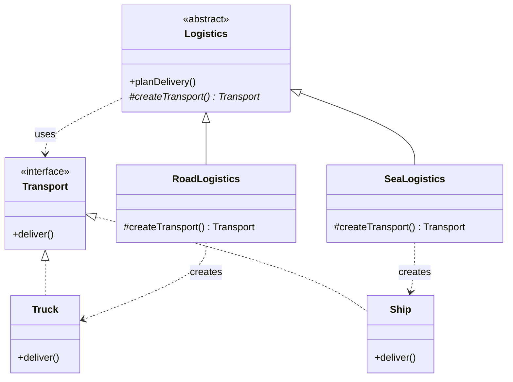

# Factory Pattern

## Question

You are building a notification service. Currently it only sends emails. Write the code to send an email notification. Now a requirement comes in: also support SMS. Then push notifications. Where does the creation logic go?

Try writing it before reading on.

---

## Pattern Mindmap

```
[Factory Pattern]
├── Problem It Solves
│   ├── NotificationService if/else: add SMS = modify existing code (OCP violation)
│   ├── Creation logic scattered across callers
│   └── Hard to test: can't swap concrete type without changing caller
├── Core Structure
│   ├── Product interface: Notification with send()
│   ├── Concrete products: EmailNotification, SMSNotification, PushNotification
│   ├── Factory: centralizes creation logic, returns interface type
│   └── Client: calls factory, uses product via interface only
├── Static Factory Method
│   ├── NotificationFactory.create(type) returns Notification
│   ├── if/else or switch inside the factory (isolated in one place)
│   └── Adding new type: change only the factory
├── Factory Method Pattern (GoF)
│   ├── Abstract creator class with abstract createTransport()
│   ├── Logistics.planDelivery() calls this.createTransport()
│   ├── RoadLogistics overrides createTransport() → Truck
│   └── SeaLogistics overrides createTransport() → Ship
├── Abstract Factory (brief)
│   ├── Factory of factories — creates families of related objects
│   ├── IndiaFactory: IndianPaymentGateway + IndianTaxCalculator
│   └── One method to get the whole suite for a region
├── When to Use
│   ├── Creation logic is complex or needs to vary by config/type
│   ├── Client must not know the concrete class (depend on interface)
│   └── You anticipate adding new product types over time
├── When NOT to Use
│   ├── Only one concrete type exists — over-engineering
│   └── Simple new call is readable and unlikely to change
├── Trade-offs
│   ├── Factory Method requires subclassing — more classes
│   ├── Static factory: simpler but can become a large switch
│   └── Abstract Factory: most flexible but most indirection
└── Interview Angles
    ├── Difference between Static Factory, Factory Method, and Abstract Factory?
    ├── How does Factory relate to OCP?
    └── When would you use a factory over a DI container?
```

## Problem Without the Pattern

The first instinct is a single method with branching:

```python
class NotificationService:
    def send(self, type_, message):
        if type_ == "EMAIL":
            n = EmailNotification()
            n.send(message)
        elif type_ == "SMS":
            n = SMSNotification()
            n.send(message)
        elif type_ == "PUSH":
            n = PushNotification()
            n.send(message)
        # Adding "SLACK" means editing this method
```

**What breaks**:
1. **OCP violation**: Every new notification type requires editing `NotificationService`. It's never closed for modification.
2. **SRP violation**: `NotificationService` now knows *how* to construct every notification type — that's not its job.
3. **Untestable construction**: You cannot substitute a mock `EmailNotification` without changing the `if` block.
4. **Scattered `new` calls**: If `EmailNotification` needs a constructor argument added, you find and fix every `new EmailNotification()` site.

---

## Derive the Minimal Fix

The constraint: **the caller should not `new` the concrete type directly**.

Step 1 — extract an ABC so all notification types are interchangeable:
```python
from abc import ABC, abstractmethod

class Notification(ABC):
    @abstractmethod
    def send(self, message): ...

class EmailNotification(Notification): ...
class SMSNotification(Notification): ...
```

Step 2 — move construction into a dedicated function that returns the ABC:
```python
def create_notification(type_):
    if type_ == "EMAIL":
        return EmailNotification()
    elif type_ == "SMS":
        return SMSNotification()
    else:
        raise ValueError(f"Unknown type: {type_}")
```

Step 3 — the service only calls the factory, never constructs directly:
```python
class NotificationService:
    def send(self, type_, message):
        n = create_notification(type_)
        n.send(message)
```

Adding `SLACK` means adding one case in `NotificationFactory` — `NotificationService` is untouched. That's the pattern.

---

> **Category**: Creational Pattern
> **Purpose**: Create objects without specifying the exact class of object that will be created.

> **Analogy**: A car rental counter. You say "I need a car." They decide whether to give you a sedan, SUV, or van based on availability. You don't worry about the specific car model — you just need something that drives.

---

## 1. Simple Factory (Static Factory)

Not a formal GoF pattern, but the most commonly used in practice. A static method creates objects based on input.

### Example: Vehicle Factory

```python
from abc import ABC, abstractmethod

class Vehicle(ABC):
    @abstractmethod
    def drive(self): ...

class Car(Vehicle):
    def drive(self): print("Driving a car")

class Bike(Vehicle):
    def drive(self): print("Riding a bike")

class Truck(Vehicle):
    def drive(self): print("Driving a truck")

def create_vehicle(type_):
    # registry maps string key to class — avoids if/else chain
    registry = {
        "car": Car,
        "bike": Bike,
        "truck": Truck,
    }
    cls = registry.get(type_.lower())
    if cls is None:
        raise ValueError(f"Unknown vehicle type: {type_}")
    return cls()

# Usage — caller doesn't know or care about Car/Bike/Truck constructors
car = create_vehicle("car")
```

**Pros:**
- Simple to implement
- Client decoupled from concrete classes

**Cons:**
- Violates Open/Closed Principle — to add a new vehicle type, you must modify the factory

---

## 2. Factory Method Pattern

Define an interface for creating an object, but let subclasses decide which class to instantiate. Creation logic moves into subclasses.

### Structure

```
Creator (abstract) → declares factoryMethod() as abstract
ConcreteCreator → implements factoryMethod(), decides which product to create
```

### Example: Logistics System

```python
from abc import ABC, abstractmethod

# Product interface
class Transport(ABC):
    @abstractmethod
    def deliver(self): ...

class Truck(Transport):
    def deliver(self):
        print("Delivering by land in a box")

class Ship(Transport):
    def deliver(self):
        print("Delivering by sea in a container")

class Drone(Transport):
    def deliver(self):
        print("Delivering by air via drone")

# Creator (abstract) — core logic uses the product, but doesn't create it directly
class Logistics(ABC):
    def plan_delivery(self):
        t = self.create_transport()  # uses the factory method
        t.deliver()

    # Factory method — subclass decides what to create
    @abstractmethod
    def create_transport(self): ...

# Concrete Creators — each decides which product to instantiate
class RoadLogistics(Logistics):
    def create_transport(self):
        return Truck()

class SeaLogistics(Logistics):
    def create_transport(self):
        return Ship()

# Adding drone delivery = new subclass only, no changes to Logistics or existing creators
class AirLogistics(Logistics):
    def create_transport(self):
        return Drone()

# Usage
logistics = RoadLogistics()
logistics.plan_delivery()  # "Delivering by land in a box"

logistics = AirLogistics()
logistics.plan_delivery()  # "Delivering by air via drone"
```

### Class Diagram



**Pros:**
- Follows Open/Closed Principle — add `AirLogistics` without changing existing code
- Single Responsibility — creation logic lives in the creator subclass

---

## 3. Abstract Factory Pattern (Brief)

Produces families of related objects. See `abstract-factory-pattern.md` for full coverage.

```python
from abc import ABC, abstractmethod

# Abstract Products
class Button(ABC):
    @abstractmethod
    def paint(self): ...

class Checkbox(ABC):
    @abstractmethod
    def paint(self): ...

# Abstract Factory — produces a matched family
class GUIFactory(ABC):
    @abstractmethod
    def create_button(self): ...

    @abstractmethod
    def create_checkbox(self): ...

# Concrete Factories — produce platform-specific families
class WinFactory(GUIFactory):
    def create_button(self):   return WinButton()
    def create_checkbox(self): return WinCheckbox()

class MacFactory(GUIFactory):
    def create_button(self):   return MacButton()
    def create_checkbox(self): return MacCheckbox()

# Client — works with any factory without knowing the platform
class Application:
    def __init__(self, factory):
        self._button = factory.create_button()

    def render(self):
        self._button.paint()
```

---

## When to Use in Interviews

- When you don't know exact types of objects until runtime: "I'd use a Factory Method so subclasses decide what to instantiate."
- When building a framework or library: "I'd expose factory methods so users can extend without modifying core classes."
- When decoupling object creation from business logic: "The service asks the factory for a `PaymentProcessor` — it doesn't care if it gets Stripe or PayPal."

---

## Common Violations

| Violation | Symptom | Fix |
|---|---|---|
| `new ConcreteClass()` scattered everywhere | Client code creates objects directly | Centralize in factory |
| Factory that never stops growing | `if/else` chain for every new type | Switch to Factory Method (subclass per type) |
| Factory returns concrete type | `Truck createTruck()` instead of `Transport` | Return interface/abstract type |

---

## Interview Tips

**Q: "Factory Method vs Abstract Factory?"**
- "Factory Method creates ONE product — the subclass decides which concrete type. Abstract Factory creates a FAMILY of related products — you get a whole matched set (Button + Checkbox + Dialog) from one factory."

**Q: "When to use Factory?"**
- "When you don't know the exact types beforehand, when you want to decouple creation from usage, or when providing a framework where users extend components."

**Q: "How does Factory relate to OCP?"**
- "Simple Factory violates OCP — you modify it to add new types. Factory Method follows OCP — you add a new subclass without touching existing code."

---

## Interviewer Follow-Up Questions

- "What problem does the Factory pattern solve? Why not just use `new` everywhere?" → `new ConcreteType()` couples the caller to a specific implementation — you can't swap the implementation without changing every call site. Factory centralizes the creation decision: `PaymentProcessorFactory.create(type)` can return `CreditCardProcessor` or `PayPalProcessor` based on config without callers knowing the concrete type. Also enables: caching instances (flyweight), injection of shared dependencies, creation from config/string (e.g., deserializing from JSON).
- "When would you use Abstract Factory vs Factory Method?" → Factory Method: one factory interface, one product. Subclasses decide which concrete product to create. Use when the client knows there's one type of product to create but wants to delegate the creation. Abstract Factory: a family of related products (e.g., `UIFactory` creates `Button`, `Checkbox`, `TextField` that all match a theme). Use when you need to create groups of related objects that must be consistent (e.g., all dark-theme or all light-theme widgets).
- "Your factory creates objects based on a string type. What happens when you add a new type?" → If the factory has a switch/if-elif: you modify the factory (OCP violation). Fix: registry pattern — a `dict` mapping strings to factory functions/classes. Registering a new type = adding one line to the registry at startup, no modification to the factory core. `registry['bitcoin'] = BitcoinProcessor`. The factory's `create()` method does `return registry[type_str]()` — never changes.
- "Can a factory method be static? What's the trade-off?" → Yes — `PaymentProcessor.of(type)` as a static factory method (common in Java/Python). Pros: clean call site, no factory object needed. Cons: can't be subclassed/overridden, can't be mocked in unit tests (static methods bypass polymorphism). For production code that needs testability: use an instance factory (injectable). For simple cases where the factory is config-only and stable: static is fine.
