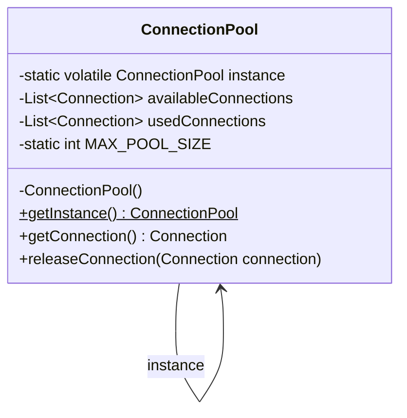

# Singleton Pattern

## Question

You are building a connection pool for a database. Every component in the application needs connections. Write the first version of a `ConnectionPool` class that any component can instantiate and use.

Try this before reading on.

---

## Pattern Mindmap

```
[Singleton Pattern]
├── Problem It Solves
│   ├── ConnectionPool created by every component = N pools, N×pool_size connections
│   ├── Config, logger, thread pool — all must be exactly one instance
│   └── Resource duplication or inconsistent shared state
├── Core Structure
│   ├── private static instance field
│   ├── private constructor — blocks external new
│   └── public static getInstance() — single access point
├── Solution 1: Synchronized Method
│   ├── public static synchronized getInstance()
│   ├── Thread-safe, but every call acquires lock — slow
│   └── Use only in very low-contention cases
├── Solution 2: Double-Checked Locking (Optimal)
│   ├── private static volatile instance (volatile required)
│   ├── First check: no lock (fast path for 99.99% of calls)
│   ├── synchronized block: create only if still null
│   └── volatile prevents partially-constructed object visibility
├── When to Use
│   ├── Shared resource with initialization cost (connection pool, config)
│   ├── Global coordination point (logger, cache, registry)
│   └── Only when exactly-one semantics is a real constraint
├── When NOT to Use
│   ├── When testability matters — singleton resists mocking
│   ├── When you think you need it for convenience — use DI instead
│   └── When state is per-user or per-request — not shared global
├── Trade-offs
│   ├── Global state makes testing harder — prefer DI with single instance
│   ├── Breaks if multiple classloaders exist (multiple "singletons")
│   └── Enum is immune to reflection and serialization attacks
└── Interview Angles
    ├── Why must volatile be used in DCL?
    ├── How does enum solve thread safety without any lock?
    └── What is the difference between Singleton and a static class?
```

## Problem Without the Pattern

The obvious implementation:

```python
class ConnectionPool:
    def __init__(self):
        self._connections = [open_new_connection() for _ in range(10)]

    def acquire(self): ...
    def release(self, c): ...

# In ServiceA:
pool_a = ConnectionPool()  # opens 10 connections

# In ServiceB:
pool_b = ConnectionPool()  # opens another 10 connections
```

**What breaks**:
1. **Resource duplication**: 2 services = 20 open connections, all independent. The pool can't enforce a global limit.
2. **Inconsistency**: `poolA.release(c)` returns `c` to `poolA`'s list. `ServiceB` never sees it — it's draining its own pool.
3. **No shared state**: Any attempt to track "how many connections are active" is per-instance, not global.

The real requirement isn't "create a connection pool" — it's "there must be exactly **one** pool, shared by everyone."

---

## Derive the Minimal Fix

The constraint: **only one instance must ever exist**.

Step 1 — block external construction by hiding `__init__`:
```python
class ConnectionPool:
    _instance = None  # holds the single shared instance

    def __new__(cls):
        raise TypeError("Use ConnectionPool.get_instance()")
```

Step 2 — the class holds its own instance and creates it exactly once:
```python
class ConnectionPool:
    _instance = None

    @classmethod
    def _create(cls):
        obj = object.__new__(cls)
        return obj
```

Step 3 — expose a global access point:
```python
    @classmethod
    def get_instance(cls):
        if cls._instance is None:
            cls._instance = cls._create()
        return cls._instance
```

That's the entire pattern. Everything below is refinements: lazy initialization, thread-safety under concurrency, preventing serialization bypass.

---

> **Purpose**: Ensure a class has only one instance and provide a global access point to it.

> **Analogy**: The president of a country. There is exactly ONE president at any time. Everyone who wants to talk to "the president" gets the same person — no matter who asks or when.

---

## When to Use

- Database connection pool
- Configuration manager
- Logging service
- Cache manager
- Thread pool

**Avoid overuse** — makes testing difficult. Prefer dependency injection where possible.

---

## Implementation

### Basic Singleton (Not Thread-Safe)

```python
class Singleton:
    _instance = None  # class-level: shared across all calls

    def __new__(cls):
        if cls._instance is None:
            cls._instance = super().__new__(cls)
        return cls._instance
```

**Problem**: Not thread-safe. Two threads can both see `_instance is None` simultaneously and create two separate instances.

---

### Thread-Safe Singleton (Double-Checked Locking)

```python
import threading

class ThreadSafeSingleton:
    _instance = None
    _lock = threading.Lock()

    def __new__(cls):
        if cls._instance is None:                  # First check — no lock (fast path)
            with cls._lock:
                if cls._instance is None:          # Second check — with lock (safe path)
                    cls._instance = super().__new__(cls)
        return cls._instance
```

**Key**: The double-check avoids acquiring the lock on the hot path after the instance exists.

---

### Module-Level Singleton (Idiomatic Python)

```python
# singleton_module.py
class _Singleton:
    def do_something(self):
        print("Singleton executing business logic")

instance = _Singleton()  # Created once when the module is first imported

# Usage — import the module-level object directly
from singleton_module import instance
instance.do_something()
```

**Why best in Python**: Python's import system guarantees a module is executed only once; `instance` is the natural singleton. No locks, no metaclass tricks needed.

---

## Real-World Example: Database Connection Pool

```python
import threading

MAX_POOL_SIZE = 10

class ConnectionPool:
    _instance = None
    _lock = threading.Lock()

    def __new__(cls):
        if cls._instance is None:
            with cls._lock:
                if cls._instance is None:
                    obj = super().__new__(cls)
                    obj._available = [create_new_connection() for _ in range(MAX_POOL_SIZE)]
                    obj._used = []
                    obj._mutex = threading.Lock()
                    cls._instance = obj
        return cls._instance

    def get_connection(self):
        with self._mutex:
            if not self._available:
                raise RuntimeError("No available connections")
            conn = self._available.pop(0)
            self._used.append(conn)
            return conn

    def release_connection(self, conn):
        with self._mutex:
            self._used.remove(conn)
            self._available.append(conn)


# Usage
pool = ConnectionPool()   # Same object every time
conn = pool.get_connection()
# Use connection
pool.release_connection(conn)
```

### Class Diagram



---

## Pros & Cons

**Pros:**
- Controlled access to single instance
- Reduced memory (one instance for shared resources)
- Global access point

**Cons:**
- Violates Single Responsibility (manages own lifecycle AND does business logic)
- Difficult to unit test — global state makes mocking hard
- Hidden dependency — not obvious from constructor, breaks DIP
- Can become a bottleneck if overused (global state = shared mutable state)

---

## Alternative: Dependency Injection

Prefer DI over Singleton for testability:

```python
# Bad: Singleton
class UserService:
    def create_user(self):
        ConnectionPool().get_connection()  # Hidden dependency!

# Good: Dependency Injection
class UserService:
    def __init__(self, pool):  # Explicit dependency, mockable in tests
        self._pool = pool

    def create_user(self):
        self._pool.get_connection()
```

The DI approach lets you inject `new InMemoryConnectionPool()` in tests — the Singleton approach doesn't.

---

## When to Use in Interviews

- When designing a logger, config manager, or connection pool: "I'd use Singleton with double-checked locking and a `volatile` field to ensure thread safety."
- When the interviewer asks about thread safety: "Basic Singleton with lazy init is not thread-safe. I'd use either DCL + volatile, or an Enum Singleton."
- When discussing tradeoffs: "I'd prefer DI over Singleton for anything testable. Singleton is fine for stateless shared resources like a logger."

---

## Common Violations

| Violation | Symptom | Fix |
|---|---|---|
| Non-volatile `instance` with DCL | Race condition; two instances possible | Add `volatile` keyword |
| Singleton for every service | Hard to test, hidden coupling | Use DI framework (Spring, Guice) |
| Mutable global state in Singleton | Concurrent writes cause bugs | Make Singleton immutable or use synchronization |

---

## Interview Tips

**Q: "Why use Singleton?"**
- "To ensure a single shared instance for resources like a connection pool or config manager. But I'd prefer DI for testability."

**Q: "Is your Singleton thread-safe?"**
- "Yes, using double-checked locking with a `volatile` field. The first null check avoids the lock on the hot path; the second null check inside the synchronized block prevents double instantiation."

**Q: "What's wrong with Singleton?"**
- "It introduces hidden global state, violates DIP (classes depend on a concrete singleton), and makes unit testing hard since you can't easily swap the instance."

---

## Interviewer Follow-Up Questions

- "What are the problems with the Singleton pattern?" → (1) Hidden global state — callers don't declare their dependency on the singleton, making behavior hard to predict. (2) Tight coupling — can't swap the implementation for a test fake. (3) Thread safety — naive singletons (check-then-create) have race conditions in multi-threaded code. (4) Ordering issues — `Config.getInstance()` may be called before the config file is loaded. Most of these are solved by dependency injection: inject a single instance rather than using a static accessor.
- "How do you make a thread-safe singleton in Java?" → Double-checked locking with `volatile`: `if (instance == null) { synchronized(Singleton.class) { if (instance == null) { instance = new Singleton(); } } }`. Without `volatile`: the CPU/compiler may reorder writes, making the reference visible before the constructor runs — another thread reads a partially-constructed object. `volatile` prevents instruction reordering. Better alternative in Java: enum singleton (thread-safe by the JVM, immune to serialization attacks).
- "How do you make a singleton in Python?" → Module-level singleton: Python modules are instantiated once and cached — import the instance from the module. `from config import config`. If you need a class-based singleton: override `__new__` to cache and return the same instance. `metaclass=SingletonMeta` approach centralizes the pattern. Simplest and most Pythonic: don't use Singleton — use module-level state or dependency injection.
- "Your test creates a Singleton that connects to production Redis. The next test gets the same instance with a stale connection. How do you fix this?" → This is the core testability problem. Fixes: (1) Add a `reset()` method to the singleton that clears the instance (only for tests, gated behind an env var). (2) Stop using Singleton — inject the Redis client as a dependency. (3) Use a DI container with a test scope that creates fresh instances per test. In practice: option 2 is the right answer — eliminate the singleton, inject dependencies.
