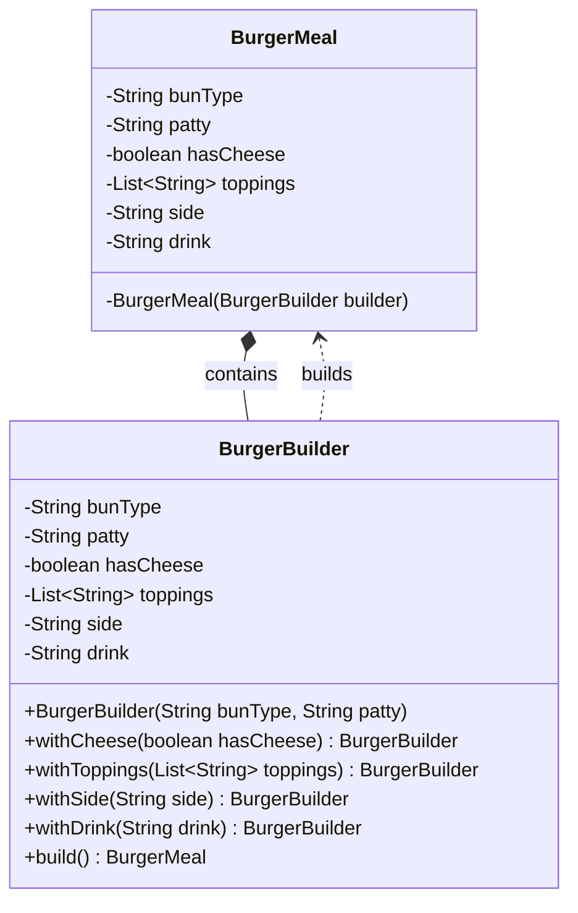

# Builder Pattern

## Question

You are building a `User` object that has: `name` (required), `email` (required), `age` (optional), `address` (optional), `phoneNumber` (optional), `profilePicture` (optional). Write the constructor for this class.

Try it before reading on.

---

## Pattern Mindmap

```
[Builder Pattern]
├── Problem It Solves
│   ├── Telescoping constructor: User(name, email, age, address, phone, pic)
│   ├── Caller must pass null for optional fields — unreadable, error-prone
│   ├── Setter approach: object is invalid between first and last setter call
│   └── Need to create immutable objects with many optional fields
├── Core Structure
│   ├── Outer class: final fields, private constructor taking Builder
│   ├── Static inner Builder class with same fields
│   ├── Builder.name(), Builder.email() — fluent setters returning this
│   ├── Builder.build() validates and constructs the outer object
│   └── Client: new User.Builder("name","email").age(30).build()
├── BurgerMeal Example
│   ├── BurgerMeal.BurgerBuilder with required + optional fields
│   ├── size(s), sauce(s), cheese(b), lettuce(b) fluent methods
│   └── build() creates immutable BurgerMeal
├── Real-World Usage
│   ├── OkHttp: Request.Builder().url().method().build()
│   ├── Lombok @Builder annotation generates builder automatically
│   └── StringBuilder is a mutable builder for String
├── When to Use
│   ├── Object has 4+ fields, several optional
│   ├── Object must be immutable (final fields, no setters)
│   └── Construction requires validation of field combinations
├── When NOT to Use
│   ├── Object has 2–3 fields — constructor or factory is simpler
│   └── Mutability is acceptable and setters work fine
├── Trade-offs
│   ├── Verbose: Builder has same fields as the object (duplication)
│   ├── Lombok @Builder eliminates boilerplate automatically
│   └── Harder to extend: subclass needs its own builder
└── Interview Angles
    ├── What is the telescoping constructor anti-pattern?
    ├── How does Builder enforce immutability?
    └── Difference between Builder and Factory?
```

## Problem Without the Pattern

The first approach — a constructor with all fields:

```python
class User:
    def __init__(self, name, email, age, address, phone, picture): ...

# Caller:
u = User("Alice", "alice@x.com", 0, None, None, None)
#                                 ^^  ^^^^  ^^^^  ^^^^
#        what do these Nones mean? which is phone vs address?
```

Or the telescoping constructor approach:
```python
u1 = User("Alice", "alice@x.com")
u2 = User("Alice", "alice@x.com", age=30)
u3 = User("Alice", "alice@x.com", age=30, address="123 Main St")
# Need a separate overload or default-param combination for every case
```

**What breaks**:
1. **Unreadable callsites**: `new User("Alice", "x@x.com", 0, null, null, null)` — what is the 5th `null`?
2. **Constructor explosion**: N optional fields → up to 2^N combinations you might need to support.
3. **Invalid state**: Nothing stops `new User(null, null, -5, ...)` — the object is invalid from birth.
4. **No immutability**: Setters let callers mutate after construction.

---

## Derive the Minimal Fix

The constraint: **separate the step-by-step configuration from the final construction**.

Step 1 — make construction private, require only mandatory fields via the builder:
```python
from dataclasses import dataclass, field

@dataclass(frozen=True)
class User:
    name: str        # required
    email: str       # required
    age: int = 0     # optional
    phone: str = ""  # optional
```

Step 2 — a `Builder` class holds mutable state during configuration:
```python
class UserBuilder:
    def __init__(self, name, email):
        self._name = name    # required → constructor param
        self._email = email  # required → constructor param
        self._age = 0
        self._phone = ""

    def age(self, a):
        self._age = a
        return self  # return self to enable chaining

    def phone(self, p):
        self._phone = p
        return self

    def build(self):
        return User(name=self._name, email=self._email,
                    age=self._age, phone=self._phone)
```

Step 3 — callsite is now readable and validated:
```python
u = UserBuilder("Alice", "alice@x.com").age(30).phone("555-1234").build()
```

That's the entire pattern — a fluent inner builder that returns `this` for chaining, and a `build()` that calls the private outer constructor.

---

> **Purpose**: Separates the construction of a complex object from its representation, allowing step-by-step creation with full control over which parts are set.

> **Analogy**: Building a custom PC. You specify: CPU=i9, RAM=32GB, Storage=1TB NVMe. The builder assembles it step by step. You don't call `new Computer(i9, 32, 1000, true, false, null, ...)` and try to remember what the 7th argument means.

---

## The Problem: Telescoping Constructors

When an object has many optional fields, you end up with either:
1. A constructor with too many parameters (unreadable, error-prone)
2. Multiple overloaded constructors that grow out of control

```python
# Telescoping Constructor Anti-Pattern
class BurgerMeal:
    def __init__(self, bun, patty,
                 has_cheese=False,
                 side=None,
                 drink=None): ...

# Usage is confusing — what does False mean here? What's the 4th arg?
meal = BurgerMeal("wheat", "veg", False, None, None)
```

**Issues:**
- Hard to read: you must remember parameter order and types
- Unnecessary `null` values for optional fields
- Risk of `NullPointerException` if internals don't null-check
- Adding a new optional field means adding more constructor overloads
- No flexibility to set values step by step

---

## The Solution: Builder Pattern

```python
from __future__ import annotations
from dataclasses import dataclass, field


@dataclass(frozen=True)  # frozen=True makes the object immutable after build()
class BurgerMeal:
    # Required components
    bun_type: str
    patty: str
    # Optional components (dataclass fields still used for the frozen object)
    has_cheese: bool = False
    toppings: tuple = ()
    side: object = None
    drink: object = None


class BurgerBuilder:
    def __init__(self, bun_type, patty):
        self._bun_type = bun_type
        self._patty = patty
        self._has_cheese = False
        self._toppings = []
        self._side = None
        self._drink = None

    def with_cheese(self, has_cheese=True):
        self._has_cheese = has_cheese
        return self  # returns builder for chaining

    def with_toppings(self, toppings):
        self._toppings = toppings
        return self

    def with_side(self, side):
        self._side = side
        return self

    def with_drink(self, drink):
        self._drink = drink
        return self

    def build(self):
        return BurgerMeal(
            bun_type=self._bun_type,
            patty=self._patty,
            has_cheese=self._has_cheese,
            toppings=tuple(self._toppings),
            side=self._side,
            drink=self._drink,
        )


# Usage — readable, flexible, no Nones
plain_burger = BurgerBuilder("wheat", "veg").build()

burger_with_cheese = BurgerBuilder("wheat", "veg").with_cheese().build()

loaded_burger = (
    BurgerBuilder("multigrain", "chicken")
    .with_cheese()
    .with_toppings(["lettuce", "onion", "jalapeno"])
    .with_side("fries")
    .with_drink("coke")
    .build()
)
```

### Class Diagram



---

## Why This is Better

| Aspect | Constructor Approach | Builder Pattern |
|---|---|---|
| Readability | Poor (nulls, long argument list) | Excellent (fluent, expressive) |
| Flexibility | Low (all-or-nothing setup) | High (configure only what's needed) |
| Maintainability | Hard to scale with more fields | Easy to extend with new options |
| Safety | High chance of errors with nulls | Controlled, safe instantiation |
| Immutability | Hard to enforce | Natural — build once, then freeze |

---

## Real-World Products Using Builder Pattern

**HTTP Request Building** (httpx, requests):
```python
import httpx

response = httpx.post(
    "https://api.example.com/users",
    headers={"Authorization": f"Bearer {token}"},
    content=request_body,
)
```

**Amazon Cart Configuration**: Items in a cart have quantity, size, color, delivery option, gift wrap, discount tags — all optional. Builder lets each combination be expressed clearly without constructor explosion.

**StringBuilder** (Java standard library): Technically a builder — you chain `append()` calls and call `toString()` at the end.

---

## When to Use in Interviews

- When designing any object with 4+ optional fields: "I'd use Builder to avoid telescoping constructors and make creation readable."
- When the interviewer asks about immutable objects: "Builder lets you set fields step by step and then produce an immutable final object via `build()`."
- When discussing API design: "Fluent builder APIs (like OkHttp's `Request.Builder`) are the gold standard for developer experience when constructing complex objects."

---

## Common Violations

| Violation | Symptom | Fix |
|---|---|---|
| Builder for 2-field class | Over-engineering a simple object | Just use a constructor |
| Mutable `build()` target | Final object's fields can change after build | Make fields `final` in the target class |
| Builder without validation in `build()` | Invalid objects created (e.g., negative price) | Add validation inside `build()` before constructing |
| No required fields in builder constructor | Required fields are optional — allows incomplete objects | Put mandatory fields in the Builder constructor |

---

## When to Use and When to Avoid

**Use when:**
- Object has 4+ fields, especially many optional ones
- You want immutability — build once, don't mutate
- Readable object creation matters (public APIs, domain models)

**Avoid when:**
- Class has only 1-2 fields — a constructor is cleaner
- Object is mutable and simple — setters are fine
- The overhead of a separate Builder class isn't justified

---

## Interview Tips

**Q: "Builder vs Constructor — when do you choose Builder?"**
- "When a class has many optional parameters, constructors become unreadable and error-prone. Builder gives a fluent API and enforces which fields are required vs optional. I'd use Builder for any object with 4+ optional configuration fields."

**Q: "How do you enforce required fields in Builder?"**
- "Put required fields in the Builder's constructor. Optional fields have `with*()` methods. `build()` can also validate that constraints are met before constructing the final object."

---

## Interviewer Follow-Up Questions

- "When should you use Builder instead of a constructor with many parameters?" → Telescoping constructor smell: `User(name, email, phone, address, dob, newsletter, premiumTier)`. Problems: argument order errors (swapping two strings of the same type — no compiler error), optional fields with awkward null/default handling, unreadable call sites. Builder fixes all three: named parameters, optional fields with sensible defaults, readable call site: `User.builder().name("Alice").email("a@b.com").newsletter(true).build()`.
- "Builder vs named keyword arguments in Python — when is Builder still useful in Python?" → Python has `**kwargs` and keyword arguments, which eliminate most Builder need. Builder is still useful in Python when: (1) the object requires validation across multiple fields at build time (e.g., `build()` checks that `start_date < end_date`); (2) you want a Fluent API for constructing complex nested objects (e.g., a query builder DSL); (3) the built object should be immutable (frozen dataclass) but requires complex construction logic.
- "How does Builder support immutable objects?" → The Builder holds all mutable state during construction. `build()` passes all accumulated fields to the target class constructor as one call. The target class stores them as `final` (Java) or sets them once in `__init__` (Python). After construction, no setters exist on the target — it's immutable. The Builder is the only "mutable" part, and it's discarded after `build()`.
- "What's the difference between Builder and Factory?" → Factory: creates one of several related objects based on a type argument. The factory decides the type; the caller provides a type selector. Builder: constructs a complex object of one known type, step-by-step, allowing optional/ordered field setting. Factory = choosing which object; Builder = configuring how to build it. They're often combined: a Factory returns different Builder implementations, each building a product variant.
