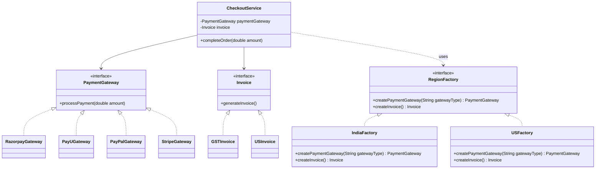

> [!NOTE]
> **📋 5-Minute Summary**
>
> **What this covers:** The Abstract Factory Pattern — provides an interface for creating families of related or dependent objects without specifying their concrete classes.
>
> **Key concepts:**
> - The problem: you have *families* of products (e.g., Mac UI vs Windows UI). A Mac Button must be used with a Mac Checkbox. Mixing a Mac Button with a Windows Checkbox breaks the system.
> - The fix: create an `UIFactory` interface with `createButton()` and `createCheckbox()`.
> - Concrete factories: `MacFactory` implements it (returns Mac items). `WinFactory` implements it (returns Win items).
> - Client usage: The client receives a `UIFactory`. It doesn't know (or care) which OS it's on. It just calls `factory.createButton()`, guaranteeing compatible products.
> - Difference from Factory Method: Factory Method creates *one* product. Abstract Factory creates *multiple related* products (a family).
>
> **Key takeaway:** Use Abstract Factory only when you have multiple, distinct product families and you must enforce that objects from different families are never mixed. It's rare in standard LLD problems but common in framework design.

---
module: 06-lld
topic: Design Patterns
subtopic: Creational
status: unread
tags: [06-lld, system-design, design-patterns]
---
# Abstract Factory Pattern

> 🔵 **Java idiom:** The Python example uses duck-typed factory classes; in Java each family is an `interface` (e.g. `GUIFactory` with `createButton()`, `createCheckbox()`) and each concrete factory an implementing class. **JDK equivalent:** `DocumentBuilderFactory`, `javax.xml.transform.TransformerFactory` — `newInstance()` returns a platform-specific family. **Interview gotcha:** don't confuse it with Factory Method — Abstract Factory produces a *family of related products* that must be used together; a single Factory Method produces *one* product. Name the "family consistency" constraint (a `WinButton` must never pair with a `MacCheckbox`) — that's the reason the pattern exists.

## Question

Your e-commerce platform is launching in India and the US. India uses UPI and Rupee invoices; the US uses Credit Card and Dollar invoices. A `CheckoutService` needs to create a `PaymentProcessor` and an `InvoiceGenerator`. How do you write `CheckoutService` so it works correctly in both regions?

Try it before reading on.

---

## Pattern Mindmap

```
[Abstract Factory Pattern]
├── Problem It Solves
│   ├── CheckoutService branches on region to create PaymentProcessor + Invoice
│   ├── Add new region = modify CheckoutService (OCP violation)
│   └── Products created for India must not mix with US products
├── Core Structure
│   ├── Abstract factory interface: RegionFactory
│   │   ├── createPaymentProcessor() → PaymentProcessor
│   │   └── createInvoiceGenerator() → InvoiceGenerator
│   ├── Concrete factories: IndiaFactory, USFactory
│   ├── Product interfaces: PaymentProcessor, InvoiceGenerator
│   └── CheckoutService takes RegionFactory — never knows the region
├── Product Families
│   ├── IndiaFactory → UPIProcessor + RupeeInvoiceGenerator
│   ├── USFactory → CreditCardProcessor + DollarInvoiceGenerator
│   └── Products within a family are guaranteed compatible
├── Analogy
│   ├── IKEA (Scandinavian style) vs Ashley (American style) furniture stores
│   ├── Each store is a factory that produces a compatible family
│   └── You shop at one store — all pieces match
├── Factory Method vs Abstract Factory
│   ├── Factory Method: one product, subclass decides type
│   ├── Abstract Factory: family of related products, whole factory swapped
│   └── Abstract Factory uses multiple Factory Methods internally
├── When to Use
│   ├── System needs multiple families of related objects
│   ├── Families must be used together (no cross-region mixing)
│   └── You want to switch entire product families by config
├── When NOT to Use
│   ├── Only one product type to create — Factory Method suffices
│   └── Product families rarely change — over-engineering
├── Trade-offs
│   ├── Adding a new product to the family requires changing all factories
│   ├── High indirection: concrete types hidden from all callers
│   └── Excellent for cross-platform UI toolkits, regional configs
└── Interview Angles
    ├── How does Abstract Factory enforce product family consistency?
    ├── When do you choose Abstract Factory over Factory Method?
    └── What changes when you add a new region?
```

## Problem Without the Pattern

The instinct is to branch on region:

```python
class CheckoutService:
    def __init__(self, region: str):
        self._region = region

    def checkout(self, order):
        if self._region == "IN":
            processor = UPIProcessor()
            invoice   = RupeeInvoice()
        elif self._region == "US":
            processor = CreditCardProcessor()
            invoice   = DollarInvoice()

        processor.process(order)
        invoice.generate(order)
```

**What breaks**:
1. **OCP violation**: Adding "EU" (SEPA + Euro invoice) means editing `CheckoutService`.
2. **Mismatched families**: Nothing prevents `UPIProcessor()` paired with `DollarInvoice()` — a bug that runs silently.
3. **Scattered creation**: `CheckoutService` must know every concrete class in every region.
4. **Untestable**: Can't inject a test family without modifying the service.

---

## Derive the Minimal Fix

The constraint: **group the related objects (payment + invoice) behind a single factory, and the service only talks to the factory**.

Step 1 — extract interfaces for the product types:
```python
from abc import ABC, abstractmethod

class PaymentProcessor(ABC):
    @abstractmethod
    def process(self, order): ...

class InvoiceGenerator(ABC):
    @abstractmethod
    def generate(self, order): ...
```

Step 2 — define the factory interface that creates a matched family:
```python
class RegionFactory(ABC):
    @abstractmethod
    def create_payment_processor(self) -> PaymentProcessor: ...

    @abstractmethod
    def create_invoice_generator(self) -> InvoiceGenerator: ...
```

Step 3 — one concrete factory per region, each wiring the correct pair:
```python
class IndiaFactory(RegionFactory):
    def create_payment_processor(self) -> PaymentProcessor:
        return UPIProcessor()

    def create_invoice_generator(self) -> InvoiceGenerator:
        return RupeeInvoice()

class USFactory(RegionFactory):
    def create_payment_processor(self) -> PaymentProcessor:
        return CreditCardProcessor()

    def create_invoice_generator(self) -> InvoiceGenerator:
        return DollarInvoice()
```

Step 4 — `CheckoutService` depends only on the `RegionFactory` interface:
```python
class CheckoutService:
    def __init__(self, factory: RegionFactory):
        self._factory = factory

    def checkout(self, order):
        self._factory.create_payment_processor().process(order)
        self._factory.create_invoice_generator().generate(order)
```

Adding EU is now: one new `EUFactory` class, zero changes to `CheckoutService`.

---

> **Purpose**: Provides an interface for creating families of related or dependent objects without specifying their concrete classes.

> **Analogy**: IKEA vs Ashley Furniture. Both make chairs, tables, and sofas — but from different families (modern vs traditional). An abstract factory gives you a matched set. You don't mix an IKEA chair with an Ashley table and hope they look right together.

---

## The Core Idea

When you need multiple related objects that must be consistent with each other (e.g., payment gateway + invoice format for a specific country), the Abstract Factory ensures you always get a matched family — never a mismatched set.

**Factory Method**: Creates ONE product. Subclass decides which.
**Abstract Factory**: Creates a FAMILY of related products. Factory object decides which family.

---

## The Problem: Hardcoded Object Creation

```python
# Bad: CheckoutService directly creates objects — tightly coupled
class CheckoutService:
    def __init__(self, gateway_type: str):
        self._gateway_type = gateway_type

    def check_out(self, amount: float):
        # Hardcoded decision logic — violates OCP
        if self._gateway_type == "razorpay":
            payment_gateway = RazorpayGateway()
        else:
            payment_gateway = PayUGateway()

        payment_gateway.process_payment(amount)

        # Always uses GSTInvoice — can't support US invoices
        invoice = GSTInvoice()
        invoice.generate_invoice()
```

**Issues:**
- Tight Coupling: `CheckoutService` directly instantiates concrete classes
- Violates OCP: Adding new gateways requires modifying `CheckoutService`
- No extensibility: Can't support different countries without rewriting

---

## The Solution: Abstract Factory Pattern

```python
from abc import ABC, abstractmethod

# ===== Abstract Product Interfaces =====
class PaymentGateway(ABC):
    @abstractmethod
    def process_payment(self, amount: float): ...

class Invoice(ABC):
    @abstractmethod
    def generate_invoice(self): ...

# ===== India Product Family =====
class RazorpayGateway(PaymentGateway):
    def process_payment(self, amount: float):
        print(f"Processing INR payment via Razorpay: {amount}")

class PayUGateway(PaymentGateway):
    def process_payment(self, amount: float):
        print(f"Processing INR payment via PayU: {amount}")

class GSTInvoice(Invoice):
    def generate_invoice(self):
        print("Generating GST Invoice for India.")

# ===== US Product Family =====
class PayPalGateway(PaymentGateway):
    def process_payment(self, amount: float):
        print(f"Processing USD payment via PayPal: {amount}")

class StripeGateway(PaymentGateway):
    def process_payment(self, amount: float):
        print(f"Processing USD payment via Stripe: {amount}")

class USInvoice(Invoice):
    def generate_invoice(self):
        print("Generating Invoice as per US norms.")

# ===== Abstract Factory =====
class RegionFactory(ABC):
    @abstractmethod
    def create_payment_gateway(self, gateway_type: str) -> PaymentGateway: ...

    @abstractmethod
    def create_invoice(self) -> Invoice: ...

# ===== Concrete Factories — each produces a matched family =====
class IndiaFactory(RegionFactory):
    def create_payment_gateway(self, gateway_type: str) -> PaymentGateway:
        if gateway_type == "razorpay":
            return RazorpayGateway()
        if gateway_type == "payu":
            return PayUGateway()
        raise ValueError(f"Unsupported gateway for India: {gateway_type}")

    def create_invoice(self) -> Invoice:
        return GSTInvoice()  # India always gets GST invoice

class USFactory(RegionFactory):
    def create_payment_gateway(self, gateway_type: str) -> PaymentGateway:
        if gateway_type == "paypal":
            return PayPalGateway()
        if gateway_type == "stripe":
            return StripeGateway()
        raise ValueError(f"Unsupported gateway for US: {gateway_type}")

    def create_invoice(self) -> Invoice:
        return USInvoice()  # US always gets US-style invoice

# ===== CheckoutService — depends on abstraction only =====
class CheckoutService:
    def __init__(self, factory: RegionFactory, gateway_type: str):
        self._payment_gateway = factory.create_payment_gateway(gateway_type)
        self._invoice = factory.create_invoice()
        # Guaranteed matched pair — correct gateway + correct invoice for the region

    def complete_order(self, amount: float):
        self._payment_gateway.process_payment(amount)
        self._invoice.generate_invoice()

# ===== Usage =====
if __name__ == "__main__":
    # India checkout with Razorpay — gets GST invoice automatically
    india_checkout = CheckoutService(IndiaFactory(), "razorpay")
    india_checkout.complete_order(1999.0)

    print("---")

    # US checkout with PayPal — gets US invoice automatically
    us_checkout = CheckoutService(USFactory(), "paypal")
    us_checkout.complete_order(49.99)
```

### Class Diagram



---

## How This Fixes the Original Issues

| Original Problem | How Abstract Factory Fixes It |
|---|---|
| Object creation mixed with business logic | Creation moved to factory classes |
| Concrete classes hardcoded in service | Service depends on `PaymentGateway` and `Invoice` interfaces |
| Adding new gateway required modifying service | Add new factory class — service untouched |
| Can't scale to new regions | Add `EUFactory`, `AUFactory` — zero changes to `CheckoutService` |

---

## When to Use in Interviews

- Multi-region or multi-platform systems: "I'd use Abstract Factory to encapsulate region-specific object creation. The service never knows if it's dealing with India or US."
- UI theme systems: "A `DarkThemeFactory` and `LightThemeFactory` both produce matched Button, Dialog, and TextField objects."
- Cross-platform rendering: "A `WindowsFactory` and `MacFactory` produce OS-native UI components — guaranteed consistent."

---

## Common Violations

| Violation | Symptom | Fix |
|---|---|---|
| Mixing product families | India gateway + US invoice by accident | Let factory enforce the family |
| Factory with too many products | One factory creates 10 unrelated types | Split into cohesive family factories |
| Client decides product family | `if region == "IN": RazorpayGateway()` | Move decision into factory selection |

---

## Pros and Cons

**Pros:**
- Ensures product family consistency (India gateway always paired with GST invoice)
- Follows OCP — add a new region by adding a new factory
- Follows DIP — client depends on `RegionFactory` interface, not concrete factories
- Easy to test — swap in a `MockFactory` for unit tests

**Cons:**
- Increased complexity — many classes and interfaces for simple cases
- Adding a new product type to ALL factories is expensive (e.g., adding `Receipt` means updating every factory)
- More boilerplate code upfront

---

## Interview Tips

**Q: "Factory Method vs Abstract Factory?"**
- "Factory Method creates one product — subclass decides the type. Abstract Factory creates a family of related products — factory object decides the family. Use Abstract Factory when you need consistency across multiple related objects."

**Q: "When would you choose Abstract Factory?"**
- "When multiple objects must be compatible or consistent with each other — like UI components per OS, or payment systems per region. You want to guarantee that you never mix a Windows button with a Mac dialog."
