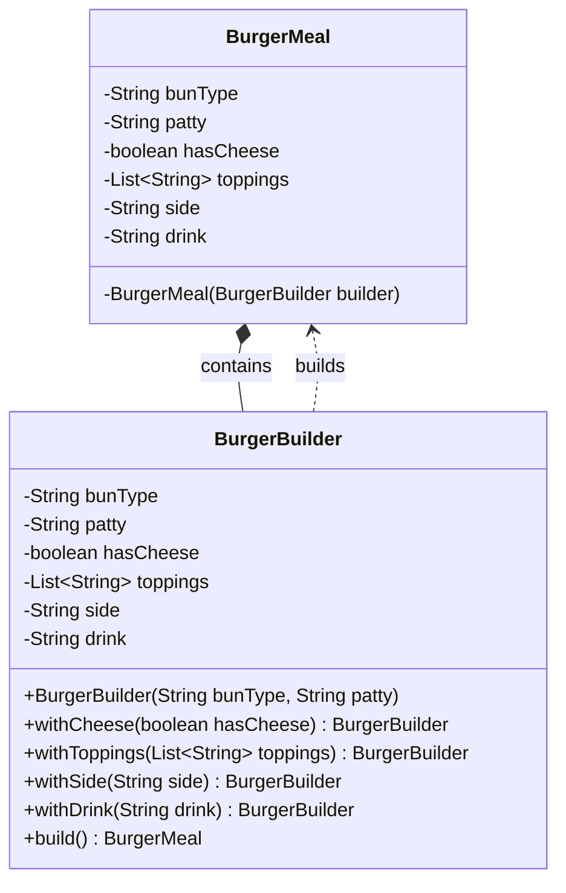

# Builder Pattern

> **Purpose**: Separates the construction of a complex object from its representation, allowing step-by-step creation with full control over which parts are set.

> **Analogy**: Building a custom PC. You specify: CPU=i9, RAM=32GB, Storage=1TB NVMe. The builder assembles it step by step. You don't call `new Computer(i9, 32, 1000, true, false, null, ...)` and try to remember what the 7th argument means.

---

## The Problem: Telescoping Constructors

When an object has many optional fields, you end up with either:
1. A constructor with too many parameters (unreadable, error-prone)
2. Multiple overloaded constructors that grow out of control

```java
// Telescoping Constructor Anti-Pattern
class BurgerMeal {
    public BurgerMeal(String bun, String patty) { ... }
    public BurgerMeal(String bun, String patty, boolean cheese) { ... }
    public BurgerMeal(String bun, String patty, boolean cheese, String side) { ... }
    public BurgerMeal(String bun, String patty, boolean cheese, String side, String drink) { ... }
}

// Usage is confusing — what does 'true' mean here?
BurgerMeal meal = new BurgerMeal("wheat", "veg", null, null, false);
```

**Issues:**
- Hard to read: you must remember parameter order and types
- Unnecessary `null` values for optional fields
- Risk of `NullPointerException` if internals don't null-check
- Adding a new optional field means adding more constructor overloads
- No flexibility to set values step by step

---

## The Solution: Builder Pattern

```java
import java.util.List;
import java.util.ArrayList;

public class BurgerMeal {
    // Required components
    private final String bunType;
    private final String patty;

    // Optional components
    private final boolean hasCheese;
    private final List<String> toppings;
    private final String side;
    private final String drink;

    // Private constructor — only the Builder can create BurgerMeal
    private BurgerMeal(BurgerBuilder builder) {
        this.bunType   = builder.bunType;
        this.patty     = builder.patty;
        this.hasCheese = builder.hasCheese;
        this.toppings  = builder.toppings;
        this.side      = builder.side;
        this.drink     = builder.drink;
    }

    // Static nested Builder class
    public static class BurgerBuilder {
        // Required fields
        private final String bunType;
        private final String patty;

        // Optional fields (with sane defaults)
        private boolean hasCheese = false;
        private List<String> toppings = new ArrayList<>();
        private String side = null;
        private String drink = null;

        // Builder constructor requires only mandatory fields
        public BurgerBuilder(String bunType, String patty) {
            this.bunType = bunType;
            this.patty   = patty;
        }

        public BurgerBuilder withCheese(boolean hasCheese) {
            this.hasCheese = hasCheese;
            return this;  // Returns builder for chaining
        }

        public BurgerBuilder withToppings(List<String> toppings) {
            this.toppings = toppings;
            return this;
        }

        public BurgerBuilder withSide(String side) {
            this.side = side;
            return this;
        }

        public BurgerBuilder withDrink(String drink) {
            this.drink = drink;
            return this;
        }

        public BurgerMeal build() {
            return new BurgerMeal(this);
        }
    }
}

// Usage — readable, flexible, no nulls
BurgerMeal plainBurger = new BurgerMeal.BurgerBuilder("wheat", "veg")
    .build();

BurgerMeal burgerWithCheese = new BurgerMeal.BurgerBuilder("wheat", "veg")
    .withCheese(true)
    .build();

List<String> toppings = List.of("lettuce", "onion", "jalapeno");
BurgerMeal loadedBurger = new BurgerMeal.BurgerBuilder("multigrain", "chicken")
    .withCheese(true)
    .withToppings(toppings)
    .withSide("fries")
    .withDrink("coke")
    .build();
```

### Class Diagram



---

## Why This is Better

| Aspect | Constructor Approach | Builder Pattern |
|---|---|---|
| Readability | Poor (nulls, long argument list) | Excellent (fluent, expressive) |
| Flexibility | Low (all-or-nothing setup) | High (configure only what's needed) |
| Maintainability | Hard to scale with more fields | Easy to extend with new options |
| Safety | High chance of errors with nulls | Controlled, safe instantiation |
| Immutability | Hard to enforce | Natural — build once, then freeze |

---

## Real-World Products Using Builder Pattern

**HTTP Request Building** (OkHttp, Retrofit):
```java
Request request = new Request.Builder()
    .url("https://api.example.com/users")
    .addHeader("Authorization", "Bearer " + token)
    .post(requestBody)
    .build();
```

**Amazon Cart Configuration**: Items in a cart have quantity, size, color, delivery option, gift wrap, discount tags — all optional. Builder lets each combination be expressed clearly without constructor explosion.

**StringBuilder** (Java standard library): Technically a builder — you chain `append()` calls and call `toString()` at the end.

---

## When to Use in Interviews

- When designing any object with 4+ optional fields: "I'd use Builder to avoid telescoping constructors and make creation readable."
- When the interviewer asks about immutable objects: "Builder lets you set fields step by step and then produce an immutable final object via `build()`."
- When discussing API design: "Fluent builder APIs (like OkHttp's `Request.Builder`) are the gold standard for developer experience when constructing complex objects."

---

## Common Violations

| Violation | Symptom | Fix |
|---|---|---|
| Builder for 2-field class | Over-engineering a simple object | Just use a constructor |
| Mutable `build()` target | Final object's fields can change after build | Make fields `final` in the target class |
| Builder without validation in `build()` | Invalid objects created (e.g., negative price) | Add validation inside `build()` before constructing |
| No required fields in builder constructor | Required fields are optional — allows incomplete objects | Put mandatory fields in the Builder constructor |

---

## When to Use and When to Avoid

**Use when:**
- Object has 4+ fields, especially many optional ones
- You want immutability — build once, don't mutate
- Readable object creation matters (public APIs, domain models)

**Avoid when:**
- Class has only 1-2 fields — a constructor is cleaner
- Object is mutable and simple — setters are fine
- The overhead of a separate Builder class isn't justified

---

## Interview Tips

**Q: "Builder vs Constructor — when do you choose Builder?"**
- "When a class has many optional parameters, constructors become unreadable and error-prone. Builder gives a fluent API and enforces which fields are required vs optional. I'd use Builder for any object with 4+ optional configuration fields."

**Q: "How do you enforce required fields in Builder?"**
- "Put required fields in the Builder's constructor. Optional fields have `with*()` methods. `build()` can also validate that constraints are met before constructing the final object."
