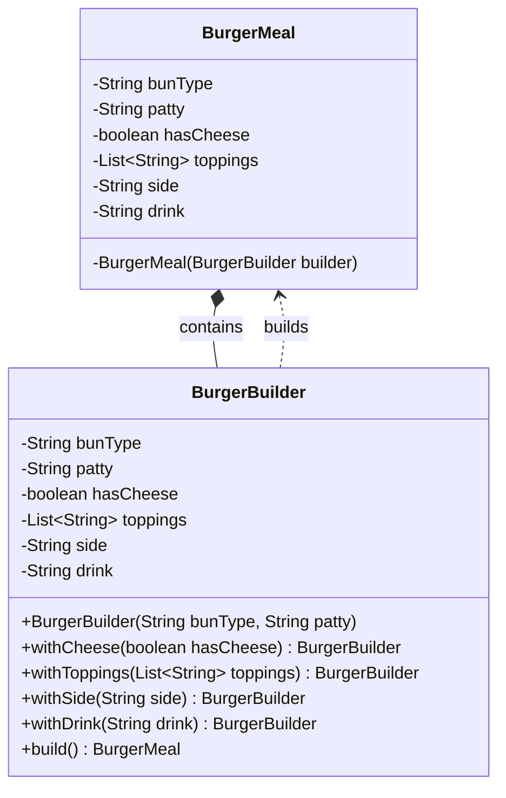

> [!NOTE]
> **📋 5-Minute Summary**
>
> **What this covers:** The Builder Pattern — separates the construction of a complex object from its representation, allowing step-by-step creation.
>
> **Key concepts:**
> - The problem: the "Telescoping Constructor" anti-pattern. A class has many optional fields, leading to `User(name, null, null, 25, null)`. Unreadable, error-prone, hard to maintain.
> - The fix: a static nested `Builder` class. The Builder has the same fields. It exposes fluent setter methods that return `this`.
> - The build method: `build()` calls the private `User` constructor, passing the builder instance. It validates all constraints before creating the object.
> - Immutability: Builder is the best way to construct immutable objects (no setters on the final `User` class) that have many optional parameters.
> - Usage: `User u = new User.Builder("Alice").age(25).phone("123").build();`
>
> **Key takeaway:** If a class has more than 4 parameters or multiple optional parameters, use the Builder pattern. It's universally expected in Java LLD interviews for creating domain models and configuration objects.

---
module: 06-lld
topic: Design Patterns
subtopic: Creational
status: unread
tags: [06-lld, system-design, design-patterns]
---
# Builder Pattern

> 🔵 **Java idiom:** The canonical Java form is a static nested `Builder` class with a private constructor on the outer class and a fluent `.setX()` chain returning `this`, ending in `.build()` — Joshua Bloch's *Effective Java* Item 2. This is the idiomatic fix for the telescoping-constructor problem (many optional params). **JDK/library equivalent:** `StringBuilder`, `Stream.Builder`, Lombok's `@Builder`, `HttpRequest.newBuilder()`. **Interview gotcha:** enforce immutability — the outer object's fields are `final` and set only in the private constructor from the builder, so there are no setters on the product itself. Validate invariants inside `build()`, not in each setter.

## Question

You are building a `User` object that has: `name` (required), `email` (required), `age` (optional), `address` (optional), `phoneNumber` (optional), `profilePicture` (optional). Write the constructor for this class.

Try it before reading on.

---

## Pattern Mindmap

```
[Builder Pattern]
├── Problem It Solves
│   ├── Telescoping constructor: User(name, email, age, address, phone, pic)
│   ├── Caller must pass null for optional fields — unreadable, error-prone
│   ├── Setter approach: object is invalid between first and last setter call
│   └── Need to create immutable objects with many optional fields
├── Core Structure
│   ├── Outer class: final fields, private constructor taking Builder
│   ├── Static inner Builder class with same fields
│   ├── Builder.name(), Builder.email() — fluent setters returning this
│   ├── Builder.build() validates and constructs the outer object
│   └── Client: new User.Builder("name","email").age(30).build()
├── BurgerMeal Example
│   ├── BurgerMeal.BurgerBuilder with required + optional fields
│   ├── size(s), sauce(s), cheese(b), lettuce(b) fluent methods
│   └── build() creates immutable BurgerMeal
├── Real-World Usage
│   ├── OkHttp: Request.Builder().url().method().build()
│   ├── Lombok @Builder annotation generates builder automatically
│   └── StringBuilder is a mutable builder for String
├── When to Use
│   ├── Object has 4+ fields, several optional
│   ├── Object must be immutable (final fields, no setters)
│   └── Construction requires validation of field combinations
├── When NOT to Use
│   ├── Object has 2–3 fields — constructor or factory is simpler
│   └── Mutability is acceptable and setters work fine
├── Trade-offs
│   ├── Verbose: Builder has same fields as the object (duplication)
│   ├── Lombok @Builder eliminates boilerplate automatically
│   └── Harder to extend: subclass needs its own builder
└── Interview Angles
    ├── What is the telescoping constructor anti-pattern?
    ├── How does Builder enforce immutability?
    └── Difference between Builder and Factory?
```

## Problem Without the Pattern

The first approach — a constructor with all fields:

```java
class User {
    public User(String name, String email, int age,
                String address, String phone, String picture) {
        ...
    }
}

// Caller:
User u = new User("Alice", "alice@x.com", 0, null, null, null);
//                                         ^^  ^^^^  ^^^^  ^^^^
//         what do these nulls mean? which is phone vs address?
```

Or the telescoping constructor approach:
```java
// Need separate overloaded constructors for every combination
User u1 = new User("Alice", "alice@x.com");
User u2 = new User("Alice", "alice@x.com", 30);
User u3 = new User("Alice", "alice@x.com", 30, "123 Main St");
// Still unreadable when positional; easy to swap arguments
```

**What breaks**:
1. **Unreadable callsites**: `new User("Alice", "x@x.com", 0, null, null, null)` — what is the 5th `null`?
2. **Constructor explosion**: N optional fields → up to 2^N combinations you might need to support (overloaded constructors).
3. **Invalid state**: Nothing stops `new User(null, null, -5, ...)` — the object is invalid from birth.
4. **No immutability**: Setters let callers mutate after construction.

---

## Derive the Minimal Fix

The constraint: **separate the step-by-step configuration from the final construction**.

Step 1 — make the outer class take only a Builder in its constructor, with required fields enforced:
```java
class User {
    private final String name;   // required
    private final String email;  // required
    private final Integer age;   // optional
    private final String phone;  // optional

    private User(Builder builder) {
        this.name  = builder.name;
        this.email = builder.email;
        this.age   = builder.age;
        this.phone = builder.phone;
    }
}
```

Step 2 — static nested `Builder` class holds the state during configuration:
```java
static class Builder {
    private final String name;   // required → constructor param
    private final String email;  // required → constructor param
    private Integer age;
    private String phone;

    public Builder(String name, String email) {
        this.name  = name;
        this.email = email;
    }

    public Builder age(int age) {
        this.age = age;
        return this;
    }

    public Builder phone(String phone) {
        this.phone = phone;
        return this;
    }

    public User build() {
        return new User(this);
    }
}
```

Step 3 — callsite is now readable and validated:
```java
User u = new User.Builder("Alice", "alice@x.com")
    .age(30)
    .phone("555-1234")
    .build();
```

That's the entire pattern — a fluent inner builder that returns `this` for chaining, and a `build()` that calls the outer (private) constructor.

---

> **Purpose**: Separates the construction of a complex object from its representation, allowing step-by-step creation with full control over which parts are set.

> **Analogy**: Building a custom PC. You specify: CPU=i9, RAM=32GB, Storage=1TB NVMe. The builder assembles it step by step. You don't call `new Computer(i9, 32, 1000, true, false, null, ...)` and try to remember what the 7th argument means.

---

## The Problem: Telescoping Constructors

When an object has many optional fields, you end up with either:
1. A constructor with too many parameters (unreadable, error-prone)
2. Multiple overloaded constructors that grow out of control

```java
// Telescoping Constructor Anti-Pattern
class BurgerMeal {
    public BurgerMeal(String bun, String patty, Boolean cheese, String side, String drink) {
        ...
    }
}

// Usage is confusing — what does false mean here?
BurgerMeal meal = new BurgerMeal("wheat", "veg", null, null, false);
```

**Issues:**
- Hard to read: you must remember parameter order and types
- Unnecessary `null` values for optional fields
- Risk of `NullPointerException` if internals don't null-check
- Adding a new optional field means updating all call sites
- No flexibility to set values step by step

---

## The Solution: Builder Pattern

```java
import java.util.ArrayList;
import java.util.List;

class BurgerMeal {
    // Required components
    private final String bunType;
    private final String patty;
    // Optional components
    private final boolean hasCheese;
    private final List<String> toppings;
    private final String side;
    private final String drink;

    // Private constructor — only the Builder creates BurgerMeal
    private BurgerMeal(BurgerBuilder builder) {
        this.bunType   = builder.bunType;
        this.patty     = builder.patty;
        this.hasCheese = builder.hasCheese;
        this.toppings  = builder.toppings;
        this.side      = builder.side;
        this.drink     = builder.drink;
    }

    static class BurgerBuilder {
        // Required fields in constructor
        private final String bunType;
        private final String patty;
        // Optional fields with sane defaults
        private boolean hasCheese = false;
        private List<String> toppings = new ArrayList<>();
        private String side;
        private String drink;

        public BurgerBuilder(String bunType, String patty) {
            this.bunType = bunType;
            this.patty   = patty;
        }

        public BurgerBuilder withCheese(boolean hasCheese) {
            this.hasCheese = hasCheese;
            return this;  // Returns builder for chaining
        }

        public BurgerBuilder withToppings(List<String> toppings) {
            this.toppings = toppings;
            return this;
        }

        public BurgerBuilder withSide(String side) {
            this.side = side;
            return this;
        }

        public BurgerBuilder withDrink(String drink) {
            this.drink = drink;
            return this;
        }

        public BurgerMeal build() {
            return new BurgerMeal(this);
        }
    }
}

// Usage — readable, flexible, no nulls
BurgerMeal plainBurger = new BurgerMeal.BurgerBuilder("wheat", "veg").build();

BurgerMeal burgerWithCheese = new BurgerMeal.BurgerBuilder("wheat", "veg")
    .withCheese(true)
    .build();

List<String> toppings = List.of("lettuce", "onion", "jalapeno");
BurgerMeal loadedBurger = new BurgerMeal.BurgerBuilder("multigrain", "chicken")
    .withCheese(true)
    .withToppings(toppings)
    .withSide("fries")
    .withDrink("coke")
    .build();
```

### Class Diagram



---

## Why This is Better

| Aspect | Constructor Approach | Builder Pattern |
|---|---|---|
| Readability | Poor (nulls, long argument list) | Excellent (fluent, expressive) |
| Flexibility | Low (all-or-nothing setup) | High (configure only what's needed) |
| Maintainability | Hard to scale with more fields | Easy to extend with new options |
| Safety | High chance of errors with nulls | Controlled, safe instantiation |
| Immutability | Hard to enforce | Natural — build once, then freeze |

---

## Real-World Products Using Builder Pattern

**HTTP Request Building** (OkHttp, Java's `HttpClient`):
```java
import okhttp3.Request;

// OkHttp's Request.Builder uses the same builder-style approach
Request request = new Request.Builder()
    .url("https://api.example.com/users")
    .header("Authorization", "Bearer " + token)
    .build();
```

**Amazon Cart Configuration**: Items in a cart have quantity, size, color, delivery option, gift wrap, discount tags — all optional. Builder lets each combination be expressed clearly without constructor explosion.

**`StringBuilder` / `HttpRequest.newBuilder()`** (Java standard library): Technically builder-like — you append/configure incrementally and call `.toString()` or `.build()` at the end.

---

## When to Use in Interviews

- When designing any object with 4+ optional fields: "I'd use Builder to avoid telescoping constructors and make creation readable."
- When the interviewer asks about immutable objects: "Builder lets you set fields step by step and then produce an immutable final object via `build()`."
- When discussing API design: "Fluent builder APIs are the gold standard for developer experience when constructing complex objects."

---

## Common Violations

| Violation | Symptom | Fix |
|---|---|---|
| Builder for 2-field class | Over-engineering a simple object | Just use a constructor |
| Mutable `build()` target | Final object's fields can change after build | Don't expose setters on the built object |
| Builder without validation in `build()` | Invalid objects created (e.g., negative price) | Add validation inside `build()` before constructing |
| No required fields in builder constructor | Required fields are optional — allows incomplete objects | Put mandatory fields in the Builder's constructor |

---

## When to Use and When to Avoid

**Use when:**
- Object has 4+ fields, especially many optional ones
- You want immutability — build once, don't mutate
- Readable object creation matters (public APIs, domain models)

**Avoid when:**
- Class has only 1-2 fields — a constructor is cleaner
- Object is mutable and simple — direct attribute assignment is fine
- The overhead of a separate Builder class isn't justified

---

## Interview Tips

**Q: "Builder vs Constructor — when do you choose Builder?"**
- "When a class has many optional parameters, constructors become unreadable and error-prone. Builder gives a fluent API and enforces which fields are required vs optional. I'd use Builder for any object with 4+ optional configuration fields."

**Q: "How do you enforce required fields in Builder?"**
- "Put required fields in the Builder's constructor. Optional fields have `withX()` methods. `build()` can also validate that constraints are met before constructing the final object."
