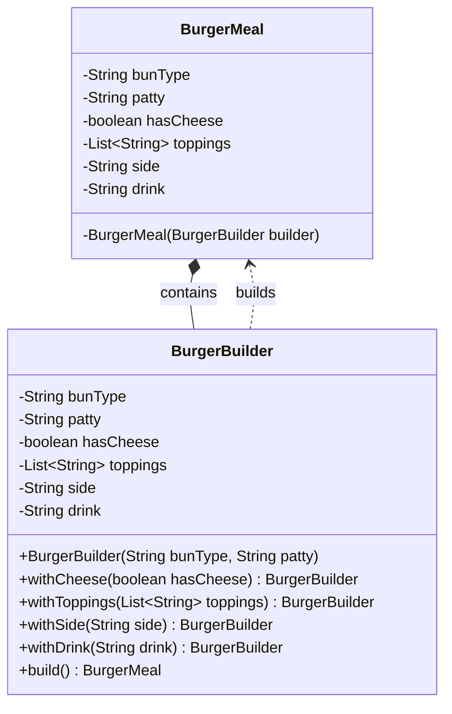

# Builder Pattern

## Question

You are building a `User` object that has: `name` (required), `email` (required), `age` (optional), `address` (optional), `phoneNumber` (optional), `profilePicture` (optional). Write the constructor for this class.

Try it before reading on.

---

## Pattern Mindmap

```
[Builder Pattern]
├── Problem It Solves
│   ├── Telescoping constructor: User(name, email, age, address, phone, pic)
│   ├── Caller must pass null for optional fields — unreadable, error-prone
│   ├── Setter approach: object is invalid between first and last setter call
│   └── Need to create immutable objects with many optional fields
├── Core Structure
│   ├── Outer class: final fields, private constructor taking Builder
│   ├── Static inner Builder class with same fields
│   ├── Builder.name(), Builder.email() — fluent setters returning this
│   ├── Builder.build() validates and constructs the outer object
│   └── Client: new User.Builder("name","email").age(30).build()
├── BurgerMeal Example
│   ├── BurgerMeal.BurgerBuilder with required + optional fields
│   ├── size(s), sauce(s), cheese(b), lettuce(b) fluent methods
│   └── build() creates immutable BurgerMeal
├── Real-World Usage
│   ├── OkHttp: Request.Builder().url().method().build()
│   ├── Lombok @Builder annotation generates builder automatically
│   └── StringBuilder is a mutable builder for String
├── When to Use
│   ├── Object has 4+ fields, several optional
│   ├── Object must be immutable (final fields, no setters)
│   └── Construction requires validation of field combinations
├── When NOT to Use
│   ├── Object has 2–3 fields — constructor or factory is simpler
│   └── Mutability is acceptable and setters work fine
├── Trade-offs
│   ├── Verbose: Builder has same fields as the object (duplication)
│   ├── Lombok @Builder eliminates boilerplate automatically
│   └── Harder to extend: subclass needs its own builder
└── Interview Angles
    ├── What is the telescoping constructor anti-pattern?
    ├── How does Builder enforce immutability?
    └── Difference between Builder and Factory?
```

## Problem Without the Pattern

The first approach — a constructor with all fields:

```python
class User:
    def __init__(self, name: str, email: str, age: int,
                 address: str, phone: str, picture: str):
        ...

# Caller:
u = User("Alice", "alice@x.com", 0, None, None, None)
#                                ^^  ^^^^  ^^^^  ^^^^
#         what do these Nones mean? which is phone vs address?
```

Or the telescoping constructor approach:
```python
# Need separate __init__ signatures or multiple factory methods for every combination
u1 = User("Alice", "alice@x.com")
u2 = User("Alice", "alice@x.com", age=30)
u3 = User("Alice", "alice@x.com", age=30, address="123 Main St")
# Still unreadable when positional; easy to swap arguments
```

**What breaks**:
1. **Unreadable callsites**: `User("Alice", "x@x.com", 0, None, None, None)` — what is the 5th `None`?
2. **Constructor explosion**: N optional fields → up to 2^N combinations you might need to support.
3. **Invalid state**: Nothing stops `User(None, None, -5, ...)` — the object is invalid from birth.
4. **No immutability**: Setters let callers mutate after construction.

---

## Derive the Minimal Fix

The constraint: **separate the step-by-step configuration from the final construction**.

Step 1 — make the outer class take only a Builder in its constructor, with required fields enforced:
```python
class User:
    def __init__(self, builder):
        self.name  = builder.name   # required
        self.email = builder.email  # required
        self.age   = builder.age    # optional
        self.phone = builder.phone  # optional
```

Step 2 — inner `Builder` class holds the state during configuration:
```python
class Builder:
    def __init__(self, name: str, email: str):
        self.name  = name   # required → constructor param
        self.email = email  # required → constructor param
        self.age   = None
        self.phone = None

    def age(self, a: int):
        self.age = a
        return self

    def phone(self, p: str):
        self.phone = p
        return self

    def build(self):
        return User(self)
```

Step 3 — callsite is now readable and validated:
```python
u = User.Builder("Alice", "alice@x.com") \
    .age(30) \
    .phone("555-1234") \
    .build()
```

That's the entire pattern — a fluent inner builder that returns `self` for chaining, and a `build()` that calls the outer constructor.

---

> **Purpose**: Separates the construction of a complex object from its representation, allowing step-by-step creation with full control over which parts are set.

> **Analogy**: Building a custom PC. You specify: CPU=i9, RAM=32GB, Storage=1TB NVMe. The builder assembles it step by step. You don't call `Computer(i9, 32, 1000, True, False, None, ...)` and try to remember what the 7th argument means.

---

## The Problem: Telescoping Constructors

When an object has many optional fields, you end up with either:
1. A constructor with too many parameters (unreadable, error-prone)
2. Multiple overloaded constructors that grow out of control

```python
# Telescoping Constructor Anti-Pattern
class BurgerMeal:
    def __init__(self, bun, patty, cheese=None, side=None, drink=None):
        ...

# Usage is confusing — what does False mean here?
meal = BurgerMeal("wheat", "veg", None, None, False)
```

**Issues:**
- Hard to read: you must remember parameter order and types
- Unnecessary `None` values for optional fields
- Risk of `AttributeError` if internals don't None-check
- Adding a new optional field means updating all call sites
- No flexibility to set values step by step

---

## The Solution: Builder Pattern

```python
from typing import List, Optional

class BurgerMeal:
    # Private constructor — only the Builder creates BurgerMeal
    def __init__(self, builder: "BurgerMeal.BurgerBuilder"):
        # Required components
        self.bun_type   = builder.bun_type
        self.patty      = builder.patty
        # Optional components
        self.has_cheese = builder.has_cheese
        self.toppings   = builder.toppings
        self.side       = builder.side
        self.drink      = builder.drink

    class BurgerBuilder:
        def __init__(self, bun_type: str, patty: str):
            # Required fields in constructor
            self.bun_type   = bun_type
            self.patty      = patty
            # Optional fields with sane defaults
            self.has_cheese: bool           = False
            self.toppings:   List[str]      = []
            self.side:       Optional[str]  = None
            self.drink:      Optional[str]  = None

        def with_cheese(self, has_cheese: bool) -> "BurgerMeal.BurgerBuilder":
            self.has_cheese = has_cheese
            return self  # Returns builder for chaining

        def with_toppings(self, toppings: List[str]) -> "BurgerMeal.BurgerBuilder":
            self.toppings = toppings
            return self

        def with_side(self, side: str) -> "BurgerMeal.BurgerBuilder":
            self.side = side
            return self

        def with_drink(self, drink: str) -> "BurgerMeal.BurgerBuilder":
            self.drink = drink
            return self

        def build(self) -> "BurgerMeal":
            return BurgerMeal(self)

# Usage — readable, flexible, no Nones
plain_burger = BurgerMeal.BurgerBuilder("wheat", "veg").build()

burger_with_cheese = (
    BurgerMeal.BurgerBuilder("wheat", "veg")
    .with_cheese(True)
    .build()
)

toppings = ["lettuce", "onion", "jalapeno"]
loaded_burger = (
    BurgerMeal.BurgerBuilder("multigrain", "chicken")
    .with_cheese(True)
    .with_toppings(toppings)
    .with_side("fries")
    .with_drink("coke")
    .build()
)
```

### Class Diagram



---

## Why This is Better

| Aspect | Constructor Approach | Builder Pattern |
|---|---|---|
| Readability | Poor (nulls, long argument list) | Excellent (fluent, expressive) |
| Flexibility | Low (all-or-nothing setup) | High (configure only what's needed) |
| Maintainability | Hard to scale with more fields | Easy to extend with new options |
| Safety | High chance of errors with nulls | Controlled, safe instantiation |
| Immutability | Hard to enforce | Natural — build once, then freeze |

---

## Real-World Products Using Builder Pattern

**HTTP Request Building** (httpx, requests):
```python
import httpx

# httpx uses a similar builder-style approach
response = httpx.get(
    "https://api.example.com/users",
    headers={"Authorization": f"Bearer {token}"},
)
```

**Amazon Cart Configuration**: Items in a cart have quantity, size, color, delivery option, gift wrap, discount tags — all optional. Builder lets each combination be expressed clearly without constructor explosion.

**io.StringIO / io.BytesIO** (Python standard library): Technically builder-like — you write to the buffer incrementally and call `getvalue()` at the end.

---

## When to Use in Interviews

- When designing any object with 4+ optional fields: "I'd use Builder to avoid telescoping constructors and make creation readable."
- When the interviewer asks about immutable objects: "Builder lets you set fields step by step and then produce an immutable final object via `build()`."
- When discussing API design: "Fluent builder APIs are the gold standard for developer experience when constructing complex objects."

---

## Common Violations

| Violation | Symptom | Fix |
|---|---|---|
| Builder for 2-field class | Over-engineering a simple object | Just use a constructor |
| Mutable `build()` target | Final object's fields can change after build | Don't expose setters on the built object |
| Builder without validation in `build()` | Invalid objects created (e.g., negative price) | Add validation inside `build()` before constructing |
| No required fields in builder constructor | Required fields are optional — allows incomplete objects | Put mandatory fields in the Builder `__init__` |

---

## When to Use and When to Avoid

**Use when:**
- Object has 4+ fields, especially many optional ones
- You want immutability — build once, don't mutate
- Readable object creation matters (public APIs, domain models)

**Avoid when:**
- Class has only 1-2 fields — a constructor is cleaner
- Object is mutable and simple — direct attribute assignment is fine
- The overhead of a separate Builder class isn't justified

---

## Interview Tips

**Q: "Builder vs Constructor — when do you choose Builder?"**
- "When a class has many optional parameters, constructors become unreadable and error-prone. Builder gives a fluent API and enforces which fields are required vs optional. I'd use Builder for any object with 4+ optional configuration fields."

**Q: "How do you enforce required fields in Builder?"**
- "Put required fields in the Builder's `__init__`. Optional fields have `with_*()` methods. `build()` can also validate that constraints are met before constructing the final object."
