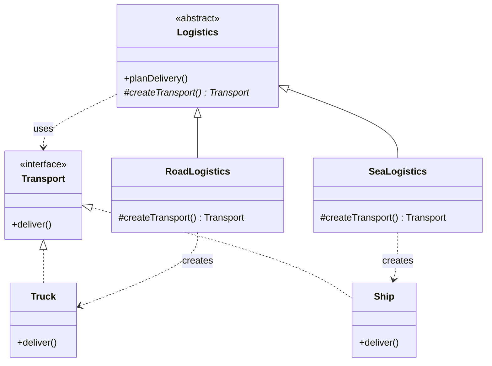

> [!NOTE]
> **📋 5-Minute Summary**
>
> **What this covers:** The Factory Pattern (Simple Factory & Factory Method) — creates objects without specifying the exact class to create.
>
> **Key concepts:**
> - The problem: business logic filled with `if/else` statements calling `new SMSNotification()`, `new EmailNotification()`. If a new type is added, you violate OCP by modifying the business logic.
> - Simple Factory: extract the `if/else` creation logic into a single `NotificationFactory` class. The client passes a string/enum, gets back the interface (`Notification`).
> - Factory Method (GoF): define an interface for creating an object, but let subclasses decide which class to instantiate. E.g., `Logistics` class has abstract `createTransport()`. `RoadLogistics` returns `Truck`, `SeaLogistics` returns `Ship`.
> - Benefit: highly decoupled. The client code only depends on the `Notification` interface, not the concrete implementations.
> - Use cases: whenever object creation logic is complex, requires conditionals based on input, or depends on configurations.
>
> **Key takeaway:** This is the most frequently used pattern in LLD interviews. Whenever you have different types of a thing (e.g., Vehicles in a Parking Lot, Cards in a Deck, Payment Methods), use a Factory to create them.

---
module: 06-lld
topic: Design Patterns
subtopic: Creational
status: unread
tags: [06-lld, system-design, design-patterns]
---
# Factory Pattern

## Question

You are building a notification service. Currently it only sends emails. Write the code to send an email notification. Now a requirement comes in: also support SMS. Then push notifications. Where does the creation logic go?

Try writing it before reading on.

---

## Pattern Mindmap

```
[Factory Pattern]
├── Problem It Solves
│   ├── NotificationService if/else: add SMS = modify existing code (OCP violation)
│   ├── Creation logic scattered across callers
│   └── Hard to test: can't swap concrete type without changing caller
├── Core Structure
│   ├── Product interface: Notification with send()
│   ├── Concrete products: EmailNotification, SMSNotification, PushNotification
│   ├── Factory: centralizes creation logic, returns interface type
│   └── Client: calls factory, uses product via interface only
├── Static Factory Method
│   ├── NotificationFactory.create(type) returns Notification
│   ├── if/else or switch inside the factory (isolated in one place)
│   └── Adding new type: change only the factory
├── Factory Method Pattern (GoF)
│   ├── Abstract creator class with abstract createTransport()
│   ├── Logistics.planDelivery() calls this.createTransport()
│   ├── RoadLogistics overrides createTransport() → Truck
│   └── SeaLogistics overrides createTransport() → Ship
├── Abstract Factory (brief)
│   ├── Factory of factories — creates families of related objects
│   ├── IndiaFactory: IndianPaymentGateway + IndianTaxCalculator
│   └── One method to get the whole suite for a region
├── When to Use
│   ├── Creation logic is complex or needs to vary by config/type
│   ├── Client must not know the concrete class (depend on interface)
│   └── You anticipate adding new product types over time
├── When NOT to Use
│   ├── Only one concrete type exists — over-engineering
│   └── Simple new call is readable and unlikely to change
├── Trade-offs
│   ├── Factory Method requires subclassing — more classes
│   ├── Static factory: simpler but can become a large switch
│   └── Abstract Factory: most flexible but most indirection
└── Interview Angles
    ├── Difference between Static Factory, Factory Method, and Abstract Factory?
    ├── How does Factory relate to OCP?
    └── When would you use a factory over a DI container?
```

## Problem Without the Pattern

The first instinct is a single method with branching:

```python
class NotificationService:
    def send(self, type: str, message: str):
        if type == "EMAIL":
            n = EmailNotification()
            n.send(message)
        elif type == "SMS":
            n = SMSNotification()
            n.send(message)
        elif type == "PUSH":
            n = PushNotification()
            n.send(message)
        # Adding "SLACK" means editing this method
```

**What breaks**:
1. **OCP violation**: Every new notification type requires editing `NotificationService`. It's never closed for modification.
2. **SRP violation**: `NotificationService` now knows *how* to construct every notification type — that's not its job.
3. **Untestable construction**: You cannot substitute a mock `EmailNotification` without changing the `if` block.
4. **Scattered `new` calls**: If `EmailNotification` needs a constructor argument added, you find and fix every `EmailNotification()` site.

---

## Derive the Minimal Fix

The constraint: **the caller should not instantiate the concrete type directly**.

Step 1 — extract an interface so all notification types are interchangeable:
```python
from abc import ABC, abstractmethod

class Notification(ABC):
    @abstractmethod
    def send(self, message: str): ...

class EmailNotification(Notification): ...
class SMSNotification(Notification): ...
```

Step 2 — move the instantiation into a dedicated method that returns the interface:
```python
class NotificationFactory:
    @staticmethod
    def create(type: str) -> Notification:
        if type == "EMAIL":
            return EmailNotification()
        elif type == "SMS":
            return SMSNotification()
        else:
            raise ValueError(f"Unknown type: {type}")
```

Step 3 — the service only calls the factory, never instantiates directly:
```python
class NotificationService:
    def send(self, type: str, message: str):
        n = NotificationFactory.create(type)
        n.send(message)
```

Adding `SLACK` means adding one branch in `NotificationFactory` — `NotificationService` is untouched. That's the pattern.

---

> **Category**: Creational Pattern
> **Purpose**: Create objects without specifying the exact class of object that will be created.

> **Analogy**: A car rental counter. You say "I need a car." They decide whether to give you a sedan, SUV, or van based on availability. You don't worry about the specific car model — you just need something that drives.

---

## 1. Simple Factory (Static Factory)

Not a formal GoF pattern, but the most commonly used in practice. A static method creates objects based on input.

### Example: Vehicle Factory

```python
class VehicleFactory:
    @staticmethod
    def create_vehicle(type: str):
        type_lower = type.lower()
        if type_lower == "car":
            return Car()
        elif type_lower == "bike":
            return Bike()
        elif type_lower == "truck":
            return Truck()
        else:
            raise ValueError(f"Unknown vehicle type: {type}")

# Usage — caller doesn't know or care about Car/Bike/Truck constructors
car = VehicleFactory.create_vehicle("car")
```

**Pros:**
- Simple to implement
- Client decoupled from concrete classes

**Cons:**
- Violates Open/Closed Principle — to add a new vehicle type, you must modify the factory

---

## 2. Factory Method Pattern

Define an interface for creating an object, but let subclasses decide which class to instantiate. Creation logic moves into subclasses.

### Structure

```
Creator (abstract) → declares factory_method() as abstract
ConcreteCreator → implements factory_method(), decides which product to create
```

### Example: Logistics System

```python
from abc import ABC, abstractmethod

# Product interface
class Transport(ABC):
    @abstractmethod
    def deliver(self): ...

class Truck(Transport):
    def deliver(self):
        print("Delivering by land in a box")

class Ship(Transport):
    def deliver(self):
        print("Delivering by sea in a container")

class Drone(Transport):
    def deliver(self):
        print("Delivering by air via drone")

# Creator (abstract) — core logic uses the product, but doesn't create it directly
class Logistics(ABC):
    def plan_delivery(self):
        t = self.create_transport()  # Uses the factory method
        t.deliver()

    # Factory method — subclass decides what to create
    @abstractmethod
    def create_transport(self) -> Transport: ...

# Concrete Creators — each decides which product to instantiate
class RoadLogistics(Logistics):
    def create_transport(self) -> Transport:
        return Truck()

class SeaLogistics(Logistics):
    def create_transport(self) -> Transport:
        return Ship()

# Adding drone delivery = new subclass only, no changes to Logistics or existing creators
class AirLogistics(Logistics):
    def create_transport(self) -> Transport:
        return Drone()

# Usage
logistics = RoadLogistics()
logistics.plan_delivery()  # "Delivering by land in a box"

logistics = AirLogistics()
logistics.plan_delivery()  # "Delivering by air via drone"
```

### Class Diagram



**Pros:**
- Follows Open/Closed Principle — add `AirLogistics` without changing existing code
- Single Responsibility — creation logic lives in the creator subclass

---

## 3. Abstract Factory Pattern (Brief)

Produces families of related objects. See `abstract-factory-pattern.md` for full coverage.

```python
from abc import ABC, abstractmethod

# Abstract Products
class Button(ABC):
    @abstractmethod
    def paint(self): ...

class Checkbox(ABC):
    @abstractmethod
    def paint(self): ...

# Abstract Factory — produces a matched family
class GUIFactory(ABC):
    @abstractmethod
    def create_button(self) -> Button: ...

    @abstractmethod
    def create_checkbox(self) -> Checkbox: ...

# Concrete Factories — produce platform-specific families
class WinFactory(GUIFactory):
    def create_button(self) -> Button:
        return WinButton()

    def create_checkbox(self) -> Checkbox:
        return WinCheckbox()

class MacFactory(GUIFactory):
    def create_button(self) -> Button:
        return MacButton()

    def create_checkbox(self) -> Checkbox:
        return MacCheckbox()

# Client — works with any factory without knowing the platform
class Application:
    def __init__(self, factory: GUIFactory):
        self._button = factory.create_button()

    def render(self):
        self._button.paint()
```

---

## When to Use in Interviews

- When you don't know exact types of objects until runtime: "I'd use a Factory Method so subclasses decide what to instantiate."
- When building a framework or library: "I'd expose factory methods so users can extend without modifying core classes."
- When decoupling object creation from business logic: "The service asks the factory for a `PaymentProcessor` — it doesn't care if it gets Stripe or PayPal."

---

## Common Violations

| Violation | Symptom | Fix |
|---|---|---|
| `ConcreteClass()` scattered everywhere | Client code creates objects directly | Centralize in factory |
| Factory that never stops growing | `if/else` chain for every new type | Switch to Factory Method (subclass per type) |
| Factory returns concrete type | `create_truck()` instead of `Transport` | Return interface/abstract type |

---

## Interview Tips

**Q: "Factory Method vs Abstract Factory?"**
- "Factory Method creates ONE product — the subclass decides which concrete type. Abstract Factory creates a FAMILY of related products — you get a whole matched set (Button + Checkbox + Dialog) from one factory."

**Q: "When to use Factory?"**
- "When you don't know the exact types beforehand, when you want to decouple creation from usage, or when providing a framework where users extend components."

**Q: "How does Factory relate to OCP?"**
- "Simple Factory violates OCP — you modify it to add new types. Factory Method follows OCP — you add a new subclass without touching existing code."

---

## Applied In

This concept is used by **9 problems** in this repo — a representative selection:

**Low-Level Design**

- [Design Chess](../../05-problems/02-frequent-problems/07-design-chess.md)
- [Design Snake and Ladder](../../05-problems/02-frequent-problems/08-design-snake-and-ladder.md)
- [Design a Hotel Management System](../../05-problems/02-frequent-problems/11-design-hotel-management.md)
- [Design Locker Service](../../05-problems/02-frequent-problems/15-design-locker-service.md)
- [Design Notification System](../../05-problems/02-frequent-problems/16-design-notification-system.md)
- [Design a Library Management System](../../05-problems/03-domain-specific/20-design-library-management.md)
- [Design a Ride Sharing System](../../05-problems/03-domain-specific/22-design-ride-sharing.md)
- [Design Minesweeper](../../05-problems/04-advanced-niche/25-design-minesweeper.md)
- …and 1 more

