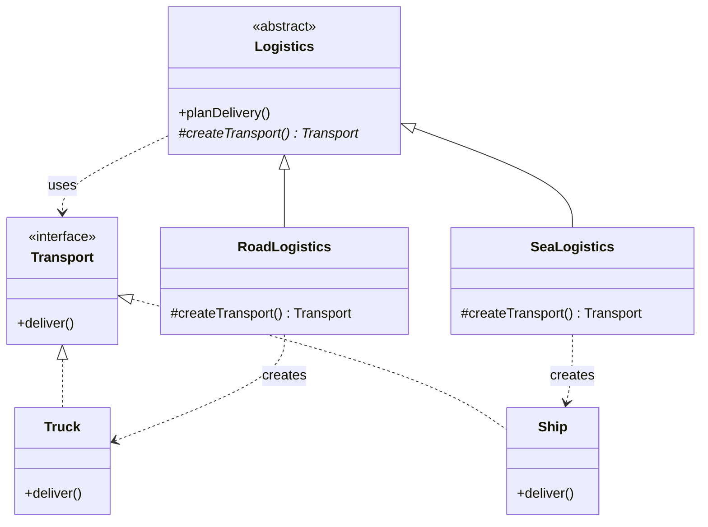

# Factory Pattern

## Question

You are building a notification service. Currently it only sends emails. Write the code to send an email notification. Now a requirement comes in: also support SMS. Then push notifications. Where does the creation logic go?

Try writing it before reading on.

---

## Pattern Mindmap

```
[Factory Pattern]
├── Problem It Solves
│   ├── NotificationService if/else: add SMS = modify existing code (OCP violation)
│   ├── Creation logic scattered across callers
│   └── Hard to test: can't swap concrete type without changing caller
├── Core Structure
│   ├── Product interface: Notification with send()
│   ├── Concrete products: EmailNotification, SMSNotification, PushNotification
│   ├── Factory: centralizes creation logic, returns interface type
│   └── Client: calls factory, uses product via interface only
├── Static Factory Method
│   ├── NotificationFactory.create(type) returns Notification
│   ├── if/else or switch inside the factory (isolated in one place)
│   └── Adding new type: change only the factory
├── Factory Method Pattern (GoF)
│   ├── Abstract creator class with abstract createTransport()
│   ├── Logistics.planDelivery() calls this.createTransport()
│   ├── RoadLogistics overrides createTransport() → Truck
│   └── SeaLogistics overrides createTransport() → Ship
├── Abstract Factory (brief)
│   ├── Factory of factories — creates families of related objects
│   ├── IndiaFactory: IndianPaymentGateway + IndianTaxCalculator
│   └── One method to get the whole suite for a region
├── When to Use
│   ├── Creation logic is complex or needs to vary by config/type
│   ├── Client must not know the concrete class (depend on interface)
│   └── You anticipate adding new product types over time
├── When NOT to Use
│   ├── Only one concrete type exists — over-engineering
│   └── Simple new call is readable and unlikely to change
├── Trade-offs
│   ├── Factory Method requires subclassing — more classes
│   ├── Static factory: simpler but can become a large switch
│   └── Abstract Factory: most flexible but most indirection
└── Interview Angles
    ├── Difference between Static Factory, Factory Method, and Abstract Factory?
    ├── How does Factory relate to OCP?
    └── When would you use a factory over a DI container?
```

## Problem Without the Pattern

The first instinct is a single method with branching:

```java
class NotificationService {
    public void send(String type, String message) {
        if (type.equals("EMAIL")) {
            EmailNotification n = new EmailNotification();
            n.send(message);
        } else if (type.equals("SMS")) {
            SMSNotification n = new SMSNotification();
            n.send(message);
        } else if (type.equals("PUSH")) {
            PushNotification n = new PushNotification();
            n.send(message);
        }
        // Adding "SLACK" means editing this method
    }
}
```

**What breaks**:
1. **OCP violation**: Every new notification type requires editing `NotificationService`. It's never closed for modification.
2. **SRP violation**: `NotificationService` now knows *how* to construct every notification type — that's not its job.
3. **Untestable construction**: You cannot substitute a mock `EmailNotification` without changing the `if` block.
4. **Scattered `new` calls**: If `EmailNotification` needs a constructor argument added, you find and fix every `new EmailNotification()` site.

---

## Derive the Minimal Fix

The constraint: **the caller should not `new` the concrete type directly**.

Step 1 — extract an interface so all notification types are interchangeable:
```java
interface Notification {
    void send(String message);
}
class EmailNotification implements Notification { ... }
class SMSNotification implements Notification { ... }
```

Step 2 — move the `new` into a dedicated method that returns the interface:
```java
class NotificationFactory {
    public static Notification create(String type) {
        switch (type) {
            case "EMAIL": return new EmailNotification();
            case "SMS":   return new SMSNotification();
            default: throw new IllegalArgumentException("Unknown type: " + type);
        }
    }
}
```

Step 3 — the service only calls the factory, never `new` directly:
```java
class NotificationService {
    public void send(String type, String message) {
        Notification n = NotificationFactory.create(type);
        n.send(message);
    }
}
```

Adding `SLACK` means adding one case in `NotificationFactory` — `NotificationService` is untouched. That's the pattern.

---

> **Category**: Creational Pattern
> **Purpose**: Create objects without specifying the exact class of object that will be created.

> **Analogy**: A car rental counter. You say "I need a car." They decide whether to give you a sedan, SUV, or van based on availability. You don't worry about the specific car model — you just need something that drives.

---

## 1. Simple Factory (Static Factory)

Not a formal GoF pattern, but the most commonly used in practice. A static method creates objects based on input.

### Example: Vehicle Factory

```java
public class VehicleFactory {
    public static Vehicle createVehicle(String type) {
        if (type.equalsIgnoreCase("car")) {
            return new Car();
        } else if (type.equalsIgnoreCase("bike")) {
            return new Bike();
        } else if (type.equalsIgnoreCase("truck")) {
            return new Truck();
        } else {
            throw new IllegalArgumentException("Unknown vehicle type: " + type);
        }
    }
}

// Usage — caller doesn't know or care about Car/Bike/Truck constructors
Vehicle car = VehicleFactory.createVehicle("car");
```

**Pros:**
- Simple to implement
- Client decoupled from concrete classes

**Cons:**
- Violates Open/Closed Principle — to add a new vehicle type, you must modify the factory

---

## 2. Factory Method Pattern

Define an interface for creating an object, but let subclasses decide which class to instantiate. Creation logic moves into subclasses.

### Structure

```
Creator (abstract) → declares factoryMethod() as abstract
ConcreteCreator → implements factoryMethod(), decides which product to create
```

### Example: Logistics System

```java
// Product interface
interface Transport {
    void deliver();
}

class Truck implements Transport {
    public void deliver() {
        System.out.println("Delivering by land in a box");
    }
}

class Ship implements Transport {
    public void deliver() {
        System.out.println("Delivering by sea in a container");
    }
}

class Drone implements Transport {
    public void deliver() {
        System.out.println("Delivering by air via drone");
    }
}

// Creator (abstract) — core logic uses the product, but doesn't create it directly
abstract class Logistics {
    public void planDelivery() {
        Transport t = createTransport();  // Uses the factory method
        t.deliver();
    }
    
    // Factory method — subclass decides what to create
    protected abstract Transport createTransport();
}

// Concrete Creators — each decides which product to instantiate
class RoadLogistics extends Logistics {
    @Override
    protected Transport createTransport() {
        return new Truck();
    }
}

class SeaLogistics extends Logistics {
    @Override
    protected Transport createTransport() {
        return new Ship();
    }
}

// Adding drone delivery = new subclass only, no changes to Logistics or existing creators
class AirLogistics extends Logistics {
    @Override
    protected Transport createTransport() {
        return new Drone();
    }
}

// Usage
Logistics logistics = new RoadLogistics();
logistics.planDelivery(); // "Delivering by land in a box"

logistics = new AirLogistics();
logistics.planDelivery(); // "Delivering by air via drone"
```

### Class Diagram



**Pros:**
- Follows Open/Closed Principle — add `AirLogistics` without changing existing code
- Single Responsibility — creation logic lives in the creator subclass

---

## 3. Abstract Factory Pattern (Brief)

Produces families of related objects. See `abstract-factory-pattern.md` for full coverage.

```java
// Abstract Products
interface Button   { void paint(); }
interface Checkbox { void paint(); }

// Abstract Factory — produces a matched family
interface GUIFactory {
    Button createButton();
    Checkbox createCheckbox();
}

// Concrete Factories — produce platform-specific families
class WinFactory implements GUIFactory {
    public Button createButton()   { return new WinButton(); }
    public Checkbox createCheckbox(){ return new WinCheckbox(); }
}

class MacFactory implements GUIFactory {
    public Button createButton()   { return new MacButton(); }
    public Checkbox createCheckbox(){ return new MacCheckbox(); }
}

// Client — works with any factory without knowing the platform
class Application {
    private Button button;
    
    public Application(GUIFactory factory) {
        button = factory.createButton();
    }
    
    public void render() {
        button.paint();
    }
}
```

---

## When to Use in Interviews

- When you don't know exact types of objects until runtime: "I'd use a Factory Method so subclasses decide what to instantiate."
- When building a framework or library: "I'd expose factory methods so users can extend without modifying core classes."
- When decoupling object creation from business logic: "The service asks the factory for a `PaymentProcessor` — it doesn't care if it gets Stripe or PayPal."

---

## Common Violations

| Violation | Symptom | Fix |
|---|---|---|
| `new ConcreteClass()` scattered everywhere | Client code creates objects directly | Centralize in factory |
| Factory that never stops growing | `if/else` chain for every new type | Switch to Factory Method (subclass per type) |
| Factory returns concrete type | `Truck createTruck()` instead of `Transport` | Return interface/abstract type |

---

## Interview Tips

**Q: "Factory Method vs Abstract Factory?"**
- "Factory Method creates ONE product — the subclass decides which concrete type. Abstract Factory creates a FAMILY of related products — you get a whole matched set (Button + Checkbox + Dialog) from one factory."

**Q: "When to use Factory?"**
- "When you don't know the exact types beforehand, when you want to decouple creation from usage, or when providing a framework where users extend components."

**Q: "How does Factory relate to OCP?"**
- "Simple Factory violates OCP — you modify it to add new types. Factory Method follows OCP — you add a new subclass without touching existing code."
