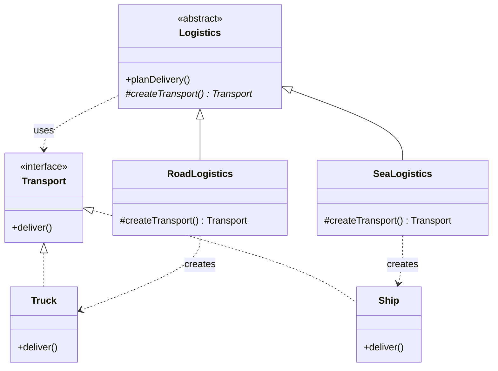

# Factory Pattern

> **Category**: Creational Pattern
> **Purpose**: Create objects without specifying the exact class of object that will be created.

> **Analogy**: A car rental counter. You say "I need a car." They decide whether to give you a sedan, SUV, or van based on availability. You don't worry about the specific car model — you just need something that drives.

---

## 1. Simple Factory (Static Factory)

Not a formal GoF pattern, but the most commonly used in practice. A static method creates objects based on input.

### Example: Vehicle Factory

```java
public class VehicleFactory {
    public static Vehicle createVehicle(String type) {
        if (type.equalsIgnoreCase("car")) {
            return new Car();
        } else if (type.equalsIgnoreCase("bike")) {
            return new Bike();
        } else if (type.equalsIgnoreCase("truck")) {
            return new Truck();
        } else {
            throw new IllegalArgumentException("Unknown vehicle type: " + type);
        }
    }
}

// Usage — caller doesn't know or care about Car/Bike/Truck constructors
Vehicle car = VehicleFactory.createVehicle("car");
```

**Pros:**
- Simple to implement
- Client decoupled from concrete classes

**Cons:**
- Violates Open/Closed Principle — to add a new vehicle type, you must modify the factory

---

## 2. Factory Method Pattern

Define an interface for creating an object, but let subclasses decide which class to instantiate. Creation logic moves into subclasses.

### Structure

```
Creator (abstract) → declares factoryMethod() as abstract
ConcreteCreator → implements factoryMethod(), decides which product to create
```

### Example: Logistics System

```java
// Product interface
interface Transport {
    void deliver();
}

class Truck implements Transport {
    public void deliver() {
        System.out.println("Delivering by land in a box");
    }
}

class Ship implements Transport {
    public void deliver() {
        System.out.println("Delivering by sea in a container");
    }
}

class Drone implements Transport {
    public void deliver() {
        System.out.println("Delivering by air via drone");
    }
}

// Creator (abstract) — core logic uses the product, but doesn't create it directly
abstract class Logistics {
    public void planDelivery() {
        Transport t = createTransport();  // Uses the factory method
        t.deliver();
    }
    
    // Factory method — subclass decides what to create
    protected abstract Transport createTransport();
}

// Concrete Creators — each decides which product to instantiate
class RoadLogistics extends Logistics {
    @Override
    protected Transport createTransport() {
        return new Truck();
    }
}

class SeaLogistics extends Logistics {
    @Override
    protected Transport createTransport() {
        return new Ship();
    }
}

// Adding drone delivery = new subclass only, no changes to Logistics or existing creators
class AirLogistics extends Logistics {
    @Override
    protected Transport createTransport() {
        return new Drone();
    }
}

// Usage
Logistics logistics = new RoadLogistics();
logistics.planDelivery(); // "Delivering by land in a box"

logistics = new AirLogistics();
logistics.planDelivery(); // "Delivering by air via drone"
```

### Class Diagram



**Pros:**
- Follows Open/Closed Principle — add `AirLogistics` without changing existing code
- Single Responsibility — creation logic lives in the creator subclass

---

## 3. Abstract Factory Pattern (Brief)

Produces families of related objects. See `abstract-factory-pattern.md` for full coverage.

```java
// Abstract Products
interface Button   { void paint(); }
interface Checkbox { void paint(); }

// Abstract Factory — produces a matched family
interface GUIFactory {
    Button createButton();
    Checkbox createCheckbox();
}

// Concrete Factories — produce platform-specific families
class WinFactory implements GUIFactory {
    public Button createButton()   { return new WinButton(); }
    public Checkbox createCheckbox(){ return new WinCheckbox(); }
}

class MacFactory implements GUIFactory {
    public Button createButton()   { return new MacButton(); }
    public Checkbox createCheckbox(){ return new MacCheckbox(); }
}

// Client — works with any factory without knowing the platform
class Application {
    private Button button;
    
    public Application(GUIFactory factory) {
        button = factory.createButton();
    }
    
    public void render() {
        button.paint();
    }
}
```

---

## When to Use in Interviews

- When you don't know exact types of objects until runtime: "I'd use a Factory Method so subclasses decide what to instantiate."
- When building a framework or library: "I'd expose factory methods so users can extend without modifying core classes."
- When decoupling object creation from business logic: "The service asks the factory for a `PaymentProcessor` — it doesn't care if it gets Stripe or PayPal."

---

## Common Violations

| Violation | Symptom | Fix |
|---|---|---|
| `new ConcreteClass()` scattered everywhere | Client code creates objects directly | Centralize in factory |
| Factory that never stops growing | `if/else` chain for every new type | Switch to Factory Method (subclass per type) |
| Factory returns concrete type | `Truck createTruck()` instead of `Transport` | Return interface/abstract type |

---

## Interview Tips

**Q: "Factory Method vs Abstract Factory?"**
- "Factory Method creates ONE product — the subclass decides which concrete type. Abstract Factory creates a FAMILY of related products — you get a whole matched set (Button + Checkbox + Dialog) from one factory."

**Q: "When to use Factory?"**
- "When you don't know the exact types beforehand, when you want to decouple creation from usage, or when providing a framework where users extend components."

**Q: "How does Factory relate to OCP?"**
- "Simple Factory violates OCP — you modify it to add new types. Factory Method follows OCP — you add a new subclass without touching existing code."
