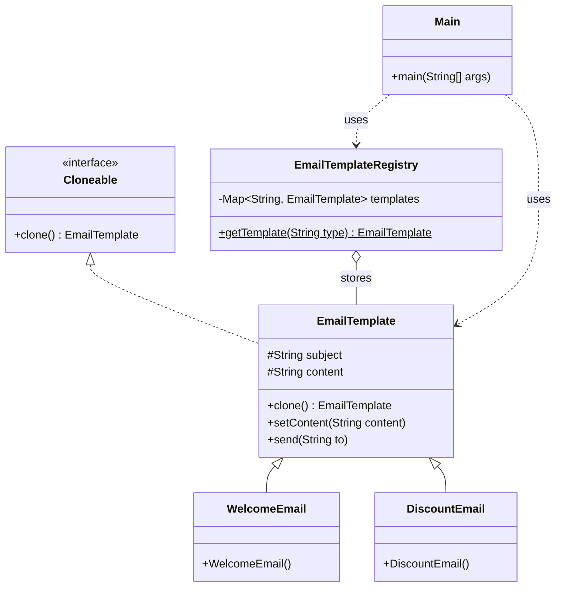

# Prototype Pattern

## Question

Your system sends marketing emails. Each email has a fixed structure (HTML template, headers, sender info) but a different recipient and a small personalization block. You need to create 10,000 `EmailTemplate` objects per campaign. Write the construction code.

Try it before reading on.

---

## Pattern Mindmap

```
[Prototype Pattern]
├── Problem It Solves
│   ├── 10,000 EmailTemplate objects each loading 50KB HTML from disk + DB
│   ├── Construction is expensive: I/O, parsing, network calls
│   └── Objects differ only in recipient + small personalization block
├── Core Structure
│   ├── Cloneable interface with clone() method
│   ├── EmailTemplate.clone() copies expensive fields from prototype
│   ├── Client mutates only the variable fields on the clone
│   └── Prototype registry: map of named templates to pre-built instances
├── Deep vs Shallow Clone
│   ├── Shallow clone: nested objects are shared (mutable references copied)
│   ├── Deep clone: nested objects are also duplicated (safe mutation)
│   └── Rule: if cloned object will mutate nested state, must deep clone
├── EmailTemplate Registry
│   ├── EmailTemplateRegistry.get("WELCOME") → clone of pre-built prototype
│   ├── Pre-built once at startup; each clone is O(field copy) not O(I/O)
│   └── Register new templates without changing client code
├── Analogy
│   ├── Word document template: create template once, duplicate for each doc
│   └── Cell mitosis: new cell is a copy of parent, then specializes
├── When to Use
│   ├── Object creation is expensive (I/O, network, parsing)
│   ├── Objects are structurally similar with small variations
│   └── Need many copies quickly (bulk campaign, game entities)
├── When NOT to Use
│   ├── Object creation is cheap (simple constructor) — just use new
│   └── Deep clone is complex and error-prone — consider factory instead
├── Trade-offs
│   ├── Deep cloning complex object graphs is tricky
│   ├── Circular references in object graph can break naive clone
│   └── Registry adds indirection but simplifies client code significantly
└── Interview Angles
    ├── When would you choose Prototype over Factory?
    ├── What is the difference between deep and shallow clone?
    └── How does a prototype registry work?
```

## Problem Without the Pattern

The obvious approach: construct each one from scratch.

```java
class EmailTemplate {
    private String htmlBody;      // 50KB HTML loaded from disk
    private Map<String,String> headers;  // parsed from config file
    private String senderInfo;    // fetched from DB
    private String recipient;
    private String personalization;

    public EmailTemplate(String recipient, String personalization) {
        this.htmlBody    = FileLoader.load("template.html"); // disk I/O
        this.headers     = ConfigParser.parse("email.cfg"); // file parse
        this.senderInfo  = DB.query("SELECT sender FROM config"); // DB call
        this.recipient   = recipient;
        this.personalization = personalization;
    }
}

// Sending to 10,000 users:
for (String user : users) {
    EmailTemplate t = new EmailTemplate(user, "Hi " + user); // 10,000 disk + DB calls
}
```

**What breaks**:
1. **Performance**: 10,000 disk reads and DB queries for data that never changes between emails.
2. **Initialization cost is constant but paid every time**: The heavy work (loading HTML, parsing config) is identical for every instance.
3. **No sharing of invariant state**: Each of 10,000 instances holds its own copy of the same 50KB HTML.

---

## Derive the Minimal Fix

The constraint: **do the expensive initialization once, then copy the result**.

Step 1 — do the expensive initialization once and store it as a prototype:
```java
EmailTemplate prototype = new EmailTemplate(); // one disk read, one DB call
```

Step 2 — for each new instance, clone the prototype and only set what differs:
```java
EmailTemplate forAlice = prototype.clone();
forAlice.setRecipient("alice@example.com");
forAlice.setPersonalization("Hi Alice");
```

Step 3 — the `clone()` implementation must decide: shallow copy (share the 50KB HTML reference — fine if it's immutable) or deep copy (create independent mutable copies):
```java
class EmailTemplate implements Cloneable {
    @Override
    public EmailTemplate clone() {
        try {
            EmailTemplate copy = (EmailTemplate) super.clone(); // shallow
            copy.headers = new HashMap<>(this.headers); // deep copy mutable field
            return copy;
        } catch (CloneNotSupportedException e) {
            throw new RuntimeException(e);
        }
    }
}
```

Now 10,000 emails = 1 expensive initialization + 10,000 cheap clones. That's the pattern.

---

> **Purpose**: Create new objects by cloning an existing object (the prototype) instead of constructing from scratch. Efficient when initialization is complex or costly.

> **Analogy**: A Word document template. Instead of creating every new quarterly report from scratch — formatting, headers, fonts, structure — you clone the template and fill in the specific numbers. Same structure, different content.

---

## The Core Idea

When object creation is expensive (heavy DB lookups, complex configuration, deep initialization), creating from scratch every time is wasteful. Instead, keep a well-configured prototype and clone it. Modify the clone, not the original.

**Key question**: Is this object expensive to create, and do many instances share the same base structure with small variations? If yes, Prototype fits.

---

## The Problem: Repetitive Instantiation

```java
// Bad: Every email is created from scratch
abstract class EmailTemplate {
    abstract void setContent(String content);
    abstract void send(String to);
}

class WelcomeEmail extends EmailTemplate {
    private String subject;
    private String content;
    
    public WelcomeEmail() {
        this.subject = "Welcome to TUF+";
        this.content = "Hi there! Thanks for joining us.";
        // Imagine this also loads config, validates templates, sets up formatting — expensive
    }
    
    public void setContent(String content) { this.content = content; }
    
    public void send(String to) {
        System.out.println("Sending to " + to + ": [" + subject + "] " + content);
    }
}

public class Main {
    public static void main(String[] args) {
        // Creating a new instance every time — redundant re-initialization
        EmailTemplate email1 = new WelcomeEmail();
        email1.send("user1@example.com");
        
        EmailTemplate email2 = new WelcomeEmail();  // Same expensive constructor again
        email2.setContent("Hi there! Welcome to TUF Premium.");
        email2.send("user2@example.com");
        
        EmailTemplate email3 = new WelcomeEmail();  // And again
        email3.setContent("Thanks for signing up. Let's get started!");
        email3.send("user3@example.com");
    }
}
```

**Issues:**
- Tight coupling to concrete class — `new WelcomeEmail()` everywhere
- Repetitive re-initialization for mostly-identical objects
- Violates DRY — same base setup repeated for every instance
- No reuse of a pre-configured base object

---

## The Solution: Prototype Pattern

```java
import java.util.HashMap;
import java.util.Map;

// 1. Prototype interface
interface Cloneable {
    EmailTemplate clone();
}

// 2. Base class with clone support
class EmailTemplate implements Cloneable {
    protected String subject;
    protected String content;
    
    @Override
    public EmailTemplate clone() {
        try {
            return (EmailTemplate) super.clone();  // Shallow copy
        } catch (CloneNotSupportedException e) {
            throw new RuntimeException("Clone not supported", e);
        }
    }
    
    public void setContent(String content) {
        this.content = content;
    }
    
    public void send(String to) {
        System.out.println("Sending to " + to + ": [" + subject + "] " + content);
    }
}

// 3. Concrete prototypes — expensive setup happens ONCE in the constructor
class WelcomeEmail extends EmailTemplate {
    public WelcomeEmail() {
        this.subject = "Welcome to TUF+";
        this.content = "Hi there! Thanks for joining us.";
        // Expensive initialization happens only once here
    }
}

class DiscountEmail extends EmailTemplate {
    public DiscountEmail() {
        this.subject = "Special Offer — 30% Off!";
        this.content = "Hi! Use code SAVE30 at checkout.";
    }
}

// 4. Registry — stores and serves clones of pre-configured prototypes
class EmailTemplateRegistry {
    private static Map<String, EmailTemplate> templates = new HashMap<>();
    
    static {
        templates.put("welcome",  new WelcomeEmail());   // Created ONCE
        templates.put("discount", new DiscountEmail());  // Created ONCE
    }
    
    public static EmailTemplate getTemplate(String type) {
        EmailTemplate template = templates.get(type);
        if (template == null) throw new IllegalArgumentException("Unknown template: " + type);
        return template.clone();  // Return a clone, never the original
    }
}

// 5. Client — clones templates, modifies only what's needed
public class Main {
    public static void main(String[] args) {
        EmailTemplate email1 = EmailTemplateRegistry.getTemplate("welcome");
        email1.setContent("Hi Alice, welcome to TUF Premium!");
        email1.send("alice@example.com");
        
        EmailTemplate email2 = EmailTemplateRegistry.getTemplate("welcome");
        email2.setContent("Hi Bob, thanks for joining!");
        email2.send("bob@example.com");
        
        // Original prototype is unchanged — both emails were cloned independently
        EmailTemplate discount = EmailTemplateRegistry.getTemplate("discount");
        discount.send("carol@example.com");  // Use as-is
    }
}
```

### Class Diagram



---

## Deep Cloning vs Shallow Cloning

**Shallow Clone**: Copies primitive fields by value; copies object references (not the objects themselves). Changes to nested objects in the clone affect the original.

**Deep Clone**: Copies everything recursively. Each clone is fully independent.

```java
// Deep clone example — for objects with nested mutable state
class EmailTemplate {
    protected String subject;
    protected List<String> attachments;  // Mutable nested object
    
    @Override
    public EmailTemplate clone() {
        try {
            EmailTemplate copy = (EmailTemplate) super.clone();
            copy.attachments = new ArrayList<>(this.attachments);  // Deep copy the list
            return copy;
        } catch (CloneNotSupportedException e) {
            throw new RuntimeException(e);
        }
    }
}
```

Use deep cloning when the prototype contains mutable nested objects. Otherwise, clones share state and modifying one affects all others.

---

## When to Use in Interviews

- When object initialization is expensive and many instances share the same structure: "I'd use Prototype — initialize once, clone many times."
- When building a game with many similar entities (enemies, tiles): "Each enemy type is a prototype; spawning clones the prototype instead of re-creating from scratch."
- When describing configuration objects: "Configuration is loaded once from file/DB and stored as a prototype. New service instances clone the config."

---

## Common Violations

| Violation | Symptom | Fix |
|---|---|---|
| Modifying original prototype | `getTemplate()` returns original, not clone | Always return a clone from the registry |
| Shallow copy of mutable fields | Clone shares `List` with original; modifications bleed through | Deep copy all mutable nested objects |
| No registry | `new WelcomeEmail()` everywhere despite expensive init | Centralize in a `TemplateRegistry` |
| Using Prototype for cheap objects | Simple POJO with 2 fields uses clone | Just use a constructor — no need for Prototype |

---

## Pros and Cons

**Pros:**
- Faster object creation — no need to reinitialize from scratch
- Reduces subclassing — no need to create subclasses for each variation
- Runtime flexibility — modify a clone on the fly without touching the prototype
- Clean decoupling — client doesn't depend on how `WelcomeEmail` is constructed

**Cons:**
- Deep cloning can be complex — circular references are hard to handle
- Easy to forget to deep copy mutable fields — subtle bugs
- Potential confusion if the clone/original distinction isn't clear

---

## Interview Tips

**Q: "When would you use Prototype over just calling `new`?"**
- "When object creation is expensive — like loading a template from DB, parsing a config file, or setting up a complex graph. You pay that cost once, then clone cheaply. Prototypes are also useful when you need many similar objects with slight variations."

**Q: "What's the risk of Prototype Pattern?"**
- "Shallow cloning. If the prototype has mutable nested objects (lists, maps, other entities), the clone shares those references. Modifying the clone's nested state corrupts the prototype. Always deep copy mutable fields."
