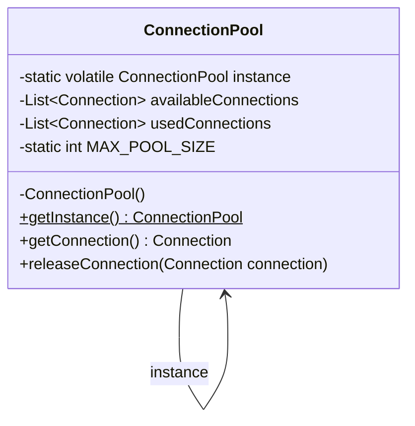

# Singleton Pattern

## Question

You are building a connection pool for a database. Every component in the application needs connections. Write the first version of a `ConnectionPool` class that any component can instantiate and use.

Try this before reading on.

---

## Pattern Mindmap

```
[Singleton Pattern]
├── Problem It Solves
│   ├── ConnectionPool created by every component = N pools, N×pool_size connections
│   ├── Config, logger, thread pool — all must be exactly one instance
│   └── Resource duplication or inconsistent shared state
├── Core Structure
│   ├── private static instance field
│   ├── private constructor — blocks external new
│   └── public static getInstance() — single access point
├── Solution 1: Synchronized Method
│   ├── public static synchronized getInstance()
│   ├── Thread-safe, but every call acquires lock — slow
│   └── Use only in very low-contention cases
├── Solution 2: Double-Checked Locking (Optimal)
│   ├── private static volatile instance (volatile required)
│   ├── First check: no lock (fast path for 99.99% of calls)
│   ├── synchronized block: create only if still null
│   └── volatile prevents partially-constructed object visibility
├── Solution 3: Enum (Best in Java)
│   ├── JVM guarantees single initialization + thread safety
│   ├── Prevents reflection attacks
│   ├── Serialization-safe automatically
│   └── Usage: Singleton.INSTANCE.doSomething()
├── When to Use
│   ├── Shared resource with initialization cost (connection pool, config)
│   ├── Global coordination point (logger, cache, registry)
│   └── Only when exactly-one semantics is a real constraint
├── When NOT to Use
│   ├── When testability matters — singleton resists mocking
│   ├── When you think you need it for convenience — use DI instead
│   └── When state is per-user or per-request — not shared global
├── Trade-offs
│   ├── Global state makes testing harder — prefer DI with single instance
│   ├── Breaks if multiple classloaders exist (multiple "singletons")
│   └── Enum is immune to reflection and serialization attacks
└── Interview Angles
    ├── Why must volatile be used in DCL?
    ├── How does enum solve thread safety without any lock?
    └── What is the difference between Singleton and a static class?
```

## Problem Without the Pattern

The obvious implementation:

```java
class ConnectionPool {
    private List<Connection> connections;

    public ConnectionPool() {
        connections = new ArrayList<>();
        for (int i = 0; i < 10; i++) {
            connections.add(openNewConnection());
        }
    }

    public Connection acquire() { ... }
    public void release(Connection c) { ... }
}

// In ServiceA:
ConnectionPool poolA = new ConnectionPool(); // opens 10 connections

// In ServiceB:
ConnectionPool poolB = new ConnectionPool(); // opens another 10 connections
```

**What breaks**:
1. **Resource duplication**: 2 services = 20 open connections, all independent. The pool can't enforce a global limit.
2. **Inconsistency**: `poolA.release(c)` returns `c` to `poolA`'s list. `ServiceB` never sees it — it's draining its own pool.
3. **No shared state**: Any attempt to track "how many connections are active" is per-instance, not global.

The real requirement isn't "create a connection pool" — it's "there must be exactly **one** pool, shared by everyone."

---

## Derive the Minimal Fix

The constraint: **only one instance must ever exist**.

Step 1 — block external construction:
```java
class ConnectionPool {
    private ConnectionPool() { } // prevent new ConnectionPool()
}
```

Step 2 — the class holds its own instance:
```java
class ConnectionPool {
    private static ConnectionPool instance = new ConnectionPool();
    private ConnectionPool() { }
}
```

Step 3 — expose a global access point:
```java
public static ConnectionPool getInstance() {
    return instance;
}
```

That's the entire pattern. Everything below is refinements: lazy initialization, thread-safety under concurrency, preventing serialization bypass.

---

> **Purpose**: Ensure a class has only one instance and provide a global access point to it.

> **Analogy**: The president of a country. There is exactly ONE president at any time. Everyone who wants to talk to "the president" gets the same person — no matter who asks or when.

---

## When to Use

- Database connection pool
- Configuration manager
- Logging service
- Cache manager
- Thread pool

**Avoid overuse** — makes testing difficult. Prefer dependency injection where possible.

---

## Implementation

### Basic Singleton (Not Thread-Safe)

```java
public class Singleton {
    private static Singleton instance;
    
    private Singleton() {
        // Private constructor prevents external instantiation
    }
    
    public static Singleton getInstance() {
        if (instance == null) {
            instance = new Singleton();
        }
        return instance;
    }
}
```

**Problem**: Not thread-safe. Two threads can both see `instance == null` simultaneously and create two separate instances.

---

### Thread-Safe Singleton (Double-Checked Locking)

```java
public class ThreadSafeSingleton {
    private static volatile ThreadSafeSingleton instance;
    
    private ThreadSafeSingleton() {}
    
    public static ThreadSafeSingleton getInstance() {
        if (instance == null) {                          // First check (no locking — fast path)
            synchronized (ThreadSafeSingleton.class) {
                if (instance == null) {                  // Second check (with lock — safe path)
                    instance = new ThreadSafeSingleton();
                }
            }
        }
        return instance;
    }
}
```

**Key**: `volatile` ensures all threads see the latest value (prevents CPU cache inconsistency). Double-check reduces lock overhead once instance is created.

---

### Enum Singleton (Best in Java)

```java
public enum Singleton {
    INSTANCE;
    
    public void doSomething() {
        // Business logic
    }
}

// Usage
Singleton.INSTANCE.doSomething();
```

**Why best**: Thread-safe by JVM, serialization-safe, and immune to reflection attacks (Java prevents creating a second enum instance via reflection).

---

## Real-World Example: Database Connection Pool

```java
public class ConnectionPool {
    private static volatile ConnectionPool instance;
    private List<Connection> availableConnections;
    private List<Connection> usedConnections;
    private static final int MAX_POOL_SIZE = 10;
    
    private ConnectionPool() {
        availableConnections = new ArrayList<>();
        usedConnections = new ArrayList<>();
        
        for (int i = 0; i < MAX_POOL_SIZE; i++) {
            availableConnections.add(createNewConnection());
        }
    }
    
    public static ConnectionPool getInstance() {
        if (instance == null) {
            synchronized (ConnectionPool.class) {
                if (instance == null) {
                    instance = new ConnectionPool();
                }
            }
        }
        return instance;
    }
    
    public synchronized Connection getConnection() {
        if (availableConnections.isEmpty()) {
            throw new RuntimeException("No available connections");
        }
        Connection connection = availableConnections.remove(0);
        usedConnections.add(connection);
        return connection;
    }
    
    public synchronized void releaseConnection(Connection connection) {
        usedConnections.remove(connection);
        availableConnections.add(connection);
    }
}

// Usage
ConnectionPool pool = ConnectionPool.getInstance();  // Same object every time
Connection conn = pool.getConnection();
// Use connection
pool.releaseConnection(conn);
```

### Class Diagram



---

## Pros & Cons

**Pros:**
- Controlled access to single instance
- Reduced memory (one instance for shared resources)
- Global access point

**Cons:**
- Violates Single Responsibility (manages own lifecycle AND does business logic)
- Difficult to unit test — global state makes mocking hard
- Hidden dependency — not obvious from constructor, breaks DIP
- Can become a bottleneck if overused (global state = shared mutable state)

---

## Alternative: Dependency Injection

Prefer DI over Singleton for testability:

```java
// Bad: Singleton
public class UserService {
    public void createUser() {
        DatabasePool.getInstance().getConnection();  // Hidden dependency!
    }
}

// Good: Dependency Injection
public class UserService {
    private final DatabasePool pool;
    
    public UserService(DatabasePool pool) {  // Explicit dependency, mockable in tests
        this.pool = pool;
    }
    
    public void createUser() {
        pool.getConnection();
    }
}
```

The DI approach lets you inject `new InMemoryConnectionPool()` in tests — the Singleton approach doesn't.

---

## When to Use in Interviews

- When designing a logger, config manager, or connection pool: "I'd use Singleton with double-checked locking and a `volatile` field to ensure thread safety."
- When the interviewer asks about thread safety: "Basic Singleton with lazy init is not thread-safe. I'd use either DCL + volatile, or an Enum Singleton."
- When discussing tradeoffs: "I'd prefer DI over Singleton for anything testable. Singleton is fine for stateless shared resources like a logger."

---

## Common Violations

| Violation | Symptom | Fix |
|---|---|---|
| Non-volatile `instance` with DCL | Race condition; two instances possible | Add `volatile` keyword |
| Singleton for every service | Hard to test, hidden coupling | Use DI framework (Spring, Guice) |
| Mutable global state in Singleton | Concurrent writes cause bugs | Make Singleton immutable or use synchronization |

---

## Interview Tips

**Q: "Why use Singleton?"**
- "To ensure a single shared instance for resources like a connection pool or config manager. But I'd prefer DI for testability."

**Q: "Is your Singleton thread-safe?"**
- "Yes, using double-checked locking with a `volatile` field. The first null check avoids the lock on the hot path; the second null check inside the synchronized block prevents double instantiation."

**Q: "What's wrong with Singleton?"**
- "It introduces hidden global state, violates DIP (classes depend on a concrete singleton), and makes unit testing hard since you can't easily swap the instance."
