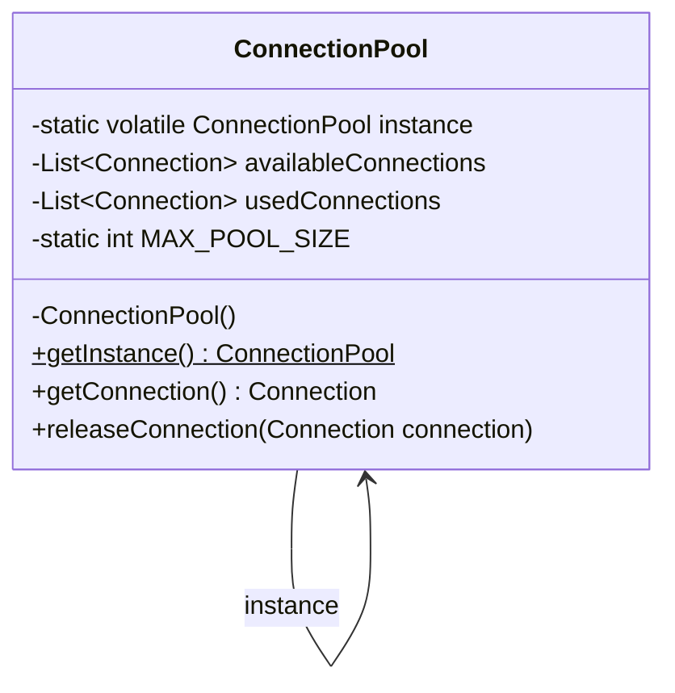

> [!NOTE]
> **📋 5-Minute Summary**
>
> **What this covers:** The Singleton Pattern — ensures a class has only one instance and provides a global access point to it.
>
> **Key concepts:**
> - The problem: multiple instances of shared resources (like DB connection pools or loggers) waste memory and cause conflicts.
> - Implementation: private constructor, static variable holding the instance, static `getInstance()` method.
> - Thread safety: lazy initialization in multithreaded environments causes race conditions (creating multiple instances).
> - Double-checked locking: the standard Java fix. Check if null, `synchronized` block, check if null again. Variable must be `volatile`.
> - Enum Singleton: Joshua Bloch's recommended Java approach. Thread-safe by default, handles serialization automatically.
> - Anti-pattern: Singleton is often considered an anti-pattern because it acts like global state, making unit testing difficult. Dependency Injection (Spring) handles singletons better.
>
> **Key takeaway:** If asked to implement a Singleton in a Java interview, you must know how to write the double-checked locking version and explain why `volatile` is required (prevents instruction reordering).

---
module: 06-lld
topic: Design Patterns
subtopic: Creational
status: unread
tags: [06-lld, system-design, design-patterns]
---
# Singleton Pattern

> 🔵 **Java idiom:** Python leans on module-level state or a metaclass; Java's interview-expected forms are (1) **double-checked locking** — `private static volatile Instance instance;` with a null-check outside and inside a `synchronized` block (`volatile` is mandatory to stop instruction-reordering handing out a half-constructed object), (2) the **enum singleton** (`enum Singleton { INSTANCE; }`) — Bloch's preferred form, thread-safe and serialization-proof for free, and (3) the **static holder idiom** (lazy init via a nested `static` class, no locking). **Interview gotcha:** be ready to explain *why* `volatile` is required and that plain `synchronized getInstance()` works but serializes every call. Note it's often an anti-pattern (global state, hard to test) — Spring-managed beans are the real-world substitute.

## Question

You are building a connection pool for a database. Every component in the application needs connections. Write the first version of a `ConnectionPool` class that any component can instantiate and use.

Try this before reading on.

---

## Pattern Mindmap

```
[Singleton Pattern]
├── Problem It Solves
│   ├── ConnectionPool created by every component = N pools, N×pool_size connections
│   ├── Config, logger, thread pool — all must be exactly one instance
│   └── Resource duplication or inconsistent shared state
├── Core Structure
│   ├── private static instance field
│   ├── private constructor — blocks external new
│   └── public static getInstance() — single access point
├── Solution 1: Synchronized Method
│   ├── public static synchronized getInstance()
│   ├── Thread-safe, but every call acquires lock — slow
│   └── Use only in very low-contention cases
├── Solution 2: Double-Checked Locking (Optimal)
│   ├── private static volatile instance (volatile required)
│   ├── First check: no lock (fast path for 99.99% of calls)
│   ├── synchronized block: create only if still null
│   └── volatile prevents partially-constructed object visibility
├── Solution 3: Enum (Best in Java)
│   ├── JVM guarantees single initialization + thread safety
│   ├── Prevents reflection attacks
│   ├── Serialization-safe automatically
│   └── Usage: Singleton.INSTANCE.doSomething()
├── When to Use
│   ├── Shared resource with initialization cost (connection pool, config)
│   ├── Global coordination point (logger, cache, registry)
│   └── Only when exactly-one semantics is a real constraint
├── When NOT to Use
│   ├── When testability matters — singleton resists mocking
│   ├── When you think you need it for convenience — use DI instead
│   └── When state is per-user or per-request — not shared global
├── Trade-offs
│   ├── Global state makes testing harder — prefer DI with single instance
│   ├── Breaks if multiple classloaders exist (multiple "singletons")
│   └── Enum is immune to reflection and serialization attacks
└── Interview Angles
    ├── Why must volatile be used in DCL?
    ├── How does enum solve thread safety without any lock?
    └── What is the difference between Singleton and a static class?
```

## Problem Without the Pattern

The obvious implementation:

```python
class ConnectionPool:
    def __init__(self):
        self.connections = []
        for _ in range(10):
            self.connections.append(self._open_new_connection())

    def acquire(self): ...
    def release(self, c): ...

# In ServiceA:
pool_a = ConnectionPool()  # opens 10 connections

# In ServiceB:
pool_b = ConnectionPool()  # opens another 10 connections
```

**What breaks**:
1. **Resource duplication**: 2 services = 20 open connections, all independent. The pool can't enforce a global limit.
2. **Inconsistency**: `pool_a.release(c)` returns `c` to `pool_a`'s list. `ServiceB` never sees it — it's draining its own pool.
3. **No shared state**: Any attempt to track "how many connections are active" is per-instance, not global.

The real requirement isn't "create a connection pool" — it's "there must be exactly **one** pool, shared by everyone."

---

## Derive the Minimal Fix

The constraint: **only one instance must ever exist**.

Step 1 — block external construction:
```python
class ConnectionPool:
    def __init__(self):
        pass  # prevent direct instantiation via __new__ override
```

Step 2 — the class holds its own instance:
```python
class ConnectionPool:
    _instance = None

    def __new__(cls):
        if cls._instance is None:
            cls._instance = super().__new__(cls)
        return cls._instance
```

Step 3 — expose a global access point:
```python
@classmethod
def get_instance(cls):
    return cls()
```

That's the entire pattern. Everything below is refinements: lazy initialization, thread-safety under concurrency, preventing serialization bypass.

---

> **Purpose**: Ensure a class has only one instance and provide a global access point to it.

> **Analogy**: The president of a country. There is exactly ONE president at any time. Everyone who wants to talk to "the president" gets the same person — no matter who asks or when.

---

## When to Use

- Database connection pool
- Configuration manager
- Logging service
- Cache manager
- Thread pool

**Avoid overuse** — makes testing difficult. Prefer dependency injection where possible.

---

## Implementation

### Basic Singleton (Not Thread-Safe)

```python
class Singleton:
    _instance = None

    def __new__(cls):
        if cls._instance is None:
            cls._instance = super().__new__(cls)
        return cls._instance

    @classmethod
    def get_instance(cls):
        return cls()
```

**Problem**: Not thread-safe. Two threads can both see `_instance is None` simultaneously and create two separate instances.

---

### Thread-Safe Singleton (Double-Checked Locking)

```python
import threading

class ThreadSafeSingleton:
    _instance = None
    _lock = threading.Lock()

    def __new__(cls):
        if cls._instance is None:                  # First check (no locking — fast path)
            with cls._lock:
                if cls._instance is None:          # Second check (with lock — safe path)
                    cls._instance = super().__new__(cls)
        return cls._instance

    @classmethod
    def get_instance(cls):
        return cls()
```

**Key**: The double-check reduces lock overhead once the instance is created. Python's GIL provides some protection, but the explicit lock is still best practice for correctness.

---

### Module-Level Singleton (Best in Python)

```python
# singleton_instance.py — module-level instance, imported everywhere
class _Singleton:
    def do_something(self):
        pass  # Business logic

instance = _Singleton()  # Created once when module is first imported

# Usage (in any other module):
# from singleton_instance import instance
# instance.do_something()
```

**Why best**: Python's module system guarantees a module is only imported once per interpreter session — the module-level object is naturally a singleton. No locks, no `__new__` tricks, no reflection attacks.

---

## Real-World Example: Database Connection Pool

```python
import threading

class ConnectionPool:
    _instance = None
    _lock = threading.Lock()
    MAX_POOL_SIZE = 10

    def __new__(cls):
        if cls._instance is None:
            with cls._lock:
                if cls._instance is None:
                    cls._instance = super().__new__(cls)
        return cls._instance

    def __init__(self):
        if hasattr(self, '_initialized'):
            return
        self._initialized = True
        self._pool_lock = threading.Lock()
        self._available_connections = [self._create_new_connection() for _ in range(self.MAX_POOL_SIZE)]
        self._used_connections = []

    def _create_new_connection(self):
        pass  # returns a Connection object

    @classmethod
    def get_instance(cls):
        return cls()

    def get_connection(self):
        with self._pool_lock:
            if not self._available_connections:
                raise RuntimeError("No available connections")
            connection = self._available_connections.pop(0)
            self._used_connections.append(connection)
            return connection

    def release_connection(self, connection):
        with self._pool_lock:
            self._used_connections.remove(connection)
            self._available_connections.append(connection)

# Usage
pool = ConnectionPool.get_instance()  # Same object every time
conn = pool.get_connection()
# Use connection
pool.release_connection(conn)
```

### Class Diagram



---

## Pros & Cons

**Pros:**
- Controlled access to single instance
- Reduced memory (one instance for shared resources)
- Global access point

**Cons:**
- Violates Single Responsibility (manages own lifecycle AND does business logic)
- Difficult to unit test — global state makes mocking hard
- Hidden dependency — not obvious from constructor, breaks DIP
- Can become a bottleneck if overused (global state = shared mutable state)

---

## Alternative: Dependency Injection

Prefer DI over Singleton for testability:

```python
# Bad: Singleton
class UserService:
    def create_user(self):
        DatabasePool.get_instance().get_connection()  # Hidden dependency!

# Good: Dependency Injection
class UserService:
    def __init__(self, pool):  # Explicit dependency, mockable in tests
        self._pool = pool

    def create_user(self):
        self._pool.get_connection()
```

The DI approach lets you inject `InMemoryConnectionPool()` in tests — the Singleton approach doesn't.

---

## When to Use in Interviews

- When designing a logger, config manager, or connection pool: "I'd use Singleton with double-checked locking and a lock to ensure thread safety."
- When the interviewer asks about thread safety: "Basic Singleton with lazy init is not thread-safe. I'd use either DCL + a threading.Lock, or a module-level instance."
- When discussing tradeoffs: "I'd prefer DI over Singleton for anything testable. Singleton is fine for stateless shared resources like a logger."

---

## Common Violations

| Violation | Symptom | Fix |
|---|---|---|
| No lock in DCL | Race condition; two instances possible | Add `threading.Lock()` |
| Singleton for every service | Hard to test, hidden coupling | Use DI framework |
| Mutable global state in Singleton | Concurrent writes cause bugs | Make Singleton immutable or use synchronization |

---

## Interview Tips

**Q: "Why use Singleton?"**
- "To ensure a single shared instance for resources like a connection pool or config manager. But I'd prefer DI for testability."

**Q: "Is your Singleton thread-safe?"**
- "Yes, using double-checked locking with a `threading.Lock`. The first None check avoids the lock on the hot path; the second None check inside the lock prevents double instantiation."

**Q: "What's wrong with Singleton?"**
- "It introduces hidden global state, violates DIP (classes depend on a concrete singleton), and makes unit testing hard since you can't easily swap the instance."

---

## Applied In

This concept is used by **2 problems** in this repo:

**Low-Level Design**

- [Design a Parking Lot](../../05-problems/01-core-problems/01-design-parking-lot.md)
- [Design a Logger Library](../../05-problems/03-domain-specific/19-design-logger-library.md)

