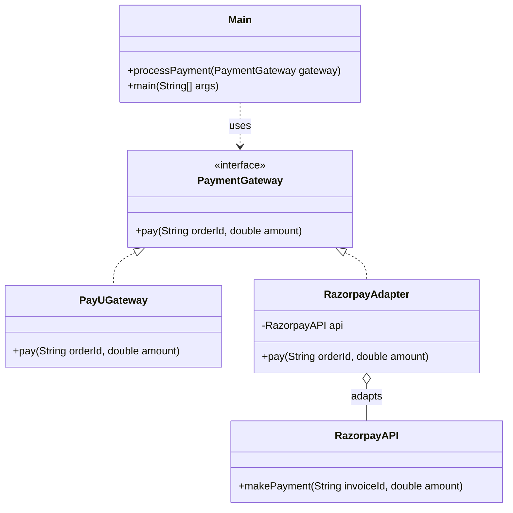

# Adapter Pattern

## Question

Your `CheckoutService` calls `paymentGateway.charge(amount, currency)`. You just switched payment providers from an internal gateway to Razorpay. Razorpay's SDK exposes `razorpayClient.initiatePayment(RazorpayRequest request)`. You cannot change `CheckoutService`, and you cannot change Razorpay's SDK. How do you make them work together?

Try it before reading on.

---

## Pattern Mindmap

```
[Adapter Pattern]
├── Problem It Solves
│   ├── CheckoutService expects PaymentGateway.charge(amount, currency)
│   ├── Razorpay SDK exposes initiatePayment(RazorpayRequest)
│   └── Cannot modify CheckoutService; cannot modify Razorpay SDK
├── Core Structure
│   ├── Target interface: PaymentGateway with charge(amount, currency)
│   ├── Adaptee: RazorpayClient with initiatePayment(RazorpayRequest)
│   ├── Adapter: RazorpayAdapter implements PaymentGateway
│   │   └── charge() builds RazorpayRequest and calls razorpayClient.initiatePayment()
│   └── Client: CheckoutService uses PaymentGateway — never knows about Razorpay
├── Analogy
│   ├── Travel power adapter: your laptop plug ≠ foreign wall socket
│   ├── Adapter bridges the two standards without modifying either
│   └── You need one adapter class, not a new laptop
├── Class Adapter vs Object Adapter
│   ├── Object adapter: adapter holds reference to adaptee (composition)
│   ├── Class adapter: adapter extends adaptee (inheritance) — Java rarely used
│   └── Object adapter preferred: works with subclasses of adaptee too
├── When to Use
│   ├── Integrating third-party library with incompatible interface
│   ├── Legacy code cannot be modified but must plug into new system
│   └── You want a consistent interface across multiple providers
├── Adapter vs Facade vs Decorator
│   ├── Adapter: makes incompatible interfaces work together (interface translation)
│   ├── Facade: simplifies a complex subsystem (hides complexity)
│   └── Decorator: adds behavior while keeping same interface (wraps, extends)
├── Trade-offs
│   ├── One adapter per library — manageable
│   ├── If library interface changes, only adapter needs updating
│   └── Over-adapting (adapter chains) → complexity, prefer direct integration
└── Interview Angles
    ├── When would you use an Adapter over a Facade?
    ├── Object adapter vs class adapter — what is the difference?
    └── How does Adapter relate to the Open/Closed Principle?
```

## Problem Without the Pattern

The instinct is to modify the call site:

```python
class CheckoutService:
    # Old code: self._gateway.charge(amount, currency)
    # New code — now we must know Razorpay's API:
    def checkout(self, order):
        req = RazorpayRequest()
        req.amount = order.amount * 100  # Razorpay wants paise, not rupees
        req.currency_code = order.currency.upper()
        self._razorpay_client.initiate_payment(req)
```

**What breaks**:
1. **SRP violation**: `CheckoutService` now contains Razorpay-specific translation logic (paise conversion, field mapping).
2. **Coupling**: `CheckoutService` directly imports Razorpay's SDK. Switching to Stripe means rewriting `CheckoutService` again.
3. **Untestable**: You cannot mock `razorpayClient` without testing `CheckoutService`'s Razorpay-specific translation code too.

---

## Derive the Minimal Fix

The constraint: **`CheckoutService` must call the interface it already knows; translation is someone else's problem**.

Step 1 — define (or keep) the ABC `CheckoutService` expects:
```python
from abc import ABC, abstractmethod

class PaymentGateway(ABC):
    @abstractmethod
    def charge(self, amount, currency): ...
```

Step 2 — write an adapter that implements the expected ABC but internally calls the incompatible library:
```python
class RazorpayAdapter(PaymentGateway):
    def __init__(self, client):
        self._client = client

    def charge(self, amount, currency):
        # Translation happens here, not in CheckoutService
        req = RazorpayRequest()
        req.amount = int(amount * 100)        # rupees → paise
        req.currency_code = currency.upper()
        self._client.initiate_payment(req)
```

Step 3 — `CheckoutService` receives `PaymentGateway` via injection; it never knows Razorpay exists:
```python
class CheckoutService:
    def __init__(self, gateway):
        self._gateway = gateway

    def checkout(self, order):
        self._gateway.charge(order.amount, order.currency)  # unchanged

# Wiring:
service = CheckoutService(RazorpayAdapter(RazorpayClient()))
```

Switching to Stripe is now: write `StripeAdapter implements PaymentGateway`. `CheckoutService` is untouched.

---

> **Type**: Structural
> **Purpose**: Allows objects with incompatible interfaces to collaborate. Acts as a wrapper/translator between two sides.

> **Analogy**: A travel power adapter. Your US laptop plug doesn't fit a UK socket. The adapter converts the interface without changing either side — your laptop is unchanged, the wall socket is unchanged, and the adapter sits in between doing the translation.

---

## The Core Idea

You have an existing system expecting a specific interface (`Target`), and a new component that does what you need but has a different interface (`Adaptee`). Instead of modifying either side, you write an `Adapter` that wraps the Adaptee and exposes the Target interface.

**Three roles:**
- **Target**: The interface your system expects
- **Adaptee**: The existing class with a different interface
- **Adapter**: Wraps Adaptee, implements Target

---

## Problem Statement

You have a `CheckoutService` that expects a `PaymentGateway` interface (`pay(orderId, amount)`).
You want to integrate Razorpay, which has a different method: `makePayment(invoiceId, amount)`.
Modifying Razorpay's API or your core `CheckoutService` is not an option.

---

## Implementation

```python
from abc import ABC, abstractmethod

# 1. Target ABC — what your system expects
class PaymentGateway(ABC):
    @abstractmethod
    def pay(self, order_id, amount): ...

# 2. Existing valid implementation of Target
class PayUGateway(PaymentGateway):
    def pay(self, order_id, amount):
        print(f"Paid {amount} using PayU for Order {order_id}")

# 3. Adaptee — third-party/legacy code with incompatible interface
class RazorpayAPI:
    def make_payment(self, invoice_id, amount):
        print(f"Paid {amount} using Razorpay for Invoice {invoice_id}")

# 4. Adapter — wraps Adaptee, implements Target
class RazorpayAdapter(PaymentGateway):
    def __init__(self):
        self._api = RazorpayAPI()

    def pay(self, order_id, amount):
        # Translation: 'order_id' maps to Razorpay's 'invoice_id' concept
        self._api.make_payment(order_id, amount)

# 5. Client — only knows about PaymentGateway, unaware of Razorpay's API
def process_payment(gateway):
    gateway.pay("ORD-123", 500)

process_payment(PayUGateway())      # Direct implementation
process_payment(RazorpayAdapter())  # Via Adapter — client code unchanged
```

### Class Diagram



---

## Another Example: Legacy Logging System

```python
from abc import ABC, abstractmethod

# Your system's logging interface
class Logger(ABC):
    @abstractmethod
    def log(self, level, message): ...

# Third-party legacy logger with different signature
class LegacyLogger:
    def write_log(self, severity, msg):
        print(f"[{severity}] {msg}")

# Adapter bridges the two — translates log(level, msg) → write_log(severity, msg)
class LegacyLoggerAdapter(Logger):
    def __init__(self):
        self._legacy = LegacyLogger()

    def log(self, level, message):
        severity = 1 if level == "ERROR" else 2 if level == "WARN" else 3
        self._legacy.write_log(severity, message)
```

---

## When to Use in Interviews

- Integrating third-party libraries that don't match your interface: "I'd wrap it in an Adapter. The Adapter implements my interface and delegates to the third-party API."
- Legacy code migration: "We can't change 10-year-old code, but we can write an Adapter that makes it compatible with the new system."
- When interviewers ask about the Strangler Fig pattern: Adapters are a key tool — wrap legacy components to make them fit the new interface progressively.

---

## Common Violations

| Violation | Symptom | Fix |
|---|---|---|
| Modifying Adaptee to fit Target | Changing third-party code | Write an Adapter instead |
| Adapter does business logic | Translation AND computation inside Adapter | Adapter should only translate, not process |
| Two-way coupling | Adapter knows details of both sides deeply | Keep Adapter thin — just translate method signatures |

---

## Adapter vs Facade

| | Adapter | Facade |
|---|---|---|
| Purpose | Make incompatible interfaces work together | Simplify a complex interface |
| Changes interface? | Yes — wraps one interface to look like another | No — just simplifies existing subsystem |
| Number of classes wrapped | Usually one | Usually many subsystem classes |

---

## When to Use

- Integrating existing classes/libraries that don't match your interface
- Legacy code migration without modifying original code
- Making unrelated classes work together

---

## Interview Tips

**Q: "Adapter vs Decorator?"**
- "Adapter changes the interface of an object. Decorator keeps the same interface but adds behavior. Use Adapter when you need translation; use Decorator when you need enhancement."

**Q: "Give a real-world Adapter example"**
- "Integrating a third-party payment SDK. Our system expects `pay(orderId, amount)` but the SDK has `makePayment(invoiceId, amount)`. The Adapter wraps the SDK and exposes our interface. Neither side changes."

---

## Interviewer Follow-Up Questions

- "What problem does the Adapter solve? Give a real-world code example." → Adapter converts an existing interface into the interface the client expects. Example: your app uses `PaymentGateway.charge(amount, currency)`. You integrate a new provider with `StripeAPI.create_payment_intent(amount_cents, currency_code)`. Rather than changing all callers: `StripeAdapter.charge(amount, currency): return stripe_api.create_payment_intent(amount * 100, currency)`. Callers use the existing `PaymentGateway` interface; the adapter handles translation.
- "How is Adapter different from Facade?" → Adapter: translates one interface to another — wraps a single class and maps its methods to a different interface. The adapter wraps an existing incompatible interface. Facade: simplifies a complex subsystem — wraps multiple classes and provides a simplified unified interface. The facade doesn't necessarily change the interface; it reduces complexity. Adapter = translation; Facade = simplification.
- "When would you use a class adapter (inheritance) vs an object adapter (composition)?" → Class adapter: `StripeAdapter extends StripeAPI implements PaymentGateway` — inherits StripeAPI's implementation, overrides to match `PaymentGateway`. Only works in single-inheritance languages (Java) if the adaptee isn't final. Object adapter: `StripeAdapter implements PaymentGateway { private StripeAPI stripe; }` — holds a reference to the adaptee, calls it explicitly. Object adapter is more flexible (works with subclasses of StripeAPI, testable with mocks), preferred.
- "You have 5 payment providers with 5 different APIs. Do you write 5 adapters?" → Yes — one adapter per external API is the correct approach. Each adapter is a thin translation layer: maps the external API to your internal `PaymentGateway` interface. The adapters are small, focused, and individually testable. This is preferable to an `if provider == 'stripe': ... elif provider == 'paypal': ...` conditional that puts all translation logic in one place (SRP violation).
