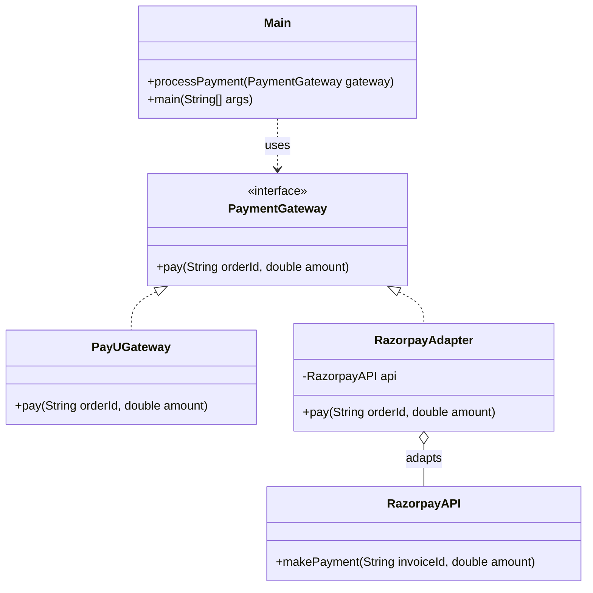

# Adapter Pattern

## Question

Your `CheckoutService` calls `paymentGateway.charge(amount, currency)`. You just switched payment providers from an internal gateway to Razorpay. Razorpay's SDK exposes `razorpayClient.initiatePayment(RazorpayRequest request)`. You cannot change `CheckoutService`, and you cannot change Razorpay's SDK. How do you make them work together?

Try it before reading on.

---

## Problem Without the Pattern

The instinct is to modify the call site:

```java
class CheckoutService {
    // Old code: paymentGateway.charge(amount, currency)
    // New code — now we must know Razorpay's API:
    public void checkout(Order order) {
        RazorpayRequest req = new RazorpayRequest();
        req.setAmount(order.getAmount() * 100); // Razorpay wants paise, not rupees
        req.setCurrencyCode(order.getCurrency().toUpperCase());
        razorpayClient.initiatePayment(req);
    }
}
```

**What breaks**:
1. **SRP violation**: `CheckoutService` now contains Razorpay-specific translation logic (paise conversion, field mapping).
2. **Coupling**: `CheckoutService` directly imports Razorpay's SDK. Switching to Stripe means rewriting `CheckoutService` again.
3. **Untestable**: You cannot mock `razorpayClient` without testing `CheckoutService`'s Razorpay-specific translation code too.

---

## Derive the Minimal Fix

The constraint: **`CheckoutService` must call the interface it already knows; translation is someone else's problem**.

Step 1 — define (or keep) the interface `CheckoutService` expects:
```java
interface PaymentGateway {
    void charge(double amount, String currency);
}
```

Step 2 — write an adapter that implements the expected interface but internally calls the incompatible library:
```java
class RazorpayAdapter implements PaymentGateway {
    private RazorpayClient razorpayClient;

    public RazorpayAdapter(RazorpayClient client) {
        this.razorpayClient = client;
    }

    @Override
    public void charge(double amount, String currency) {
        // Translation happens here, not in CheckoutService
        RazorpayRequest req = new RazorpayRequest();
        req.setAmount((int)(amount * 100)); // rupees → paise
        req.setCurrencyCode(currency.toUpperCase());
        razorpayClient.initiatePayment(req);
    }
}
```

Step 3 — `CheckoutService` receives `PaymentGateway` via injection; it never knows Razorpay exists:
```java
class CheckoutService {
    private final PaymentGateway gateway;

    public CheckoutService(PaymentGateway gateway) { this.gateway = gateway; }

    public void checkout(Order order) {
        gateway.charge(order.getAmount(), order.getCurrency()); // unchanged
    }
}

// Wiring:
CheckoutService service = new CheckoutService(new RazorpayAdapter(new RazorpayClient()));
```

Switching to Stripe is now: write `StripeAdapter implements PaymentGateway`. `CheckoutService` is untouched.

---

> **Type**: Structural
> **Purpose**: Allows objects with incompatible interfaces to collaborate. Acts as a wrapper/translator between two sides.

> **Analogy**: A travel power adapter. Your US laptop plug doesn't fit a UK socket. The adapter converts the interface without changing either side — your laptop is unchanged, the wall socket is unchanged, and the adapter sits in between doing the translation.

---

## The Core Idea

You have an existing system expecting a specific interface (`Target`), and a new component that does what you need but has a different interface (`Adaptee`). Instead of modifying either side, you write an `Adapter` that wraps the Adaptee and exposes the Target interface.

**Three roles:**
- **Target**: The interface your system expects
- **Adaptee**: The existing class with a different interface
- **Adapter**: Wraps Adaptee, implements Target

---

## Problem Statement

You have a `CheckoutService` that expects a `PaymentGateway` interface (`pay(orderId, amount)`).
You want to integrate Razorpay, which has a different method: `makePayment(invoiceId, amount)`.
Modifying Razorpay's API or your core `CheckoutService` is not an option.

---

## Implementation

```java
// 1. Target Interface — what your system expects
interface PaymentGateway {
    void pay(String orderId, double amount);
}

// 2. Existing valid implementation of Target
class PayUGateway implements PaymentGateway {
    public void pay(String orderId, double amount) {
        System.out.println("Paid " + amount + " using PayU for Order " + orderId);
    }
}

// 3. Adaptee — third-party/legacy code with incompatible interface
class RazorpayAPI {
    public void makePayment(String invoiceId, double amount) {
        System.out.println("Paid " + amount + " using Razorpay for Invoice " + invoiceId);
    }
}

// 4. Adapter — wraps Adaptee, implements Target
class RazorpayAdapter implements PaymentGateway {
    private RazorpayAPI api;
    
    public RazorpayAdapter() {
        this.api = new RazorpayAPI();
    }
    
    @Override
    public void pay(String orderId, double amount) {
        // Translation: 'orderId' maps to Razorpay's 'invoiceId' concept
        api.makePayment(orderId, amount);
    }
}

// 5. Client — only knows about PaymentGateway, unaware of Razorpay's API
public class Main {
    public static void processPayment(PaymentGateway gateway) {
        gateway.pay("ORD-123", 500);
    }
    
    public static void main(String[] args) {
        processPayment(new PayUGateway());      // Direct implementation
        processPayment(new RazorpayAdapter()); // Via Adapter — client code unchanged
    }
}
```

### Class Diagram



---

## Another Example: Legacy Logging System

```java
// Your system's logging interface
interface Logger {
    void log(String level, String message);
}

// Third-party legacy logger with different signature
class LegacyLogger {
    public void writeLog(int severity, String msg) {
        System.out.println("[" + severity + "] " + msg);
    }
}

// Adapter bridges the two
class LegacyLoggerAdapter implements Logger {
    private LegacyLogger legacy = new LegacyLogger();
    
    @Override
    public void log(String level, String message) {
        int severity = level.equals("ERROR") ? 1 : level.equals("WARN") ? 2 : 3;
        legacy.writeLog(severity, message);
    }
}
```

---

## When to Use in Interviews

- Integrating third-party libraries that don't match your interface: "I'd wrap it in an Adapter. The Adapter implements my interface and delegates to the third-party API."
- Legacy code migration: "We can't change 10-year-old code, but we can write an Adapter that makes it compatible with the new system."
- When interviewers ask about the Strangler Fig pattern: Adapters are a key tool — wrap legacy components to make them fit the new interface progressively.

---

## Common Violations

| Violation | Symptom | Fix |
|---|---|---|
| Modifying Adaptee to fit Target | Changing third-party code | Write an Adapter instead |
| Adapter does business logic | Translation AND computation inside Adapter | Adapter should only translate, not process |
| Two-way coupling | Adapter knows details of both sides deeply | Keep Adapter thin — just translate method signatures |

---

## Adapter vs Facade

| | Adapter | Facade |
|---|---|---|
| Purpose | Make incompatible interfaces work together | Simplify a complex interface |
| Changes interface? | Yes — wraps one interface to look like another | No — just simplifies existing subsystem |
| Number of classes wrapped | Usually one | Usually many subsystem classes |

---

## When to Use

- Integrating existing classes/libraries that don't match your interface
- Legacy code migration without modifying original code
- Making unrelated classes work together

---

## Interview Tips

**Q: "Adapter vs Decorator?"**
- "Adapter changes the interface of an object. Decorator keeps the same interface but adds behavior. Use Adapter when you need translation; use Decorator when you need enhancement."

**Q: "Give a real-world Adapter example"**
- "Integrating a third-party payment SDK. Our system expects `pay(orderId, amount)` but the SDK has `makePayment(invoiceId, amount)`. The Adapter wraps the SDK and exposes our interface. Neither side changes."
