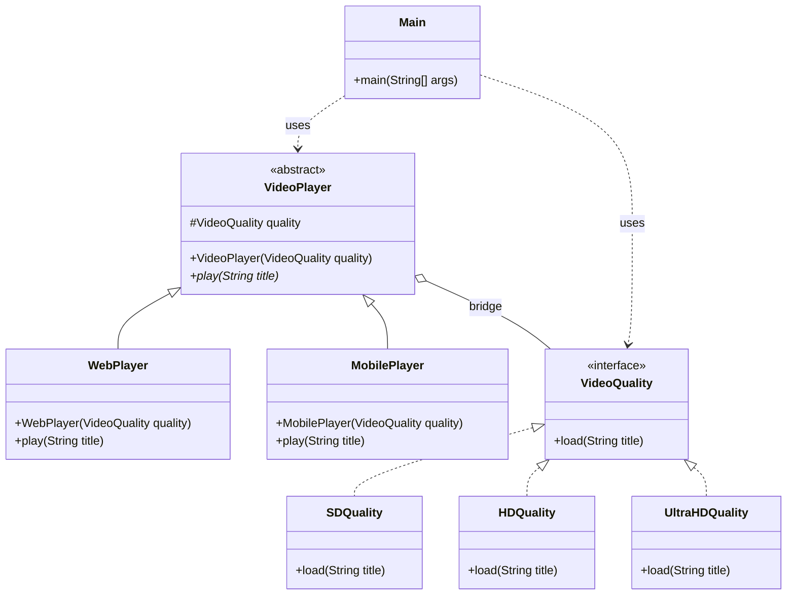

# Bridge Pattern

## Real-Life Analogy

A TV and a remote control are two separate hierarchies that communicate through a common interface.

- The **TV** (Sony, Samsung, LG) is the **implementation** — it knows how to change channels, adjust volume, switch inputs.
- The **remote** (Basic, Universal, Smart) is the **abstraction** — it knows *what* you want to do, but delegates the *how* to the TV.

A Samsung remote can control a Sony TV. A universal remote can control an LG TV. You never need a `SamsungRemoteForSonyTV` class or a `UniversalRemoteForLGTV` class.

**Without Bridge**: If you have 3 remote types and 4 TV brands, you need 12 classes.  
**With Bridge**: You need 3 remote classes + 4 TV classes = 7 classes. The math keeps improving as you scale.

---

## What Problem Does It Solve?

When you have **multiple dimensions of variability**, inheritance creates a combinatorial class explosion. Bridge separates the two dimensions into independent hierarchies connected via composition.

- **Abstraction**: The high-level control layer (VideoPlayer: Web, Mobile, SmartTV).
- **Implementation**: The concrete behavior (VideoQuality: SD, HD, 4K).

Both can vary independently.

---

## Understanding the Problem

Consider building a video player with multiple platforms and multiple quality options:

```java
// Each class is a platform + quality combination
class WebHDPlayer implements PlayQuality {
    public void play(String title) {
        System.out.println("Web Player: Playing " + title + " in HD");
    }
}

class MobileHDPlayer implements PlayQuality {
    public void play(String title) {
        System.out.println("Mobile Player: Playing " + title + " in HD");
    }
}

class SmartTVUltraHDPlayer implements PlayQuality {
    public void play(String title) {
        System.out.println("Smart TV: Playing " + title + " in ultra HD");
    }
}

class Web4KPlayer implements PlayQuality {
    public void play(String title) {
        System.out.println("Web Player: Playing " + title + " in 4K");
    }
}

public class Main {
    public static void main(String[] args) {
        PlayQuality player = new WebHDPlayer();
        player.play("Interstellar");
    }
}
```

**The problem**: 3 platforms × 4 quality options = 12 classes. Add one new platform? 4 more classes. Add one new quality? 3 more classes. This is the combinatorial explosion the Bridge Pattern eliminates.

---

## Solution: Bridge Pattern

```java
// ======== Implementor Interface =========
interface VideoQuality {
    void load(String title);
}

// ============ Concrete Implementors ==============
class SDQuality implements VideoQuality {
    public void load(String title) {
        System.out.println("Streaming " + title + " in SD Quality");
    }
}

class HDQuality implements VideoQuality {
    public void load(String title) {
        System.out.println("Streaming " + title + " in HD Quality");
    }
}

class UltraHDQuality implements VideoQuality {
    public void load(String title) {
        System.out.println("Streaming " + title + " in 4K Ultra HD Quality");
    }
}

// ========== Abstraction ==========
abstract class VideoPlayer {
    protected VideoQuality quality;
    
    public VideoPlayer(VideoQuality quality) {
        this.quality = quality;
    }
    
    abstract void play(String title);
}

// =========== Refined Abstractions ==============
class WebPlayer extends VideoPlayer {
    public WebPlayer(VideoQuality quality) { super(quality); }
    
    void play(String title) {
        System.out.println("Web Platform:");
        quality.load(title);
    }
}

class MobilePlayer extends VideoPlayer {
    public MobilePlayer(VideoQuality quality) { super(quality); }
    
    void play(String title) {
        System.out.println("Mobile Platform:");
        quality.load(title);
    }
}

// Client Code
public class Main {
    public static void main(String[] args) {
        // Playing on Web with HD Quality
        VideoPlayer player1 = new WebPlayer(new HDQuality());
        player1.play("Interstellar");
        
        // Playing on Mobile with Ultra HD Quality
        VideoPlayer player2 = new MobilePlayer(new UltraHDQuality());
        player2.play("Inception");
    }
}
```

Now: 2 platforms + 3 quality types = 5 classes total.  
Add `SmartTVPlayer`? One class. It works with all existing qualities automatically.  
Add `FullHDQuality`? One class. It works with all existing players automatically.

---

## Class Diagram



---

## When to Use Bridge Pattern

- You have **two independent dimensions of variation** (platform + format, shape + color, device + protocol).
- You want to **mix and match** combinations at runtime without hardcoding them.
- Adding to one dimension should not require changes to the other.
- You anticipate frequent additions on either side.
- You want composition over inheritance.

---

## How Bridge Solves the Issues

| Problem | Solution |
|---|---|
| **Class explosion** | Platform and quality are separate hierarchies. M platforms + N qualities = M+N classes instead of M×N. |
| **Tight coupling** | `VideoPlayer` holds a reference to `VideoQuality` via composition, not inheritance. |
| **Hard to extend** | New platforms and quality types each require exactly one new class. |
| **Code duplication** | Each class has one responsibility. Quality logic lives in quality classes, not duplicated in every player. |

---

## Advantages

- **Decouples abstraction and implementation**: Either side can change independently.
- **Avoids class explosion**: M + N instead of M × N.
- **Supports Open/Closed Principle**: Extend either hierarchy without touching the other.
- **Runtime flexibility**: Swap implementations at runtime (e.g., downgrade quality when bandwidth drops).
- **Ideal for cross-platform code**: One abstraction hierarchy works across all platforms.

## Disadvantages

- **Increased upfront complexity**: Overkill if there's only one variation dimension.
- **Can be confused with Strategy**: Bridge is structural (object composition for class hierarchy); Strategy is behavioral (swapping algorithms). Bridge separates abstraction from implementation; Strategy swaps algorithms within a context.
- **Indirection**: Two class hierarchies to follow mentally instead of one.
