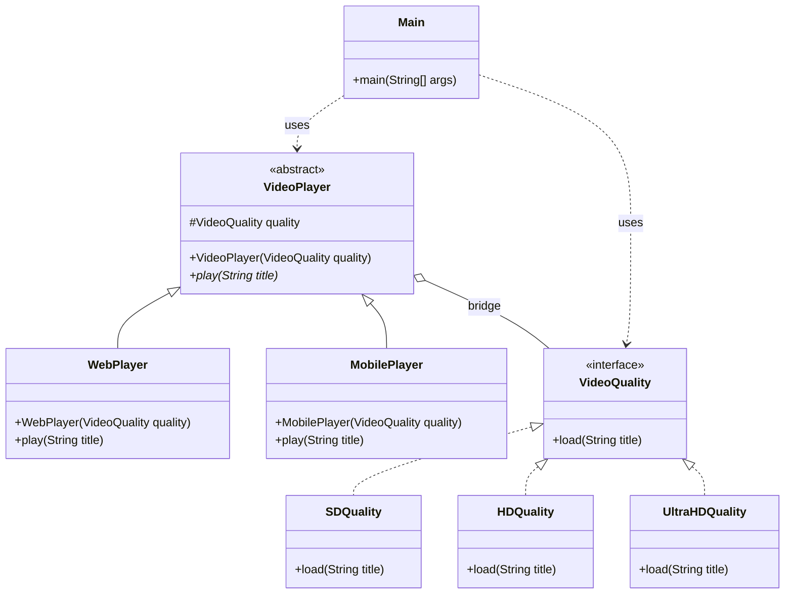

# Bridge Pattern

## Question

You are building a video player that must run on Web, Mobile, and SmartTV. It must support SD, HD, and 4K quality. Model this with inheritance: `WebSDPlayer`, `WebHDPlayer`, `Web4KPlayer`, `MobileSDPlayer`, `MobileHDPlayer`... How many classes do you need? What happens when you add a fourth platform?

Try to count before reading on.

---

## Pattern Mindmap

```
[Bridge Pattern]
├── Core Concept
│   ├── What → Decouple abstraction from implementation so both vary independently
│   └── Why → Prevents M×N class explosion from combining two orthogonal dimensions
├── Key Components
│   ├── Abstraction → high-level control layer (VideoPlayer); holds ref to Implementor
│   ├── Refined Abstraction → WebPlayer, MobilePlayer, SmartTVPlayer
│   ├── Implementor interface → VideoRenderer with render(quality, title)
│   └── Concrete Implementor → SDRenderer, HDRenderer, FourKRenderer
├── When to Use
│   ├── ✓ Two independent dimensions of variation (platform × quality, shape × color)
│   ├── ✓ Want to switch implementations at runtime
│   └── ✓ Inheritance would create a combinatorial class explosion
├── When NOT to Use
│   ├── ✗ Only one dimension varies — simpler inheritance or strategy is enough
│   └── ✗ Both dimensions are stable and rarely change
├── Trade-offs
│   ├── Pro: Add new platform or quality without touching existing classes
│   └── Con: Indirection makes call stack harder to trace; extra interfaces to define
├── Real-World Examples
│   ├── JDBC Driver → Connection abstraction bridges to MySQLDriver / OracleDriver
│   └── GUI frameworks → Window abstraction bridges to WindowsImpl / MacImpl
└── Interview Angles
    ├── vs Adapter → Bridge is designed upfront; Adapter retrofits incompatible interfaces
    ├── vs Strategy → Strategy swaps one algorithm; Bridge decouples two class hierarchies
    └── Code challenge: model Shape (Circle/Square) × Color (Red/Blue) without 4 subclasses
```

---

## Problem Without the Pattern

With 3 platforms and 3 quality settings, pure inheritance creates one class per combination:

```java
class WebSDPlayer    { public void play(String title) { ... } }
class WebHDPlayer    { public void play(String title) { ... } }
class Web4KPlayer    { public void play(String title) { ... } }
class MobileSDPlayer { public void play(String title) { ... } }
class MobileHDPlayer { public void play(String title) { ... } }
class Mobile4KPlayer { public void play(String title) { ... } }
class SmartTVSDPlayer { ... }
class SmartTVHDPlayer { ... }
class SmartTV4KPlayer { ... }
// 3 platforms × 3 qualities = 9 classes
// Add SmartWatch → 3 more classes
// Add 8K quality → 4 more classes (one per platform)
```

**What breaks**:
1. **Class explosion**: M platforms × N qualities = M×N classes. Every addition multiplies.
2. **Duplication**: The HD streaming logic is nearly identical across `WebHDPlayer`, `MobileHDPlayer`, `SmartTVHDPlayer` — only the platform output differs.
3. **Adding one thing forces adding many**: A new quality tier requires one subclass per platform.
4. **Static binding**: You cannot switch quality at runtime — it is baked into the class name.

---

## Derive the Minimal Fix

The constraint: **the two dimensions (platform and quality) must vary independently**.

Step 1 — recognize the two hierarchies: what you're doing (platform abstraction) and how (quality implementation). Separate them:

```java
// Implementation hierarchy: how the video is rendered
interface VideoQuality {
    void load(String title);
}
class HDQuality implements VideoQuality {
    public void load(String title) { System.out.println("Streaming " + title + " in HD"); }
}

// Abstraction hierarchy: which platform
abstract class VideoPlayer {
    protected VideoQuality quality;  // bridge — holds the implementation
    public VideoPlayer(VideoQuality q) { this.quality = q; }
    abstract void play(String title);
}
class WebPlayer extends VideoPlayer {
    public WebPlayer(VideoQuality q) { super(q); }
    public void play(String title) {
        System.out.print("Web: ");
        quality.load(title);  // delegates to whichever quality was injected
    }
}
```

Step 2 — compose at runtime:
```java
VideoPlayer player = new WebPlayer(new HDQuality()); // HD on Web
VideoPlayer player = new MobilePlayer(new UltraHDQuality()); // 4K on Mobile
```

Now: 3 platforms + 3 qualities = 6 classes instead of 9. Adding SmartWatch = 1 class. Adding 8K = 1 class. They work with all combinations automatically.

---

## Real-Life Analogy

A TV and a remote control are two separate hierarchies that communicate through a common interface.

- The **TV** (Sony, Samsung, LG) is the **implementation** — it knows how to change channels, adjust volume, switch inputs.
- The **remote** (Basic, Universal, Smart) is the **abstraction** — it knows *what* you want to do, but delegates the *how* to the TV.

A Samsung remote can control a Sony TV. A universal remote can control an LG TV. You never need a `SamsungRemoteForSonyTV` class or a `UniversalRemoteForLGTV` class.

**Without Bridge**: If you have 3 remote types and 4 TV brands, you need 12 classes.  
**With Bridge**: You need 3 remote classes + 4 TV classes = 7 classes. The math keeps improving as you scale.

---

## What Problem Does It Solve?

When you have **multiple dimensions of variability**, inheritance creates a combinatorial class explosion. Bridge separates the two dimensions into independent hierarchies connected via composition.

- **Abstraction**: The high-level control layer (VideoPlayer: Web, Mobile, SmartTV).
- **Implementation**: The concrete behavior (VideoQuality: SD, HD, 4K).

Both can vary independently.

---

## Understanding the Problem

Consider building a video player with multiple platforms and multiple quality options:

```java
// Each class is a platform + quality combination
class WebHDPlayer implements PlayQuality {
    public void play(String title) {
        System.out.println("Web Player: Playing " + title + " in HD");
    }
}

class MobileHDPlayer implements PlayQuality {
    public void play(String title) {
        System.out.println("Mobile Player: Playing " + title + " in HD");
    }
}

class SmartTVUltraHDPlayer implements PlayQuality {
    public void play(String title) {
        System.out.println("Smart TV: Playing " + title + " in ultra HD");
    }
}

class Web4KPlayer implements PlayQuality {
    public void play(String title) {
        System.out.println("Web Player: Playing " + title + " in 4K");
    }
}

public class Main {
    public static void main(String[] args) {
        PlayQuality player = new WebHDPlayer();
        player.play("Interstellar");
    }
}
```

**The problem**: 3 platforms × 4 quality options = 12 classes. Add one new platform? 4 more classes. Add one new quality? 3 more classes. This is the combinatorial explosion the Bridge Pattern eliminates.

---

## Solution: Bridge Pattern

```java
// ======== Implementor Interface =========
interface VideoQuality {
    void load(String title);
}

// ============ Concrete Implementors ==============
class SDQuality implements VideoQuality {
    public void load(String title) {
        System.out.println("Streaming " + title + " in SD Quality");
    }
}

class HDQuality implements VideoQuality {
    public void load(String title) {
        System.out.println("Streaming " + title + " in HD Quality");
    }
}

class UltraHDQuality implements VideoQuality {
    public void load(String title) {
        System.out.println("Streaming " + title + " in 4K Ultra HD Quality");
    }
}

// ========== Abstraction ==========
abstract class VideoPlayer {
    protected VideoQuality quality;
    
    public VideoPlayer(VideoQuality quality) {
        this.quality = quality;
    }
    
    abstract void play(String title);
}

// =========== Refined Abstractions ==============
class WebPlayer extends VideoPlayer {
    public WebPlayer(VideoQuality quality) { super(quality); }
    
    void play(String title) {
        System.out.println("Web Platform:");
        quality.load(title);
    }
}

class MobilePlayer extends VideoPlayer {
    public MobilePlayer(VideoQuality quality) { super(quality); }
    
    void play(String title) {
        System.out.println("Mobile Platform:");
        quality.load(title);
    }
}

// Client Code
public class Main {
    public static void main(String[] args) {
        // Playing on Web with HD Quality
        VideoPlayer player1 = new WebPlayer(new HDQuality());
        player1.play("Interstellar");
        
        // Playing on Mobile with Ultra HD Quality
        VideoPlayer player2 = new MobilePlayer(new UltraHDQuality());
        player2.play("Inception");
    }
}
```

Now: 2 platforms + 3 quality types = 5 classes total.  
Add `SmartTVPlayer`? One class. It works with all existing qualities automatically.  
Add `FullHDQuality`? One class. It works with all existing players automatically.

---

## Class Diagram



---

## When to Use Bridge Pattern

- You have **two independent dimensions of variation** (platform + format, shape + color, device + protocol).
- You want to **mix and match** combinations at runtime without hardcoding them.
- Adding to one dimension should not require changes to the other.
- You anticipate frequent additions on either side.
- You want composition over inheritance.

---

## How Bridge Solves the Issues

| Problem | Solution |
|---|---|
| **Class explosion** | Platform and quality are separate hierarchies. M platforms + N qualities = M+N classes instead of M×N. |
| **Tight coupling** | `VideoPlayer` holds a reference to `VideoQuality` via composition, not inheritance. |
| **Hard to extend** | New platforms and quality types each require exactly one new class. |
| **Code duplication** | Each class has one responsibility. Quality logic lives in quality classes, not duplicated in every player. |

---

## Advantages

- **Decouples abstraction and implementation**: Either side can change independently.
- **Avoids class explosion**: M + N instead of M × N.
- **Supports Open/Closed Principle**: Extend either hierarchy without touching the other.
- **Runtime flexibility**: Swap implementations at runtime (e.g., downgrade quality when bandwidth drops).
- **Ideal for cross-platform code**: One abstraction hierarchy works across all platforms.

## Disadvantages

- **Increased upfront complexity**: Overkill if there's only one variation dimension.
- **Can be confused with Strategy**: Bridge is structural (object composition for class hierarchy); Strategy is behavioral (swapping algorithms). Bridge separates abstraction from implementation; Strategy swaps algorithms within a context.
- **Indirection**: Two class hierarchies to follow mentally instead of one.
