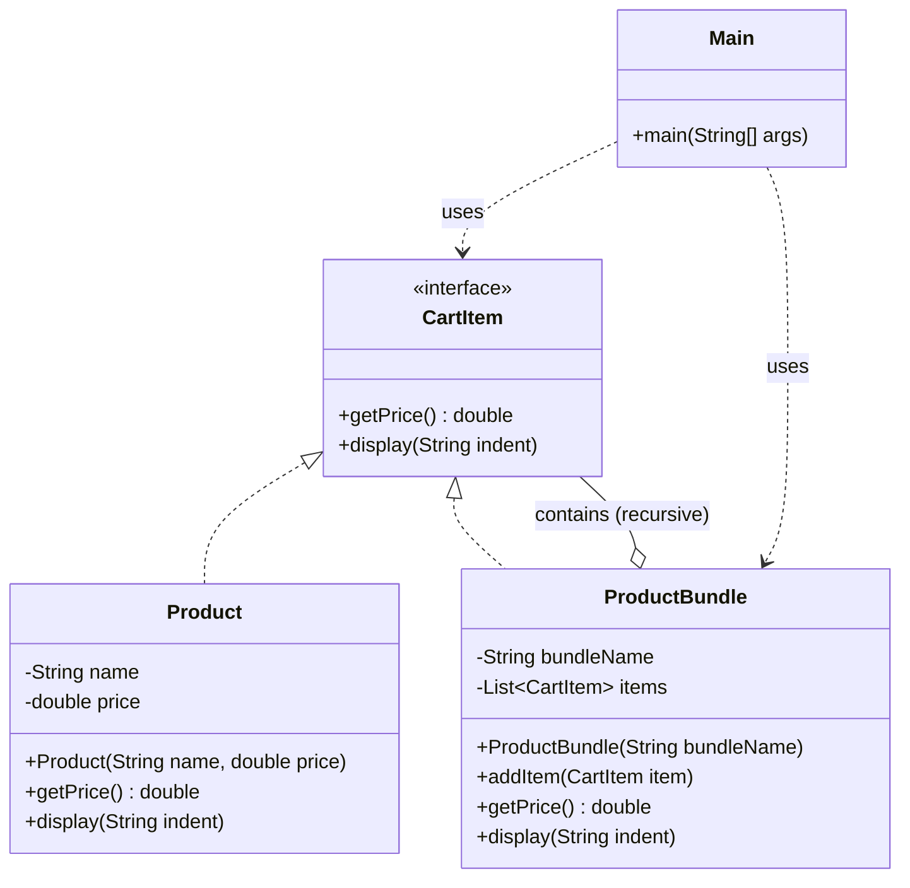

# Composite Pattern

## Question

You are building a shopping cart. A cart can contain individual `Product` items. It can also contain `Bundle` (a gift set containing multiple products). `Bundle` can contain other `Bundle`s. You need `getPrice()` to work uniformly for both. Write the code.

Try it before reading on.

---

## Problem Without the Pattern

The `instanceof` approach:

```java
class Cart {
    public double totalPrice(List<Object> items) {
        double total = 0;
        for (Object item : items) {
            if (item instanceof Product) {
                total += ((Product) item).getPrice();
            } else if (item instanceof Bundle) {
                Bundle bundle = (Bundle) item;
                for (Object inner : bundle.getItems()) {
                    if (inner instanceof Product) {
                        total += ((Product) inner).getPrice();
                    } else if (inner instanceof Bundle) {
                        // recurse manually again...
                    }
                }
            }
        }
        return total;
    }
}
```

**What breaks**:
1. **`instanceof` chains break on new types**: Adding `DigitalProduct` requires editing `totalPrice()`.
2. **Manual recursion**: The caller must know that `Bundle` can nest, and must replicate the recursion logic everywhere it handles items.
3. **No uniform interface**: You cannot call `.getPrice()` on both `Product` and `Bundle` — they require different code paths.
4. **SRP violation**: `Cart` knows the internal structure of `Bundle`.

---

## Derive the Minimal Fix

The constraint: **treat individual objects and compositions uniformly through a common interface**.

Step 1 — define a common interface:
```java
interface CartItem {
    double getPrice();
}
```

Step 2 — leaf (individual item) implements the interface directly:
```java
class Product implements CartItem {
    private double price;
    public double getPrice() { return price; }
}
```

Step 3 — composite (bundle) implements the same interface and delegates to its children:
```java
class Bundle implements CartItem {
    private List<CartItem> items = new ArrayList<>();

    public void add(CartItem item) { items.add(item); }

    public double getPrice() {
        return items.stream().mapToDouble(CartItem::getPrice).sum();
        // recursion happens automatically — a Bundle inside a Bundle just delegates again
    }
}
```

Step 4 — the caller is identical for both:
```java
CartItem singleProduct = new Product(10.0);
CartItem giftBundle    = new Bundle();
((Bundle)giftBundle).add(new Product(5.0));
((Bundle)giftBundle).add(new Product(3.0));

System.out.println(singleProduct.getPrice()); // 10.0
System.out.println(giftBundle.getPrice());    // 8.0 — recursion is automatic
```

---

## Real-Life Analogy

A **file system** is the perfect example of Composite Pattern.

- A **File** is a leaf: it has a size and you can `getSize()` on it.
- A **Folder** is a composite: it can contain Files *or* other Folders. When you call `getSize()` on a folder, it adds up the sizes of everything inside — recursively.

The critical insight: you don't need to know whether you're dealing with a single file or a folder containing 1,000 nested files. **You call the same `getSize()` either way.**

```
Documents/                    <- Folder (composite)
  ├── resume.pdf              <- File (leaf)    100 KB
  ├── photos/                 <- Folder (composite)
  │   ├── vacation.jpg        <- File (leaf)    2 MB
  │   └── family.png          <- File (leaf)    1.5 MB
  └── projects/               <- Folder (composite)
      └── code.zip            <- File (leaf)    500 KB
```

`Documents.getSize()` returns 4.1 MB without you caring about the nesting structure.

---

## What Problem Does It Solve?

When your objects form a **tree (part-whole hierarchy)** and you want to treat individual objects (leaves) and groups of objects (composites) through the **same interface**.

Without Composite, client code must constantly check types:
```java
if (item instanceof Product) { ... }
else if (item instanceof ProductBundle) { ... }
```

This is fragile, breaks polymorphism, and makes recursive structures impossible.

---

## Understanding the Problem

Consider an e-commerce checkout system:

```java
import java.util.*;

// Represents a single product
class Product {
    private String name;
    private double price;
    
    public Product(String name, double price) {
        this.name = name;
        this.price = price;
    }
    
    public double getPrice() {
        return price;
    }
    
    public void display(String indent) {
        System.out.println(indent + "Product: " + name + " – ₹" + price);
    }
}

// Represents a bundle of products
class ProductBundle {
    private String bundleName;
    private List<Product> products;
    
    public ProductBundle(String bundleName) {
        this.bundleName = bundleName;
        this.products = new ArrayList<>();
    }
    
    public void addProduct(Product product) {
        products.add(product);
    }
    
    public double getPrice() {
        return products.stream().mapToDouble(Product::getPrice).sum();
    }
    
    public void display(String indent) {
        System.out.println(indent + "Bundle: " + bundleName);
        for (Product product : products) {
            product.display(indent + "  ");
        }
    }
}

// Main logic
public class Main {
    public static void main(String[] args) {
        Product book = new Product("Book", 500);
        Product headphones = new Product("Headphones", 1500);
        Product charger = new Product("Charger", 800);
        
        ProductBundle iphoneCombo = new ProductBundle("iPhone Combo Pack");
        iphoneCombo.addProduct(headphones);
        iphoneCombo.addProduct(charger);
        
        // Cart must use Object — no shared interface
        List<Object> cart = Arrays.asList(book, iphoneCombo);
        
        double total = 0;
        for (Object item : cart) {
            if (item instanceof Product) {           // Type checking everywhere
                ((Product) item).display("  ");
                total += ((Product) item).getPrice();
            } else if (item instanceof ProductBundle) {
                ((ProductBundle) item).display("  ");
                total += ((ProductBundle) item).getPrice();
            }
        }
        
        System.out.println("\nTotal Price: ₹" + total);
    }
}
```

**Problems**:
- `instanceof` checks scattered throughout client code.
- Cart must be typed as `List<Object>` — unsafe.
- `ProductBundle` cannot contain another `ProductBundle` (no recursive structure, so "bundle of bundles" is impossible).
- Any new item type requires changing every piece of client code.

---

## Solution: Composite Pattern

```java
import java.util.*;

// Interface for items that can be added to the cart
interface CartItem {
    double getPrice();
    void display(String indent);
}

// Product class implementing CartItem — the LEAF
class Product implements CartItem {
    private String name;
    private double price;
    
    public Product(String name, double price) {
        this.name = name;
        this.price = price;
    }
    
    public double getPrice() {
        return price;
    }
    
    public void display(String indent) {
        System.out.println(indent + "Product: " + name + " – ₹" + price);
    }
}

// ProductBundle class implementing CartItem — the COMPOSITE
class ProductBundle implements CartItem {
    private String bundleName;
    private List<CartItem> items;  // Contains CartItems, which can be Products OR other Bundles
    
    public ProductBundle(String bundleName) {
        this.bundleName = bundleName;
        this.items = new ArrayList<>();
    }
    
    public void addItem(CartItem item) {
        items.add(item);
    }
    
    public double getPrice() {
        return items.stream().mapToDouble(CartItem::getPrice).sum();  // Recursive
    }
    
    public void display(String indent) {
        System.out.println(indent + "Bundle: " + bundleName);
        for (CartItem item : items) {
            item.display(indent + "  ");  // Polymorphism handles the rest
        }
    }
}

// Main logic
public class Main {
    public static void main(String[] args) {
        // Individual Products (Leaves)
        CartItem book = new Product("Atomic Habits", 499);
        CartItem phone = new Product("iPhone 15", 79999);
        CartItem earbuds = new Product("AirPods", 15999);
        CartItem charger = new Product("20W Charger", 1999);
        
        // Bundle contains individual products
        ProductBundle iphoneCombo = new ProductBundle("iPhone Essentials Combo");
        iphoneCombo.addItem(phone);
        iphoneCombo.addItem(earbuds);
        iphoneCombo.addItem(charger);
        
        // Bundle can also contain another bundle — recursive composition
        ProductBundle schoolKit = new ProductBundle("Back to School Kit");
        schoolKit.addItem(new Product("Notebook Pack", 249));
        schoolKit.addItem(new Product("Pen Set", 99));
        schoolKit.addItem(new Product("Highlighter", 149));
        
        // Cart is simply List<CartItem> — both products and bundles treated uniformly
        List<CartItem> cart = Arrays.asList(book, iphoneCombo, schoolKit);
        
        System.out.println("Your Amazon Cart:");
        double total = 0;
        for (CartItem item : cart) {
            item.display("  ");       // No instanceof. No casting. Pure polymorphism.
            total += item.getPrice();
        }
        
        System.out.println("\nTotal: ₹" + total);
    }
}
```

---

## Class Diagram



---

## Leaf vs Composite

| Concept | Role | Example |
|---|---|---|
| **Leaf** | Simple, atomic object. No children. | `Product` |
| **Composite** | Container that holds Leaves or other Composites. Delegates operations to children. | `ProductBundle` |
| **Component** | The common interface both implement. | `CartItem` |

The composite's `getPrice()` is recursive: it calls `getPrice()` on each child, and if a child is itself a `ProductBundle`, it recurses again. This works to any depth.

---

## When to Use Composite Pattern

- You have a **tree/hierarchical structure**: folders in folders, departments in departments, UI components in containers.
- You want to treat **leaves and composites uniformly** so client code doesn't distinguish them.
- You need **recursive operations**: total size, total price, rendering, serialization.
- You want to avoid `instanceof` chains in client code.

---

## How Composite Solves the Issues

| Issue | Solution |
|---|---|
| **`instanceof` everywhere** | Both `Product` and `ProductBundle` implement `CartItem`. The loop calls `item.getPrice()` directly — no type checking needed. |
| **`List<Object>` unsafe cart** | Cart is now `List<CartItem>`. Type-safe. |
| **Bundle can't contain Bundle** | `ProductBundle` holds `List<CartItem>`. Any `CartItem` (including another `ProductBundle`) can be added. |
| **Code duplication** | `getPrice()` and `display()` logic written once per class. The loop is written once. |

---

## Advantages

- **Uniform treatment**: Single interface for leaves and composites eliminates special-casing.
- **Recursive composition**: Tree structures of arbitrary depth supported naturally.
- **Open/Closed Principle**: Add new item types by implementing `CartItem` — no existing code changes.
- **Cleaner client code**: Client never needs to know the internal structure.

## Disadvantages

- **Overkill for flat structures**: If you never need nesting, the interface adds unnecessary abstraction.
- **Type safety concerns**: Sometimes you genuinely need to distinguish leaves from composites (e.g., you can only call `addItem()` on bundles, not products). The common interface hides this.
- **SRP strain at scale**: The composite manages both its children and the business logic, which can grow complex.
