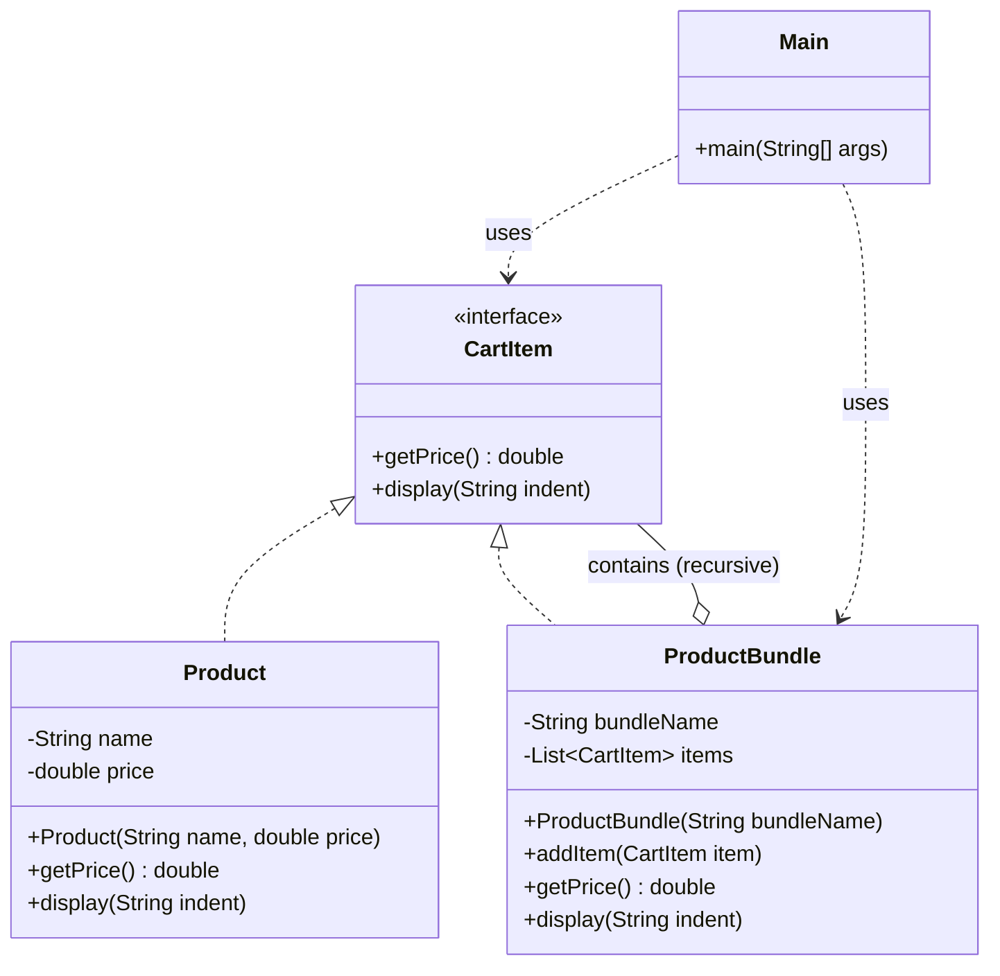

> [!NOTE]
> **📋 5-Minute Summary**
>
> **What this covers:** The Composite Pattern — composes objects into tree structures to represent part-whole hierarchies, allowing clients to treat individual objects and compositions uniformly.
>
> **Key concepts:**
> - The problem: operating on trees of objects where leaves and branches have different interfaces. E.g., getting the total price of a shopping cart containing loose Items and bundled Boxes (which contain more items/boxes).
> - The fix: define a common interface (`Component`) for both leaf nodes and composite nodes (e.g., `FileSystemNode` with `getSize()`).
> - Leaf: represents end objects (e.g., `File`). `getSize()` returns its own size.
> - Composite: represents complex objects (e.g., `Folder`). Contains a list of `Component`s. Its `getSize()` iterates through children and sums their sizes.
> - Client usage: The client calls `getSize()` on the root. It doesn't care if it's looking at a single file or a folder with a million nested files.
>
> **Key takeaway:** If an interview problem involves a tree structure (File System, Organization Chart, UI DOM Tree, Nested Tasks), you must immediately think of the Composite pattern.

---
module: 06-lld
topic: Design Patterns
subtopic: Structural
status: unread
tags: [06-lld, system-design, design-patterns]
---
# Composite Pattern

> 🔵 **Java idiom:** A shared `Component` interface (`interface FileSystemNode { int size(); }`) implemented by both leaves (`File`) and composites (`Directory` holding `List<FileSystemNode>`), so clients treat one and many uniformly. **JDK equivalent:** the Swing/AWT container tree (`Component`/`Container`), `javax.swing.JComponent`, the DOM. **Interview gotcha:** the design tension is *transparency vs safety* — do you put `add(child)`/`remove(child)` on the base `Component` (transparent: uniform, but leaves must throw `UnsupportedOperationException`) or only on `Composite` (safe, but clients must type-check)? State the tradeoff explicitly; GoF favors transparency. Recursive traversal is naturally a `default` method or template.

## Question

You are building a shopping cart. A cart can contain individual `Product` items. It can also contain `Bundle` (a gift set containing multiple products). `Bundle` can contain other `Bundle`s. You need `getPrice()` to work uniformly for both. Write the code.

Try it before reading on.

---

## Pattern Mindmap

```
[Composite Pattern]
├── Problem It Solves
│   ├── Cart contains Product and Bundle (bundle may contain bundles)
│   ├── instanceof chains to calculate price — breaks on every new type
│   └── Recursive tree traversal is reimplemented everywhere
├── Core Structure
│   ├── Component interface: CartItem with getPrice() and getDescription()
│   ├── Leaf: Product — implements CartItem, returns own price
│   ├── Composite: ProductBundle — contains List<CartItem>
│   │   └── getPrice() = sum of all children.getPrice() (recursive)
│   └── Client: calls getPrice() on root — never cares about depth
├── Tree Structure
│   ├── Cart → [Product, Bundle → [Product, Bundle → [Product, Product]]]
│   ├── Leaf and composite implement same interface
│   └── Recursive getPrice() traverses the entire tree transparently
├── File System Analogy
│   ├── File (leaf): getSize() returns own size
│   ├── Directory (composite): getSize() = sum of children sizes
│   └── Client calls getSize() on any node — works for both
├── When to Use
│   ├── Part-whole hierarchies: tree structures where leaves and branches behave uniformly
│   ├── UI component trees: Panel contains Button, Label, Panel
│   └── Org charts, DOM trees, file systems
├── When NOT to Use
│   ├── Structure is flat — no nesting — direct list is simpler
│   └── Leaf vs Composite must behave differently in important ways
├── Trade-offs
│   ├── Uniform treatment: client code is simpler (no instanceof)
│   ├── Hard to restrict: nothing prevents invalid children in composite
│   └── Walking the tree is O(N) — deep trees can be slow if not cached
└── Interview Angles
    ├── What makes Composite different from a simple recursive data structure?
    ├── How does Composite relate to the Visitor pattern?
    └── When does the Composite tree need a parent reference?
```

## Problem Without the Pattern

The `instanceof` approach:

```java
class Cart {
    double totalPrice(List<Object> items) {
        double total = 0;
        for (Object item : items) {
            if (item instanceof Product product) {
                total += product.getPrice();
            } else if (item instanceof Bundle bundle) {
                for (Object inner : bundle.getItems()) {
                    if (inner instanceof Product innerProduct) {
                        total += innerProduct.getPrice();
                    } else if (inner instanceof Bundle) {
                        // recurse manually again...
                    }
                }
            }
        }
        return total;
    }
}
```

**What breaks**:
1. **`instanceof` chains break on new types**: Adding `DigitalProduct` requires editing `totalPrice()`.
2. **Manual recursion**: The caller must know that `Bundle` can nest, and must replicate the recursion logic everywhere it handles items.
3. **No uniform interface**: You cannot call `.getPrice()` on both `Product` and `Bundle` — they require different code paths.
4. **SRP violation**: `Cart` knows the internal structure of `Bundle`.

---

## Derive the Minimal Fix

The constraint: **treat individual objects and compositions uniformly through a common interface**.

Step 1 — define a common interface:
```java
interface CartItem {
    double getPrice();
}
```

Step 2 — leaf (individual item) implements the interface directly:
```java
class Product implements CartItem {
    private final double price;

    Product(double price) {
        this.price = price;
    }

    @Override
    public double getPrice() {
        return price;
    }
}
```

Step 3 — composite (bundle) implements the same interface and delegates to its children:
```java
class Bundle implements CartItem {
    private final List<CartItem> items = new ArrayList<>();

    void add(CartItem item) {
        items.add(item);
    }

    @Override
    public double getPrice() {
        double total = 0;
        for (CartItem item : items) {
            total += item.getPrice();
            // recursion happens automatically — a Bundle inside a Bundle just delegates again
        }
        return total;
    }
}
```

Step 4 — the caller is identical for both:
```java
Product singleProduct = new Product(10.0);
Bundle giftBundle = new Bundle();
giftBundle.add(new Product(5.0));
giftBundle.add(new Product(3.0));

System.out.println(singleProduct.getPrice()); // 10.0
System.out.println(giftBundle.getPrice());    // 8.0 — recursion is automatic
```

---

## Real-Life Analogy

A **file system** is the perfect example of Composite Pattern.

- A **File** is a leaf: it has a size and you can `getSize()` on it.
- A **Folder** is a composite: it can contain Files *or* other Folders. When you call `getSize()` on a folder, it adds up the sizes of everything inside — recursively.

The critical insight: you don't need to know whether you're dealing with a single file or a folder containing 1,000 nested files. **You call the same `getSize()` either way.**

```
Documents/                    <- Folder (composite)
  ├── resume.pdf              <- File (leaf)    100 KB
  ├── photos/                 <- Folder (composite)
  │   ├── vacation.jpg        <- File (leaf)    2 MB
  │   └── family.png          <- File (leaf)    1.5 MB
  └── projects/               <- Folder (composite)
      └── code.zip            <- File (leaf)    500 KB
```

`Documents.getSize()` returns 4.1 MB without you caring about the nesting structure.

---

## What Problem Does It Solve?

When your objects form a **tree (part-whole hierarchy)** and you want to treat individual objects (leaves) and groups of objects (composites) through the **same interface**.

Without Composite, client code must constantly check types:
```java
if (item instanceof Product) { ... }
else if (item instanceof ProductBundle) { ... }
```

This is fragile, breaks polymorphism, and makes recursive structures impossible.

---

## Understanding the Problem

Consider an e-commerce checkout system:

```java
import java.util.ArrayList;
import java.util.List;

// Represents a single product
class Product {
    private final String name;
    private final double price;

    Product(String name, double price) {
        this.name = name;
        this.price = price;
    }

    double getPrice() {
        return price;
    }

    void display(String indent) {
        System.out.println(indent + "Product: " + name + " - Rs" + price);
    }
}

// Represents a bundle of products
class ProductBundle {
    private final String bundleName;
    private final List<Product> products = new ArrayList<>();

    ProductBundle(String bundleName) {
        this.bundleName = bundleName;
    }

    void addProduct(Product product) {
        products.add(product);
    }

    double getPrice() {
        double total = 0;
        for (Product p : products) {
            total += p.getPrice();
        }
        return total;
    }

    void display(String indent) {
        System.out.println(indent + "Bundle: " + bundleName);
        for (Product product : products) {
            product.display(indent + "  ");
        }
    }
}

// Main logic
public class Main {
    public static void main(String[] args) {
        Product book = new Product("Book", 500);
        Product headphones = new Product("Headphones", 1500);
        Product charger = new Product("Charger", 800);

        ProductBundle iphoneCombo = new ProductBundle("iPhone Combo Pack");
        iphoneCombo.addProduct(headphones);
        iphoneCombo.addProduct(charger);

        // Cart must use plain list of Object — no shared interface
        List<Object> cart = List.of(book, iphoneCombo);

        double total = 0;
        for (Object item : cart) {
            if (item instanceof Product product) {          // Type checking everywhere
                product.display("  ");
                total += product.getPrice();
            } else if (item instanceof ProductBundle bundle) {
                bundle.display("  ");
                total += bundle.getPrice();
            }
        }

        System.out.println("\nTotal Price: Rs" + total);
    }
}
```

**Problems**:
- `instanceof` checks scattered throughout client code.
- `ProductBundle` cannot contain another `ProductBundle` (no recursive structure, so "bundle of bundles" is impossible).
- Any new item type requires changing every piece of client code.

---

## Solution: Composite Pattern

```java
import java.util.ArrayList;
import java.util.List;

// Interface for items that can be added to the cart — the Component
interface CartItem {
    double getPrice();

    void display(String indent);
}

// Product class implementing CartItem — the LEAF
class Product implements CartItem {
    private final String name;
    private final double price;

    Product(String name, double price) {
        this.name = name;
        this.price = price;
    }

    @Override
    public double getPrice() {
        return price;
    }

    @Override
    public void display(String indent) {
        System.out.println(indent + "Product: " + name + " - Rs" + price);
    }
}

// ProductBundle class implementing CartItem — the COMPOSITE
class ProductBundle implements CartItem {
    private final String bundleName;
    private final List<CartItem> items = new ArrayList<>(); // Contains CartItems, which can be Products OR other Bundles

    ProductBundle(String bundleName) {
        this.bundleName = bundleName;
    }

    void addItem(CartItem item) {
        items.add(item);
    }

    @Override
    public double getPrice() {
        double total = 0;
        for (CartItem item : items) {
            total += item.getPrice(); // Recursive
        }
        return total;
    }

    @Override
    public void display(String indent) {
        System.out.println(indent + "Bundle: " + bundleName);
        for (CartItem item : items) {
            item.display(indent + "  "); // Polymorphism handles the rest
        }
    }
}

// Main logic
public class Main {
    public static void main(String[] args) {
        // Individual Products (Leaves)
        Product book = new Product("Atomic Habits", 499);
        Product phone = new Product("iPhone 15", 79999);
        Product earbuds = new Product("AirPods", 15999);
        Product charger = new Product("20W Charger", 1999);

        // Bundle contains individual products
        ProductBundle iphoneCombo = new ProductBundle("iPhone Essentials Combo");
        iphoneCombo.addItem(phone);
        iphoneCombo.addItem(earbuds);
        iphoneCombo.addItem(charger);

        // Bundle can also contain another bundle — recursive composition
        ProductBundle schoolKit = new ProductBundle("Back to School Kit");
        schoolKit.addItem(new Product("Notebook Pack", 249));
        schoolKit.addItem(new Product("Pen Set", 99));
        schoolKit.addItem(new Product("Highlighter", 149));

        // Cart is simply List<CartItem> — both products and bundles treated uniformly
        List<CartItem> cart = List.of(book, iphoneCombo, schoolKit);

        System.out.println("Your Amazon Cart:");
        double total = 0;
        for (CartItem item : cart) {
            item.display("  ");        // No instanceof. No casting. Pure polymorphism.
            total += item.getPrice();
        }

        System.out.println("\nTotal: Rs" + total);
    }
}
```

---

## Class Diagram



---

## Leaf vs Composite

| Concept | Role | Example |
|---|---|---|
| **Leaf** | Simple, atomic object. No children. | `Product` |
| **Composite** | Container that holds Leaves or other Composites. Delegates operations to children. | `ProductBundle` |
| **Component** | The common interface both implement. | `CartItem` |

The composite's `getPrice()` is recursive: it calls `getPrice()` on each child, and if a child is itself a `ProductBundle`, it recurses again. This works to any depth.

---

## When to Use Composite Pattern

- You have a **tree/hierarchical structure**: folders in folders, departments in departments, UI components in containers.
- You want to treat **leaves and composites uniformly** so client code doesn't distinguish them.
- You need **recursive operations**: total size, total price, rendering, serialization.
- You want to avoid `instanceof` chains in client code.

---

## How Composite Solves the Issues

| Issue | Solution |
|---|---|
| **`instanceof` everywhere** | Both `Product` and `ProductBundle` implement `CartItem`. The loop calls `item.getPrice()` directly — no type checking needed. |
| **Unsafe cart list** | Cart is now `List<CartItem>`. Type-safe. |
| **Bundle can't contain Bundle** | `ProductBundle` holds `List<CartItem>`. Any `CartItem` (including another `ProductBundle`) can be added. |
| **Code duplication** | `getPrice()` and `display()` logic written once per class. The loop is written once. |

---

## Advantages

- **Uniform treatment**: Single interface for leaves and composites eliminates special-casing.
- **Recursive composition**: Tree structures of arbitrary depth supported naturally.
- **Open/Closed Principle**: Add new item types by implementing `CartItem` — no existing code changes.
- **Cleaner client code**: Client never needs to know the internal structure.

## Disadvantages

- **Overkill for flat structures**: If you never need nesting, the interface adds unnecessary abstraction.
- **Type safety concerns**: Sometimes you genuinely need to distinguish leaves from composites (e.g., you can only call `addItem()` on bundles, not products). The common interface hides this.
- **SRP strain at scale**: The composite manages both its children and the business logic, which can grow complex.

---

## Applied In

This concept is used by **4 problems** in this repo:

**Low-Level Design**

- [Design a Nested Comment System](../../06-problems/02-frequent-problems/10-design-comment-system.md)
- [Design Coupon System](../../06-problems/02-frequent-problems/17-design-coupon-system.md)
- [Design S3 Object Storage / File System](../../06-problems/04-advanced-niche/26-design-s3-object-storage.md)
- [Design Version Control System](../../06-problems/04-advanced-niche/29-design-version-control.md)

