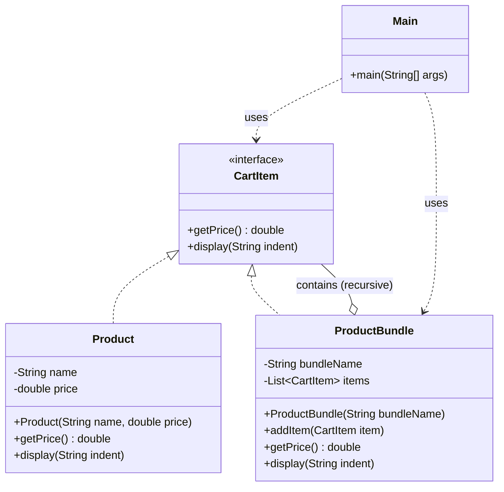

# Composite Pattern

## Question

You are building a shopping cart. A cart can contain individual `Product` items. It can also contain `Bundle` (a gift set containing multiple products). `Bundle` can contain other `Bundle`s. You need `getPrice()` to work uniformly for both. Write the code.

Try it before reading on.

---

## Pattern Mindmap

```
[Composite Pattern]
├── Problem It Solves
│   ├── Cart contains Product and Bundle (bundle may contain bundles)
│   ├── instanceof chains to calculate price — breaks on every new type
│   └── Recursive tree traversal is reimplemented everywhere
├── Core Structure
│   ├── Component interface: CartItem with getPrice() and getDescription()
│   ├── Leaf: Product — implements CartItem, returns own price
│   ├── Composite: ProductBundle — contains List<CartItem>
│   │   └── getPrice() = sum of all children.getPrice() (recursive)
│   └── Client: calls getPrice() on root — never cares about depth
├── Tree Structure
│   ├── Cart → [Product, Bundle → [Product, Bundle → [Product, Product]]]
│   ├── Leaf and composite implement same interface
│   └── Recursive getPrice() traverses the entire tree transparently
├── File System Analogy
│   ├── File (leaf): getSize() returns own size
│   ├── Directory (composite): getSize() = sum of children sizes
│   └── Client calls getSize() on any node — works for both
├── When to Use
│   ├── Part-whole hierarchies: tree structures where leaves and branches behave uniformly
│   ├── UI component trees: Panel contains Button, Label, Panel
│   └── Org charts, DOM trees, file systems
├── When NOT to Use
│   ├── Structure is flat — no nesting — direct list is simpler
│   └── Leaf vs Composite must behave differently in important ways
├── Trade-offs
│   ├── Uniform treatment: client code is simpler (no instanceof)
│   ├── Hard to restrict: nothing prevents invalid children in composite
│   └── Walking the tree is O(N) — deep trees can be slow if not cached
└── Interview Angles
    ├── What makes Composite different from a simple recursive data structure?
    ├── How does Composite relate to the Visitor pattern?
    └── When does the Composite tree need a parent reference?
```

## Problem Without the Pattern

The `isinstance` approach:

```python
class Cart:
    def total_price(self, items: list) -> float:
        total = 0
        for item in items:
            if isinstance(item, Product):
                total += item.get_price()
            elif isinstance(item, Bundle):
                for inner in item.get_items():
                    if isinstance(inner, Product):
                        total += inner.get_price()
                    elif isinstance(inner, Bundle):
                        # recurse manually again...
                        pass
        return total
```

**What breaks**:
1. **`isinstance` chains break on new types**: Adding `DigitalProduct` requires editing `total_price()`.
2. **Manual recursion**: The caller must know that `Bundle` can nest, and must replicate the recursion logic everywhere it handles items.
3. **No uniform interface**: You cannot call `.get_price()` on both `Product` and `Bundle` — they require different code paths.
4. **SRP violation**: `Cart` knows the internal structure of `Bundle`.

---

## Derive the Minimal Fix

The constraint: **treat individual objects and compositions uniformly through a common interface**.

Step 1 — define a common interface:
```python
from abc import ABC, abstractmethod

class CartItem(ABC):
    @abstractmethod
    def get_price(self) -> float:
        pass
```

Step 2 — leaf (individual item) implements the interface directly:
```python
class Product(CartItem):
    def __init__(self, price: float):
        self._price = price

    def get_price(self) -> float:
        return self._price
```

Step 3 — composite (bundle) implements the same interface and delegates to its children:
```python
class Bundle(CartItem):
    def __init__(self):
        self._items: list[CartItem] = []

    def add(self, item: CartItem):
        self._items.append(item)

    def get_price(self) -> float:
        return sum(item.get_price() for item in self._items)
        # recursion happens automatically — a Bundle inside a Bundle just delegates again
```

Step 4 — the caller is identical for both:
```python
single_product = Product(10.0)
gift_bundle = Bundle()
gift_bundle.add(Product(5.0))
gift_bundle.add(Product(3.0))

print(single_product.get_price())  # 10.0
print(gift_bundle.get_price())     # 8.0 — recursion is automatic
```

---

## Real-Life Analogy

A **file system** is the perfect example of Composite Pattern.

- A **File** is a leaf: it has a size and you can `getSize()` on it.
- A **Folder** is a composite: it can contain Files *or* other Folders. When you call `getSize()` on a folder, it adds up the sizes of everything inside — recursively.

The critical insight: you don't need to know whether you're dealing with a single file or a folder containing 1,000 nested files. **You call the same `getSize()` either way.**

```
Documents/                    <- Folder (composite)
  ├── resume.pdf              <- File (leaf)    100 KB
  ├── photos/                 <- Folder (composite)
  │   ├── vacation.jpg        <- File (leaf)    2 MB
  │   └── family.png          <- File (leaf)    1.5 MB
  └── projects/               <- Folder (composite)
      └── code.zip            <- File (leaf)    500 KB
```

`Documents.getSize()` returns 4.1 MB without you caring about the nesting structure.

---

## What Problem Does It Solve?

When your objects form a **tree (part-whole hierarchy)** and you want to treat individual objects (leaves) and groups of objects (composites) through the **same interface**.

Without Composite, client code must constantly check types:
```python
if isinstance(item, Product): ...
elif isinstance(item, ProductBundle): ...
```

This is fragile, breaks polymorphism, and makes recursive structures impossible.

---

## Understanding the Problem

Consider an e-commerce checkout system:

```python
# Represents a single product
class Product:
    def __init__(self, name: str, price: float):
        self._name = name
        self._price = price

    def get_price(self) -> float:
        return self._price

    def display(self, indent: str):
        print(f"{indent}Product: {self._name} – ₹{self._price}")

# Represents a bundle of products
class ProductBundle:
    def __init__(self, bundle_name: str):
        self._bundle_name = bundle_name
        self._products: list[Product] = []

    def add_product(self, product: Product):
        self._products.append(product)

    def get_price(self) -> float:
        return sum(p.get_price() for p in self._products)

    def display(self, indent: str):
        print(f"{indent}Bundle: {self._bundle_name}")
        for product in self._products:
            product.display(indent + "  ")

# Main logic
if __name__ == "__main__":
    book = Product("Book", 500)
    headphones = Product("Headphones", 1500)
    charger = Product("Charger", 800)

    iphone_combo = ProductBundle("iPhone Combo Pack")
    iphone_combo.add_product(headphones)
    iphone_combo.add_product(charger)

    # Cart must use plain list — no shared interface
    cart = [book, iphone_combo]

    total = 0
    for item in cart:
        if isinstance(item, Product):           # Type checking everywhere
            item.display("  ")
            total += item.get_price()
        elif isinstance(item, ProductBundle):
            item.display("  ")
            total += item.get_price()

    print(f"\nTotal Price: ₹{total}")
```

**Problems**:
- `isinstance` checks scattered throughout client code.
- `ProductBundle` cannot contain another `ProductBundle` (no recursive structure, so "bundle of bundles" is impossible).
- Any new item type requires changing every piece of client code.

---

## Solution: Composite Pattern

```python
from abc import ABC, abstractmethod

# Interface for items that can be added to the cart
class CartItem(ABC):
    @abstractmethod
    def get_price(self) -> float:
        pass

    @abstractmethod
    def display(self, indent: str):
        pass

# Product class implementing CartItem — the LEAF
class Product(CartItem):
    def __init__(self, name: str, price: float):
        self._name = name
        self._price = price

    def get_price(self) -> float:
        return self._price

    def display(self, indent: str):
        print(f"{indent}Product: {self._name} – ₹{self._price}")

# ProductBundle class implementing CartItem — the COMPOSITE
class ProductBundle(CartItem):
    def __init__(self, bundle_name: str):
        self._bundle_name = bundle_name
        self._items: list[CartItem] = []  # Contains CartItems, which can be Products OR other Bundles

    def add_item(self, item: CartItem):
        self._items.append(item)

    def get_price(self) -> float:
        return sum(item.get_price() for item in self._items)  # Recursive

    def display(self, indent: str):
        print(f"{indent}Bundle: {self._bundle_name}")
        for item in self._items:
            item.display(indent + "  ")  # Polymorphism handles the rest

# Main logic
if __name__ == "__main__":
    # Individual Products (Leaves)
    book = Product("Atomic Habits", 499)
    phone = Product("iPhone 15", 79999)
    earbuds = Product("AirPods", 15999)
    charger = Product("20W Charger", 1999)

    # Bundle contains individual products
    iphone_combo = ProductBundle("iPhone Essentials Combo")
    iphone_combo.add_item(phone)
    iphone_combo.add_item(earbuds)
    iphone_combo.add_item(charger)

    # Bundle can also contain another bundle — recursive composition
    school_kit = ProductBundle("Back to School Kit")
    school_kit.add_item(Product("Notebook Pack", 249))
    school_kit.add_item(Product("Pen Set", 99))
    school_kit.add_item(Product("Highlighter", 149))

    # Cart is simply list[CartItem] — both products and bundles treated uniformly
    cart: list[CartItem] = [book, iphone_combo, school_kit]

    print("Your Amazon Cart:")
    total = 0
    for item in cart:
        item.display("  ")       # No isinstance. No casting. Pure polymorphism.
        total += item.get_price()

    print(f"\nTotal: ₹{total}")
```

---

## Class Diagram



---

## Leaf vs Composite

| Concept | Role | Example |
|---|---|---|
| **Leaf** | Simple, atomic object. No children. | `Product` |
| **Composite** | Container that holds Leaves or other Composites. Delegates operations to children. | `ProductBundle` |
| **Component** | The common interface both implement. | `CartItem` |

The composite's `get_price()` is recursive: it calls `get_price()` on each child, and if a child is itself a `ProductBundle`, it recurses again. This works to any depth.

---

## When to Use Composite Pattern

- You have a **tree/hierarchical structure**: folders in folders, departments in departments, UI components in containers.
- You want to treat **leaves and composites uniformly** so client code doesn't distinguish them.
- You need **recursive operations**: total size, total price, rendering, serialization.
- You want to avoid `isinstance` chains in client code.

---

## How Composite Solves the Issues

| Issue | Solution |
|---|---|
| **`isinstance` everywhere** | Both `Product` and `ProductBundle` implement `CartItem`. The loop calls `item.get_price()` directly — no type checking needed. |
| **Unsafe cart list** | Cart is now `list[CartItem]`. Type-safe. |
| **Bundle can't contain Bundle** | `ProductBundle` holds `list[CartItem]`. Any `CartItem` (including another `ProductBundle`) can be added. |
| **Code duplication** | `get_price()` and `display()` logic written once per class. The loop is written once. |

---

## Advantages

- **Uniform treatment**: Single interface for leaves and composites eliminates special-casing.
- **Recursive composition**: Tree structures of arbitrary depth supported naturally.
- **Open/Closed Principle**: Add new item types by implementing `CartItem` — no existing code changes.
- **Cleaner client code**: Client never needs to know the internal structure.

## Disadvantages

- **Overkill for flat structures**: If you never need nesting, the interface adds unnecessary abstraction.
- **Type safety concerns**: Sometimes you genuinely need to distinguish leaves from composites (e.g., you can only call `add_item()` on bundles, not products). The common interface hides this.
- **SRP strain at scale**: The composite manages both its children and the business logic, which can grow complex.
