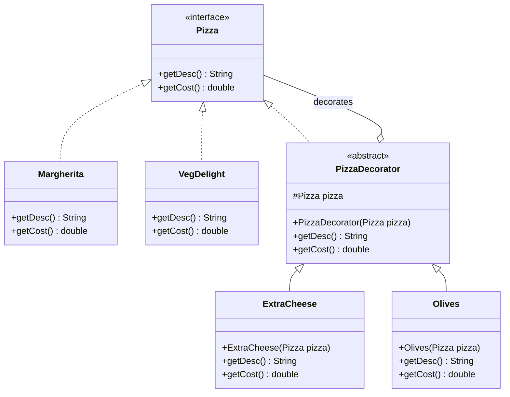

> [!NOTE]
> **📋 5-Minute Summary**
>
> **What this covers:** The Decorator Pattern — lets you attach new behaviors to objects dynamically by placing them inside special wrapper objects that contain the behaviors.
>
> **Key concepts:**
> - The problem: adding features to an object via inheritance leads to class explosion. E.g., `Coffee`, `CoffeeWithMilk`, `CoffeeWithSugar`, `CoffeeWithMilkAndSugar`.
> - The fix: create an interface (`Beverage` with `getCost()`). The base object (`Espresso`) implements it.
> - The decorators: create wrapper classes (`Milk`, `Sugar`) that *also* implement `Beverage` AND accept a `Beverage` in their constructor.
> - Chaining: `new Sugar(new Milk(new Espresso()))`. When `getCost()` is called on the outermost object, it delegates down the chain and adds its own cost.
> - Flexibility: you can add or remove decorators at runtime. The client just sees a `Beverage`.
>
> **Key takeaway:** This is a very common LLD question (e.g., "Design a Pizza pricing system with toppings" or "Design a text formatting tool"). Decorator avoids subclass explosion by wrapping objects recursively.

---
module: 06-lld
topic: Design Patterns
subtopic: Structural
status: unread
tags: [06-lld, system-design, design-patterns]
---
# Decorator Pattern

> 🔵 **Java idiom:** The decorator `implements` the same interface as the wrapped object *and* holds a reference to it, forwarding calls plus added behavior. **The archetypal JDK example is `java.io`:** `new BufferedReader(new InputStreamReader(new FileInputStream(f)))` — each wrapper adds one capability (buffering, char-decoding) over the same `Reader`/`InputStream` contract. Also `Collections.synchronizedList()`/`unmodifiableList()`. **Interview gotcha:** contrast with inheritance — decorators compose at *runtime* and stack in any order/count, avoiding the subclass explosion (`BufferedGzipEncryptedStream…`). Distinguish from Proxy (same interface, but Proxy *controls access* rather than *adding features*) and Adapter (*changes* the interface).

## Question

You have a `Pizza` class with a `getCost()` method. Pizzas can have toppings: cheese (+$1), mushrooms (+$1.50), olives (+$0.75). Any combination is valid. Model this using inheritance.

Try it before reading on.

---

## Pattern Mindmap

```
[Decorator Pattern]
├── Problem It Solves
│   ├── Pizza + N toppings → 2^N subclasses (CheeseMushroom, CheeseOlive, ...)
│   ├── Adding one topping doubles the subclass count
│   └── Static inheritance cannot compose at runtime
├── Core Structure
│   ├── Component interface: Pizza with getCost() and getDescription()
│   ├── Concrete component: BasePizza implements Pizza
│   ├── Abstract decorator: ToppingDecorator implements Pizza, holds Pizza reference
│   ├── Concrete decorators: CheeseDecorator, MushroomDecorator, OliveDecorator
│   └── Each decorator: getCost() = inner.getCost() + own cost
├── Composition at Runtime
│   ├── new CheeseDecorator(new MushroomDecorator(new BasePizza()))
│   ├── Chain can be built in any order, any combination
│   └── Each wrapper adds exactly one responsibility
├── Key Property
│   ├── Decorator implements same interface as component
│   ├── Client cannot tell if it has a base or decorated instance
│   └── Open for extension (new decorators) without modifying base
├── Analogy
│   ├── Coffee shop: Espresso + Milk + Caramel + Whip
│   └── Each add-on wraps the previous cup, adds cost and description
├── Real-World: Java I/O
│   ├── InputStream → FileInputStream → BufferedInputStream → DataInputStream
│   ├── Each layer wraps the previous and adds behavior (buffering, data parsing)
│   └── New InputStream type = one new class, works with all existing wrappers
├── When to Use
│   ├── Behavior combinations grow combinatorially with inheritance
│   ├── Features should be added/removed at runtime
│   └── Extending a class via subclassing is impractical (third-party, final)
├── When NOT to Use
│   ├── Only 2–3 fixed variants exist — simple subclassing is clearer
│   └── Decorator chain order matters in non-obvious ways — confusing
├── Trade-offs
│   ├── Many small classes; deep chains are hard to debug
│   ├── Identity: decorated object is not isinstance of specific decorator
│   └── Flexible for extension; rigid if component interface changes
└── Interview Angles
    ├── How is Decorator different from Inheritance?
    ├── How does Java I/O use the Decorator pattern?
    └── Decorator vs Proxy — what is the distinction?
```

## Problem Without the Pattern

The subclass-for-every-combination approach:

```java
class CheesePizza extends Pizza { }
class MushroomPizza extends Pizza { }
class OlivePizza extends Pizza { }
class CheeseMushroomPizza extends Pizza { }
class CheeseOlivePizza extends Pizza { }
class MushroomOlivePizza extends Pizza { }
class CheeseMushroomOlivePizza extends Pizza { }
// 3 toppings → 7 classes. 4 toppings → 15 classes. N toppings → 2^N - 1 classes.
```

**What breaks**:
1. **Class explosion**: N toppings = 2^N subclasses. Adding "jalapeño" doubles the class count.
2. **Static composition**: The combination (cheese + mushroom) is hardcoded at compile time. You cannot build combinations at runtime based on user input.
3. **SRP violation**: `CheeseMushroomPizza` knows about the pricing of both cheese and mushrooms.

---

## Derive the Minimal Fix

The constraint: **wrap behavior dynamically at runtime, not statically at compile time**.

Step 1 — ensure every pizza and every topping share the same interface:
```java
interface Pizza {
    double getCost();
    String getDescription();
}

class PlainPizza implements Pizza {
    public double getCost()        { return 5.0; }
    public String getDescription() { return "Plain pizza"; }
}
```

Step 2 — a decorator wraps a `Pizza`, adds its cost, and delegates everything else to the wrapped object:
```java
abstract class ToppingDecorator implements Pizza {
    protected final Pizza pizza;

    protected ToppingDecorator(Pizza pizza) {
        this.pizza = pizza;
    }
}

class CheeseTopping extends ToppingDecorator {
    public CheeseTopping(Pizza pizza) { super(pizza); }
    public double getCost()        { return pizza.getCost() + 1.0; }
    public String getDescription() { return pizza.getDescription() + ", Cheese"; }
}

class MushroomTopping extends ToppingDecorator {
    public MushroomTopping(Pizza pizza) { super(pizza); }
    public double getCost()        { return pizza.getCost() + 1.5; }
    public String getDescription() { return pizza.getDescription() + ", Mushroom"; }
}
```

Step 3 — compose at runtime by nesting wrappers:
```java
Pizza order = new CheeseTopping(new MushroomTopping(new PlainPizza()));
// cost = 5.0 + 1.5 + 1.0 = 7.5
// description = "Plain pizza, Mushroom, Cheese"
```

Adding jalapeño is one new `JalapenoTopping` class. Zero changes to existing classes.

---

> **Type**: Structural
> **Purpose**: Dynamically adds behavior to an object without altering its structure or creating a class explosion through inheritance.

> **Analogy**: A coffee shop. Start with plain coffee. Add milk (Decorator). Add sugar (Decorator). Add whipped cream (Decorator). Each addition wraps the previous without modifying the original `Coffee` class. You can combine them in any order, any combination.

---

## The Core Idea

Instead of creating `CoffeeWithMilk`, `CoffeeWithSugar`, `CoffeeWithMilkAndSugar`, `CoffeeWithWhippedCream`... (2^N subclasses for N additions), you wrap the object. Each decorator adds its own behavior and delegates everything else to the wrapped object.

**The key insight**: Decorators implement the same interface as what they wrap. They ARE the thing, AND they hold the thing.

---

## Problem Statement

Pizza pricing. Base: `Margherita`. Toppings: `Cheese`, `Olives`, `Mushroom`.
Calculate total cost allowing any combination.

Without Decorator, you'd need: `MargheritaWithCheese`, `MargheritaWithOlives`, `MargheritaWithCheeseAndOlives`... that's $2^N$ classes.

---

## Implementation

```java
// 1. Component Interface — the base contract
interface Pizza {
    String getDesc();
    double getCost();
}

// 2. Concrete Components — the base items
class Margherita implements Pizza {
    public String getDesc()  { return "Margherita"; }
    public double getCost()  { return 100; }
}

class VegDelight implements Pizza {
    public String getDesc()  { return "Veg Delight"; }
    public double getCost()  { return 150; }
}

// 3. Decorator Base — implements same interface, holds a Pizza
abstract class PizzaDecorator implements Pizza {
    protected final Pizza pizza; // The wrapped object

    protected PizzaDecorator(Pizza pizza) {
        this.pizza = pizza;
    }

    // Default: delegate to wrapped pizza
    public String getDesc()  { return pizza.getDesc(); }
    public double getCost()  { return pizza.getCost(); }
}

// 4. Concrete Decorators — each adds its own behavior
class ExtraCheese extends PizzaDecorator {
    public ExtraCheese(Pizza pizza) { super(pizza); }
    public String getDesc()  { return pizza.getDesc() + ", Extra Cheese"; }
    public double getCost()  { return pizza.getCost() + 50; }
}

class Olives extends PizzaDecorator {
    public Olives(Pizza pizza) { super(pizza); }
    public String getDesc()  { return pizza.getDesc() + ", Olives"; }
    public double getCost()  { return pizza.getCost() + 20; }
}

class Mushroom extends PizzaDecorator {
    public Mushroom(Pizza pizza) { super(pizza); }
    public String getDesc()  { return pizza.getDesc() + ", Mushroom"; }
    public double getCost()  { return pizza.getCost() + 30; }
}

// 5. Client — chain decorators in any combination
public class Main {
    public static void main(String[] args) {
        Pizza myPizza = new Margherita();           // Cost: 100
        myPizza = new ExtraCheese(myPizza);          // Cost: 150
        myPizza = new Olives(myPizza);               // Cost: 170

        System.out.println(myPizza.getDesc() + " = $" + myPizza.getCost());
        // Output: Margherita, Extra Cheese, Olives = $170.0

        // Different combination, zero new classes
        Pizza fancyPizza = new VegDelight();          // Cost: 150
        fancyPizza = new ExtraCheese(fancyPizza);     // Cost: 200
        fancyPizza = new Mushroom(fancyPizza);        // Cost: 230
        fancyPizza = new Olives(fancyPizza);          // Cost: 250

        System.out.println(fancyPizza.getDesc() + " = $" + fancyPizza.getCost());
        // Output: Veg Delight, Extra Cheese, Mushroom, Olives = $250.0
    }
}
```

### Class Diagram



---

## Why Not Inheritance?

Inheritance is static — you must commit to a class hierarchy at compile time:
- `MargheritaWithCheese`
- `MargheritaWithOlives`
- `MargheritaWithCheeseAndOlives`
- `VegDelightWithCheese`
- `VegDelightWithCheeseAndOlives`
- ... ($2^N$ classes for N toppings × M base pizzas)

Decorator is **dynamic composition** — you add behavior at runtime, in any combination.

---

## Real-World Example: Java I/O Streams

Java's `java.io` library follows the same Decorator principle:

```java
import java.io.*;

// FileInputStream is the base component
// BufferedInputStream is a Decorator (adds buffering)
// InputStreamReader is a Decorator (adds byte-to-character decoding)

InputStream base = new FileInputStream("data.bin");             // raw bytes
InputStream buffered = new BufferedInputStream(base);           // Decorator: adds buffer
Reader text = new InputStreamReader(buffered, "UTF-8");         // Decorator: adds text decoding
BufferedReader reader = new BufferedReader(text);                // Decorator: adds readLine()

String line = reader.readLine();  // Reads a buffered, decoded line from a file
```

Each wrapper adds behavior without modifying the original.

---

## When to Use in Interviews

- When designing a pricing/discount system: "I'd use Decorator to apply discounts on top of each other — a `StudentDiscount` wrapping a `SeasonalDiscount` wrapping the base `Price`."
- When building middleware/logging: "Each middleware in a request pipeline is a Decorator — it does its work and passes control to the next."
- When the interviewer suggests inheritance for combinations: "Inheritance creates a class explosion. Decorator lets you compose behavior dynamically at runtime."

---

## Common Violations

| Violation | Symptom | Fix |
|---|---|---|
| Inheritance for combinations | `MargheritaWithCheese`, `MargheritaWithOlives` classes | Use Decorator pattern |
| Decorator breaks interface contract | Decorator changes behavior beyond adding | Decorator should only add; never break existing behavior |
| Deep decorator chains without documentation | Hard to trace what's wrapped | Keep decorator responsibilities narrow and named clearly |

---

## Decorator vs Inheritance Summary

| | Inheritance | Decorator |
|---|---|---|
| When decided | Compile time (static) | Runtime (dynamic) |
| Combinations | $2^N$ subclasses | Wrap and compose freely |
| Modifies original? | No | No |
| Adds behavior? | Yes (but rigidly) | Yes (flexibly) |

---

## Interview Tips

**Q: "Decorator vs Inheritance for adding behavior?"**
- "Inheritance is static — you decide at compile time. Decorator is dynamic — you compose behavior at runtime. For N optional additions, inheritance needs 2^N subclasses. Decorator needs N wrapper classes composable in any combination."

**Q: "Give a real-world Decorator example"**
- "Java's `java.io` streams. `FileInputStream` gives you the base file. `BufferedInputStream` decorates it with buffering. `InputStreamReader` decorates it with character decoding. Each wrapper adds behavior without modifying the original."

---

## Applied In

This concept is used by **1 problem** in this repo:

**Low-Level Design**

- [Design a Logger Library](../../06-problems/03-domain-specific/19-design-logger-library.md)

