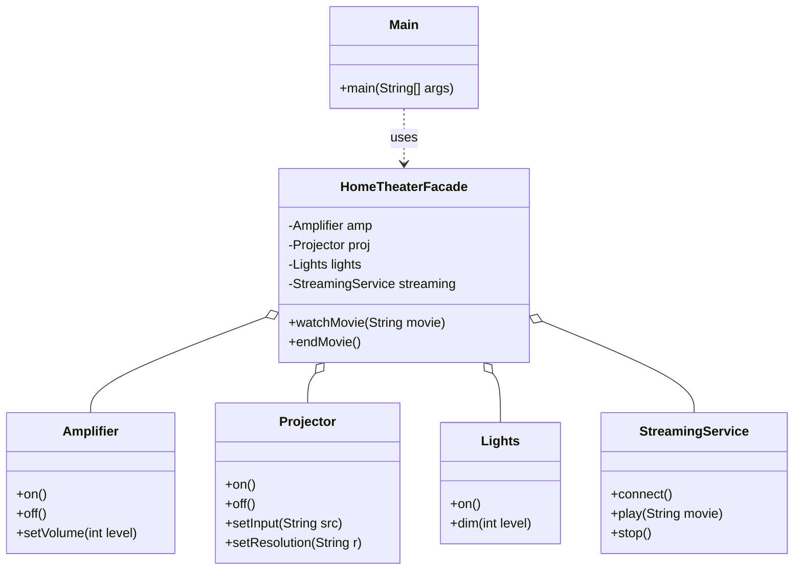

> [!NOTE]
> **📋 5-Minute Summary**
>
> **What this covers:** The Facade Pattern — provides a simplified, higher-level interface to a complex subsystem of classes.
>
> **Key concepts:**
> - The problem: a client needs to perform a common task (e.g., "Checkout"), but doing so requires orchestrating 5 different complex subsystems (Inventory, Payment, Shipping, Loyalty, Email).
> - The fix: create a `CheckoutFacade` class that exposes a single `placeOrder()` method.
> - The facade handles the complexity: inside `placeOrder()`, it coordinates the 5 subsystems in the correct order, handling errors and passing data between them.
> - Benefits: isolates clients from subsystem changes. If the Payment system upgrades from v1 to v2, only the Facade changes; the client UI stays the same.
> - Difference from Adapter: Adapter changes an existing interface to match another interface. Facade creates a new, simpler interface for an entire complex system.
>
> **Key takeaway:** Use Facade to hide "spaghetti" coordination logic from the client. In Spring/Java, @Service classes often act as facades orchestrating multiple Repositories.

---
module: 06-lld
topic: Design Patterns
subtopic: Structural
status: unread
tags: [06-lld, system-design, design-patterns]
---
# Facade Pattern

> 🔵 **Java idiom:** A single class exposing coarse-grained methods that orchestrate several subsystem classes — often a Spring `@Service` layer coordinating repositories, mappers, and clients so controllers see one simple API. **JDK equivalent:** `javax.faces.context.FacesContext`, `java.net.URL.openConnection()` hiding sockets/streams, SLF4J over logging backends. **Interview gotcha:** a Facade *simplifies* but must not *forbid* — subsystem classes stay accessible for power users; it adds convenience, not a hard wall (that's a different concern). Contrast with Adapter (Facade defines a *new simpler* interface over many classes; Adapter matches *one existing* interface). It reduces coupling: clients depend on the facade, not the subsystem graph.

## Question

To place an order, a client must: validate inventory, charge the payment, generate an invoice, send a shipping notification, and update the loyalty points. Each of these is a separate service. Write the client code that calls all five services to place one order.

Try it before reading on.

---

## Pattern Mindmap

```
[Facade Pattern]
├── Problem It Solves
│   ├── Client must coordinate 5 services: inventory, payment, invoice, shipping, loyalty
│   ├── Controller knows too much — violates SRP, hard to test
│   └── Any subsystem change requires updating every client
├── Core Structure
│   ├── Facade: OrderFacade with placeOrder(order, user)
│   ├── Orchestrates: InventoryService, PaymentService, InvoiceService, ShippingService, LoyaltyService
│   ├── Client: calls facade.placeOrder() — one method, five subsystems hidden
│   └── Subsystems: unchanged, still independently usable
├── OrderFacade.placeOrder()
│   ├── inventoryService.isAvailable() → throw if not
│   ├── paymentService.charge()
│   ├── invoiceService.generate()
│   ├── shippingService.notifyShipment()
│   └── loyaltyService.addPoints()
├── HomeTheaterFacade Example
│   ├── watchMovie() hides: projector.on(), speakers.setVolume(), dvd.play()...
│   └── Client calls one method instead of six
├── Analogy
│   ├── Hotel concierge: one person handles reservations, taxis, room service
│   └── You do not call each department — the concierge orchestrates
├── When to Use
│   ├── Subsystem is complex and clients only need a simple workflow
│   ├── You want to decouple clients from subsystem internals
│   └── Building a service layer on top of infrastructure components
├── Facade vs Adapter vs Proxy
│   ├── Facade: simplifies a complex subsystem (new simplified interface)
│   ├── Adapter: translates one interface to another (same functionality)
│   └── Proxy: controls access to a single object (same interface)
├── Trade-offs
│   ├── Facade can become a God Object if it orchestrates too much logic
│   ├── Facade does not prevent direct subsystem access — just provides convenience
│   └── Easy to test: mock the facade in client tests; test subsystems independently
└── Interview Angles
    ├── When would you introduce a Facade vs calling services directly?
    ├── How is Facade different from a God Class?
    └── Can Facade violate SRP? How do you prevent it?
```

## Problem Without the Pattern

The client knows and orchestrates every subsystem:

```python
# In the client (e.g., an HTTP controller):
def place_order(self, order, user):
    if not self._inventory_service.is_available(order.get_product_id(), order.get_qty()):
        raise OutOfStockException()
    self._inventory_service.reserve(order.get_product_id(), order.get_qty())

    result = self._payment_service.charge(user.get_payment_method(), order.get_total())
    if not result.is_success():
        raise PaymentFailedException()

    invoice_id = self._invoice_service.generate(order, user)

    self._shipping_service.schedule_delivery(order, user.get_address())

    self._loyalty_service.add_points(user.get_id(), order.get_total())
```

**What breaks**:
1. **Client is tightly coupled to 5 subsystems**: The HTTP controller must import `InventoryService`, `PaymentService`, `InvoiceService`, `ShippingService`, `LoyaltyService`.
2. **SRP violation**: The controller knows the orchestration sequence. If the sequence changes (e.g., loyalty points before invoice), you edit the controller.
3. **Duplication**: Every entry point (web, mobile, batch job) that places orders must repeat this sequence.
4. **Untestable**: Testing an order requires constructing or mocking all 5 services in every test.

---

## Derive the Minimal Fix

The constraint: **the client should call one method; the orchestration sequence lives behind a single entry point**.

Step 1 — create a `Facade` class that knows all the subsystems and the correct sequence:
```python
class OrderFacade:
    def __init__(self, inventory_service, payment_service,
                 invoice_service, shipping_service, loyalty_service):
        self._inventory_service = inventory_service
        self._payment_service = payment_service
        self._invoice_service = invoice_service
        self._shipping_service = shipping_service
        self._loyalty_service = loyalty_service

    def place_order(self, order, user):
        # full orchestration lives here, not in the controller
        self._inventory_service.reserve(order.get_product_id(), order.get_qty())
        self._payment_service.charge(user.get_payment_method(), order.get_total())
        self._invoice_service.generate(order, user)
        self._shipping_service.schedule_delivery(order, user.get_address())
        self._loyalty_service.add_points(user.get_id(), order.get_total())
```

Step 2 — the client calls one method:
```python
# In the HTTP controller (and the mobile controller, and the batch job):
order_facade.place_order(order, user)
```

The controller now imports only `OrderFacade`. The subsystems are hidden. Changing the sequence means editing one class.

---

> **Type**: Structural
> **Purpose**: Provides a simplified interface to a complex subsystem, hiding the complexity behind a single entry point.

> **Analogy**: A hotel. Instead of calling housekeeping, room service, the front desk, and the concierge separately, you call ONE number — the hotel operator — who coordinates everything. The Facade hides complexity behind a simple interface.

---

## The Core Idea

A complex system has many moving parts. Clients shouldn't need to know about each subsystem and the correct order to call them. The Facade provides a single, clean interface that orchestrates the subsystems internally.

**What changes**: The client API gets simpler. The subsystems stay intact.

---

## Problem Statement

A `HomeTheater` system requires:
1. Dimming the lights
2. Turning on the projector
3. Setting projector input to Netflix
4. Turning on the amplifier
5. Setting the volume

The client just wants `watch_movie()`. They shouldn't need to know the correct sequence of 5 subsystem calls.

---

## Implementation

```python
# Subsystem Components — each has its own complex interface
class Amplifier:
    def on(self):                   print("Amp ON")
    def off(self):                  print("Amp OFF")
    def set_volume(self, level: int): print(f"Amp Volume: {level}")

class Projector:
    def on(self):                   print("Projector ON")
    def off(self):                  print("Projector OFF")
    def set_input(self, src: str):  print(f"Projector Input: {src}")
    def set_resolution(self, r: str): print(f"Projector Resolution: {r}")

class Lights:
    def on(self):                   print("Lights ON")
    def dim(self, level: int):      print(f"Lights dimmed to {level}%")

class StreamingService:
    def connect(self):              print("Streaming service connected")
    def play(self, movie: str):     print(f"Playing: {movie}")
    def stop(self):                 print("Streaming stopped")

# Facade — one entry point, hides all the complexity
class HomeTheaterFacade:
    def __init__(self):
        self._amp = Amplifier()
        self._proj = Projector()
        self._lights = Lights()
        self._streaming = StreamingService()

    # Simple interface for a complex sequence
    def watch_movie(self, movie: str):
        print(f"--- Preparing to watch {movie} ---")
        self._lights.dim(10)
        self._proj.on()
        self._proj.set_input("HDMI-1")
        self._proj.set_resolution("4K")
        self._amp.on()
        self._amp.set_volume(5)
        self._streaming.connect()
        self._streaming.play(movie)

    def end_movie(self):
        print("--- Shutting down theater ---")
        self._streaming.stop()
        self._amp.off()
        self._proj.off()
        self._lights.on()

# Client — calls ONE method, knows nothing about subsystems
if __name__ == "__main__":
    home_theater = HomeTheaterFacade()

    home_theater.watch_movie("Inception")
    # ... movie plays ...
    home_theater.end_movie()
```

### Class Diagram



---

## Real-World Example: Order Fulfillment

```python
# Without Facade — client knows too much
class OrderController:
    def place_order(self, order):
        self._inventory_service.check_stock(order)
        self._payment_service.charge(order.get_customer(), order.get_total())
        self._warehouse_service.pick_and_pack(order)
        self._shipping_service.schedule_pickup(order)
        self._notification_service.send_confirmation(order)
        self._loyalty_service.add_points(order.get_customer(), order.get_total())

# With Facade — controller stays thin
class OrderFacade:
    # Orchestrates all subsystems internally
    def place_order(self, order):
        self._inventory_service.check_stock(order)
        self._payment_service.charge(order.get_customer(), order.get_total())
        self._warehouse_service.pick_and_pack(order)
        self._shipping_service.schedule_pickup(order)
        self._notification_service.send_confirmation(order)
        self._loyalty_service.add_points(order.get_customer(), order.get_total())

class OrderController:
    def __init__(self, order_facade: OrderFacade):
        self._order_facade = order_facade

    def place_order(self, order):
        self._order_facade.place_order(order)  # One call
```

---

## When to Use in Interviews

- When designing a service layer above complex subsystems: "I'd add a Facade so the API layer calls one method without knowing how 6 downstream services coordinate."
- When building an SDK or library: "The Facade hides internal complexity — users get a clean API, not a manual for 10 internal classes."
- When dealing with legacy systems: "A Facade wraps the legacy system, giving new code a clean entry point without touching the old code."

---

## Common Violations

| Violation | Symptom | Fix |
|---|---|---|
| Facade does business logic | Facade validates, transforms, and decides | Facade should only coordinate; logic stays in subsystems |
| Facade exposes all subsystem methods | One-to-one passthrough — no simplification | If every call is forwarded, there's no benefit; aggregate into meaningful operations |
| Skipping the Facade | Controllers/clients directly calling 5+ subsystems | Introduce a Facade to centralize orchestration |

---

## Facade vs Other Patterns

| | Facade | Adapter | Proxy |
|---|---|---|---|
| Purpose | Simplify complex subsystem | Translate incompatible interface | Control access to one object |
| Number of subsystems | Many | One (Adaptee) | One (Real Object) |
| Changes interface? | Yes — simpler | Yes — different | No — same |
| Hides complexity? | Yes | No | Partially |

---

## Interview Tips

**Q: "Facade vs Adapter?"**
- "Facade simplifies a complex subsystem into a single clean interface — it coordinates many classes. Adapter translates one interface to another — it wraps one class. Facade is about simplification; Adapter is about compatibility."

**Q: "Real-world Facade example?"**
- "A hotel operator. Instead of you calling housekeeping, room service, and the front desk separately, you call one number. The hotel operator coordinates everything. Similarly, `CheckoutFacade.checkout(order)` coordinates payment, inventory, shipping, and notification internally."

---

## Applied In

This concept is used by **1 problem** in this repo:

**Low-Level Design**

- [Design S3 Object Storage / File System](../../05-problems/04-advanced-niche/26-design-s3-object-storage.md)

