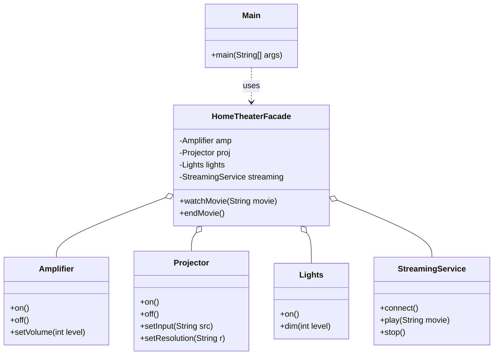

# Facade Pattern

## Question

To place an order, a client must: validate inventory, charge the payment, generate an invoice, send a shipping notification, and update the loyalty points. Each of these is a separate service. Write the client code that calls all five services to place one order.

Try it before reading on.

---

## Pattern Mindmap

```
[Facade Pattern]
├── Problem It Solves
│   ├── Client must coordinate 5 services: inventory, payment, invoice, shipping, loyalty
│   ├── Controller knows too much — violates SRP, hard to test
│   └── Any subsystem change requires updating every client
├── Core Structure
│   ├── Facade: OrderFacade with placeOrder(order, user)
│   ├── Orchestrates: InventoryService, PaymentService, InvoiceService, ShippingService, LoyaltyService
│   ├── Client: calls facade.placeOrder() — one method, five subsystems hidden
│   └── Subsystems: unchanged, still independently usable
├── OrderFacade.placeOrder()
│   ├── inventoryService.isAvailable() → throw if not
│   ├── paymentService.charge()
│   ├── invoiceService.generate()
│   ├── shippingService.notifyShipment()
│   └── loyaltyService.addPoints()
├── HomeTheaterFacade Example
│   ├── watchMovie() hides: projector.on(), speakers.setVolume(), dvd.play()...
│   └── Client calls one method instead of six
├── Analogy
│   ├── Hotel concierge: one person handles reservations, taxis, room service
│   └── You do not call each department — the concierge orchestrates
├── When to Use
│   ├── Subsystem is complex and clients only need a simple workflow
│   ├── You want to decouple clients from subsystem internals
│   └── Building a service layer on top of infrastructure components
├── Facade vs Adapter vs Proxy
│   ├── Facade: simplifies a complex subsystem (new simplified interface)
│   ├── Adapter: translates one interface to another (same functionality)
│   └── Proxy: controls access to a single object (same interface)
├── Trade-offs
│   ├── Facade can become a God Object if it orchestrates too much logic
│   ├── Facade does not prevent direct subsystem access — just provides convenience
│   └── Easy to test: mock the facade in client tests; test subsystems independently
└── Interview Angles
    ├── When would you introduce a Facade vs calling services directly?
    ├── How is Facade different from a God Class?
    └── Can Facade violate SRP? How do you prevent it?
```

## Problem Without the Pattern

The client knows and orchestrates every subsystem:

```java
// In the client (e.g., an HTTP controller):
public void placeOrder(Order order, User user) {
    if (!inventoryService.isAvailable(order.getProductId(), order.getQty())) {
        throw new OutOfStockException();
    }
    inventoryService.reserve(order.getProductId(), order.getQty());

    PaymentResult result = paymentService.charge(user.getPaymentMethod(), order.getTotal());
    if (!result.isSuccess()) throw new PaymentFailedException();

    String invoiceId = invoiceService.generate(order, user);

    shippingService.scheduleDelivery(order, user.getAddress());

    loyaltyService.addPoints(user.getId(), order.getTotal());
}
```

**What breaks**:
1. **Client is tightly coupled to 5 subsystems**: The HTTP controller must import `InventoryService`, `PaymentService`, `InvoiceService`, `ShippingService`, `LoyaltyService`.
2. **SRP violation**: The controller knows the orchestration sequence. If the sequence changes (e.g., loyalty points before invoice), you edit the controller.
3. **Duplication**: Every entry point (web, mobile, batch job) that places orders must repeat this sequence.
4. **Untestable**: Testing an order requires constructing or mocking all 5 services in every test.

---

## Derive the Minimal Fix

The constraint: **the client should call one method; the orchestration sequence lives behind a single entry point**.

Step 1 — create a `Facade` class that knows all the subsystems and the correct sequence:
```java
class OrderFacade {
    private InventoryService inventoryService;
    private PaymentService paymentService;
    private InvoiceService invoiceService;
    private ShippingService shippingService;
    private LoyaltyService loyaltyService;

    public OrderFacade(/* inject all services */) { ... }

    public void placeOrder(Order order, User user) {
        // full orchestration lives here, not in the controller
        inventoryService.reserve(order.getProductId(), order.getQty());
        paymentService.charge(user.getPaymentMethod(), order.getTotal());
        invoiceService.generate(order, user);
        shippingService.scheduleDelivery(order, user.getAddress());
        loyaltyService.addPoints(user.getId(), order.getTotal());
    }
}
```

Step 2 — the client calls one method:
```java
// In the HTTP controller (and the mobile controller, and the batch job):
orderFacade.placeOrder(order, user);
```

The controller now imports only `OrderFacade`. The subsystems are hidden. Changing the sequence means editing one class.

---

> **Type**: Structural
> **Purpose**: Provides a simplified interface to a complex subsystem, hiding the complexity behind a single entry point.

> **Analogy**: A hotel. Instead of calling housekeeping, room service, the front desk, and the concierge separately, you call ONE number — the hotel operator — who coordinates everything. The Facade hides complexity behind a simple interface.

---

## The Core Idea

A complex system has many moving parts. Clients shouldn't need to know about each subsystem and the correct order to call them. The Facade provides a single, clean interface that orchestrates the subsystems internally.

**What changes**: The client API gets simpler. The subsystems stay intact.

---

## Problem Statement

A `HomeTheater` system requires:
1. Dimming the lights
2. Turning on the projector
3. Setting projector input to Netflix
4. Turning on the amplifier
5. Setting the volume

The client just wants `watchMovie()`. They shouldn't need to know the correct sequence of 5 subsystem calls.

---

## Implementation

```java
// Subsystem Components — each has its own complex interface
class Amplifier {
    public void on()                  { System.out.println("Amp ON"); }
    public void off()                 { System.out.println("Amp OFF"); }
    public void setVolume(int level)  { System.out.println("Amp Volume: " + level); }
}

class Projector {
    public void on()                  { System.out.println("Projector ON"); }
    public void off()                 { System.out.println("Projector OFF"); }
    public void setInput(String src)  { System.out.println("Projector Input: " + src); }
    public void setResolution(String r){ System.out.println("Projector Resolution: " + r); }
}

class Lights {
    public void on()                  { System.out.println("Lights ON"); }
    public void dim(int level)        { System.out.println("Lights dimmed to " + level + "%"); }
}

class StreamingService {
    public void connect()             { System.out.println("Streaming service connected"); }
    public void play(String movie)    { System.out.println("Playing: " + movie); }
    public void stop()                { System.out.println("Streaming stopped"); }
}

// Facade — one entry point, hides all the complexity
class HomeTheaterFacade {
    private Amplifier amp;
    private Projector proj;
    private Lights lights;
    private StreamingService streaming;
    
    public HomeTheaterFacade() {
        this.amp       = new Amplifier();
        this.proj      = new Projector();
        this.lights    = new Lights();
        this.streaming = new StreamingService();
    }
    
    // Simple interface for a complex sequence
    public void watchMovie(String movie) {
        System.out.println("--- Preparing to watch " + movie + " ---");
        lights.dim(10);
        proj.on();
        proj.setInput("HDMI-1");
        proj.setResolution("4K");
        amp.on();
        amp.setVolume(5);
        streaming.connect();
        streaming.play(movie);
    }
    
    public void endMovie() {
        System.out.println("--- Shutting down theater ---");
        streaming.stop();
        amp.off();
        proj.off();
        lights.on();
    }
}

// Client — calls ONE method, knows nothing about subsystems
public class Main {
    public static void main(String[] args) {
        HomeTheaterFacade homeTheater = new HomeTheaterFacade();
        
        homeTheater.watchMovie("Inception");
        // ... movie plays ...
        homeTheater.endMovie();
    }
}
```

### Class Diagram



---

## Real-World Example: Order Fulfillment

```java
// Without Facade — client knows too much
public class OrderController {
    public void placeOrder(Order order) {
        inventoryService.checkStock(order);
        paymentService.charge(order.getCustomer(), order.getTotal());
        warehouseService.pickAndPack(order);
        shippingService.schedulePickup(order);
        notificationService.sendConfirmation(order);
        loyaltyService.addPoints(order.getCustomer(), order.getTotal());
    }
}

// With Facade — controller stays thin
public class OrderFacade {
    // Orchestrates all subsystems internally
    public void placeOrder(Order order) {
        inventoryService.checkStock(order);
        paymentService.charge(order.getCustomer(), order.getTotal());
        warehouseService.pickAndPack(order);
        shippingService.schedulePickup(order);
        notificationService.sendConfirmation(order);
        loyaltyService.addPoints(order.getCustomer(), order.getTotal());
    }
}

public class OrderController {
    private OrderFacade orderFacade;
    
    public void placeOrder(Order order) {
        orderFacade.placeOrder(order);  // One call
    }
}
```

---

## When to Use in Interviews

- When designing a service layer above complex subsystems: "I'd add a Facade so the API layer calls one method without knowing how 6 downstream services coordinate."
- When building an SDK or library: "The Facade hides internal complexity — users get a clean API, not a manual for 10 internal classes."
- When dealing with legacy systems: "A Facade wraps the legacy system, giving new code a clean entry point without touching the old code."

---

## Common Violations

| Violation | Symptom | Fix |
|---|---|---|
| Facade does business logic | Facade validates, transforms, and decides | Facade should only coordinate; logic stays in subsystems |
| Facade exposes all subsystem methods | One-to-one passthrough — no simplification | If every call is forwarded, there's no benefit; aggregate into meaningful operations |
| Skipping the Facade | Controllers/clients directly calling 5+ subsystems | Introduce a Facade to centralize orchestration |

---

## Facade vs Other Patterns

| | Facade | Adapter | Proxy |
|---|---|---|---|
| Purpose | Simplify complex subsystem | Translate incompatible interface | Control access to one object |
| Number of subsystems | Many | One (Adaptee) | One (Real Object) |
| Changes interface? | Yes — simpler | Yes — different | No — same |
| Hides complexity? | Yes | No | Partially |

---

## Interview Tips

**Q: "Facade vs Adapter?"**
- "Facade simplifies a complex subsystem into a single clean interface — it coordinates many classes. Adapter translates one interface to another — it wraps one class. Facade is about simplification; Adapter is about compatibility."

**Q: "Real-world Facade example?"**
- "A hotel operator. Instead of you calling housekeeping, room service, and the front desk separately, you call one number. The hotel operator coordinates everything. Similarly, `CheckoutFacade.checkout(order)` coordinates payment, inventory, shipping, and notification internally."
