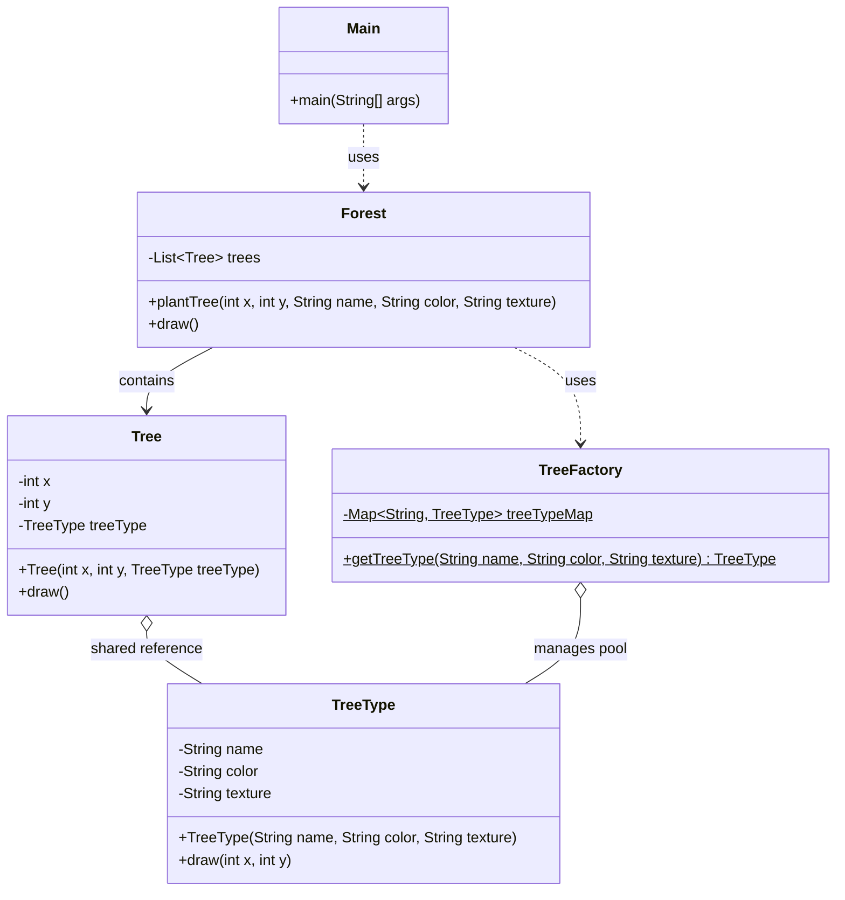

# Flyweight Pattern

## Question

You are building a 2D forest game. You create 1,000,000 `Tree` objects. Each tree has: `type` (Oak, Pine, Birch), `texture` (50KB image), `color`, `x`, `y`. How much memory does this use? What is wrong with creating a distinct object per tree?

Try to reason through the memory math before reading on.

---

## Pattern Mindmap

```
[Flyweight Pattern]
├── Problem It Solves
│   ├── 1M Tree objects × 50KB texture = 50GB memory
│   ├── Most data (type, texture, color) is shared across trees
│   └── Only position (x, y) differs per tree instance
├── Core Structure
│   ├── Intrinsic state (TreeType): type, texture, color — shared, immutable
│   ├── Extrinsic state (Tree): x, y — per-instance, passed at call time
│   ├── TreeFactory: cache of TreeType objects by type name
│   └── Client: creates Tree(x, y, factory.getTreeType("Oak"))
├── Memory Math
│   ├── Without Flyweight: 1M × 50KB = 50GB
│   ├── With Flyweight: 3 TreeType objects × 50KB = 150KB + 1M × (8 bytes x,y) = ~8MB
│   └── Savings: ~99.98% memory reduction
├── TreeFactory (Registry)
│   ├── Map<String, TreeType> cache
│   ├── getTreeType(name): return cached or create and cache new
│   └── Client never calls new TreeType() directly
├── Analogy
│   ├── Google Maps: one icon image for each POI type (hotel, restaurant)
│   ├── Position is extrinsic; icon texture is intrinsic flyweight
│   └── Uber: one car icon shared across thousands of driver pins on map
├── Real-World Java
│   ├── String Pool: identical literals share same String object
│   ├── Integer.valueOf(-128 to 127): cached, not re-created
│   └── Character cache, Boolean.TRUE/FALSE singletons
├── When to Use
│   ├── Large number of fine-grained objects with shared state
│   ├── Memory is the bottleneck (game objects, map pins, font glyphs)
│   └── Intrinsic and extrinsic state can be clearly separated
├── When NOT to Use
│   ├── Object count is small — premature optimization
│   └── State cannot be cleanly split into intrinsic/extrinsic
└── Interview Angles
    ├── What is the difference between intrinsic and extrinsic state?
    ├── How does Java String Pool implement Flyweight?
    └── How do you prevent cache growth from becoming a memory leak?
```

## Problem Without the Pattern

```python
class Tree:
    def __init__(self, tree_type: str, texture: bytes, color: str, x: int, y: int):
        self._type = tree_type
        self._texture = texture  # separate copy per instance (50KB per tree)
        self._color = color
        self._x = x
        self._y = y

import random

# Creating 1,000,000 trees:
trees = []
for i in range(1_000_000):
    trees.append(Tree("Oak", load_texture("oak.png"), "green", random.randint(0, 1000), random.randint(0, 1000)))
# Memory: 1,000,000 × 50KB = 50GB — system crash
```

**What breaks**:
1. **Identical data duplicated per instance**: All Oak trees have the same `texture` and `color`. Each of 1M trees allocates its own 50KB copy.
2. **Memory exhaustion**: 1M × 50KB = 50GB just for textures.
3. **GC pressure**: 1M large objects constantly stress the garbage collector.

**Key insight**: There are only 3 tree types, but 1,000,000 trees. The type, texture, and color are **intrinsic** (shared, immutable). Only `x` and `y` are **extrinsic** (unique per instance).

---

## Derive the Minimal Fix

The constraint: **share the invariant state across instances; keep only the unique state per object**.

Step 1 — extract the shared (intrinsic) state into a separate `TreeType` object:
```python
class TreeType:
    def __init__(self, tree_type: str, texture: bytes, color: str):
        self._type = tree_type
        self._texture = texture  # loaded once, shared by all trees of this type
        self._color = color

    def draw(self, x: int, y: int):
        # render this tree type at the given coordinates
        pass
```

Step 2 — a factory ensures each type is created only once:
```python
class TreeFactory:
    _cache: dict[str, TreeType] = {}

    @classmethod
    def get_tree_type(cls, tree_type: str, texture: bytes, color: str) -> TreeType:
        if tree_type not in cls._cache:
            cls._cache[tree_type] = TreeType(tree_type, texture, color)
        return cls._cache[tree_type]
```

Step 3 — the `Tree` object holds only extrinsic state (unique position) and a reference to the shared `TreeType`:
```python
class Tree:
    def __init__(self, x: int, y: int, tree_type: TreeType):
        self._x = x
        self._y = y
        self._type = tree_type  # shared reference — not a copy

    def draw(self):
        self._type.draw(self._x, self._y)
```

Memory: 3 `TreeType` objects × 50KB = 150KB (shared). 1M `Tree` objects × 8 bytes (x, y + reference) = ~8MB. Total: ~8MB vs 50GB.

---

## Real-Life Analogy

You are building a video game with a forest of **1 million trees**.

Each tree has:
- **Species, color, bark texture, leaf shape** — same for every Oak tree. Same for every Pine tree.
- **X coordinate, Y coordinate, health** — unique to each individual tree.

**Without Flyweight**: You store all of this in every tree object.
```
1,000,000 trees × (species + color + texture + bark + x + y + health)
= 1,000,000 × 100 KB = 100 GB of RAM
```
Your game crashes at launch.

**With Flyweight**: You separate shared data from unique data.
```
3 TreeType objects × 100 KB each = 300 KB  (shared/intrinsic state)
1,000,000 Tree objects × (x + y + health) = ~24 MB  (unique/extrinsic state)
```
Total: ~24 MB. Game runs fine.

The **shared data** (stored once per species) is called **intrinsic state**.  
The **unique data** (stored per instance) is called **extrinsic state**.

---

## Core Concepts

| Term | Definition | Example |
|---|---|---|
| **Intrinsic State** | Immutable, shared data stored inside the flyweight object. Context-independent. | Tree species, color, texture |
| **Extrinsic State** | Context-specific data passed in by the client. Not stored in flyweight. | Tree position (x, y) |
| **Flyweight Object** | The shared, immutable object reused across many contexts. | `TreeType` |
| **Flyweight Factory** | Ensures flyweights are reused, not recreated. Returns existing instance if available. | `TreeFactory` |

---

## Understanding the Problem

Rendering a forest on a map like Google Maps:

```python
# ================ Tree Class =================
class Tree:
    # Attributes that keep on changing
    # Attributes that remain constant — duplicated for every tree!
    def __init__(self, x: int, y: int, name: str, color: str, texture: str):
        self._x = x
        self._y = y
        self._name = name
        self._color = color
        self._texture = texture

    def draw(self):
        print(f"Drawing tree at ({self._x}, {self._y}) with type {self._name}")

# ================ Forest Class =================
class Forest:
    def __init__(self):
        self._trees: list[Tree] = []

    def plant_tree(self, x: int, y: int, name: str, color: str, texture: str):
        tree = Tree(x, y, name, color, texture)
        self._trees.append(tree)

    def draw(self):
        for tree in self._trees:
            tree.draw()

# =============== Client Code ==================
if __name__ == "__main__":
    forest = Forest()

    # Planting 1 million trees — all storing identical name/color/texture
    for i in range(1_000_000):
        forest.plant_tree(i, i, "Oak", "Green", "Rough")

    print("Planted 1 million trees.")
```

**Problems**:
- 1 million `Tree` objects each store `"Oak"`, `"Green"`, `"Rough"` redundantly.
- Same data copied a million times.
- Memory usage is proportional to number of trees × total data per tree.

---

## Solution: Flyweight Pattern

```python
# ============= TreeType Class (FLYWEIGHT) ================
# Stores only the SHARED (intrinsic) data — created once per species
class TreeType:
    def __init__(self, name: str, color: str, texture: str):
        self._name = name
        self._color = color
        self._texture = texture

    # Extrinsic state (x, y) is passed in — NOT stored here
    def draw(self, x: int, y: int):
        print(f"Drawing {self._name} tree at ({x}, {y})")

# ================ Tree Class =================
# Stores only UNIQUE (extrinsic) data + a reference to the shared flyweight
class Tree:
    def __init__(self, x: int, y: int, tree_type: TreeType):
        self._x = x          # Unique per tree
        self._y = y          # Unique per tree
        self._tree_type = tree_type  # Shared reference — NOT a copy

    def draw(self):
        self._tree_type.draw(self._x, self._y)  # Passes extrinsic state to flyweight

# ============ TreeFactory Class (FLYWEIGHT FACTORY) ==============
# The factory guarantees reuse — no duplicate TreeType objects ever created
class TreeFactory:
    _tree_type_map: dict[str, TreeType] = {}

    @classmethod
    def get_tree_type(cls, name: str, color: str, texture: str) -> TreeType:
        key = f"{name} - {color} - {texture}"
        if key not in cls._tree_type_map:
            cls._tree_type_map[key] = TreeType(name, color, texture)
            print(f"Created new TreeType: {key}")
        return cls._tree_type_map[key]

# ================ Forest Class =================
class Forest:
    def __init__(self):
        self._trees: list[Tree] = []

    def plant_tree(self, x: int, y: int, name: str, color: str, texture: str):
        tree_type = TreeFactory.get_tree_type(name, color, texture)  # Reuses existing
        tree = Tree(x, y, tree_type)
        self._trees.append(tree)

    def draw(self):
        for tree in self._trees:
            tree.draw()

# =============== Client Code ==================
if __name__ == "__main__":
    forest = Forest()

    # 1 million Oak trees — only ONE TreeType("Oak","Green","Rough") object created
    for i in range(1_000_000):
        forest.plant_tree(i, i, "Oak", "Green", "Rough")

    # Adding Pine trees — ONE new TreeType object created, reused for all pine trees
    for i in range(500_000):
        forest.plant_tree(i, i + 1_000_000, "Pine", "Dark Green", "Smooth")

    print(f"Total TreeType objects: {len(TreeFactory._tree_type_map)}")  # Only 2 regardless of 1.5M trees
```

**Result**: 1,500,000 trees exist, but only 2 `TreeType` objects are ever created. Memory for shared data: essentially zero.

---

## Class Diagram



---

## How Flyweight Solves the Issue

| Problem | Solution |
|---|---|
| **1M duplicate `name/color/texture` fields** | `TreeType` stores shared data once. All 1M Oak trees reference the same `TreeType` object. |
| **Memory proportional to tree count** | Memory for shared data is constant (one object per species). Only positions scale with tree count. |
| **Slow rendering, high GC pressure** | Far fewer large objects means faster GC and lower memory bandwidth. |

---

## When to Use Flyweight Pattern

- You have a **large number of similar objects** (thousands to millions).
- **Memory or performance** is a bottleneck.
- The objects have **clearly separable intrinsic (shared) and extrinsic (unique) state**.
- The intrinsic state is **immutable** (flyweights are typically immutable to be safely shared).

---

## Real-World Applications

| Application | Flyweight Use |
|---|---|
| **Google Maps** | Tree/landmark icons: millions of the same icon rendered at different coordinates. Icon data (image, color) shared; position is extrinsic. |
| **Uber Driver Map** | Car icons: all cars use the same icon data. Only GPS coordinates differ. |
| **Game Engines (Unity)** | Mesh, material, and texture data shared across thousands of instances via GPU instancing. |
| **Web Browsers** | CSS rules and font objects reused across thousands of DOM elements with the same style. |
| **Java String Pool** | String literals with the same value point to the same object in memory. `"hello" == "hello"` is true in Java because of the string pool. |
| **Java Integer Cache** | `Integer.valueOf(127) == Integer.valueOf(127)` is true because Integers from -128 to 127 are cached (flyweights). |

---

## Advantages

- Dramatically reduces memory when many objects share data.
- Improves performance in memory-constrained or rendering-heavy environments.
- Faster object creation (reuse instead of instantiate).

## Disadvantages

- **Added complexity**: Factory management, two-tier state separation, more classes.
- **Harder to debug**: Shared state means a bug in a flyweight affects many objects simultaneously.
- **Immutability required**: Flyweight objects must not be modified after sharing or you corrupt many contexts at once.
- **Extrinsic state management**: The client must track and pass in extrinsic state, which adds cognitive overhead.
