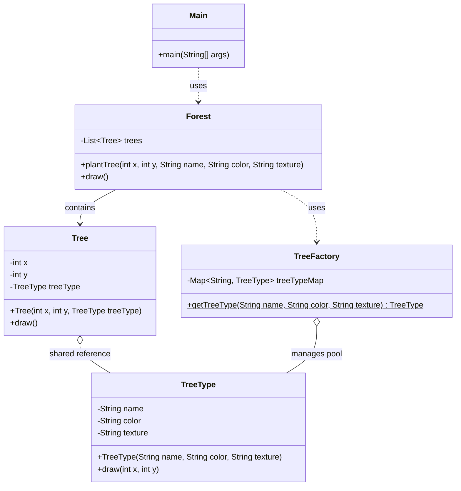

# Flyweight Pattern

## Real-Life Analogy

You are building a video game with a forest of **1 million trees**.

Each tree has:
- **Species, color, bark texture, leaf shape** — same for every Oak tree. Same for every Pine tree.
- **X coordinate, Y coordinate, health** — unique to each individual tree.

**Without Flyweight**: You store all of this in every tree object.
```
1,000,000 trees × (species + color + texture + bark + x + y + health)
= 1,000,000 × 100 KB = 100 GB of RAM
```
Your game crashes at launch.

**With Flyweight**: You separate shared data from unique data.
```
3 TreeType objects × 100 KB each = 300 KB  (shared/intrinsic state)
1,000,000 Tree objects × (x + y + health) = ~24 MB  (unique/extrinsic state)
```
Total: ~24 MB. Game runs fine.

The **shared data** (stored once per species) is called **intrinsic state**.  
The **unique data** (stored per instance) is called **extrinsic state**.

---

## Core Concepts

| Term | Definition | Example |
|---|---|---|
| **Intrinsic State** | Immutable, shared data stored inside the flyweight object. Context-independent. | Tree species, color, texture |
| **Extrinsic State** | Context-specific data passed in by the client. Not stored in flyweight. | Tree position (x, y) |
| **Flyweight Object** | The shared, immutable object reused across many contexts. | `TreeType` |
| **Flyweight Factory** | Ensures flyweights are reused, not recreated. Returns existing instance if available. | `TreeFactory` |

---

## Understanding the Problem

Rendering a forest on a map like Google Maps:

```java
// ================ Tree Class =================
class Tree {
    // Attributes that keep on changing 
    private int x;
    private int y;
    
    // Attributes that remain constant — duplicated for every tree!
    private String name;
    private String color;
    private String texture;
    
    public Tree(int x, int y, String name, String color, String texture) {
        this.x = x;
        this.y = y;
        this.name = name;
        this.color = color;
        this.texture = texture;
    }
    
    public void draw() {
        System.out.println("Drawing tree at (" + this.x + ", " + this.y + ") with type " + this.name);
    }
}

// ================ Forest Class =================
class Forest {
    private List<Tree> trees;
    
    public Forest() {
        this.trees = new ArrayList<>();
    }
    
    public void plantTree(int x, int y, String name, String color, String texture) {
        Tree tree = new Tree(x, y, name, color, texture);
        this.trees.add(tree);
    }
    
    public void draw() {
        for (Tree tree : this.trees) {
            tree.draw();
        }
    }
}

// =============== Client Code ==================
public class Main {
    public static void main(String[] args) {
        Forest forest = new Forest();
        
        // Planting 1 million trees — all storing identical name/color/texture
        for (int i = 0; i < 1000000; i++) {
            forest.plantTree(i, i, "Oak", "Green", "Rough");
        }
        
        System.out.println("Planted 1 million trees.");
    }
}
```

**Problems**:
- 1 million `Tree` objects each store `"Oak"`, `"Green"`, `"Rough"` redundantly.
- Same data copied a million times.
- Memory usage is proportional to number of trees × total data per tree.

---

## Solution: Flyweight Pattern

```java
// ============= TreeType Class (FLYWEIGHT) ================
// Stores only the SHARED (intrinsic) data — created once per species
class TreeType {
    private String name;
    private String color;
    private String texture;
    
    public TreeType(String name, String color, String texture) {
        this.name = name;
        this.color = color;
        this.texture = texture;
    }
    
    // Extrinsic state (x, y) is passed in — NOT stored here
    public void draw(int x, int y) {
        System.out.println("Drawing " + this.name + " tree at (" + x + ", " + y + ")");
    }
}

// ================ Tree Class =================
// Stores only UNIQUE (extrinsic) data + a reference to the shared flyweight
class Tree {
    private int x;     // Unique per tree
    private int y;     // Unique per tree
    private TreeType treeType;   // Shared reference — NOT a copy
    
    public Tree(int x, int y, TreeType treeType) {
        this.x = x;
        this.y = y;
        this.treeType = treeType;
    }
    
    public void draw() {
        this.treeType.draw(this.x, this.y);  // Passes extrinsic state to flyweight
    }
}

// ============ TreeFactory Class (FLYWEIGHT FACTORY) ==============
// The factory guarantees reuse — no duplicate TreeType objects ever created
class TreeFactory {
    private static Map<String, TreeType> treeTypeMap = new HashMap<>();
    
    public static TreeType getTreeType(String name, String color, String texture) {
        String key = name + " - " + color + " - " + texture;
        if (!treeTypeMap.containsKey(key)) {
            treeTypeMap.put(key, new TreeType(name, color, texture));
            System.out.println("Created new TreeType: " + key);
        }
        return treeTypeMap.get(key);
    }
}

// ================ Forest Class =================
class Forest {
    private List<Tree> trees;
    
    public Forest() {
        this.trees = new ArrayList<>();
    }
    
    public void plantTree(int x, int y, String name, String color, String texture) {
        TreeType treeType = TreeFactory.getTreeType(name, color, texture);  // Reuses existing
        Tree tree = new Tree(x, y, treeType);
        this.trees.add(tree);
    }
    
    public void draw() {
        for (Tree tree : this.trees) {
            tree.draw();
        }
    }
}

// =============== Client Code ==================
public class Main {
    public static void main(String[] args) {
        Forest forest = new Forest();
        
        // 1 million Oak trees — only ONE TreeType("Oak","Green","Rough") object created
        for (int i = 0; i < 1000000; i++) {
            forest.plantTree(i, i, "Oak", "Green", "Rough");
        }
        
        // Adding Pine trees — ONE new TreeType object created, reused for all pine trees
        for (int i = 0; i < 500000; i++) {
            forest.plantTree(i, i + 1000000, "Pine", "Dark Green", "Smooth");
        }
        
        System.out.println("Total TreeType objects: " + 2); // Only 2 regardless of 1.5M trees
    }
}
```

**Result**: 1,500,000 trees exist, but only 2 `TreeType` objects are ever created. Memory for shared data: essentially zero.

---

## Class Diagram



---

## How Flyweight Solves the Issue

| Problem | Solution |
|---|---|
| **1M duplicate `name/color/texture` fields** | `TreeType` stores shared data once. All 1M Oak trees reference the same `TreeType` object. |
| **Memory proportional to tree count** | Memory for shared data is constant (one object per species). Only positions scale with tree count. |
| **Slow rendering, high GC pressure** | Far fewer large objects means faster GC and lower memory bandwidth. |

---

## When to Use Flyweight Pattern

- You have a **large number of similar objects** (thousands to millions).
- **Memory or performance** is a bottleneck.
- The objects have **clearly separable intrinsic (shared) and extrinsic (unique) state**.
- The intrinsic state is **immutable** (flyweights are typically immutable to be safely shared).

---

## Real-World Applications

| Application | Flyweight Use |
|---|---|
| **Google Maps** | Tree/landmark icons: millions of the same icon rendered at different coordinates. Icon data (image, color) shared; position is extrinsic. |
| **Uber Driver Map** | Car icons: all cars use the same icon data. Only GPS coordinates differ. |
| **Game Engines (Unity)** | Mesh, material, and texture data shared across thousands of instances via GPU instancing. |
| **Web Browsers** | CSS rules and font objects reused across thousands of DOM elements with the same style. |
| **Java String Pool** | String literals with the same value point to the same object in memory. `"hello" == "hello"` is true in Java because of the string pool. |
| **Java Integer Cache** | `Integer.valueOf(127) == Integer.valueOf(127)` is true because Integers from -128 to 127 are cached (flyweights). |

---

## Advantages

- Dramatically reduces memory when many objects share data.
- Improves performance in memory-constrained or rendering-heavy environments.
- Faster object creation (reuse instead of instantiate).

## Disadvantages

- **Added complexity**: Factory management, two-tier state separation, more classes.
- **Harder to debug**: Shared state means a bug in a flyweight affects many objects simultaneously.
- **Immutability required**: Flyweight objects must not be modified after sharing or you corrupt many contexts at once.
- **Extrinsic state management**: The client must track and pass in extrinsic state, which adds cognitive overhead.
