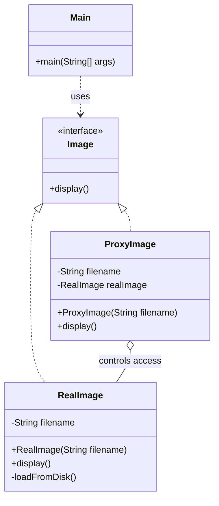

# Proxy Pattern

## Question

You have a `HeavyReportGenerator` that loads 500MB of data on construction and takes 3 seconds to initialize. Most users open the app but never actually run a report. Also, some users should not be allowed to run reports at all. How do you handle both problems without modifying `HeavyReportGenerator`?

Try it before reading on.

---

## Pattern Mindmap

```
[Proxy Pattern]
├── Problem It Solves
│   ├── HeavyReportGenerator: 500MB + 3 seconds to initialize
│   ├── Most users never run a report — eager init wastes resources
│   └── Some users must be blocked — access control before real call
├── Core Structure
│   ├── Subject interface: ReportGenerator with generateReport()
│   ├── Real subject: HeavyReportGenerator (expensive)
│   ├── Proxy: implements same interface, holds/creates real subject
│   └── Client: calls proxy — cannot tell if it is talking to proxy or real
├── Proxy Types
│   ├── Virtual Proxy: lazy init — create real object only on first use
│   ├── Protection Proxy: check permissions before delegating
│   ├── Caching Proxy: return cached result if available
│   ├── Remote Proxy: represent object in another address space (RMI, gRPC stub)
│   └── Logging Proxy: record calls for audit/debugging
├── LazyReportProxy
│   ├── generator field starts null
│   ├── On first generateReport(): check generator == null, create and assign
│   └── Subsequent calls: delegate immediately (no re-init)
├── SecureReportProxy
│   ├── Check user role before delegating
│   ├── Throw UnauthorizedException if no permission
│   └── Real generator only created if access is granted
├── Analogy
│   ├── Celebrity manager: all requests go through manager (proxy)
│   └── Manager decides what to forward, what to block, what to log
├── Real-World Usage
│   ├── Hibernate lazy loading: @OneToMany collection is a proxy — loaded on access
│   ├── Spring AOP: transaction and security proxies wrap beans
│   └── Java dynamic proxy: Proxy.newProxyInstance() for generic interception
├── Proxy vs Decorator vs Adapter
│   ├── Proxy: same interface, controls access to real object
│   ├── Decorator: same interface, adds behavior, client knows it's decorated
│   └── Adapter: different interface, translates between incompatible APIs
└── Interview Angles
    ├── How does Hibernate use Virtual Proxy for lazy loading?
    ├── Difference between Proxy and Decorator?
    └── What is a dynamic proxy and how does Spring use it?
```

## Problem Without the Pattern

Eager initialization wastes resources:
```java
class ReportService {
    private HeavyReportGenerator generator;

    public ReportService() {
        generator = new HeavyReportGenerator(); // 3 seconds, 500MB — on every startup
    }

    public void generateReport(User user) {
        generator.generate();
    }
}
```

Access control added inline violates SRP:
```java
public void generateReport(User user) {
    if (!user.hasRole("ADMIN")) throw new SecurityException("Denied");
    generator.generate();  // now ReportService mixes generation + authorization
}
```

**What breaks**:
1. **Eager load cost**: Every user pays the 3-second init cost even if they never use the feature.
2. **SRP violation**: `ReportService` now knows authorization rules. Every new rule requires editing `ReportService`.
3. **Cannot unit-test generator logic without auth logic activating**, and vice versa.

---

## Derive the Minimal Fix

The constraint: **intercept the call before it reaches the real object — without the caller knowing**.

Step 1 — define the interface both the real object and proxy implement:
```java
interface ReportGenerator {
    void generate();
}
```

Step 2a — **Virtual Proxy** (lazy init): defer construction until first use:
```java
class LazyReportProxy implements ReportGenerator {
    private HeavyReportGenerator real;

    public void generate() {
        if (real == null) real = new HeavyReportGenerator(); // init on first call only
        real.generate();
    }
}
```

Step 2b — **Protection Proxy** (access control): check permissions before delegating:
```java
class SecureReportProxy implements ReportGenerator {
    private HeavyReportGenerator real = new HeavyReportGenerator();
    private User currentUser;

    public SecureReportProxy(User user) { this.currentUser = user; }

    public void generate() {
        if (!currentUser.hasRole("ADMIN")) throw new SecurityException("Denied");
        real.generate();
    }
}
```

Step 3 — the client holds `ReportGenerator` (the interface), never the concrete class:
```java
ReportGenerator generator = new LazyReportProxy();
generator.generate(); // real object created here, not at startup
```

`HeavyReportGenerator` is never modified. The proxy is transparent to the caller.

---

> **Type**: Structural
> **Purpose**: Provides a placeholder or surrogate for another object to control access to it — adding lazy loading, access control, logging, or caching without modifying the real object.

> **Analogy**: A celebrity's manager. All requests to the celebrity go through the manager (proxy). The manager screens calls, logs who contacted them, enforces access control ("no interviews before 10am"), and can cache responses ("same answer as last time — here's the press release"). The celebrity's work is unchanged; the manager controls the interface.

---

## The Core Idea

The Proxy sits between the client and the real object. It implements the same interface as the real object, so the client doesn't know it's talking to a proxy. The proxy decides: when to load the real object, whether to allow the call, what to log, and whether to cache the result.

**Three roles:**
- **Subject (interface)**: Common interface for Proxy and RealObject
- **RealSubject**: The actual object doing the real work
- **Proxy**: Controls access to RealSubject

---

## Problem Statement

Loading a high-res image from disk is expensive (1-2 seconds). We want the object to exist cheaply, but defer the expensive disk load until `display()` is actually called. On repeated calls, we want to reuse the already-loaded image.

---

## Implementation: Virtual Proxy (Lazy Loading)

```java
// Interface — Proxy and RealImage both implement this
interface Image {
    void display();
}

// Real Object — expensive to create
class RealImage implements Image {
    private String filename;
    
    public RealImage(String filename) {
        this.filename = filename;
        loadFromDisk();  // Expensive operation runs at construction
    }
    
    private void loadFromDisk() {
        System.out.println("Loading " + filename + " from disk... (Heavy IO)");
        try {
            Thread.sleep(1000);  // Simulates disk latency
        } catch (InterruptedException e) {
            e.printStackTrace();
        }
    }
    
    @Override
    public void display() {
        System.out.println("Displaying " + filename);
    }
}

// Proxy — lightweight, defers loading until needed
class ProxyImage implements Image {
    private String filename;
    private RealImage realImage;  // Null until actually needed
    
    public ProxyImage(String filename) {
        this.filename = filename;
        // No disk IO here — cheap to create
    }
    
    @Override
    public void display() {
        if (realImage == null) {
            realImage = new RealImage(filename);  // Load on first access
        }
        realImage.display();  // Second call: reuses cached RealImage
    }
}

// Client
public class Main {
    public static void main(String[] args) {
        Image img = new ProxyImage("photo_4k.jpg");
        System.out.println("Image object created (no disk IO yet)");
        
        img.display();  // First call: loads from disk, then displays
        img.display();  // Second call: reuses cached object — no disk IO
    }
}

// Output:
// Image object created (no disk IO yet)
// Loading photo_4k.jpg from disk... (Heavy IO)
// Displaying photo_4k.jpg
// Displaying photo_4k.jpg
```

### Class Diagram



---

## Protection Proxy: Access Control

```java
interface DocumentService {
    void readDocument(String docId);
    void deleteDocument(String docId);
}

class RealDocumentService implements DocumentService {
    public void readDocument(String docId) {
        System.out.println("Reading document: " + docId);
    }
    
    public void deleteDocument(String docId) {
        System.out.println("Deleting document: " + docId);
    }
}

// Proxy that enforces role-based access
class SecureDocumentProxy implements DocumentService {
    private RealDocumentService realService = new RealDocumentService();
    private String userRole;
    
    public SecureDocumentProxy(String userRole) {
        this.userRole = userRole;
    }
    
    @Override
    public void readDocument(String docId) {
        // Everyone can read
        System.out.println("[LOG] " + userRole + " reading " + docId);
        realService.readDocument(docId);
    }
    
    @Override
    public void deleteDocument(String docId) {
        // Only admins can delete
        if (!userRole.equals("ADMIN")) {
            throw new SecurityException("Only admins can delete documents");
        }
        System.out.println("[LOG] ADMIN deleting " + docId);
        realService.deleteDocument(docId);
    }
}

// Usage
DocumentService adminProxy = new SecureDocumentProxy("ADMIN");
adminProxy.deleteDocument("doc-001");  // Allowed

DocumentService userProxy = new SecureDocumentProxy("USER");
userProxy.readDocument("doc-001");     // Allowed
userProxy.deleteDocument("doc-001");   // SecurityException thrown
```

---

## Caching Proxy

```java
interface WeatherService {
    String getWeather(String city);
}

class RealWeatherService implements WeatherService {
    public String getWeather(String city) {
        System.out.println("Fetching weather from API for: " + city);
        // Expensive API call
        return "Sunny, 25C";
    }
}

class CachingWeatherProxy implements WeatherService {
    private RealWeatherService realService = new RealWeatherService();
    private Map<String, String> cache = new HashMap<>();
    
    @Override
    public String getWeather(String city) {
        if (cache.containsKey(city)) {
            System.out.println("[CACHE HIT] " + city);
            return cache.get(city);
        }
        String result = realService.getWeather(city);
        cache.put(city, result);
        return result;
    }
}
```

---

## Proxy Variations

| Type | What it Controls | Real-World Example |
|---|---|---|
| Virtual Proxy | When to load the real object (lazy init) | Thumbnail before full image loads |
| Protection Proxy | Who can access the real object | Admin-only API endpoints |
| Remote Proxy | Where the real object lives (local rep of remote) | gRPC stub, RMI proxy |
| Caching Proxy | Whether to call real object or return cached result | API response cache |
| Logging Proxy | Records all calls before/after delegating | Audit trails, debugging |

---

## When to Use in Interviews

- When designing an API gateway: "The gateway is a Proxy — it adds auth, rate limiting, and logging before forwarding to the real service."
- When discussing lazy loading (e.g., ORM): "Hibernate uses Virtual Proxies for lazy-loaded relations — the `Address` field on `User` is a proxy until you actually call `getAddress()`."
- When building a caching layer: "I'd add a Caching Proxy in front of the DB service. Same interface, but it intercepts calls and returns cached results when available."

---

## Common Violations

| Violation | Symptom | Fix |
|---|---|---|
| Proxy adds unrelated behavior | Proxy transforms data, not just controls access | Keep proxy concerns to access control / logging / caching |
| Proxy vs Decorator confusion | Using Proxy to add behavior instead of control access | Use Decorator to add behavior; Proxy to control access |
| No interface | Client holds `RealImage` directly — can't swap in Proxy | Always program to interface so Proxy can be swapped in |

---

## Proxy vs Decorator

| | Proxy | Decorator |
|---|---|---|
| Purpose | Control access to real object | Add behavior to object |
| Knows RealObject? | Usually creates it internally | Receives it from outside |
| Same interface? | Yes | Yes |
| Intent | Access control, lazy load, cache | Enrich functionality |

---

## Interview Tips

**Q: "Proxy vs Decorator?"**
- "Both wrap an object and implement the same interface. But Proxy controls access — it decides IF and WHEN to forward a call. Decorator adds behavior — it always forwards and adds something before/after. A security proxy might block the call; a decorator never does."

**Q: "Give a real-world Proxy example"**
- "Hibernate's lazy loading. When you load a `User`, the `orders` field isn't fetched from DB immediately — it's a Proxy. The first time you call `user.getOrders()`, the proxy fetches the real data. This saves DB calls when you don't need the related data."
