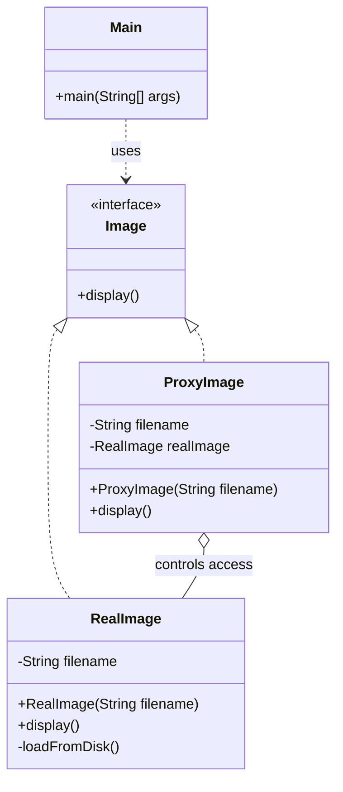

# Proxy Pattern

## Question

You have a `HeavyReportGenerator` that loads 500MB of data on construction and takes 3 seconds to initialize. Most users open the app but never actually run a report. Also, some users should not be allowed to run reports at all. How do you handle both problems without modifying `HeavyReportGenerator`?

Try it before reading on.

---

## Pattern Mindmap

```
[Proxy Pattern]
├── Problem It Solves
│   ├── HeavyReportGenerator: 500MB + 3 seconds to initialize
│   ├── Most users never run a report — eager init wastes resources
│   └── Some users must be blocked — access control before real call
├── Core Structure
│   ├── Subject interface: ReportGenerator with generateReport()
│   ├── Real subject: HeavyReportGenerator (expensive)
│   ├── Proxy: implements same interface, holds/creates real subject
│   └── Client: calls proxy — cannot tell if it is talking to proxy or real
├── Proxy Types
│   ├── Virtual Proxy: lazy init — create real object only on first use
│   ├── Protection Proxy: check permissions before delegating
│   ├── Caching Proxy: return cached result if available
│   ├── Remote Proxy: represent object in another address space (RMI, gRPC stub)
│   └── Logging Proxy: record calls for audit/debugging
├── LazyReportProxy
│   ├── generator field starts None
│   ├── On first generateReport(): check generator is None, create and assign
│   └── Subsequent calls: delegate immediately (no re-init)
├── SecureReportProxy
│   ├── Check user role before delegating
│   ├── Throw UnauthorizedException if no permission
│   └── Real generator only created if access is granted
├── Analogy
│   ├── Celebrity manager: all requests go through manager (proxy)
│   └── Manager decides what to forward, what to block, what to log
├── Real-World Usage
│   ├── Hibernate lazy loading: @OneToMany collection is a proxy — loaded on access
│   ├── Spring AOP: transaction and security proxies wrap beans
│   └── Java dynamic proxy: Proxy.newProxyInstance() for generic interception
├── Proxy vs Decorator vs Adapter
│   ├── Proxy: same interface, controls access to real object
│   ├── Decorator: same interface, adds behavior, client knows it's decorated
│   └── Adapter: different interface, translates between incompatible APIs
└── Interview Angles
    ├── How does Hibernate use Virtual Proxy for lazy loading?
    ├── Difference between Proxy and Decorator?
    └── What is a dynamic proxy and how does Spring use it?
```

## Problem Without the Pattern

Eager initialization wastes resources:
```python
class ReportService:
    def __init__(self):
        self._generator = HeavyReportGenerator()  # 3 seconds, 500MB — on every startup

    def generate_report(self, user):
        self._generator.generate()
```

Access control added inline violates SRP:
```python
def generate_report(self, user):
    if not user.has_role("ADMIN"):
        raise SecurityError("Denied")
    self._generator.generate()  # now ReportService mixes generation + authorization
```

**What breaks**:
1. **Eager load cost**: Every user pays the 3-second init cost even if they never use the feature.
2. **SRP violation**: `ReportService` now knows authorization rules. Every new rule requires editing `ReportService`.
3. **Cannot unit-test generator logic without auth logic activating**, and vice versa.

---

## Derive the Minimal Fix

The constraint: **intercept the call before it reaches the real object — without the caller knowing**.

Step 1 — define the interface both the real object and proxy implement:
```python
from abc import ABC, abstractmethod

class ReportGenerator(ABC):
    @abstractmethod
    def generate(self):
        pass
```

Step 2a — **Virtual Proxy** (lazy init): defer construction until first use:
```python
class LazyReportProxy(ReportGenerator):
    def __init__(self):
        self._real = None

    def generate(self):
        if self._real is None:
            self._real = HeavyReportGenerator()  # init on first call only
        self._real.generate()
```

Step 2b — **Protection Proxy** (access control): check permissions before delegating:
```python
class SecureReportProxy(ReportGenerator):
    def __init__(self, user):
        self._real = HeavyReportGenerator()
        self._current_user = user

    def generate(self):
        if not self._current_user.has_role("ADMIN"):
            raise SecurityError("Denied")
        self._real.generate()
```

Step 3 — the client holds `ReportGenerator` (the interface), never the concrete class:
```python
generator = LazyReportProxy()
generator.generate()  # real object created here, not at startup
```

`HeavyReportGenerator` is never modified. The proxy is transparent to the caller.

---

> **Type**: Structural
> **Purpose**: Provides a placeholder or surrogate for another object to control access to it — adding lazy loading, access control, logging, or caching without modifying the real object.

> **Analogy**: A celebrity's manager. All requests to the celebrity go through the manager (proxy). The manager screens calls, logs who contacted them, enforces access control ("no interviews before 10am"), and can cache responses ("same answer as last time — here's the press release"). The celebrity's work is unchanged; the manager controls the interface.

---

## The Core Idea

The Proxy sits between the client and the real object. It implements the same interface as the real object, so the client doesn't know it's talking to a proxy. The proxy decides: when to load the real object, whether to allow the call, what to log, and whether to cache the result.

**Three roles:**
- **Subject (interface)**: Common interface for Proxy and RealObject
- **RealSubject**: The actual object doing the real work
- **Proxy**: Controls access to RealSubject

---

## Problem Statement

Loading a high-res image from disk is expensive (1-2 seconds). We want the object to exist cheaply, but defer the expensive disk load until `display()` is actually called. On repeated calls, we want to reuse the already-loaded image.

---

## Implementation: Virtual Proxy (Lazy Loading)

```python
import time
from abc import ABC, abstractmethod

# Interface — Proxy and RealImage both implement this
class Image(ABC):
    @abstractmethod
    def display(self):
        pass

# Real Object — expensive to create
class RealImage(Image):
    def __init__(self, filename: str):
        self._filename = filename
        self._load_from_disk()  # Expensive operation runs at construction

    def _load_from_disk(self):
        print(f"Loading {self._filename} from disk... (Heavy IO)")
        time.sleep(1)  # Simulates disk latency

    def display(self):
        print(f"Displaying {self._filename}")

# Proxy — lightweight, defers loading until needed
class ProxyImage(Image):
    def __init__(self, filename: str):
        self._filename = filename
        self._real_image = None  # None until actually needed
        # No disk IO here — cheap to create

    def display(self):
        if self._real_image is None:
            self._real_image = RealImage(self._filename)  # Load on first access
        self._real_image.display()  # Second call: reuses cached RealImage

# Client
if __name__ == "__main__":
    img = ProxyImage("photo_4k.jpg")
    print("Image object created (no disk IO yet)")

    img.display()  # First call: loads from disk, then displays
    img.display()  # Second call: reuses cached object — no disk IO

# Output:
# Image object created (no disk IO yet)
# Loading photo_4k.jpg from disk... (Heavy IO)
# Displaying photo_4k.jpg
# Displaying photo_4k.jpg
```

### Class Diagram



---

## Protection Proxy: Access Control

```python
from abc import ABC, abstractmethod

class DocumentService(ABC):
    @abstractmethod
    def read_document(self, doc_id: str):
        pass

    @abstractmethod
    def delete_document(self, doc_id: str):
        pass

class RealDocumentService(DocumentService):
    def read_document(self, doc_id: str):
        print(f"Reading document: {doc_id}")

    def delete_document(self, doc_id: str):
        print(f"Deleting document: {doc_id}")

# Proxy that enforces role-based access
class SecureDocumentProxy(DocumentService):
    def __init__(self, user_role: str):
        self._real_service = RealDocumentService()
        self._user_role = user_role

    def read_document(self, doc_id: str):
        # Everyone can read
        print(f"[LOG] {self._user_role} reading {doc_id}")
        self._real_service.read_document(doc_id)

    def delete_document(self, doc_id: str):
        # Only admins can delete
        if self._user_role != "ADMIN":
            raise SecurityError("Only admins can delete documents")
        print(f"[LOG] ADMIN deleting {doc_id}")
        self._real_service.delete_document(doc_id)

# Usage
admin_proxy = SecureDocumentProxy("ADMIN")
admin_proxy.delete_document("doc-001")  # Allowed

user_proxy = SecureDocumentProxy("USER")
user_proxy.read_document("doc-001")    # Allowed
user_proxy.delete_document("doc-001")  # SecurityError raised
```

---

## Caching Proxy

```python
from abc import ABC, abstractmethod

class WeatherService(ABC):
    @abstractmethod
    def get_weather(self, city: str) -> str:
        pass

class RealWeatherService(WeatherService):
    def get_weather(self, city: str) -> str:
        print(f"Fetching weather from API for: {city}")
        # Expensive API call
        return "Sunny, 25C"

class CachingWeatherProxy(WeatherService):
    def __init__(self):
        self._real_service = RealWeatherService()
        self._cache: dict[str, str] = {}

    def get_weather(self, city: str) -> str:
        if city in self._cache:
            print(f"[CACHE HIT] {city}")
            return self._cache[city]
        result = self._real_service.get_weather(city)
        self._cache[city] = result
        return result
```

---

## Proxy Variations

| Type | What it Controls | Real-World Example |
|---|---|---|
| Virtual Proxy | When to load the real object (lazy init) | Thumbnail before full image loads |
| Protection Proxy | Who can access the real object | Admin-only API endpoints |
| Remote Proxy | Where the real object lives (local rep of remote) | gRPC stub, RMI proxy |
| Caching Proxy | Whether to call real object or return cached result | API response cache |
| Logging Proxy | Records all calls before/after delegating | Audit trails, debugging |

---

## When to Use in Interviews

- When designing an API gateway: "The gateway is a Proxy — it adds auth, rate limiting, and logging before forwarding to the real service."
- When discussing lazy loading (e.g., ORM): "Hibernate uses Virtual Proxies for lazy-loaded relations — the `Address` field on `User` is a proxy until you actually call `get_address()`."
- When building a caching layer: "I'd add a Caching Proxy in front of the DB service. Same interface, but it intercepts calls and returns cached results when available."

---

## Common Violations

| Violation | Symptom | Fix |
|---|---|---|
| Proxy adds unrelated behavior | Proxy transforms data, not just controls access | Keep proxy concerns to access control / logging / caching |
| Proxy vs Decorator confusion | Using Proxy to add behavior instead of control access | Use Decorator to add behavior; Proxy to control access |
| No interface | Client holds `RealImage` directly — can't swap in Proxy | Always program to interface so Proxy can be swapped in |

---

## Proxy vs Decorator

| | Proxy | Decorator |
|---|---|---|
| Purpose | Control access to real object | Add behavior to object |
| Knows RealObject? | Usually creates it internally | Receives it from outside |
| Same interface? | Yes | Yes |
| Intent | Access control, lazy load, cache | Enrich functionality |

---

## Interview Tips

**Q: "Proxy vs Decorator?"**
- "Both wrap an object and implement the same interface. But Proxy controls access — it decides IF and WHEN to forward a call. Decorator adds behavior — it always forwards and adds something before/after. A security proxy might block the call; a decorator never does."

**Q: "Give a real-world Proxy example"**
- "Hibernate's lazy loading. When you load a `User`, the `orders` field isn't fetched from DB immediately — it's a Proxy. The first time you call `user.get_orders()`, the proxy fetches the real data. This saves DB calls when you don't need the related data."
