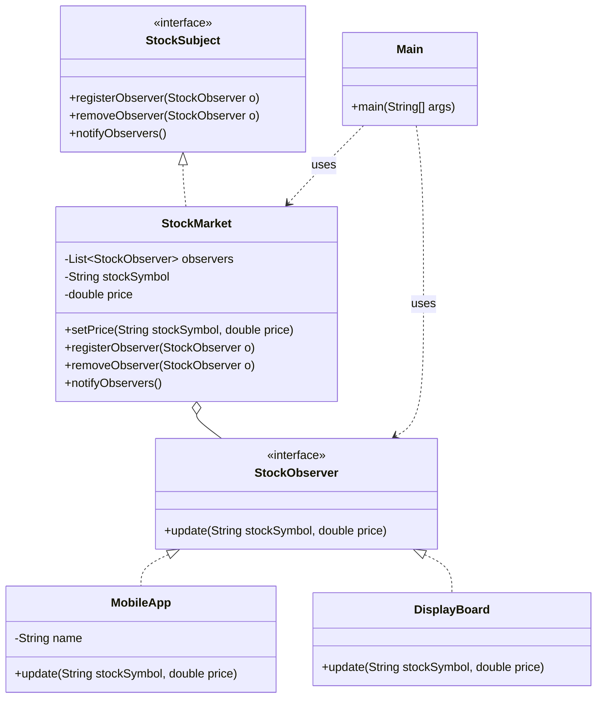

# Observer Pattern

## Question

A `StockMarket` class holds the current price of a stock. A `PriceAlert`, a `Chart`, and a `NewsFeed` all need to update when the stock price changes. Write the code inside `StockMarket.setPrice()` that tells all three components about the change.

Try it before reading on.

---

## Pattern Mindmap

```
[Observer Pattern]
├── Problem It Solves
│   ├── StockMarket.setPrice() hardcoded to call PriceAlert, Chart, NewsFeed
│   ├── Adding/removing a listener requires modifying StockMarket
│   └── StockMarket should not know about its observers
├── Core Structure
│   ├── Subject (Observable): StockMarket maintains List<Observer>
│   │   ├── subscribe(Observer o), unsubscribe(Observer o)
│   │   └── notifyObservers() iterates and calls each o.update()
│   ├── Observer interface: update(price) or update(Event)
│   └── Concrete observers: PriceAlert, Chart, NewsFeed implement Observer
├── Push vs Pull Model
│   ├── Push: subject sends data in update(price) — observer gets what subject decides
│   ├── Pull: update() passes subject reference; observer calls subject.getPrice()
│   └── Pull: observer gets exactly what it needs; push: simpler but may send excess data
├── Analogy
│   ├── YouTube subscription: channel (subject) notifies subscribers (observers) on upload
│   └── Subscriber list is dynamic — subscribe/unsubscribe any time
├── Lapsed Listener (Memory Leak)
│   ├── Observer registered but never unsubscribed when widget is destroyed
│   ├── Subject holds strong reference → observer cannot be GC'd
│   └── Fix: unsubscribe in onDestroy/close; use WeakReference for listeners
├── When to Use
│   ├── One-to-many dependency: one state change, many components must react
│   ├── Decoupled event system (UI events, stock tickers, messaging)
│   └── Publisher/subscriber systems (event bus, message queue)
├── Trade-offs
│   ├── Unexpected cascading updates: one change → chain of reactions
│   ├── Delivery order is undefined (iterate order = registration order)
│   └── Memory leaks if unsubscribe is forgotten
└── Interview Angles
    ├── Push vs pull — what are the trade-offs?
    ├── How do you prevent the lapsed listener memory leak?
    └── How does Observer relate to event-driven architecture at scale?
```

## Problem Without the Pattern

The direct approach — `StockMarket` calls each component explicitly:

```python
class StockMarket:
    def __init__(self):
        self._price = 0.0
        self._alert = PriceAlert()
        self._chart = Chart()
        self._feed = NewsFeed()

    def set_price(self, price):
        self._price = price
        self._alert.on_price_changed(price)  # hardcoded dependency
        self._chart.on_price_changed(price)  # hardcoded dependency
        self._feed.on_price_changed(price)   # hardcoded dependency
```

**What breaks**:
1. **Tight coupling**: `StockMarket` must import and know about `PriceAlert`, `Chart`, and `NewsFeed`. It can't compile without them.
2. **OCP violation**: Adding a 4th subscriber (e.g., `MobileNotification`) means editing `StockMarket.setPrice()`.
3. **SRP violation**: `StockMarket` manages stock prices AND knows the notification routing table.
4. **Untestable**: You cannot test price changes without constructing all three dependent objects.

---

## Derive the Minimal Fix

The constraint: **`StockMarket` must not know who is listening**.

Step 1 — extract a common ABC all subscribers implement:
```python
from abc import ABC, abstractmethod

class Observer(ABC):
    @abstractmethod
    def on_price_changed(self, price): ...
```

Step 2 — `StockMarket` holds a list of `Observer`, never concrete types:
```python
class StockMarket:
    def __init__(self):
        self._observers = []  # list of Observer
        self._price = 0.0

    def add_observer(self, o):    self._observers.append(o)
    def remove_observer(self, o): self._observers.remove(o)
```

Step 3 — on state change, iterate the list:
```python
    def set_price(self, price):
        self._price = price
        for o in self._observers:
            o.on_price_changed(price)
```

Adding `MobileNotification` is now: implement `Observer`, call `market.addObserver(new MobileNotification())`. Zero edits to `StockMarket`. That is the pattern.

---

> **Category**: Behavioral Pattern
> **Purpose**: Define a one-to-many dependency so that when one object changes state, all its dependents are notified and updated automatically.

## Real-Life Analogy

**YouTube subscriptions.**

When a channel (Subject) uploads a new video, every subscriber (Observer) gets a notification automatically. The channel does not know who exactly is subscribed — it just fires the event. Subscribers can subscribe or unsubscribe at any time. The channel doesn't care.

- The **channel** is the Subject: it maintains a list of subscribers and calls `notify()` when new content is uploaded.
- The **subscriber** is the Observer: it implements `update()` which defines what happens when a notification arrives (show a bell icon, send an email, play a sound).

The channel and subscribers are **loosely coupled**: the channel only knows subscribers implement some notification interface. It has no idea whether they're a mobile app, a desktop app, or an email digest service.

---

## When to Use

- Event handling systems (UI listeners, webhook handlers).
- Pub-Sub scenarios (stock market, news feeds, IoT sensor updates).
- Keeping UI in sync with data models (MVC: Model changes → View updates).
- Any time one change in one object should trigger updates in many objects, without hardcoding those relationships.

---

## Implementation

### Example: Stock Market Ticker

```python
from abc import ABC, abstractmethod

# 1. Observer ABC
class StockObserver(ABC):
    @abstractmethod
    def update(self, stock_symbol, price): ...

# 2. Subject ABC
class StockSubject(ABC):
    @abstractmethod
    def register_observer(self, o): ...

    @abstractmethod
    def remove_observer(self, o): ...

    @abstractmethod
    def notify_observers(self): ...

class StockMarket(StockSubject):
    def __init__(self):
        self._observers = []  # list of StockObserver
        self._stock_symbol = ""
        self._price = 0.0

    def set_price(self, stock_symbol, price):
        self._stock_symbol = stock_symbol
        self._price = price
        self.notify_observers()  # state changed — notify ALL subscribers automatically

    def register_observer(self, o):
        self._observers.append(o)

    def remove_observer(self, o):
        self._observers.remove(o)

    def notify_observers(self):
        for observer in self._observers:
            observer.update(self._stock_symbol, self._price)

# 3. Concrete Observers — each decides what to do with the notification
class MobileApp(StockObserver):
    def __init__(self, name):
        self._name = name

    def update(self, stock_symbol, price):
        print(f"Mobile App ({self._name}): {stock_symbol} is now ${price}")

class DisplayBoard(StockObserver):
    def update(self, stock_symbol, price):
        print(f"Wall Display: {stock_symbol} -> {price}")

# Usage
nasdaq = StockMarket()

app1 = MobileApp("User A")
app2 = MobileApp("User B")
board = DisplayBoard()

# Subscribe
nasdaq.register_observer(app1)
nasdaq.register_observer(app2)
nasdaq.register_observer(board)

# State change — all three notified
print("--- Market Open ---")
nasdaq.set_price("AAPL", 150.00)

# User B unsubscribes — only app1 and board notified from now on
print("--- Market Update ---")
nasdaq.remove_observer(app2)
nasdaq.set_price("AAPL", 155.00)
```

### Class Diagram



---

## Output

```
--- Market Open ---
Mobile App (User A): AAPL is now $150.0
Mobile App (User B): AAPL is now $150.0
Wall Display: AAPL -> 150.0
--- Market Update ---
Mobile App (User A): AAPL is now $155.0
Wall Display: AAPL -> 155.0
```

---

## Push vs Pull Model

### Push Model (Used above)
Subject sends data directly to observer: `observer.update(data)`
- **Pros**: Observer gets the relevant data immediately. No extra call needed.
- **Cons**: Subject must know what data the observer needs. Creates coupling if different observers need different subsets of data.

### Pull Model
Subject notifies that *something changed*, observer pulls the data it needs: `observer.update()` → `subject.getData()`
- **Pros**: Flexible — each observer fetches only the fields it cares about.
- **Cons**: Two round trips (notify + get). Observer needs a reference to the subject.

---

## Real-World Examples

1. **React/Redux**: Store updates → connected components re-render.
3. **Kafka/RabbitMQ**: Producers publish events; consumers subscribe. Distributed Observer.
4. **YouTube**: Channel uploads → all subscribers notified.
5. **Git Hooks**: `post-commit` hook fires after every commit, notifying registered scripts.

---

## Python Built-in Support

Python has no `Observable` base class, but the same pattern is idiomatic with a mixin or a plain list of callables:

```python
from typing import Callable

class NewsAgency:
    def __init__(self):
        self._news = ""
        self._listeners = []  # list of callables: fn(old_value, new_value)

    def add_listener(self, fn):
        self._listeners.append(fn)

    def set_news(self, value):
        old = self._news
        self._news = value
        for fn in self._listeners:
            fn(old, value)  # (old_value, new_value)
```

---

## Pros & Cons

**Pros:**
- **Loose Coupling**: Subject only knows observers implement the observer interface — not their concrete types.
- **Dynamic Relationships**: Subscribe/unsubscribe at runtime. The channel list is mutable.
- **Open/Closed**: Add new observer types without touching the Subject at all.

**Cons:**
- **Memory Leaks**: "Lapsed Listener Problem" — if you register but never deregister, observers are never garbage collected. Common in Android and Swing.
- **Ordering**: Notification order among observers is typically undefined.
- **Cascade effects**: One notification can trigger updates that trigger more notifications. Hard to trace in complex systems.

---

## Interviewer Follow-Up Questions

- "What's the difference between Observer and a direct method call?" → Direct call: the subject knows exactly which objects to notify — tight coupling, can't add observers without modifying the subject. Observer: the subject only knows the `Observer` interface — it calls `notify()` on all registered observers without knowing their concrete types. Adding a new observer = implement the interface and register. Subject never changes. This is the Open-Closed Principle applied to event notification.
- "Observer vs Pub/Sub — how do they differ?" → Observer (in-process): subject holds direct references to observers; notification is synchronous (observer's `update()` is called directly). Pub/Sub (distributed): publisher and subscriber are decoupled via a message broker (Kafka, Redis Pub/Sub, SNS); they don't know about each other; delivery is async. Observer = synchronous, same process. Pub/Sub = asynchronous, potentially different services. Observer is a design pattern; Pub/Sub is an architectural pattern.
- "What happens if an observer throws an exception during notification?" → The default synchronous Observer: the exception propagates up through the subject's `notifyAll()` loop, potentially stopping notification to remaining observers. Fix: wrap each `observer.update()` in a try-catch, log the error, and continue with the next observer. Never let one bad observer break the notification chain. For async observers (background threads): exceptions are silently swallowed by default — log them explicitly in the observer thread's exception handler.
- "How do you implement thread-safe Observer registration and notification?" → Registration race: `observers.append(observer)` from two threads simultaneously can corrupt the list (in Python: GIL protects `list.append`, but not compound operations). Notification: iterating `observers` while another thread modifies it → `RuntimeError: list changed size`. Fix: copy the list before iterating — `for obs in list(self._observers): obs.update(event)`. Use `threading.RLock` around registration/deregistration. For high-throughput: use an immutable list and atomic swap on modification (copy-on-write).
