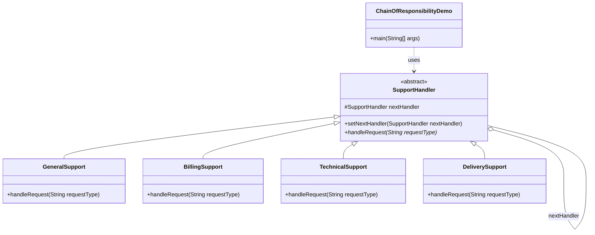

> [!NOTE]
> **📋 5-Minute Summary**
>
> **What this covers:** The Chain of Responsibility Pattern — passes requests along a chain of handlers. Upon receiving a request, each handler decides either to process it or to pass it to the next handler in the chain.
>
> **Key concepts:**
> - The problem: hardcoding the routing logic for requests (e.g., a massive `if-else` block for determining if an auth token, cache, or DB should handle a request).
> - The fix: create an abstract `Handler` class with a `setNext(Handler next)` method and a `handle(Request req)` method.
> - The chain: link the handlers together (`authHandler.setNext(cacheHandler).setNext(dbHandler)`).
> - Processing: the client sends the request to the *first* handler in the chain. If a handler can fully resolve it, it does; otherwise, it calls `next.handle(req)`.
> - Use cases: Middleware in web frameworks (Express, Spring), Logger levels (DEBUG -> INFO -> ERROR), Event bubbling in UI frameworks.
>
> **Key takeaway:** Use this pattern when you have multiple objects that can handle a request, and the specific handler shouldn't be known a priori by the sender.

---
module: 06-lld
topic: Design Patterns
subtopic: Behavioral
status: unread
tags: [06-lld, system-design, design-patterns]
---
# Chain of Responsibility

## Question

A customer support system has three tiers: a bot handles FAQs, a junior agent handles simple billing, and a senior agent handles escalations. Write `handleRequest(Request r)` that routes the request to the right tier.

Try it before reading on.

---

## Pattern Mindmap

```
[Chain of Responsibility Pattern]
├── Core Concept
│   ├── What → Pass a request along a chain of handlers; each decides to handle or forward
│   └── Why → Decouples sender from receiver; avoids if-else chains for routing logic
├── Key Components
│   ├── Handler interface → handleRequest(Request r); setNext(Handler h)
│   ├── Concrete Handlers → BotHandler, JuniorAgentHandler, SeniorAgentHandler
│   ├── Chain setup → bot.setNext(junior).setNext(senior)
│   └── Client → sends to chain head; doesn't know which handler responds
├── When to Use
│   ├── ✓ Request processing pipelines: auth → logging → rate-limit → business logic
│   ├── ✓ Multiple handlers can process a request (middleware stack)
│   └── ✓ Handler set changes at runtime or is configurable
├── When NOT to Use
│   ├── ✗ Exactly one handler always handles the request — use strategy instead
│   └── ✗ Chain is very long — debugging which handler ran becomes hard
├── Trade-offs
│   ├── Pro: Open/Closed — add new handler without modifying chain or client
│   └── Con: No guarantee of handling; request may fall off the end of chain
├── Real-World Examples
│   ├── Servlet Filters → doFilter() chain in Java EE / Spring
│   └── Express.js middleware → next() passes request to next handler
└── Interview Angles
    ├── vs Decorator → Decorator always wraps (adds behavior); CoR may stop propagation
    ├── vs Strategy → Strategy selects one algorithm; CoR lets each handler decide
    └── Code challenge: implement logging + auth + rate-limit middleware chain
```

---

## Problem Without the Pattern

```python
class SupportSystem:
    def handle_request(self, r):
        if r.type == FAQ:
            bot.answer(r)
        elif r.type == BILLING and r.complexity == LOW:
            junior_agent.handle(r)
        elif r.complexity == HIGH:
            senior_agent.handle(r)
        else:
            manager.escalate(r)
```

**What breaks**:
1. **OCP violation**: Adding a new tier (e.g., `TechSupport`) means editing `handle_request`.
2. **SRP violation**: `SupportSystem` must know the rules for every tier's decision boundary.
3. **Routing logic and handling logic are mixed**: The condition that decides *who* handles is inseparable from the code that *calls* the handler.
4. **Rigid order**: Reordering the chain requires rewriting conditions, not just reordering objects.

---

## Derive the Minimal Fix

The constraint: **each handler decides whether to handle or pass — the sender should not know the chain structure**.

Step 1 — extract a `Handler` interface with `handle(Request)` and a `next` link:
```python
from abc import ABC, abstractmethod

class SupportHandler(ABC):
    def __init__(self):
        self._next = None

    def set_next(self, next_handler):
        self._next = next_handler

    @abstractmethod
    def handle(self, r):
        pass

    def pass_to_next(self, r):
        if self._next is not None:
            self._next.handle(r)
        else:
            print(f"Unhandled: {r}")
```

Step 2 — each tier is its own class that handles what it can, passes the rest:
```python
class BotHandler(SupportHandler):
    def handle(self, r):
        if r.type == FAQ:
            print("Bot: answered FAQ")
        else:
            self.pass_to_next(r)

class JuniorAgentHandler(SupportHandler):
    def handle(self, r):
        if r.complexity == LOW:
            print("Junior: handled")
        else:
            self.pass_to_next(r)
```

Step 3 — wire the chain once at setup; the sender just calls the first link:
```python
bot = BotHandler()
junior = JuniorAgentHandler()
senior = SeniorAgentHandler()
bot.set_next(junior)
junior.set_next(senior)

bot.handle(incoming_request)  # request propagates automatically
```

Adding `TechSupport` is now: create `TechSupportHandler`, insert it into the chain at the right position. Zero edits to existing handlers.

---

> **Category**: Behavioral Pattern
> **Purpose**: Pass a request along a chain of handlers. Each handler decides to process the request or pass it to the next handler in the chain.

## Real-Life Analogy

**A customer support ticket escalation system.**

When you raise a support ticket, it goes to Level 1 (basic helpdesk). If L1 can't solve it, they escalate to Level 2 (technical support). If L2 can't solve it, they escalate to Level 3 (engineering). Each level handles what it can and passes the rest up.

Key properties:
- **L1 handles** routine questions (password reset, account info). They don't know L3 exists.
- **L2 handles** deeper technical issues. If solved, the chain stops. No need to bother L3.
- **L3 handles** anything that reaches them. If they can't handle it, the ticket is unresolved.
- **You (the sender) don't know** which level will ultimately handle it. You just submit the ticket.

This is Chain of Responsibility: the sender is decoupled from the receiver. The chain is configured at setup time. Handlers can be added, removed, or reordered without touching the client or other handlers.

---

## Formal Definition

The Chain of Responsibility Pattern transforms particular behaviors into standalone handler objects. It allows a request to be passed along a chain of handlers, where each handler decides whether to process the request or pass it to the next. This decouples the sender from the receivers.

**Key Components**:

| Component | Role | Example |
|---|---|---|
| **Handler** | Abstract class/interface defining `handleRequest()` and a reference to the next handler. | `SupportHandler` |
| **Concrete Handler** | Processes the request if it can, otherwise delegates to `nextHandler`. | `GeneralSupport`, `BillingSupport` |
| **Client** | Sends requests to the first handler in the chain. Unaware of which handler processes it. | `ChainOfResponsibilityDemo` |

---

## Understanding the Problem

Without Chain of Responsibility, all logic is crammed into a single method:

```python
class SupportService:
    def handle_request(self, request_type):
        if request_type == "general":
            print("Handled by General Support")
        elif request_type == "refund":
            print("Handled by Billing Team")
        elif request_type == "technical":
            print("Handled by Technical Support")
        elif request_type == "delivery":
            print("Handled by Delivery Team")
        else:
            print("No handler available")


# Main
if __name__ == "__main__":
    support_service = SupportService()
    support_service.handle_request("general")
    support_service.handle_request("refund")
    support_service.handle_request("technical")
    support_service.handle_request("delivery")
    support_service.handle_request("unknown")
```

| Issue | Description |
|---|---|
| **Violation of OCP** | Every time a new request type is added, `handle_request` must be modified. |
| **Monolithic Code** | All logic in one method. Hard to maintain, test, and extend. Each handler is tightly coupled with the others. |
| **Scalability** | Can't change the order of processing without modifying the core logic. Adding new handlers or reordering is cumbersome. |

---

## Solution: Chain of Responsibility

```python
from abc import ABC, abstractmethod


# Abstract base class defining the SupportHandler
class SupportHandler(ABC):
    def __init__(self):
        self._next_handler = None

    # Method to set the next handler in the chain
    def set_next_handler(self, next_handler):
        self._next_handler = next_handler

    # Abstract method to handle the request
    @abstractmethod
    def handle_request(self, request_type):
        pass


# Concrete Handler for General Support
class GeneralSupport(SupportHandler):
    def handle_request(self, request_type):
        if request_type.lower() == "general":
            print("GeneralSupport: Handling general query")
        elif self._next_handler is not None:
            self._next_handler.handle_request(request_type)


# Concrete Handler for Billing Support
class BillingSupport(SupportHandler):
    def handle_request(self, request_type):
        if request_type.lower() == "refund":
            print("BillingSupport: Handling refund request")
        elif self._next_handler is not None:
            self._next_handler.handle_request(request_type)


# Concrete Handler for Technical Support
class TechnicalSupport(SupportHandler):
    def handle_request(self, request_type):
        if request_type.lower() == "technical":
            print("TechnicalSupport: Handling technical issue")
        elif self._next_handler is not None:
            self._next_handler.handle_request(request_type)


# Concrete Handler for Delivery Support
class DeliverySupport(SupportHandler):
    def handle_request(self, request_type):
        if request_type.lower() == "delivery":
            print("DeliverySupport: Handling delivery issue")
        elif self._next_handler is not None:
            self._next_handler.handle_request(request_type)
        else:
            print("DeliverySupport: No handler found for request")


# Client Code
if __name__ == "__main__":
    general = GeneralSupport()
    billing = BillingSupport()
    technical = TechnicalSupport()
    delivery = DeliverySupport()

    # Setting up the chain: general -> billing -> technical -> delivery
    general.set_next_handler(billing)
    billing.set_next_handler(technical)
    technical.set_next_handler(delivery)

    # Testing the chain of responsibility with different request types
    general.handle_request("refund")    # Passes through General -> handled by Billing
    general.handle_request("delivery")  # Passes through General -> Billing -> Technical -> handled by Delivery
    general.handle_request("unknown")   # Reaches end of chain unhandled
```

### Class Diagram



---

## How Chain of Responsibility Fixes the Issues

| Issue | Solution |
|---|---|
| **Violation of OCP** | Add a new handler class without modifying existing code. Each handler is open for extension and closed for modification. |
| **Monolithic Code** | Logic is separated into individual handler classes, each responsible for one type of request. |
| **Scalability** | New handlers can be added without changing existing logic. Chain order can change by simply rearranging `set_next_handler()` calls. |

---

## When to Use

- Multiple objects can handle a request, but the specific handler is unknown beforehand.
- You want to decompose request senders from receivers.
- You need to dynamically change or reorder the chain at runtime.
- You want each handler to have a single, well-defined responsibility.

This pattern is valuable in: customer support routing, middleware pipelines (Spring filters, servlet filters), GUI event bubbling, logging (DEBUG → INFO → WARN → ERROR), and sign-up/validation pipelines.

---

## Pros & Cons

**Pros**
- Reduces coupling between sender and receiver — sender doesn't know which handler processes it.
- Easy to add or remove handlers without changing existing code.
- Follows Single Responsibility Principle and Open/Closed Principle.
- Dynamic control over handler execution sequence.

**Cons**
- Performance issues if the chain is very long — every handler is evaluated in sequence.
- Debugging is harder — the dynamic flow makes it difficult to trace exactly which handler processed a request.
- Risk of unhandled requests — if no handler matches, the request falls off the end of the chain.
- Order matters — incorrect chain setup can break the logic.

---

## Real-World Examples

1. **Sign-Up Validation Pipeline**: Validate email → check age → verify terms accepted → CAPTCHA check. Each check is a handler; fails at the first invalid step.
2. **Customer Support Ticket Routing**: General → Billing → Technical → Delivery as shown above.
3. **GUI Event Bubbling**: A mouse click on a button bubbles up: Button → Panel → Window → Application.
4. **Servlet Filters / Spring Security Filter Chain**: Each filter handles authentication, authorization, logging, etc. in sequence.
5. **Logging Frameworks**: Log4j uses levels as a chain — DEBUG passes through if level is set higher.

---

## Applied In

This concept is used by **4 problems** in this repo:

**Low-Level Design**

- [Design an ATM System](../../05-problems/02-frequent-problems/12-design-atm.md)
- [Design Notification System](../../05-problems/02-frequent-problems/16-design-notification-system.md)
- [Design Coupon System](../../05-problems/02-frequent-problems/17-design-coupon-system.md)
- [Design a Logger Library](../../05-problems/03-domain-specific/19-design-logger-library.md)

