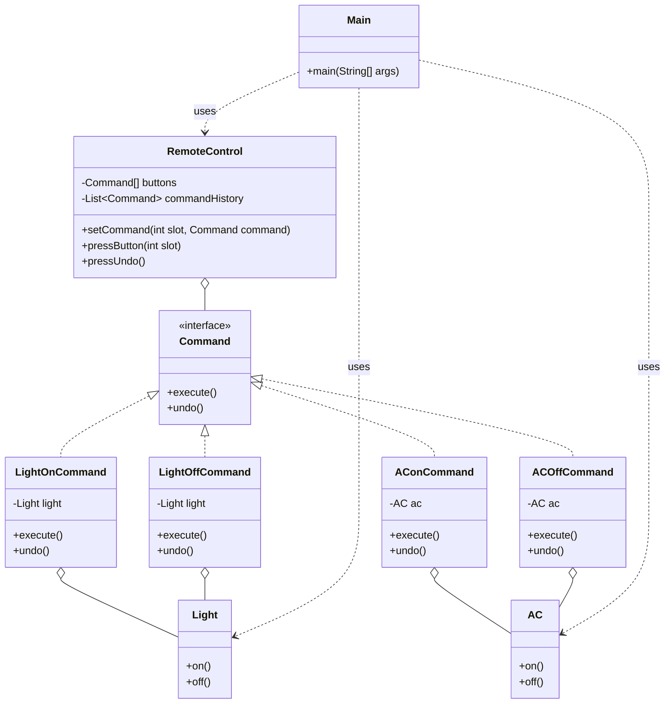

# Command Pattern

## Question

You are building a `RemoteControl` that can operate a `Light` (on/off) and a `Fan` (on/off). Write the `pressButton(String device, String action)` method. Now add undo. Now support macros (press one button to run a sequence of actions).

Try it before reading on.

---

## Pattern Mindmap

```
[Command Pattern]
├── Core Concept
│   ├── What → Encapsulate a request as an object with execute() and undo()
│   └── Why → Enables undo/redo, macro commands, request queuing, and logging
├── Key Components
│   ├── Command interface → execute(); undo()
│   ├── Concrete Commands → LightOnCommand, FanOffCommand (hold receiver + state)
│   ├── Receiver → Light, Fan — actual business logic lives here
│   ├── Invoker → RemoteControl — stores command, calls execute()
│   └── Command history stack → for undo/redo
├── When to Use
│   ├── ✓ Need undo/redo functionality (text editor, drawing app)
│   ├── ✓ Queue or schedule operations (job queue, task scheduler)
│   └── ✓ Macro commands: one button triggers a sequence of actions
├── When NOT to Use
│   ├── ✗ Simple one-time invocations with no need for undo or queuing
│   └── ✗ Only one type of command — direct method call is simpler
├── Trade-offs
│   ├── Pro: Decouples invoker from receiver; commands are first-class objects
│   └── Con: Class proliferation — one Command class per operation
├── Real-World Examples
│   ├── GUI toolbars → each button is a Command; undo stack holds history
│   └── Database transactions → each SQL operation wrapped as a Command with rollback
└── Interview Angles
    ├── Undo → store commands on a stack; call undo() in reverse order
    ├── Macro → MacroCommand holds List<Command>; execute() calls all in order
    └── Code challenge: implement text editor insert/delete with undo history
```

---

## Problem Without the Pattern

```java
class RemoteControl {
    private Light light;
    private Fan fan;
    private String lastAction;  // for undo

    public void pressButton(String device, String action) {
        if (device.equals("LIGHT") && action.equals("ON")) {
            light.turnOn();
            lastAction = "LIGHT_ON";
        } else if (device.equals("LIGHT") && action.equals("OFF")) {
            light.turnOff();
            lastAction = "LIGHT_OFF";
        } else if (device.equals("FAN") && action.equals("ON")) {
            fan.start();
            lastAction = "FAN_ON";
        }
        // adding AC requires editing this method
    }

    public void undo() {
        if (lastAction.equals("LIGHT_ON"))  light.turnOff();
        else if (lastAction.equals("LIGHT_OFF")) light.turnOn();
        else if (lastAction.equals("FAN_ON"))    fan.stop();
        // undo logic must mirror every branch above
    }
}
```

**What breaks**:
1. **OCP violation**: Adding a new device (`AirConditioner`) requires editing both `pressButton` and `undo`.
2. **Undo is a parallel copy**: The undo logic is a mirror of the execute logic — every addition doubles the maintenance cost.
3. **No macro support**: Executing a sequence requires a new list-of-strings parameter and yet more branches.
4. **Tight coupling**: `RemoteControl` must import `Light`, `Fan`, and every future device.

---

## Derive the Minimal Fix

The constraint: **encapsulate each action as an object so it can be stored, undone, and composed into sequences**.

Step 1 — extract an interface with `execute()` and `undo()`:
```java
interface Command {
    void execute();
    void undo();
}
```

Step 2 — each action is its own class:
```java
class LightOnCommand implements Command {
    private Light light;
    public LightOnCommand(Light l) { this.light = l; }
    public void execute() { light.turnOn(); }
    public void undo()    { light.turnOff(); }
}
```

Step 3 — `RemoteControl` holds a `Command` (and a stack for undo), never a concrete device:
```java
class RemoteControl {
    private Deque<Command> history = new ArrayDeque<>();

    public void pressButton(Command cmd) {
        cmd.execute();
        history.push(cmd);
    }

    public void undo() {
        if (!history.isEmpty()) history.pop().undo();
    }
}
```

Macro is now trivial: create a `MacroCommand(List<Command>)` that calls `execute()` on each. Adding `AirConditioner` is one new `Command` class — `RemoteControl` is untouched.

---

## Real-Life Analogy

**A restaurant order ticket.**

When a waiter takes your order, they write it on a ticket (a Command object) and pass it to the kitchen. The waiter doesn't cook the food. The kitchen doesn't need to know who ordered it. The ticket encapsulates: *what* was ordered, *who* is the receiver (kitchen), and *when* it was placed.

The key properties that map to the pattern:
- **Encapsulate the request**: The ticket contains all information needed to execute the action.
- **Decouple sender from receiver**: The waiter (Invoker) doesn't know how to cook. The kitchen (Receiver) doesn't know who to serve.
- **Support undo/cancel**: Before the kitchen starts cooking, the manager can cancel (undo) the ticket.
- **Queue**: If the kitchen is busy, tickets queue up and are executed in order.

Another analogy: A **TV remote's record button**. Pressing record encapsulates: action=record, receiver=TV, parameters=channel. Pressing it again (or a stop button) undoes recording.

---

## Formal Definition

The Command Pattern encapsulates a request as an object, allowing:
- Parameterization of clients with different requests.
- Queuing or logging of requests.
- Support for undoable operations.

It turns the request into a standalone object that contains all the context needed for execution.

## Four Key Components

| Component | Role | Example |
|---|---|---|
| **Command** | Interface with `execute()` and `undo()`. | `Command` interface |
| **Concrete Command** | Implements Command; knows the receiver and calls its methods. | `LightOnCommand` |
| **Receiver** | The object that actually does the work. | `Light`, `AC` |
| **Invoker** | Holds and triggers commands. Doesn't know what they do. | `RemoteControl` |

---

## Understanding the Problem

A naive remote control implementation:

```java
// Receiver classes - Light and AC with basic on/off methods
class Light {
    public void on() {
        System.out.println("Light turned ON");
    }
    
    public void off() {
        System.out.println("Light turned OFF");
    }
}

class AC {
    public void on() {
        System.out.println("AC turned ON");
    }
    
    public void off() {
        System.out.println("AC turned OFF");
    }
}

// Invoker - NaiveRemoteControl class to control devices
class NaiveRemoteControl {
    private Light light;
    private AC ac;
    private String lastAction;
    
    public NaiveRemoteControl(Light light, AC ac) {
        this.light = light;
        this.ac = ac;
        this.lastAction = "";
    }
    
    public void pressLightOn() {
        this.light.on();
        this.lastAction = "LIGHT_ON";
    }
    
    public void pressLightOff() {
        this.light.off();
        this.lastAction = "LIGHT_OFF";
    }
    
    public void pressACOn() {
        this.ac.on();
        this.lastAction = "AC_ON";
    }
    
    public void pressACOff() {
        this.ac.off();
        this.lastAction = "AC_OFF";
    }
    
    // Undo last action — tightly coupled, grows with every new device
    public void pressUndo() {
        if (this.lastAction.equals("LIGHT_ON")) {
            this.light.off();
            this.lastAction = "LIGHT_OFF";
        } else if (this.lastAction.equals("LIGHT_OFF")) {
            this.light.on();
            this.lastAction = "LIGHT_ON";
        } else if (this.lastAction.equals("AC_ON")) {
            this.ac.off();
            this.lastAction = "AC_OFF";
        } else if (this.lastAction.equals("AC_OFF")) {
            this.ac.on();
            this.lastAction = "AC_ON";
        } else {
            System.out.println("No action to undo.");
        }
    }
}

// Client Code
public class Main {
    public static void main(String[] args) {
        Light light = new Light();
        AC ac = new AC();
        NaiveRemoteControl remote = new NaiveRemoteControl(light, ac);
        
        remote.pressLightOn();
        remote.pressACOn();
        remote.pressLightOff();
        remote.pressUndo();  // Should undo LIGHT_OFF -> Light ON
        remote.pressUndo();  // Should undo AC_ON -> AC OFF
    }
}
```

**Issues with this code:**

| Issue | Description |
|---|---|
| **Tight Coupling** | `NaiveRemoteControl` directly calls `Light.on()`, `AC.on()`. Adding a new device requires modifying the remote class. |
| **Undo logic is fragile** | `pressUndo()` uses string comparisons and only tracks the last action. Multi-level undo is impossible. |
| **Hardcoded commands** | Each button is a method. Adding a new button = new method. Adding a new device = new if-else in undo. |
| **No history** | Only the last action is tracked. No way to replay or queue commands. |
| **Violates OCP** | Every change requires modifying the invoker class. |

---

## Solution: Command Pattern

```java
// ========= Receiver classes ===========
class Light {
    public void on() {
        System.out.println("Light turned ON");
    }
    
    public void off() {
        System.out.println("Light turned OFF");
    }
}

class AC {
    public void on() {
        System.out.println("AC turned ON");
    }
    
    public void off() {
        System.out.println("AC turned OFF");
    }
}

// ========= Command interface ===========
interface Command {
    void execute();
    void undo();
}

// Concrete commands — each knows its receiver and encapsulates one action
class LightOnCommand implements Command {
    private Light light;
    
    public LightOnCommand(Light light) {
        this.light = light;
    }
    
    @Override
    public void execute() {
        this.light.on();
    }
    
    @Override
    public void undo() {
        this.light.off();
    }
}

class LightOffCommand implements Command {
    private Light light;
    
    public LightOffCommand(Light light) {
        this.light = light;
    }
    
    @Override
    public void execute() {
        this.light.off();
    }
    
    @Override
    public void undo() {
        this.light.on();
    }
}

class AConCommand implements Command {
    private AC ac;
    
    public AConCommand(AC ac) {
        this.ac = ac;
    }
    
    @Override
    public void execute() {
        this.ac.on();
    }
    
    @Override
    public void undo() {
        this.ac.off();
    }
}

class ACOffCommand implements Command {
    private AC ac;
    
    public ACOffCommand(AC ac) {
        this.ac = ac;
    }
    
    @Override
    public void execute() {
        this.ac.off();
    }
    
    @Override
    public void undo() {
        this.ac.on();
    }
}

// ========== Remote control class (Invoker) ==========
// Knows nothing about Light or AC — only knows the Command interface
class RemoteControl {
    private Command[] buttons;
    private List<Command> commandHistory;
    
    public RemoteControl() {
        this.buttons = new Command[4];
        this.commandHistory = new ArrayList<>();
    }
    
    public void setCommand(int slot, Command command) {
        this.buttons[slot] = command;
    }
    
    public void pressButton(int slot) {
        if (this.buttons[slot] != null) {
            this.buttons[slot].execute();
            this.commandHistory.add(this.buttons[slot]);
        } else {
            System.out.println("No command assigned to slot " + slot);
        }
    }
    
    // Full history-based undo — works for any command, any device
    public void pressUndo() {
        if (!this.commandHistory.isEmpty()) {
            Command lastCommand = this.commandHistory.remove(this.commandHistory.size() - 1);
            lastCommand.undo();
        } else {
            System.out.println("No commands to undo.");
        }
    }
}

// ========= Client code ===========
public class Main {
    public static void main(String[] args) {
        Light light = new Light();
        AC ac = new AC();
        
        Command lightOn = new LightOnCommand(light);
        Command lightOff = new LightOffCommand(light);
        Command acOn = new AConCommand(ac);
        Command acOff = new ACOffCommand(ac);
        
        RemoteControl remote = new RemoteControl();
        remote.setCommand(0, lightOn);
        remote.setCommand(1, lightOff);
        remote.setCommand(2, acOn);
        remote.setCommand(3, acOff);
        
        remote.pressButton(0);  // Light ON
        remote.pressButton(2);  // AC ON
        remote.pressButton(1);  // Light OFF
        remote.pressUndo();     // Undo Light OFF -> Light ON
        remote.pressUndo();     // Undo AC ON -> AC OFF
    }
}
```

### Class Diagram



---

## How Command Pattern Resolves the Issues

| Issue | How Command Pattern Resolves It |
|---|---|
| **Tight Coupling** | `RemoteControl` only holds `Command[]`. It never imports or mentions `Light` or `AC`. Adding a new device requires creating one new Command class — no changes to the remote. |
| **Undo Functionality** | Each `Command` knows its own undo. The remote's `commandHistory` stack supports unlimited multi-level undo. |
| **Hardcoded Commands** | Commands are assigned to slots dynamically at runtime. Swap commands without recompiling the invoker. |
| **No Command History** | `commandHistory` list tracks all executed commands. Supports replay, undo, logging, and auditing. |
| **Violates OCP** | New device → new Command class. RemoteControl, Light, AC never change. |

---

## When to Use the Command Pattern

- **Undo/Redo support**: Text editors, drawing apps, transaction rollback.
- **Request queuing**: Job queues, task schedulers, message brokers.
- **Macro/batch operations**: "Night mode" that turns off lights, lowers thermostat, locks doors — one composite command.
- **Decouple UI from business logic**: Button click → Command → Service. The button doesn't know what the service does.
- **Transactional systems**: Database operations wrapped in commands that can be committed or rolled back.
- **Plug-in architectures**: New operations added as new command classes without modifying the host.

---

## Pros and Cons

**Pros**
- Decouples the Invoker from the Receiver completely.
- Supports undo/redo via command history stack.
- Commands are first-class objects — they can be queued, logged, serialized, or sent over the network.
- Easy to add new commands without breaking existing code (OCP).

**Cons**
- Increases the number of classes — every action becomes a class.
- Simple operations like "turn on the light" get wrapped in a class, which may feel over-engineered for small systems.
- Undo/redo logic requires careful thought for commands with side effects (e.g., network calls).
