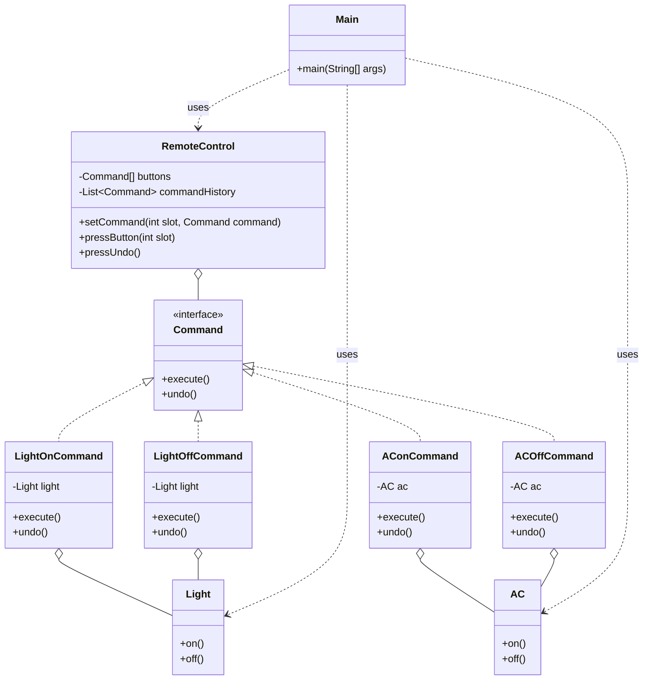

> [!NOTE]
> **📋 5-Minute Summary**
>
> **What this covers:** The Command Pattern — encapsulates a request as an object, allowing you to parameterize clients with different requests, queue or log requests, and support undoable operations.
>
> **Key concepts:**
> - The problem: tightly coupling a UI button to the business logic it triggers. Or, needing to implement "Undo/Redo" functionality.
> - The fix: create a `Command` interface with an `execute()` method.
> - Concrete Commands: `TurnOnLightCommand`, `TransferMoneyCommand`. These hold the parameters needed to execute the action and a reference to the receiver.
> - Invoker: the object calling the command (e.g., a Button). It just calls `command.execute()`.
> - Undo: add an `undo()` method to the interface. Maintain a `Stack<Command>` of executed commands. To undo, pop the stack and call `undo()`.
> - Async/Queuing: because the request is now an object, it can be serialized, saved to a database, or put on a queue (e.g., Kafka) to be executed later.
>
> **Key takeaway:** Command is the definitive answer to any LLD interview question involving "Undo/Redo" functionality (like a Text Editor) or job queuing.

---
module: 06-lld
topic: Design Patterns
subtopic: Behavioral
status: unread
tags: [06-lld, system-design, design-patterns]
---
# Command Pattern

## Question

You are building a `RemoteControl` that can operate a `Light` (on/off) and a `Fan` (on/off). Write the `pressButton(String device, String action)` method. Now add undo. Now support macros (press one button to run a sequence of actions).

Try it before reading on.

---

## Pattern Mindmap

```
[Command Pattern]
├── Core Concept
│   ├── What → Encapsulate a request as an object with execute() and undo()
│   └── Why → Enables undo/redo, macro commands, request queuing, and logging
├── Key Components
│   ├── Command interface → execute(); undo()
│   ├── Concrete Commands → LightOnCommand, FanOffCommand (hold receiver + state)
│   ├── Receiver → Light, Fan — actual business logic lives here
│   ├── Invoker → RemoteControl — stores command, calls execute()
│   └── Command history stack → for undo/redo
├── When to Use
│   ├── ✓ Need undo/redo functionality (text editor, drawing app)
│   ├── ✓ Queue or schedule operations (job queue, task scheduler)
│   └── ✓ Macro commands: one button triggers a sequence of actions
├── When NOT to Use
│   ├── ✗ Simple one-time invocations with no need for undo or queuing
│   └── ✗ Only one type of command — direct method call is simpler
├── Trade-offs
│   ├── Pro: Decouples invoker from receiver; commands are first-class objects
│   └── Con: Class proliferation — one Command class per operation
├── Real-World Examples
│   ├── GUI toolbars → each button is a Command; undo stack holds history
│   └── Database transactions → each SQL operation wrapped as a Command with rollback
└── Interview Angles
    ├── Undo → store commands on a stack; call undo() in reverse order
    ├── Macro → MacroCommand holds List<Command>; execute() calls all in order
    └── Code challenge: implement text editor insert/delete with undo history
```

---

## Problem Without the Pattern

```python
class RemoteControl:
    def __init__(self, light, fan):
        self._light = light
        self._fan = fan
        self._last_action = ""  # for undo

    def press_button(self, device, action):
        if device == "LIGHT" and action == "ON":
            self._light.turn_on()
            self._last_action = "LIGHT_ON"
        elif device == "LIGHT" and action == "OFF":
            self._light.turn_off()
            self._last_action = "LIGHT_OFF"
        elif device == "FAN" and action == "ON":
            self._fan.start()
            self._last_action = "FAN_ON"
        # adding AC requires editing this method

    def undo(self):
        if self._last_action == "LIGHT_ON":
            self._light.turn_off()
        elif self._last_action == "LIGHT_OFF":
            self._light.turn_on()
        elif self._last_action == "FAN_ON":
            self._fan.stop()
        # undo logic must mirror every branch above
```

**What breaks**:
1. **OCP violation**: Adding a new device (`AirConditioner`) requires editing both `press_button` and `undo`.
2. **Undo is a parallel copy**: The undo logic is a mirror of the execute logic — every addition doubles the maintenance cost.
3. **No macro support**: Executing a sequence requires a new list-of-strings parameter and yet more branches.
4. **Tight coupling**: `RemoteControl` must import `Light`, `Fan`, and every future device.

---

## Derive the Minimal Fix

The constraint: **encapsulate each action as an object so it can be stored, undone, and composed into sequences**.

Step 1 — extract an interface with `execute()` and `undo()`:
```python
from abc import ABC, abstractmethod

class Command(ABC):
    @abstractmethod
    def execute(self):
        pass

    @abstractmethod
    def undo(self):
        pass
```

Step 2 — each action is its own class:
```python
class LightOnCommand(Command):
    def __init__(self, light):
        self._light = light

    def execute(self):
        self._light.turn_on()

    def undo(self):
        self._light.turn_off()
```

Step 3 — `RemoteControl` holds a `Command` (and a stack for undo), never a concrete device:
```python
class RemoteControl:
    def __init__(self):
        self._history = []

    def press_button(self, cmd):
        cmd.execute()
        self._history.append(cmd)

    def undo(self):
        if self._history:
            self._history.pop().undo()
```

Macro is now trivial: create a `MacroCommand(list[Command])` that calls `execute()` on each. Adding `AirConditioner` is one new `Command` class — `RemoteControl` is untouched.

---

## Real-Life Analogy

**A restaurant order ticket.**

When a waiter takes your order, they write it on a ticket (a Command object) and pass it to the kitchen. The waiter doesn't cook the food. The kitchen doesn't need to know who ordered it. The ticket encapsulates: *what* was ordered, *who* is the receiver (kitchen), and *when* it was placed.

The key properties that map to the pattern:
- **Encapsulate the request**: The ticket contains all information needed to execute the action.
- **Decouple sender from receiver**: The waiter (Invoker) doesn't know how to cook. The kitchen (Receiver) doesn't know who to serve.
- **Support undo/cancel**: Before the kitchen starts cooking, the manager can cancel (undo) the ticket.
- **Queue**: If the kitchen is busy, tickets queue up and are executed in order.

Another analogy: A **TV remote's record button**. Pressing record encapsulates: action=record, receiver=TV, parameters=channel. Pressing it again (or a stop button) undoes recording.

---

## Formal Definition

The Command Pattern encapsulates a request as an object, allowing:
- Parameterization of clients with different requests.
- Queuing or logging of requests.
- Support for undoable operations.

It turns the request into a standalone object that contains all the context needed for execution.

## Four Key Components

| Component | Role | Example |
|---|---|---|
| **Command** | Interface with `execute()` and `undo()`. | `Command` interface |
| **Concrete Command** | Implements Command; knows the receiver and calls its methods. | `LightOnCommand` |
| **Receiver** | The object that actually does the work. | `Light`, `AC` |
| **Invoker** | Holds and triggers commands. Doesn't know what they do. | `RemoteControl` |

---

## Understanding the Problem

A naive remote control implementation:

```python
# Receiver classes - Light and AC with basic on/off methods
class Light:
    def on(self):
        print("Light turned ON")

    def off(self):
        print("Light turned OFF")


class AC:
    def on(self):
        print("AC turned ON")

    def off(self):
        print("AC turned OFF")


# Invoker - NaiveRemoteControl class to control devices
class NaiveRemoteControl:
    def __init__(self, light, ac):
        self._light = light
        self._ac = ac
        self._last_action = ""

    def press_light_on(self):
        self._light.on()
        self._last_action = "LIGHT_ON"

    def press_light_off(self):
        self._light.off()
        self._last_action = "LIGHT_OFF"

    def press_ac_on(self):
        self._ac.on()
        self._last_action = "AC_ON"

    def press_ac_off(self):
        self._ac.off()
        self._last_action = "AC_OFF"

    # Undo last action — tightly coupled, grows with every new device
    def press_undo(self):
        if self._last_action == "LIGHT_ON":
            self._light.off()
            self._last_action = "LIGHT_OFF"
        elif self._last_action == "LIGHT_OFF":
            self._light.on()
            self._last_action = "LIGHT_ON"
        elif self._last_action == "AC_ON":
            self._ac.off()
            self._last_action = "AC_OFF"
        elif self._last_action == "AC_OFF":
            self._ac.on()
            self._last_action = "AC_ON"
        else:
            print("No action to undo.")


# Client Code
if __name__ == "__main__":
    light = Light()
    ac = AC()
    remote = NaiveRemoteControl(light, ac)

    remote.press_light_on()
    remote.press_ac_on()
    remote.press_light_off()
    remote.press_undo()  # Should undo LIGHT_OFF -> Light ON
    remote.press_undo()  # Should undo AC_ON -> AC OFF
```

**Issues with this code:**

| Issue | Description |
|---|---|
| **Tight Coupling** | `NaiveRemoteControl` directly calls `Light.on()`, `AC.on()`. Adding a new device requires modifying the remote class. |
| **Undo logic is fragile** | `press_undo()` uses string comparisons and only tracks the last action. Multi-level undo is impossible. |
| **Hardcoded commands** | Each button is a method. Adding a new button = new method. Adding a new device = new if-else in undo. |
| **No history** | Only the last action is tracked. No way to replay or queue commands. |
| **Violates OCP** | Every change requires modifying the invoker class. |

---

## Solution: Command Pattern

```python
from abc import ABC, abstractmethod


# ========= Receiver classes ===========
class Light:
    def on(self):
        print("Light turned ON")

    def off(self):
        print("Light turned OFF")


class AC:
    def on(self):
        print("AC turned ON")

    def off(self):
        print("AC turned OFF")


# ========= Command interface ===========
class Command(ABC):
    @abstractmethod
    def execute(self):
        pass

    @abstractmethod
    def undo(self):
        pass


# Concrete commands — each knows its receiver and encapsulates one action
class LightOnCommand(Command):
    def __init__(self, light):
        self._light = light

    def execute(self):
        self._light.on()

    def undo(self):
        self._light.off()


class LightOffCommand(Command):
    def __init__(self, light):
        self._light = light

    def execute(self):
        self._light.off()

    def undo(self):
        self._light.on()


class AConCommand(Command):
    def __init__(self, ac):
        self._ac = ac

    def execute(self):
        self._ac.on()

    def undo(self):
        self._ac.off()


class ACOffCommand(Command):
    def __init__(self, ac):
        self._ac = ac

    def execute(self):
        self._ac.off()

    def undo(self):
        self._ac.on()


# ========== Remote control class (Invoker) ==========
# Knows nothing about Light or AC — only knows the Command interface
class RemoteControl:
    def __init__(self):
        self._buttons = [None] * 4
        self._command_history = []

    def set_command(self, slot, command):
        self._buttons[slot] = command

    def press_button(self, slot):
        if self._buttons[slot] is not None:
            self._buttons[slot].execute()
            self._command_history.append(self._buttons[slot])
        else:
            print(f"No command assigned to slot {slot}")

    # Full history-based undo — works for any command, any device
    def press_undo(self):
        if self._command_history:
            last_command = self._command_history.pop()
            last_command.undo()
        else:
            print("No commands to undo.")


# ========= Client code ===========
if __name__ == "__main__":
    light = Light()
    ac = AC()

    light_on = LightOnCommand(light)
    light_off = LightOffCommand(light)
    ac_on = AConCommand(ac)
    ac_off = ACOffCommand(ac)

    remote = RemoteControl()
    remote.set_command(0, light_on)
    remote.set_command(1, light_off)
    remote.set_command(2, ac_on)
    remote.set_command(3, ac_off)

    remote.press_button(0)  # Light ON
    remote.press_button(2)  # AC ON
    remote.press_button(1)  # Light OFF
    remote.press_undo()     # Undo Light OFF -> Light ON
    remote.press_undo()     # Undo AC ON -> AC OFF
```

### Class Diagram



---

## How Command Pattern Resolves the Issues

| Issue | How Command Pattern Resolves It |
|---|---|
| **Tight Coupling** | `RemoteControl` only holds `Command[]`. It never imports or mentions `Light` or `AC`. Adding a new device requires creating one new Command class — no changes to the remote. |
| **Undo Functionality** | Each `Command` knows its own undo. The remote's `command_history` stack supports unlimited multi-level undo. |
| **Hardcoded Commands** | Commands are assigned to slots dynamically at runtime. Swap commands without recompiling the invoker. |
| **No Command History** | `command_history` list tracks all executed commands. Supports replay, undo, logging, and auditing. |
| **Violates OCP** | New device → new Command class. RemoteControl, Light, AC never change. |

---

## When to Use the Command Pattern

- **Undo/Redo support**: Text editors, drawing apps, transaction rollback.
- **Request queuing**: Job queues, task schedulers, message brokers.
- **Macro/batch operations**: "Night mode" that turns off lights, lowers thermostat, locks doors — one composite command.
- **Decouple UI from business logic**: Button click → Command → Service. The button doesn't know what the service does.
- **Transactional systems**: Database operations wrapped in commands that can be committed or rolled back.
- **Plug-in architectures**: New operations added as new command classes without modifying the host.

---

## Pros and Cons

**Pros**
- Decouples the Invoker from the Receiver completely.
- Supports undo/redo via command history stack.
- Commands are first-class objects — they can be queued, logged, serialized, or sent over the network.
- Easy to add new commands without breaking existing code (OCP).

**Cons**
- Increases the number of classes — every action becomes a class.
- Simple operations like "turn on the light" get wrapped in a class, which may feel over-engineered for small systems.
- Undo/redo logic requires careful thought for commands with side effects (e.g., network calls).
