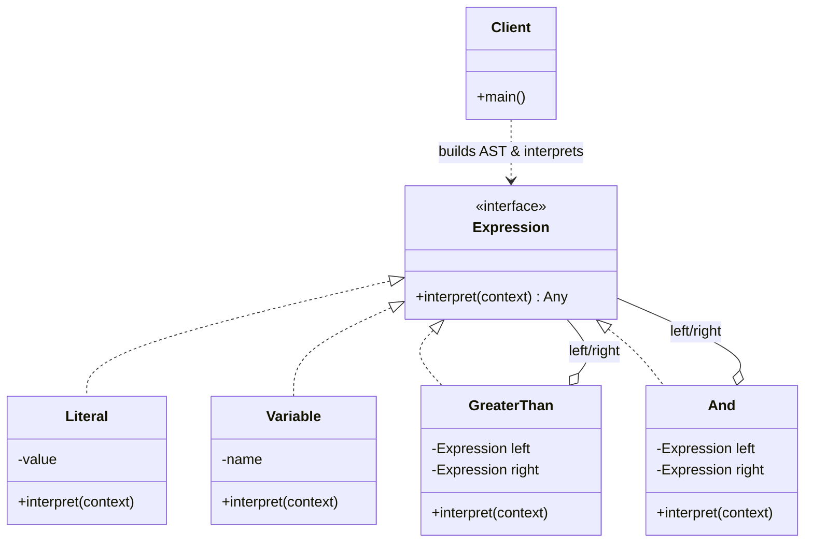

> [!NOTE]
> **📋 5-Minute Summary**
>
> **What this covers:** The Interpreter Pattern — defines a grammar for a simple language and an interpreter that evaluates sentences in that language, representing each grammar rule as a class.
>
> **Key concepts:**
> - The problem: you have a small domain language (arithmetic expressions, filter rules, boolean queries) and need to parse + evaluate it repeatedly.
> - The fix: model the grammar as a **class hierarchy of expressions**. Each rule = one class with an `interpret(context)` method.
> - **Terminal expressions** are the leaves (a number, a variable). **Non-terminal expressions** compose others (`Add`, `And`, `GreaterThan`).
> - The parsed sentence becomes an **Abstract Syntax Tree (AST)**; interpreting = recursively calling `interpret()` down the tree.
>
> **Key takeaway:** Interpreter is niche but shows up for rules engines, query/filter DSLs, calculators, and feature-flag conditions. For anything beyond a *simple, stable* grammar, use a real parser generator (ANTLR) instead — Interpreter doesn't scale to complex languages.

---
module: 06-lld
topic: Design Patterns
subtopic: Behavioral
status: unread
tags: [06-lld, system-design, design-patterns]
---
# Interpreter Pattern

> 🔵 **Java idiom:** An `Expression` interface with `interpret(Context)`, implemented by terminal expressions (literals/variables) and non-terminal expressions (`AndExpression`, `OrExpression`) that compose sub-expressions into an AST. **JDK equivalent:** `java.util.regex.Pattern` interprets a regex grammar; `java.text.Format`. **Interview gotcha:** this is the *least* used GoF pattern and only fits small, stable grammars (rule engines, simple DSLs, boolean filters) — for anything real you reach for a parser generator (ANTLR) instead, so say that. It pairs with Composite (the AST *is* a composite tree) and the Visitor pattern (to add operations over the tree without touching node classes).

## Question

You are building a rules engine. Users define conditions like `age > 18 AND country == "US"` in a small text DSL, and your system must evaluate each rule against many records. Design a way to represent and evaluate these expressions.

Try it before reading on.

---

## Pattern Mindmap

```
[Interpreter Pattern]
├── Problem It Solves
│   ├── A recurring small language (arithmetic, boolean filters, query DSL)
│   ├── Naive fix: one giant eval() with nested if/else per operator → unmaintainable
│   └── Need to evaluate the same grammar against many inputs
├── Core Structure
│   ├── AbstractExpression: interpret(context) interface
│   ├── TerminalExpression: leaves — Number, Variable (no children)
│   ├── NonTerminalExpression: Add, And, GreaterThan (compose sub-expressions)
│   ├── Context: variable bindings / input the expression evaluates against
│   └── AST: the parsed sentence as a tree of expression objects
├── How Evaluation Works
│   ├── Build the AST once (parse the sentence into expression objects)
│   ├── interpret() recurses: a node evaluates its children then combines
│   └── Same AST is reusable across many contexts (inputs)
├── Analogy
│   ├── A math teacher reading "3 + 4 × 2": grammar rules say × before +
│   └── Each rule (times, plus) is a small reusable evaluator
├── When to Use
│   ├── Simple, well-defined, STABLE grammar
│   ├── Rules engines, filter/search DSLs, calculators, feature-flag conditions
│   └── The language is small enough that a class-per-rule stays manageable
├── When NOT to Use (critical)
│   ├── Complex grammar → class explosion; use ANTLR/parser generator instead
│   ├── Grammar changes often → maintenance nightmare
│   └── Performance-critical parsing of huge inputs
├── Trade-offs
│   ├── Each grammar rule = one class → clean but grows with grammar size
│   ├── Easy to add a new operation (new expression class)
│   └── Parsing itself is NOT the pattern's job (often paired with a separate parser)
└── Interview Angles
    ├── Why not just a big switch on operator?
    ├── Terminal vs non-terminal expressions?
    └── When would you reach for ANTLR instead of hand-rolling this?
```

## Problem Without the Pattern

```java
Object evaluate(Map<String, Object> expr, Map<String, Object> context) {
    // One monolithic evaluator that re-parses and branches on every call
    String op = (String) expr.get("op");
    if (op.equals("num")) {
        return expr.get("value");
    } else if (op.equals("var")) {
        return context.get(expr.get("name"));
    } else if (op.equals("add")) {
        return (int) evaluate((Map<String, Object>) expr.get("left"), context)
                + (int) evaluate((Map<String, Object>) expr.get("right"), context);
    } else if (op.equals("and")) {
        return (boolean) evaluate((Map<String, Object>) expr.get("left"), context)
                && (boolean) evaluate((Map<String, Object>) expr.get("right"), context);
    } else if (op.equals("gt")) {
        return (int) evaluate((Map<String, Object>) expr.get("left"), context)
                > (int) evaluate((Map<String, Object>) expr.get("right"), context);
    }
    // ... one more branch for every operator, forever
    throw new IllegalArgumentException("Unknown op");
}
```

**What breaks**:
1. **OCP violation**: Adding an operator (`OR`, `<=`, `contains`) means editing this one function every time.
2. **No structure**: The grammar lives implicitly inside a dict shape + a switch. There's no first-class notion of "an expression" you can compose, print, or optimize.
3. **Untestable rules**: You can't unit-test the `AND` rule in isolation — it's a branch buried in a mega-function.
4. **Hard to extend behavior**: Want to *pretty-print* or *type-check* the same expression? You'd write another parallel giant switch.

---

## Derive the Minimal Fix

The constraint: **each grammar rule should be its own object that knows how to interpret itself.**

Step 1 — one interface: every expression can `interpret(context)`:
```java
interface Expression {
    Object interpret(Map<String, Object> context);
}
```

Step 2 — terminal expressions are the leaves (no children):
```java
class Number implements Expression {
    private final int value;

    Number(int value) {
        this.value = value;
    }

    public Object interpret(Map<String, Object> context) {
        return value;
    }
}

class Variable implements Expression {
    private final String name;

    Variable(String name) {
        this.name = name;
    }

    public Object interpret(Map<String, Object> context) {
        return context.get(name);
    }
}
```

Step 3 — non-terminal expressions compose sub-expressions:
```java
class GreaterThan implements Expression {
    private final Expression left, right;

    GreaterThan(Expression left, Expression right) {
        this.left = left;
        this.right = right;
    }

    public Object interpret(Map<String, Object> context) {
        return (int) left.interpret(context) > (int) right.interpret(context);
    }
}

class And implements Expression {
    private final Expression left, right;

    And(Expression left, Expression right) {
        this.left = left;
        this.right = right;
    }

    public Object interpret(Map<String, Object> context) {
        return (boolean) left.interpret(context) && (boolean) right.interpret(context);
    }
}
```

Adding `Or` is now one new class. Nothing existing changes. And the *same* expression tree can later get a `prettyPrint()` method — the structure is reusable.

---

> **Category**: Behavioral Pattern
> **Purpose**: Given a language, define a representation for its grammar along with an interpreter that uses the representation to interpret sentences in the language.

## Real-Life Analogy

**A math teacher grading arithmetic.**

Give a student `3 + 4 × 2`. They don't evaluate left-to-right blindly — they apply **grammar rules**: "multiplication binds tighter than addition." So they first compute `4 × 2 = 8`, then `3 + 8 = 11`.

Each rule is a small, reusable evaluator:
- The "number" rule just reads the value (a *terminal*).
- The "times" rule evaluates its two operands, then multiplies (a *non-terminal* that composes others).
- The "plus" rule evaluates its two operands, then adds.

The full expression is a **tree** of these rules. To evaluate the whole thing, you evaluate the leaves and let each rule combine its children's results upward.

**The key insight**: Each grammar rule becomes a class. A sentence in the language becomes a tree of those class instances (an AST), and "interpreting" is just recursion over that tree.

---

## When to Use

- You have a **simple, well-defined, and stable** grammar (arithmetic, boolean filters, a query DSL).
- You need to **evaluate sentences of that grammar repeatedly**, often against many different inputs.
- The number of grammar rules is small enough that a **class-per-rule** stays manageable.
- Building a rules engine, search/filter DSL, calculator, or feature-flag condition evaluator.

---

## Understanding the Problem

Consider a filter DSL: `age > 18 AND country == "US"`. You want to run this filter over a million user records.

If you hard-code the filter in Java, changing the rule means a code deploy. If you evaluate it with a giant switch (above), every new operator edits the same function and you can't reuse the parsed rule for anything but evaluation.

What you want: **parse the rule once into a tree of small rule-objects**, then evaluate that tree against each record's context — and be able to add new operators without touching existing ones.

---

## Solution: Interpreter Pattern

```java
// 1. Abstract Expression
interface Expression {
    Object interpret(Map<String, Object> context);
}


// 2. Terminal Expressions (leaves — no sub-expressions)
class Literal implements Expression {
    private final Object value;

    Literal(Object value) {
        this.value = value;
    }

    public Object interpret(Map<String, Object> context) {
        return value;
    }
}


class Variable implements Expression {
    private final String name;

    Variable(String name) {
        this.name = name;
    }

    public Object interpret(Map<String, Object> context) {
        return context.get(name);
    }
}


// 3. Non-Terminal Expressions (compose other expressions)
class GreaterThan implements Expression {
    private final Expression left, right;

    GreaterThan(Expression left, Expression right) {
        this.left = left;
        this.right = right;
    }

    public Object interpret(Map<String, Object> context) {
        return (int) left.interpret(context) > (int) right.interpret(context);
    }
}


class Equals implements Expression {
    private final Expression left, right;

    Equals(Expression left, Expression right) {
        this.left = left;
        this.right = right;
    }

    public Object interpret(Map<String, Object> context) {
        return left.interpret(context).equals(right.interpret(context));
    }
}


class And implements Expression {
    private final Expression left, right;

    And(Expression left, Expression right) {
        this.left = left;
        this.right = right;
    }

    public Object interpret(Map<String, Object> context) {
        return (boolean) left.interpret(context) && (boolean) right.interpret(context);
    }
}


// Client — build the AST for: age > 18 AND country == "US"
public class Main {
    public static void main(String[] args) {
        Expression rule = new And(
                new GreaterThan(new Variable("age"), new Literal(18)),
                new Equals(new Variable("country"), new Literal("US")));

        // The SAME rule tree is reused across many contexts (inputs)
        System.out.println(rule.interpret(Map.of("age", 25, "country", "US")));  // true
        System.out.println(rule.interpret(Map.of("age", 15, "country", "US")));  // false (age fails)
        System.out.println(rule.interpret(Map.of("age", 30, "country", "IN")));  // false (country fails)
    }
}
```

> Note: building the AST from raw text (`"age > 18 AND ..."`) is the job of a **parser**, which is a separate concern. The Interpreter pattern is about *representing and evaluating* the grammar, not tokenizing it. In practice you write a small parser (or use ANTLR) that outputs this expression tree.

### Class Diagram



---

## How Interpreter Pattern Resolves the Issues

| Issue | Solution |
|---|---|
| **Giant switch on operator** | Each operator is its own expression class with its own `interpret()`. No central switch. |
| **Adding an operator edits everything** | Add a new expression class (`Or`, `Contains`). Existing classes untouched (OCP). |
| **Rules untestable in isolation** | Each expression class can be unit-tested standalone. |
| **Structure not reusable** | The AST is a first-class object tree — reusable for evaluation, pretty-printing, or optimization. |

---

## Interpreter vs. a Parser Generator (ANTLR)

| Aspect | Interpreter Pattern | ANTLR / parser generator |
|---|---|---|
| **Grammar size** | Small, stable grammars. | Large, complex, evolving grammars. |
| **How you build it** | Hand-write a class per rule. | Declare a grammar file; tool generates the parser. |
| **Scaling** | Class explosion as the grammar grows. | Handles full programming languages. |
| **Best for** | Rules engines, filter DSLs, calculators. | SQL parsers, config languages, compilers. |

The senior signal: know that Interpreter is deliberately for *simple* grammars, and name ANTLR/a proper parser as the answer once the grammar gets real.

---

## When NOT to Use

- The grammar is **complex or grows often** — you get an unmanageable explosion of classes. Reach for a parser generator.
- The language is a **full programming language** — Interpreter is for tiny DSLs, not general-purpose languages.
- Parsing is **performance-critical over huge inputs** — a hand-rolled recursive interpreter may be too slow; compile to bytecode or use an optimized engine.

---

## Pros & Cons

**Pros**
- Each grammar rule is a small, focused, independently testable class.
- Adding a new operation/rule is a new class — existing rules don't change (Open/Closed).
- The parsed expression is a reusable AST you can evaluate, print, or transform.

**Cons**
- **Class explosion**: even a modest grammar produces many classes; complex grammars become unmaintainable.
- Doesn't cover parsing (tokenizing text → AST) — that's a separate, often harder problem.
- Recursive interpretation can be slow for large expressions or high-volume evaluation.

---

## Applied In

This concept is used by problems involving expression evaluation and rules:

**Low-Level Design**

- [Design a Coupon System](../../06-problems/02-frequent-problems/17-design-coupon-system.md)
- [Design a Search Engine](../../06-problems/04-advanced-niche/27-design-search-engine.md)
- [Design a Logger Library](../../06-problems/03-domain-specific/19-design-logger-library.md)
