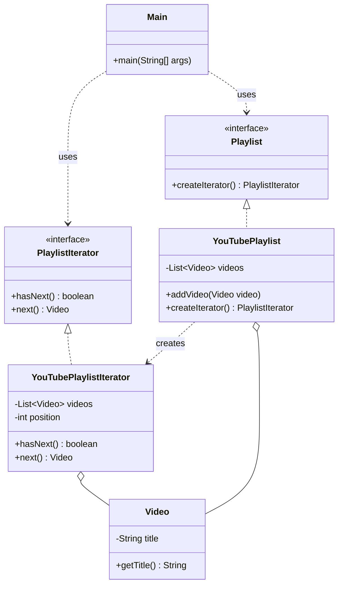

# Iterator Pattern

## Question

You have a `VideoLibrary` that stores videos internally in an `ArrayList`. You need to let a client iterate through all videos. You also have a `PlaylistLibrary` that uses a `LinkedList`. The client code must work the same way for both. Write the traversal code.

Try it before reading on.

---

## Problem Without the Pattern

The obvious approach — expose the internal collection directly:

```java
class VideoLibrary {
    private ArrayList<Video> videos = new ArrayList<>();

    public ArrayList<Video> getVideos() { return videos; } // exposes ArrayList
}

class PlaylistLibrary {
    private LinkedList<Video> videos = new LinkedList<>();

    public LinkedList<Video> getVideos() { return videos; } // exposes LinkedList
}

// Client must know the concrete type to iterate:
ArrayList<Video> vids = library.getVideos();
for (int i = 0; i < vids.size(); i++) {
    process(vids.get(i));  // only works because we know it's an ArrayList
}
```

**What breaks**:
1. **Encapsulation broken**: The client knows the internal data structure. Changing `ArrayList` to `TreeSet` inside `VideoLibrary` breaks all client code.
2. **No uniform traversal**: `ArrayList` iterates with `get(i)`, `LinkedList` with `.poll()`, a custom BST with a recursive walk. Each requires different client code.
3. **Exposes internal mutability**: `getVideos()` returns a live reference — the caller can `videos.clear()` the library.

---

## Derive the Minimal Fix

The constraint: **the client must not know the internal structure; traversal interface must be identical regardless of storage type**.

Step 1 — define an `Iterator` interface that hides the traversal mechanism:
```java
interface Iterator<T> {
    boolean hasNext();
    T next();
}
```

Step 2 — the collection creates and returns its own iterator (it knows its internal structure; the client does not need to):
```java
class VideoLibrary {
    private ArrayList<Video> videos = new ArrayList<>();

    public Iterator<Video> iterator() {
        return new Iterator<Video>() {
            private int index = 0;
            public boolean hasNext() { return index < videos.size(); }
            public Video next()      { return videos.get(index++); }
        };
    }
}
```

Step 3 — the client only uses `Iterator<Video>`, regardless of the underlying structure:
```java
Iterator<Video> it = library.iterator(); // works for ArrayList, LinkedList, BST
while (it.hasNext()) {
    process(it.next());
}
```

Changing `VideoLibrary` to use `TreeSet` internally requires updating only the `iterator()` factory — the client is untouched.

---

> **Category**: Behavioral Pattern
> **Purpose**: Provide a way to access elements of a collection sequentially without exposing its underlying representation.

## Real-Life Analogy

**A TV remote's channel-up button.**

When you press the channel-up button on a TV remote, you don't need to know:
- Whether channels are stored as an array, a linked list, a database query, or a satellite frequency table.
- How the "next channel" is calculated.
- How many channels exist.

You just press the button. One at a time. In sequence. The remote gives you a consistent interface — "give me the next item" — regardless of how the collection is internally organized.

An Iterator is exactly that channel-up button. It provides a uniform `hasNext()` / `next()` contract regardless of the underlying data structure. Change the collection from `ArrayList` to `LinkedList` to a custom tree — the client code using the iterator doesn't change at all.

---

## Formal Definition

The Iterator Pattern is a behavioral design pattern that entrusts the traversal behavior of a collection to a separate object. It traverses elements without exposing the underlying operations. Whether the collection is an array, a list, a tree, or a custom structure, you use the same iterator interface to access it one element at a time.

**Key Components**:

| Component | Role | Example |
|---|---|---|
| **Iterator Interface** | Defines `hasNext()` and `next()` contract. | `PlaylistIterator` |
| **Concrete Iterator** | Implements traversal logic for a specific collection. | `YouTubePlaylistIterator` |
| **Aggregate Interface** | Defines `createIterator()` — the collection provides its own iterator. | `Playlist` |
| **Concrete Aggregate** | The actual collection. Returns an iterator without exposing internals. | `YouTubePlaylist` |

---

## Understanding the Problem

Direct exposure of the internal structure:

```cpp
// A simple Video class
class Video {
    string title;
public:
    Video(string t) : title(t) {}
    string getTitle() const { return title; }
};

// YouTubePlaylist class
class YouTubePlaylist {
    vector<Video> videos;
public:
    void addVideo(const Video& video) { videos.push_back(video); }
    vector<Video>& getVideos() { return videos; }  // Exposes internal structure
};

// Client Code
int main() {
    YouTubePlaylist playlist;
    playlist.addVideo(Video("LLD Tutorial"));
    playlist.addVideo(Video("System Design Basics"));

    // Client is tightly coupled to vector<Video>
    for (const Video& v : playlist.getVideos()) {
        cout << v.getTitle() << endl;
    }
}
```

**Issues**:

| Problem | Description |
|---|---|
| **Exposes internal structure** | `getVideos()` returns the raw list. Clients can modify it — breaks encapsulation. |
| **Tight coupling to collection type** | Client code depends on `vector`. Change to `list` or custom tree breaks every caller. |
| **No control over traversal** | Traversal logic is managed outside the class. Can't enforce custom order without changing client code. |
| **Difficult multiple independent traversals** | Two parts of the program iterating the same playlist simultaneously requires manual index management. |

---

## Solution: Iterator Pattern (Step 1 — Basic)

```java
// ========== Video class representing a single video ==========
class Video {
    private String title;
    
    public Video(String title) {
        this.title = title;
    }
    
    public String getTitle() {
        return this.title;
    }
}

// ========== YouTubePlaylist class (Aggregate) ==========
class YouTubePlaylist {
    private List<Video> videos;
    
    public YouTubePlaylist() {
        this.videos = new ArrayList<>();
    }
    
    // Method to add video to playlist
    public void addVideo(Video video) {
        this.videos.add(video);
    }
    
    // Method to expose internal video list 
    public List<Video> getVideos() {
        return this.videos;
    }
}

// ========== Iterator interface ==========
interface PlaylistIterator {
    boolean hasNext();
    Video next();
}

// ========== Concrete Iterator class ==========
class YouTubePlaylistIterator implements PlaylistIterator {
    private List<Video> videos;
    private int position;
    
    public YouTubePlaylistIterator(List<Video> videos) {
        this.videos = videos;
        this.position = 0;
    }
    
    // Check if more videos are left to iterate
    @Override
    public boolean hasNext() {
        return this.position < this.videos.size();
    }
    
    // Return the next video in sequence
    @Override
    public Video next() {
        if (this.hasNext()) {
            Video video = this.videos.get(this.position);
            this.position++;
            return video;
        }
        return null;
    }
}

// ========== Main method (Client code) ==========
public class Main {
    public static void main(String[] args) {
        YouTubePlaylist playlist = new YouTubePlaylist();
        playlist.addVideo(new Video("LLD Tutorial"));
        playlist.addVideo(new Video("System Design Basics"));
        
        // Client directly creates the iterator using internal list (not ideal)
        PlaylistIterator iterator = new YouTubePlaylistIterator(playlist.getVideos());
        
        // Use the iterator to loop through the playlist
        while (iterator.hasNext()) {
            System.out.println(iterator.next().getTitle());
        }
    }
}
```

**One issue remains**: The client still accesses `playlist.getVideos()` — the internal list is still exposed for creating the iterator. The collection should provide its own iterator.

---

## Refined Solution: Collection Provides Its Own Iterator

```java
// ========== Video class representing a single video ==========
class Video {
    private String title;
    
    public Video(String title) {
        this.title = title;
    }
    
    public String getTitle() {
        return this.title;
    }
}

// ================ Playlist interface ================
// (acts as a contract for collections that are iterable) 
interface Playlist {
    PlaylistIterator createIterator();
}

// ========== Iterator interface (defines traversal contract) ==========
interface PlaylistIterator {
    boolean hasNext();
    Video next();
}

// ========== Concrete Iterator class ==========
// Implements the actual logic for traversing the YouTubePlaylist
class YouTubePlaylistIterator implements PlaylistIterator {
    private List<Video> videos;
    private int position;
    
    public YouTubePlaylistIterator(List<Video> videos) {
        this.videos = videos;
        this.position = 0;
    }
    
    // Check if more videos are left
    @Override
    public boolean hasNext() {
        return this.position < this.videos.size();
    }
    
    // Return the next video in the playlist
    @Override
    public Video next() {
        if (this.hasNext()) {
            Video video = this.videos.get(this.position);
            this.position++;
            return video;
        }
        return null;
    }
}

// ========== YouTubePlaylist class (Aggregate) ==========
// Implements Playlist to guarantee it provides an iterator
class YouTubePlaylist implements Playlist {
    private List<Video> videos;
    
    public YouTubePlaylist() {
        this.videos = new ArrayList<>();
    }
    
    // Method to add a video to the playlist
    public void addVideo(Video video) {
        this.videos.add(video);
    }
    
    // Instead of exposing the list, return an iterator
    @Override
    public PlaylistIterator createIterator() {
        return new YouTubePlaylistIterator(this.videos);
    }
}

// ========== Main method (Client code) ==========
public class Main {
    public static void main(String[] args) {
        YouTubePlaylist playlist = new YouTubePlaylist();
        playlist.addVideo(new Video("LLD Tutorial"));
        playlist.addVideo(new Video("System Design Basics"));
        
        // Client asks for an iterator — no access to internal data structure
        PlaylistIterator iterator = playlist.createIterator();
        
        // Iterate through the playlist using the provided interface
        while (iterator.hasNext()) {
            System.out.println(iterator.next().getTitle());
        }
    }
}
```

### Class Diagram



---

## How Iterator Resolves the Issues

| Problem | Solution |
|---|---|
| **Exposes internal structure** | `YouTubePlaylist` no longer has `getVideos()`. The collection returns an iterator, not its internal list. |
| **No standard traversal** | All traversal uses the consistent `hasNext()` / `next()` interface, regardless of underlying structure. |
| **Traversal logic spread across client** | Index/position tracking is inside `YouTubePlaylistIterator` — client code is clean. |
| **Tight coupling to collection type** | Client depends only on `Playlist` and `PlaylistIterator` interfaces. Switch to `MusicPlaylist` (different internal structure) — client doesn't change. |
| **Can't customize traversal** | Add `ReversePlaylistIterator` implementing `PlaylistIterator`. The collection just returns a different iterator. |

---

## When to Use

- You want to traverse a collection **without exposing its internal structure**.
- You need **multiple traversal strategies** (forward, reverse, filtered) for the same collection.
- You want a **unified way to traverse different collection types** (list, set, tree, database cursor).
- You want to **decouple iteration logic from collection logic**.

---

## Real-World Examples

- **Java's `Iterator<T>`**: `List`, `Set`, `Map.entrySet()` all implement `Iterable`. The `for-each` loop uses this iterator.
- **Python's `iter()` / `next()`**: Every iterable object in Python implements the iterator protocol.
- **Database Cursors**: A database cursor iterates over result rows without loading the entire result set into memory.
- **File Readers**: `BufferedReader.lines()` returns a stream (an iterator-like abstraction) over file lines.

---

## Pros & Cons

**Pros**
- Hides internal structure — clients traverse without knowing how the collection is built.
- Unified traversal interface — same `hasNext()`/`next()` for any collection.
- Supports multiple traversal strategies — forward, reverse, filtered, all as separate iterator classes.
- Follows SRP (iteration logic separated) and OCP (new iterators without modifying collections).

**Cons**
- Adds extra classes/interfaces — more boilerplate for simple lists.
- Can be overkill for small, simple data structures where a direct `for` loop is cleaner.
- External iteration is manual — the client manages the `while (iterator.hasNext())` loop unless further abstracted.
