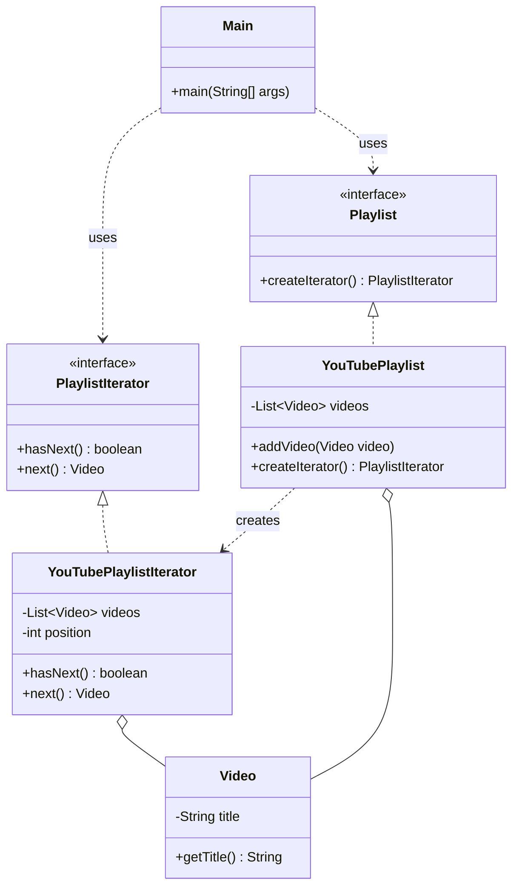

> [!NOTE]
> **📋 5-Minute Summary**
>
> **What this covers:** The Iterator Pattern — provides a way to access the elements of an aggregate object sequentially without exposing its underlying representation (list, stack, tree, etc.).
>
> **Key concepts:**
> - The problem: you want to iterate over a custom collection (e.g., a Binary Search Tree or a Graph), but you don't want to expose its internal node structure to the client.
> - The fix: extract the traversal behavior into a separate `Iterator` object.
> - Interface: the Iterator has methods like `hasNext()` and `next()`.
> - Decoupling: the client code uses the Iterator interface, completely unaware of whether it's traversing an array, a linked list, or a complex tree.
> - Built-in: in Java, this is deeply integrated via the `Iterable` and `Iterator` interfaces, powering the enhanced `for-each` loop.
>
> **Key takeaway:** You rarely need to write this from scratch in LLD interviews because standard libraries provide it. However, if asked to implement a custom data structure (like a specialized graph), providing an Iterator is the correct OOP approach.

---
module: 06-lld
topic: Design Patterns
subtopic: Behavioral
status: unread
tags: [06-lld, system-design, design-patterns]
---
# Iterator Pattern

> 🔵 **Java idiom:** This is *built into the language*: implement `Iterable<T>` (returns an `Iterator<T>` with `hasNext()`/`next()`) and your object works in a for-each loop. **JDK equivalent:** the entire Collections framework; `Scanner`. **Interview gotcha:** know **fail-fast vs fail-safe** — most collection iterators throw `ConcurrentModificationException` if the collection is structurally modified mid-iteration (via a `modCount` check), while `CopyOnWriteArrayList` / `ConcurrentHashMap` iterators are weakly-consistent/fail-safe. Mention `Iterator.remove()` as the *only* safe way to delete during iteration, and that Java 8 `Stream`s are the functional alternative for internal iteration.

## Question

You have a `VideoLibrary` that stores videos internally in an `ArrayList`. You need to let a client iterate through all videos. You also have a `PlaylistLibrary` that uses a `LinkedList`. The client code must work the same way for both. Write the traversal code.

Try it before reading on.

---

## Pattern Mindmap

```
[Iterator Pattern]
├── Core Concept
│   ├── What → Provide sequential access to collection elements without exposing internals
│   └── Why → Client code works identically for ArrayList, LinkedList, tree, graph
├── Key Components
│   ├── Iterator interface → hasNext(); next()
│   ├── Concrete Iterators → ArrayListIterator, LinkedListIterator
│   ├── Iterable interface → iterator() — collection implements this
│   └── Client → only uses hasNext()/next(); doesn't know the underlying structure
├── When to Use
│   ├── ✓ Hide internal representation (switch ArrayList to TreeSet without changing callers)
│   ├── ✓ Multiple simultaneous traversals of the same collection
│   └── ✓ Provide uniform iteration over different data structures (composite tree)
├── When NOT to Use
│   ├── ✗ Direct index access needed — iterator hides positional info
│   └── ✗ Simple List with no abstraction requirement — enhanced for-loop is sufficient
├── Trade-offs
│   ├── Pro: Decouples traversal logic from collection; swap structure without changing client
│   └── Con: Stateful — concurrent modification during iteration causes ConcurrentModificationException
├── Real-World Examples
│   ├── Java Iterable/Iterator → every Collection implements Iterable; enables for-each
│   └── Database ResultSet → rows fetched one at a time via next() without loading all into memory
└── Interview Angles
    ├── Internal vs External → internal hides loop; external gives caller control (Java uses external)
    ├── Fail-fast → modCount check throws ConcurrentModificationException if mutated during iteration
    └── Code challenge: implement an Iterator for a binary tree (in-order traversal)
```

---

## Problem Without the Pattern

The obvious approach — expose the internal collection directly:

```java
class VideoLibrary {
    private List<Video> videos = new ArrayList<>();  // list (like ArrayList)

    List<Video> getVideos() {
        return videos;  // exposes internal list
    }
}


class PlaylistLibrary {
    private LinkedList<Video> videos = new LinkedList<>();  // linked list

    LinkedList<Video> getVideos() {
        return videos;  // exposes internal linked list
    }
}


// Client must know the concrete type to iterate:
List<Video> vids = library.getVideos();
for (int i = 0; i < vids.size(); i++) {
    process(vids.get(i));  // only works because we know it's a List
}
```

**What breaks**:
1. **Encapsulation broken**: The client knows the internal data structure. Changing `list` to `set` inside `VideoLibrary` breaks all client code.
2. **No uniform traversal**: `list` iterates with `[i]`, `deque` with `.popleft()`, a custom BST with a recursive walk. Each requires different client code.
3. **Exposes internal mutability**: `get_videos()` returns a live reference — the caller can `videos.clear()` the library.

---

## Derive the Minimal Fix

The constraint: **the client must not know the internal structure; traversal interface must be identical regardless of storage type**.

Step 1 — define an `Iterator` interface using Java's `Iterator<T>` contract:
```java
interface PlaylistIterator<T> {
    boolean hasNext();
    T next();
}
```

Step 2 — the collection creates and returns its own iterator (it knows its internal structure; the client does not need to):
```java
class VideoLibrary {
    private List<Video> videos = new ArrayList<>();

    PlaylistIterator<Video> createIterator() {
        return new YouTubePlaylistIterator(videos);
    }
}
```

Step 3 — the client only uses the iterator, regardless of the underlying structure:
```java
PlaylistIterator<Video> it = library.createIterator();
while (it.hasNext()) {
    process(it.next());
}
```

Changing `VideoLibrary` to use a `set` internally requires updating only the `create_iterator()` factory — the client is untouched.

---

> **Category**: Behavioral Pattern
> **Purpose**: Provide a way to access elements of a collection sequentially without exposing its underlying representation.

## Real-Life Analogy

**A TV remote's channel-up button.**

When you press the channel-up button on a TV remote, you don't need to know:
- Whether channels are stored as an array, a linked list, a database query, or a satellite frequency table.
- How the "next channel" is calculated.
- How many channels exist.

You just press the button. One at a time. In sequence. The remote gives you a consistent interface — "give me the next item" — regardless of how the collection is internally organized.

An Iterator is exactly that channel-up button. It provides a uniform `has_next()` / `next()` contract regardless of the underlying data structure. Change the collection from `list` to `deque` to a custom tree — the client code using the iterator doesn't change at all.

---

## Formal Definition

The Iterator Pattern is a behavioral design pattern that entrusts the traversal behavior of a collection to a separate object. It traverses elements without exposing the underlying operations. Whether the collection is an array, a list, a tree, or a custom structure, you use the same iterator interface to access it one element at a time.

**Key Components**:

| Component | Role | Example |
|---|---|---|
| **Iterator Interface** | Defines `hasNext()` and `next()` contract. | `PlaylistIterator` |
| **Concrete Iterator** | Implements traversal logic for a specific collection. | `YouTubePlaylistIterator` |
| **Aggregate Interface** | Defines `createIterator()` — the collection provides its own iterator. | `Playlist` |
| **Concrete Aggregate** | The actual collection. Returns an iterator without exposing internals. | `YouTubePlaylist` |

---

## Understanding the Problem

Direct exposure of the internal structure:

```java
// A simple Video class
class Video {
    private final String title;

    Video(String title) {
        this.title = title;
    }

    String getTitle() {
        return title;
    }
}

// YouTubePlaylist class
class YouTubePlaylist {
    private final List<Video> videos = new ArrayList<>();

    void addVideo(Video video) {
        videos.add(video);
    }

    List<Video> getVideos() {
        return videos;  // Exposes internal structure
    }
}

// Client Code
public class Main {
    public static void main(String[] args) {
        YouTubePlaylist playlist = new YouTubePlaylist();
        playlist.addVideo(new Video("LLD Tutorial"));
        playlist.addVideo(new Video("System Design Basics"));

        // Client is tightly coupled to List<Video>
        for (Video v : playlist.getVideos()) {
            System.out.println(v.getTitle());
        }
    }
}
```

**Issues**:

| Problem | Description |
|---|---|
| **Exposes internal structure** | `getVideos()` returns the raw list. Clients can modify it — breaks encapsulation. |
| **Tight coupling to collection type** | Client code depends on `List`. Change to a custom tree breaks every caller. |
| **No control over traversal** | Traversal logic is managed outside the class. Can't enforce custom order without changing client code. |
| **Difficult multiple independent traversals** | Two parts of the program iterating the same playlist simultaneously requires manual index management. |

---

## Solution: Iterator Pattern (Step 1 — Basic)

```java
// ========== Video class representing a single video ==========
class Video {
    private final String title;

    Video(String title) {
        this.title = title;
    }

    String getTitle() {
        return title;
    }
}


// ========== YouTubePlaylist class (Aggregate) ==========
class YouTubePlaylist {
    private final List<Video> videos = new ArrayList<>();

    // Method to add video to playlist
    void addVideo(Video video) {
        videos.add(video);
    }

    // Method to expose internal video list
    List<Video> getVideos() {
        return videos;
    }
}


// ========== Concrete Iterator class ==========
class YouTubePlaylistIterator implements Iterator<Video> {
    private final List<Video> videos;
    private int position = 0;

    YouTubePlaylistIterator(List<Video> videos) {
        this.videos = videos;
    }

    // Check if more videos are left to iterate
    public boolean hasNext() {
        return position < videos.size();
    }

    // Return the next video in sequence
    public Video next() {
        if (!hasNext()) {
            throw new NoSuchElementException();
        }
        return videos.get(position++);
    }
}


// ========== Main (Client code) ==========
public class Main {
    public static void main(String[] args) {
        YouTubePlaylist playlist = new YouTubePlaylist();
        playlist.addVideo(new Video("LLD Tutorial"));
        playlist.addVideo(new Video("System Design Basics"));

        // Client directly creates the iterator using internal list (not ideal)
        YouTubePlaylistIterator iterator = new YouTubePlaylistIterator(playlist.getVideos());

        // Use the iterator to loop through the playlist
        while (iterator.hasNext()) {
            System.out.println(iterator.next().getTitle());
        }
    }
}
```

**One issue remains**: The client still accesses `playlist.get_videos()` — the internal list is still exposed for creating the iterator. The collection should provide its own iterator.

---

## Refined Solution: Collection Provides Its Own Iterator

```java
// ========== Video class representing a single video ==========
class Video {
    private final String title;

    Video(String title) {
        this.title = title;
    }

    String getTitle() {
        return title;
    }
}


// ================ Playlist interface ================
// (acts as a contract for collections that are iterable)
interface Playlist extends Iterable<Video> {
    Iterator<Video> createIterator();

    default Iterator<Video> iterator() {
        return createIterator();
    }
}


// ========== Concrete Iterator class ==========
// Implements the actual logic for traversing the YouTubePlaylist
class YouTubePlaylistIterator implements Iterator<Video> {
    private final List<Video> videos;
    private int position = 0;

    YouTubePlaylistIterator(List<Video> videos) {
        this.videos = videos;
    }

    // Check if more videos are left
    public boolean hasNext() {
        return position < videos.size();
    }

    // Return the next video in the playlist
    public Video next() {
        if (!hasNext()) {
            throw new NoSuchElementException();
        }
        return videos.get(position++);
    }
}


// ========== YouTubePlaylist class (Aggregate) ==========
// Implements Playlist to guarantee it provides an iterator
class YouTubePlaylist implements Playlist {
    private final List<Video> videos = new ArrayList<>();

    // Method to add a video to the playlist
    void addVideo(Video video) {
        videos.add(video);
    }

    // Instead of exposing the list, return an iterator
    public Iterator<Video> createIterator() {
        return new YouTubePlaylistIterator(videos);
    }
}


// ========== Main (Client code) ==========
public class Main {
    public static void main(String[] args) {
        YouTubePlaylist playlist = new YouTubePlaylist();
        playlist.addVideo(new Video("LLD Tutorial"));
        playlist.addVideo(new Video("System Design Basics"));

        // Client asks for an iterator — no access to internal data structure
        Iterator<Video> iterator = playlist.createIterator();

        // Iterate through the playlist using the provided interface
        while (iterator.hasNext()) {
            System.out.println(iterator.next().getTitle());
        }
    }
}
```

### Class Diagram



---

## How Iterator Resolves the Issues

| Problem | Solution |
|---|---|
| **Exposes internal structure** | `YouTubePlaylist` no longer has `getVideos()`. The collection returns an iterator, not its internal list. |
| **No standard traversal** | All traversal uses the consistent `hasNext()` / `next()` interface, regardless of underlying structure. |
| **Traversal logic spread across client** | Index/position tracking is inside `YouTubePlaylistIterator` — client code is clean. |
| **Tight coupling to collection type** | Client depends only on `Playlist` and `YouTubePlaylistIterator` interfaces. Switch to `MusicPlaylist` (different internal structure) — client doesn't change. |
| **Can't customize traversal** | Add `ReversePlaylistIterator` implementing the same iterator protocol. The collection just returns a different iterator. |

---

## When to Use

- You want to traverse a collection **without exposing its internal structure**.
- You need **multiple traversal strategies** (forward, reverse, filtered) for the same collection.
- You want a **unified way to traverse different collection types** (list, set, tree, database cursor).
- You want to **decouple iteration logic from collection logic**.

---

## Real-World Examples

- **Java's `Iterator<T>`**: `List`, `Set`, `Map.entrySet()` all implement `Iterable`. The `for-each` loop uses this iterator.
- **Database Cursors**: A database cursor iterates over result rows without loading the entire result set into memory.
- **File Readers**: `Files.lines(path)` or `BufferedReader.readLine()` reads lines one at a time.

---

## Pros & Cons

**Pros**
- Hides internal structure — clients traverse without knowing how the collection is built.
- Unified traversal interface — same `hasNext()`/`next()` for any collection.
- Supports multiple traversal strategies — forward, reverse, filtered, all as separate iterator classes.
- Follows SRP (iteration logic separated) and OCP (new iterators without modifying collections).

**Cons**
- Adds extra classes/interfaces — more boilerplate for simple lists.
- Can be overkill for small, simple data structures where a direct `for` loop is cleaner.
- External iteration is manual — the client manages the `while iterator.hasNext()` loop unless further abstracted.

---

## Applied In

This concept is used by **2 problems** in this repo:

**Low-Level Design**

- [Design Search Engine (Inverted Index)](../../06-problems/04-advanced-niche/27-design-search-engine.md)
- [Design Text Editor](../../06-problems/04-advanced-niche/31-design-text-editor.md)

