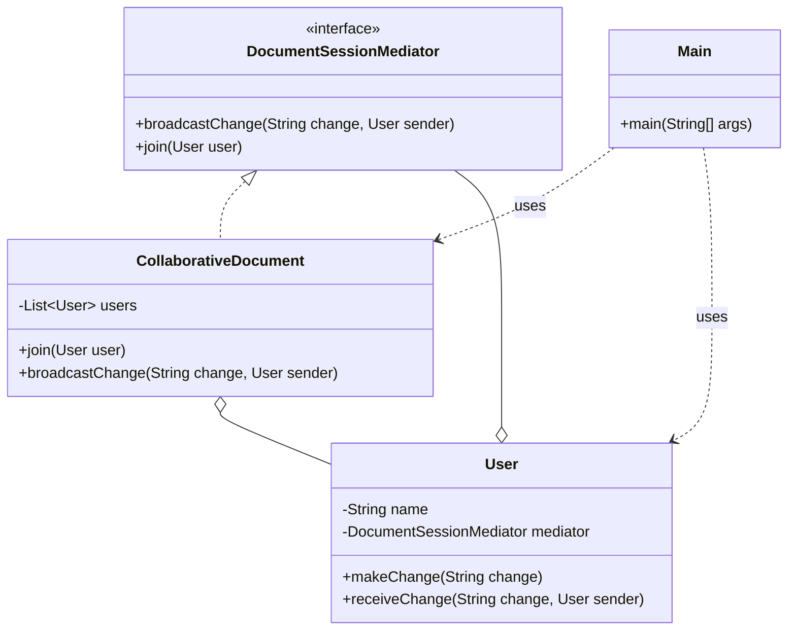

# Mediator Pattern

## Question

A collaborative document editor has users `Alice`, `Bob`, and `Charlie`. When Alice types, Bob and Charlie must see the change. When Bob types, Alice and Charlie must see it. Write the `User.type(String text)` method that propagates changes to all other users.

Try it before reading on.

---

## Pattern Mindmap

```
[Mediator Pattern]
├── Core Concept
│   ├── What → Centralize communication between components through a mediator object
│   └── Why → Reduces N×(N-1) peer-to-peer couplings to N mediator couplings
├── Key Components
│   ├── Mediator interface → notify(Component sender, String event)
│   ├── Concrete Mediator → DocumentEditor — wires Alice, Bob, Charlie together
│   ├── Colleague → User/Component — calls mediator.notify() instead of peers directly
│   └── Mediator routes → receives event, decides who else to update
├── When to Use
│   ├── ✓ Many components communicate in complex, many-to-many patterns
│   ├── ✓ Changing collaboration logic without touching individual components
│   └── ✓ Chat rooms, air traffic control, UI component coordination
├── When NOT to Use
│   ├── ✗ Few components — mediator adds needless indirection
│   └── ✗ Communication is one-directional — Observer is simpler
├── Trade-offs
│   ├── Pro: Decouples colleagues; mediator is the only place to change routing
│   └── Con: Mediator can become a God Object — complex, hard to maintain
├── Real-World Examples
│   ├── Chat room → ChatRoom mediates messages between User objects
│   └── Air Traffic Control → ATC mediates between Plane objects; planes never talk directly
└── Interview Angles
    ├── vs Observer → Observer is one-to-many (subject→subscribers); Mediator is many-to-many
    ├── God Object risk → split mediator by domain if it grows too large
    └── Code challenge: implement a chat room where users join/leave and broadcast messages
```

---

## Problem Without the Pattern

```java
class User {
    private String name;
    private List<User> peers = new ArrayList<>(); // direct references to all others

    public void addPeer(User u) { peers.add(u); }

    public void type(String text) {
        System.out.println(name + " typed: " + text);
        for (User peer : peers) {
            peer.receiveUpdate(name, text); // direct call to each peer
        }
    }

    public void receiveUpdate(String from, String text) { ... }
}

// Setup:
alice.addPeer(bob);
alice.addPeer(charlie);
bob.addPeer(alice);
bob.addPeer(charlie);
charlie.addPeer(alice);
charlie.addPeer(bob);
// N users = N*(N-1) peer references
```

**What breaks**:
1. **O(N²) connections**: Each user holds direct references to all others. 10 users = 90 peer links.
2. **Tight coupling**: `User` must import `User` to hold peer references — circular dependency; each user is coupled to every other.
3. **Fragile add/remove**: Adding a 4th user `Dave` requires updating every existing user's peer list.
4. **SRP violation**: `User` manages its own content AND routes messages to peers.

---

## Derive the Minimal Fix

The constraint: **users must not hold references to each other — communication routes through a single coordinator**.

Step 1 — extract a `Mediator` interface:
```java
interface DocumentMediator {
    void broadcastChange(User sender, String text);
    void addUser(User u);
}
```

Step 2 — each `User` only holds a reference to the mediator:
```java
class User {
    private String name;
    private DocumentMediator mediator;

    public User(String name, DocumentMediator mediator) {
        this.name = name;
        this.mediator = mediator;
    }

    public void type(String text) {
        mediator.broadcastChange(this, text); // send to mediator, not to peers
    }

    public void receiveUpdate(String from, String text) {
        System.out.println(name + " sees: " + from + " → " + text);
    }
}
```

Step 3 — the mediator owns the routing:
```java
class CollaborativeDocument implements DocumentMediator {
    private List<User> users = new ArrayList<>();

    public void addUser(User u)    { users.add(u); }

    public void broadcastChange(User sender, String text) {
        for (User u : users) {
            if (u != sender) u.receiveUpdate(sender.getName(), text);
        }
    }
}
```

Adding `Dave` is now: `mediator.addUser(dave)`. No existing user changes. N users = N mediator references, not N² peer links.

---

> **Category**: Behavioral Pattern
> **Purpose**: Centralize complex communication between objects into a single mediator object. Objects no longer communicate directly — they communicate only through the mediator.

## Real-Life Analogy

**Air Traffic Control (ATC).**

At a busy airport, there are dozens of planes in the air and on the runway. If every plane communicated directly with every other plane to coordinate landings, take-offs, and taxiing — the system would collapse. Planes would need references to every other plane. Any new plane joining would require updating all existing planes.

Instead, **every plane only talks to the ATC tower**. The tower:
- Knows the positions and intentions of all planes.
- Coordinates who can land, who must hold, who can take off.
- Broadcasts updates as needed.

Planes don't know about each other at all. They only know: "Talk to ATC."

**Without Mediator**: N planes need N×(N-1) communication channels. Adding a new plane requires updating all other planes.

**With Mediator**: N planes + 1 ATC = N communication channels. Adding a new plane means one new connection — to ATC.

The ATC is the mediator. It reduces O(N²) connections to O(N).

---

## Formal Definition

The Mediator Pattern is a behavioral design pattern that centralizes complex communication between objects into a single mediator object. It promotes loose coupling and organizes the interaction between components. Instead of objects communicating directly with each other, they interact through the mediator.

**Key Components**:

| Component | Role | Example |
|---|---|---|
| **Mediator Interface** | Defines methods for components to communicate through. | `DocumentSessionMediator` |
| **Concrete Mediator** | Implements the interface; knows all components and routes messages. | `CollaborativeDocument` |
| **Colleague** | Component that only communicates via the mediator. | `User` |

---

## Understanding the Problem

Users directly holding references to each other:

```java
// Class representing a User in a collaborative document editor
class User {
    private String name;
    private List<User> others;  // List of users that have access to this user
    
    public User(String name) {
        this.name = name;
        this.others = new ArrayList<>();
    }
    
    // Method to add a collaborator to this user (grants access to the user)
    public void addCollaborator(User user) {
        this.others.add(user);
    }
    
    // Method to make a change to the document and notify all collaborators
    public void makeChange(String change) {
        System.out.println(this.name + " made a change: " + change);
        for (User u : this.others) {
            u.receiveChange(change, this);  // Notify each collaborator about the change
        }
    }
    
    // Method to receive a change notification from another user
    public void receiveChange(String change, User fromUser) {
        System.out.println(this.name + " received: \"" + change + "\" from " + fromUser.name);
    }
}

// Client Code
public class Main {
    public static void main(String[] args) {
        // Creating users
        User alice = new User("Alice");
        User bob = new User("Bob");
        User charlie = new User("Charlie");
        
        // Adding collaborators (Alice gives access to Bob and Charlie)
        alice.addCollaborator(bob);
        alice.addCollaborator(charlie);
        
        // Alice makes a change, notifying Bob and Charlie
        alice.makeChange(" Updated the document title");
        
        // Bob makes a change, notifying Alice and Charlie
        bob.makeChange("Added a new section to the document");
    }
}
```

**Issues**:

| Issue | Description |
|---|---|
| **Tight Coupling** | Each user holds references to every other user they collaborate with. Modifying collaborators is risky. |
| **Adding/Removing Users Breaks Structure** | Dynamically adding or removing users requires updating every existing user's reference list. |
| **Hard to Orchestrate Roles** | No place to enforce editor/viewer/admin rules — every user can do everything to every other user. |
| **Lack of SRP** | The `User` class manages collaborators, makes changes, AND notifies others. Three responsibilities in one class. |
| **Scalability** | Complexity grows as O(N²) with users. 10 users = 90 direct connections. |

---

## Solution: Mediator Pattern

```java
// Mediator Interface
interface DocumentSessionMediator {
    void broadcastChange(String change, User sender);
    void join(User user);
}

// Concrete Mediator Class
class CollaborativeDocument implements DocumentSessionMediator {
    private List<User> users;
    
    public CollaborativeDocument() {
        this.users = new ArrayList<>();
    }
    
    @Override
    public void join(User user) {
        this.users.add(user);
    }
    
    @Override
    public void broadcastChange(String change, User sender) {
        for (User user : this.users) {
            if (user != sender) {
                user.receiveChange(change, sender);
            }
        }
    }
}

// User Class — only knows about the mediator, never about other users
class User {
    private String name;
    private DocumentSessionMediator mediator;
    
    public User(String name, DocumentSessionMediator mediator) {
        this.name = name;
        this.mediator = mediator;
    }
    
    // Method for users to make a change
    public void makeChange(String change) {
        System.out.println(this.name + " edited the document: " + change);
        this.mediator.broadcastChange(change, this);
    }
    
    // Method to receive a change from another user
    public void receiveChange(String change, User sender) {
        System.out.println(this.name + " saw change from " + sender.name + ": \"" + change + "\"");
    }
}

// Client Code
public class Main {
    public static void main(String[] args) {
        CollaborativeDocument doc = new CollaborativeDocument();
        
        // Creating users — they each only know the mediator
        User alice = new User("Alice", doc);
        User bob = new User("Bob", doc);
        User charlie = new User("Charlie", doc);
        
        // Joining the collaborative document
        doc.join(alice);
        doc.join(bob);
        doc.join(charlie);
        
        // Users making changes — routed through mediator
        alice.makeChange("Added project title");
        bob.makeChange("Corrected grammar in paragraph 2");
    }
}
```

### Class Diagram



---

## How Mediator Resolves the Issues

| Issue | Solution |
|---|---|
| **Tight Coupling** | Users hold only a reference to the mediator. No user knows any other user. |
| **Adding/Removing Users Breaks Structure** | `CollaborativeDocument.join()` manages the user list centrally. Adding a user = one line. |
| **Hard to Orchestrate Roles** | Roles (editor/viewer/admin) can be implemented in `CollaborativeDocument.broadcastChange()` — check the sender's role before broadcasting. Zero changes to the `User` class. |
| **Lack of SRP** | `User` only handles its own behavior. `CollaborativeDocument` handles all communication. |
| **Scalability** | N connections (each user to the mediator) instead of N×(N-1). |

---

## When to Use

- Multiple components need to interact but should remain **decoupled**.
- You need to **manage rules or permissions centrally** (access control, roles).
- You need **flexible broadcasting, filtering, or transformation** of messages.
- The direct object-to-object connection graph would be too complex (many components = many connections).

---

## Pros & Cons

**Pros**
- Components don't need to know about each other — only the mediator interface.
- Easy to manage roles and access centrally in the mediator.
- Easier to test and extend — add new colleagues without touching existing ones.
- Clean separation of business logic (User) and interaction logic (CollaborativeDocument).

**Cons**
- Mediator can become a "God Object" — as the system grows, the mediator accumulates too much logic.
- Single point of failure — if the mediator fails, all communication breaks.
- Adds an abstraction layer — harder to understand for developers unfamiliar with the pattern.

---

## Real-World Examples

1. **Air Traffic Control**: The classic analogy — planes (colleagues) talk only to the tower (mediator).
2. **Chat Rooms / Slack Channels**: Users send messages to the channel (mediator), which routes them to all other members. Users don't have each other's direct addresses.
3. **Auction System**: Bidders don't interact with each other — all bids go through the auctioneer (mediator).
4. **Airline Management System**: Booking, customer service, flight status, and payment services communicate through a central coordinator rather than calling each other directly.
5. **MVC's Controller**: The Controller mediates between the View (UI) and Model (data) — the View doesn't talk to the Model directly.
