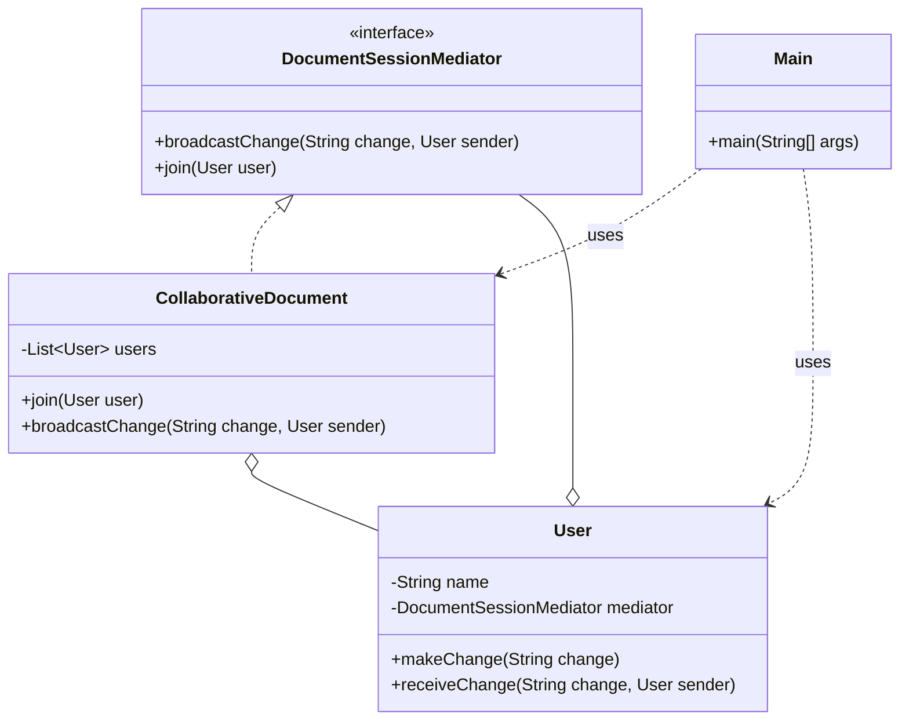

# Mediator Pattern

## Question

A collaborative document editor has users `Alice`, `Bob`, and `Charlie`. When Alice types, Bob and Charlie must see the change. When Bob types, Alice and Charlie must see it. Write the `User.type(String text)` method that propagates changes to all other users.

Try it before reading on.

---

## Pattern Mindmap

```
[Mediator Pattern]
├── Core Concept
│   ├── What → Centralize communication between components through a mediator object
│   └── Why → Reduces N×(N-1) peer-to-peer couplings to N mediator couplings
├── Key Components
│   ├── Mediator interface → notify(Component sender, String event)
│   ├── Concrete Mediator → DocumentEditor — wires Alice, Bob, Charlie together
│   ├── Colleague → User/Component — calls mediator.notify() instead of peers directly
│   └── Mediator routes → receives event, decides who else to update
├── When to Use
│   ├── ✓ Many components communicate in complex, many-to-many patterns
│   ├── ✓ Changing collaboration logic without touching individual components
│   └── ✓ Chat rooms, air traffic control, UI component coordination
├── When NOT to Use
│   ├── ✗ Few components — mediator adds needless indirection
│   └── ✗ Communication is one-directional — Observer is simpler
├── Trade-offs
│   ├── Pro: Decouples colleagues; mediator is the only place to change routing
│   └── Con: Mediator can become a God Object — complex, hard to maintain
├── Real-World Examples
│   ├── Chat room → ChatRoom mediates messages between User objects
│   └── Air Traffic Control → ATC mediates between Plane objects; planes never talk directly
└── Interview Angles
    ├── vs Observer → Observer is one-to-many (subject→subscribers); Mediator is many-to-many
    ├── God Object risk → split mediator by domain if it grows too large
    └── Code challenge: implement a chat room where users join/leave and broadcast messages
```

---

## Problem Without the Pattern

```python
class User:
    def __init__(self, name):
        self._name = name
        self._peers = []  # direct references to all others

    def add_peer(self, u):
        self._peers.append(u)

    def type(self, text):
        print(f"{self._name} typed: {text}")
        for peer in self._peers:
            peer.receive_update(self._name, text)  # direct call to each peer

    def receive_update(self, from_user, text):
        pass


# Setup:
alice.add_peer(bob)
alice.add_peer(charlie)
bob.add_peer(alice)
bob.add_peer(charlie)
charlie.add_peer(alice)
charlie.add_peer(bob)
# N users = N*(N-1) peer references
```

**What breaks**:
1. **O(N²) connections**: Each user holds direct references to all others. 10 users = 90 peer links.
2. **Tight coupling**: `User` must hold `User` peer references — circular dependency; each user is coupled to every other.
3. **Fragile add/remove**: Adding a 4th user `Dave` requires updating every existing user's peer list.
4. **SRP violation**: `User` manages its own content AND routes messages to peers.

---

## Derive the Minimal Fix

The constraint: **users must not hold references to each other — communication routes through a single coordinator**.

Step 1 — extract a `Mediator` interface:
```python
from abc import ABC, abstractmethod

class DocumentMediator(ABC):
    @abstractmethod
    def broadcast_change(self, sender, text):
        pass

    @abstractmethod
    def add_user(self, u):
        pass
```

Step 2 — each `User` only holds a reference to the mediator:
```python
class User:
    def __init__(self, name, mediator):
        self._name = name
        self._mediator = mediator

    def type(self, text):
        self._mediator.broadcast_change(self, text)  # send to mediator, not to peers

    def receive_update(self, from_user, text):
        print(f"{self._name} sees: {from_user} → {text}")
```

Step 3 — the mediator owns the routing:
```python
class CollaborativeDocument(DocumentMediator):
    def __init__(self):
        self._users = []

    def add_user(self, u):
        self._users.append(u)

    def broadcast_change(self, sender, text):
        for u in self._users:
            if u is not sender:
                u.receive_update(sender._name, text)
```

Adding `Dave` is now: `mediator.add_user(dave)`. No existing user changes. N users = N mediator references, not N² peer links.

---

> **Category**: Behavioral Pattern
> **Purpose**: Centralize complex communication between objects into a single mediator object. Objects no longer communicate directly — they communicate only through the mediator.

## Real-Life Analogy

**Air Traffic Control (ATC).**

At a busy airport, there are dozens of planes in the air and on the runway. If every plane communicated directly with every other plane to coordinate landings, take-offs, and taxiing — the system would collapse. Planes would need references to every other plane. Any new plane joining would require updating all existing planes.

Instead, **every plane only talks to the ATC tower**. The tower:
- Knows the positions and intentions of all planes.
- Coordinates who can land, who must hold, who can take off.
- Broadcasts updates as needed.

Planes don't know about each other at all. They only know: "Talk to ATC."

**Without Mediator**: N planes need N×(N-1) communication channels. Adding a new plane requires updating all other planes.

**With Mediator**: N planes + 1 ATC = N communication channels. Adding a new plane means one new connection — to ATC.

The ATC is the mediator. It reduces O(N²) connections to O(N).

---

## Formal Definition

The Mediator Pattern is a behavioral design pattern that centralizes complex communication between objects into a single mediator object. It promotes loose coupling and organizes the interaction between components. Instead of objects communicating directly with each other, they interact through the mediator.

**Key Components**:

| Component | Role | Example |
|---|---|---|
| **Mediator Interface** | Defines methods for components to communicate through. | `DocumentSessionMediator` |
| **Concrete Mediator** | Implements the interface; knows all components and routes messages. | `CollaborativeDocument` |
| **Colleague** | Component that only communicates via the mediator. | `User` |

---

## Understanding the Problem

Users directly holding references to each other:

```python
# Class representing a User in a collaborative document editor
class User:
    def __init__(self, name):
        self._name = name
        self._others = []  # List of users that have access to this user

    # Method to add a collaborator to this user (grants access to the user)
    def add_collaborator(self, user):
        self._others.append(user)

    # Method to make a change to the document and notify all collaborators
    def make_change(self, change):
        print(f"{self._name} made a change: {change}")
        for u in self._others:
            u.receive_change(change, self)  # Notify each collaborator about the change

    # Method to receive a change notification from another user
    def receive_change(self, change, from_user):
        print(f'{self._name} received: "{change}" from {from_user._name}')


# Client Code
if __name__ == "__main__":
    # Creating users
    alice = User("Alice")
    bob = User("Bob")
    charlie = User("Charlie")

    # Adding collaborators (Alice gives access to Bob and Charlie)
    alice.add_collaborator(bob)
    alice.add_collaborator(charlie)

    # Alice makes a change, notifying Bob and Charlie
    alice.make_change(" Updated the document title")

    # Bob makes a change, notifying Alice and Charlie
    bob.make_change("Added a new section to the document")
```

**Issues**:

| Issue | Description |
|---|---|
| **Tight Coupling** | Each user holds references to every other user they collaborate with. Modifying collaborators is risky. |
| **Adding/Removing Users Breaks Structure** | Dynamically adding or removing users requires updating every existing user's reference list. |
| **Hard to Orchestrate Roles** | No place to enforce editor/viewer/admin rules — every user can do everything to every other user. |
| **Lack of SRP** | The `User` class manages collaborators, makes changes, AND notifies others. Three responsibilities in one class. |
| **Scalability** | Complexity grows as O(N²) with users. 10 users = 90 direct connections. |

---

## Solution: Mediator Pattern

```python
from abc import ABC, abstractmethod


# Mediator Interface
class DocumentSessionMediator(ABC):
    @abstractmethod
    def broadcast_change(self, change, sender):
        pass

    @abstractmethod
    def join(self, user):
        pass


# Concrete Mediator Class
class CollaborativeDocument(DocumentSessionMediator):
    def __init__(self):
        self._users = []

    def join(self, user):
        self._users.append(user)

    def broadcast_change(self, change, sender):
        for user in self._users:
            if user is not sender:
                user.receive_change(change, sender)


# User Class — only knows about the mediator, never about other users
class User:
    def __init__(self, name, mediator):
        self._name = name
        self._mediator = mediator

    # Method for users to make a change
    def make_change(self, change):
        print(f"{self._name} edited the document: {change}")
        self._mediator.broadcast_change(change, self)

    # Method to receive a change from another user
    def receive_change(self, change, sender):
        print(f'{self._name} saw change from {sender._name}: "{change}"')


# Client Code
if __name__ == "__main__":
    doc = CollaborativeDocument()

    # Creating users — they each only know the mediator
    alice = User("Alice", doc)
    bob = User("Bob", doc)
    charlie = User("Charlie", doc)

    # Joining the collaborative document
    doc.join(alice)
    doc.join(bob)
    doc.join(charlie)

    # Users making changes — routed through mediator
    alice.make_change("Added project title")
    bob.make_change("Corrected grammar in paragraph 2")
```

### Class Diagram



---

## How Mediator Resolves the Issues

| Issue | Solution |
|---|---|
| **Tight Coupling** | Users hold only a reference to the mediator. No user knows any other user. |
| **Adding/Removing Users Breaks Structure** | `CollaborativeDocument.join()` manages the user list centrally. Adding a user = one line. |
| **Hard to Orchestrate Roles** | Roles (editor/viewer/admin) can be implemented in `CollaborativeDocument.broadcast_change()` — check the sender's role before broadcasting. Zero changes to the `User` class. |
| **Lack of SRP** | `User` only handles its own behavior. `CollaborativeDocument` handles all communication. |
| **Scalability** | N connections (each user to the mediator) instead of N×(N-1). |

---

## When to Use

- Multiple components need to interact but should remain **decoupled**.
- You need to **manage rules or permissions centrally** (access control, roles).
- You need **flexible broadcasting, filtering, or transformation** of messages.
- The direct object-to-object connection graph would be too complex (many components = many connections).

---

## Pros & Cons

**Pros**
- Components don't need to know about each other — only the mediator interface.
- Easy to manage roles and access centrally in the mediator.
- Easier to test and extend — add new colleagues without touching existing ones.
- Clean separation of business logic (User) and interaction logic (CollaborativeDocument).

**Cons**
- Mediator can become a "God Object" — as the system grows, the mediator accumulates too much logic.
- Single point of failure — if the mediator fails, all communication breaks.
- Adds an abstraction layer — harder to understand for developers unfamiliar with the pattern.

---

## Real-World Examples

1. **Air Traffic Control**: The classic analogy — planes (colleagues) talk only to the tower (mediator).
2. **Chat Rooms / Slack Channels**: Users send messages to the channel (mediator), which routes them to all other members. Users don't have each other's direct addresses.
3. **Auction System**: Bidders don't interact with each other — all bids go through the auctioneer (mediator).
4. **Airline Management System**: Booking, customer service, flight status, and payment services communicate through a central coordinator rather than calling each other directly.
5. **MVC's Controller**: The Controller mediates between the View (UI) and Model (data) — the View doesn't talk to the Model directly.
