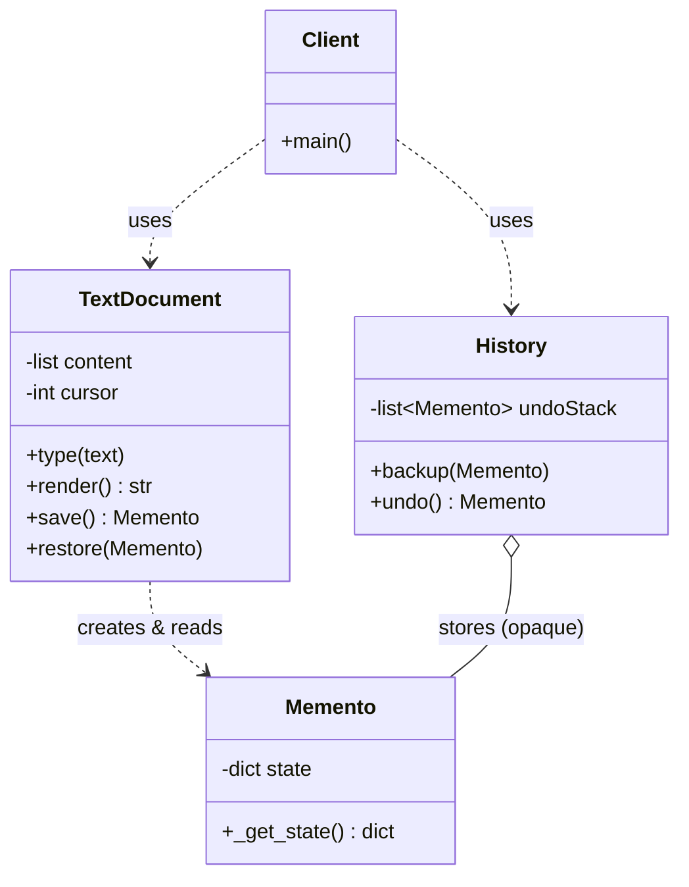

> [!NOTE]
> **📋 5-Minute Summary**
>
> **What this covers:** The Memento Pattern — captures and externalizes an object's internal state so it can be restored later, **without violating encapsulation**.
>
> **Key concepts:**
> - The problem: implementing undo/redo needs to save/restore an object's state, but exposing its private fields to a history manager breaks encapsulation.
> - Three roles: **Originator** (the object whose state we snapshot), **Memento** (an opaque state snapshot), **Caretaker** (holds the mementos, e.g., an undo stack — but can't read inside them).
> - The Originator creates mementos (`save()`) and restores from them (`restore(m)`). The Caretaker only *stores* mementos; it never inspects their contents.
> - The Memento is opaque to everyone except the Originator that made it — that's what preserves encapsulation.
>
> **Key takeaway:** Memento is the correct answer for "add undo/redo" — text editors, drawing apps, game save points, transactional rollback. It differs from Command-based undo: Command re-computes the reverse action; Memento restores a saved snapshot.

---
module: 06-lld
topic: Design Patterns
subtopic: Behavioral
status: unread
tags: [06-lld, system-design, design-patterns]
---
# Memento Pattern

## Question

You are building a text editor. The user types, then presses **Ctrl+Z** repeatedly to undo. Design an undo mechanism that can restore the editor's previous states — **without exposing the editor's internal buffer/cursor fields to the undo manager**.

Try it before reading on.

---

## Pattern Mindmap

```
[Memento Pattern]
├── Problem It Solves
│   ├── Undo/redo needs to save & restore object state over time
│   ├── Naive fix: expose private fields to a history manager → breaks encapsulation
│   └── Rolling back a failed multi-step operation to a known-good snapshot
├── Core Structure
│   ├── Originator: the object with state (Editor) — creates and consumes mementos
│   ├── Memento: opaque snapshot of Originator state (immutable)
│   ├── Caretaker: stores mementos (undo stack) but never looks inside them
│   ├── Originator.save() → returns a new Memento
│   └── Originator.restore(memento) → sets its state from the Memento
├── Encapsulation Boundary
│   ├── Only the Originator can read a Memento's contents
│   ├── Caretaker treats Memento as a black box (store/retrieve only)
│   └── In Java: nested private class / narrow interface enforces this
├── Analogy
│   ├── A video game save point: save() writes a save file, load() restores it
│   └── The save file is opaque — you don't hand-edit it, you just load it
├── When to Use
│   ├── Undo/redo, snapshots, checkpoints, transactional rollback
│   ├── You must restore state without breaking encapsulation
│   └── State capture must not leak the object's internal representation
├── Memento vs Command
│   ├── Memento: store a full snapshot, restore by loading it
│   ├── Command: store the operation, undo by computing the inverse
│   └── Command is memory-cheap for reversible ops; Memento handles irreversible ones
├── Trade-offs
│   ├── Memory: full snapshots are expensive → use incremental/diff mementos
│   ├── Caretaker must manage lifetime (bound the history size)
│   └── Deep vs shallow copy: a snapshot must not alias mutable live state
└── Interview Angles
    ├── How do you avoid unbounded memory growth?
    ├── Memento vs Command for undo — when each?
    └── How do you snapshot huge state cheaply (incremental / copy-on-write)?
```

## Problem Without the Pattern

```python
class Editor:
    def __init__(self):
        self.content = ""
        self.cursor = 0


class UndoManager:
    def __init__(self):
        self._history = []

    def backup(self, editor):
        # Reaches directly into the editor's private fields
        self._history.append((editor.content, editor.cursor))

    def undo(self, editor):
        editor.content, editor.cursor = self._history.pop()
```

**What breaks**:
1. **Encapsulation violation**: `UndoManager` knows the editor's exact internal shape (`content`, `cursor`). Add a `selection` field or rename `content`, and every caller that snapshots state breaks.
2. **Fragile coupling**: The history format is welded to the editor's private representation. The two classes can no longer evolve independently.
3. **No integrity guarantee**: Anyone holding the history tuple can mutate it, silently corrupting a "past" state.
4. **Aliasing bugs**: If a field is a mutable object (a list buffer), storing the reference means later edits mutate the "saved" snapshot too.

---

## Derive the Minimal Fix

The constraint: **only the object itself should be able to read/write its own saved state; the history holder must treat snapshots as opaque.**

Step 1 — the snapshot (Memento) is an opaque, immutable value the Originator produces and consumes:
```python
class EditorMemento:
    # Opaque to everyone except the Editor that created it.
    def __init__(self, content, cursor):
        self._content = content
        self._cursor = cursor
```

Step 2 — the Originator owns `save()` and `restore()`; it deep-copies to avoid aliasing:
```python
class Editor:
    def __init__(self):
        self.content = ""
        self.cursor = 0

    def save(self):
        return EditorMemento(self.content, self.cursor)   # snapshot my own state

    def restore(self, memento):
        self.content = memento._content                    # only I read the memento
        self.cursor = memento._cursor
```

Step 3 — the Caretaker just holds mementos; it never opens them:
```python
class History:
    def __init__(self):
        self._stack = []

    def push(self, memento):
        self._stack.append(memento)

    def pop(self):
        return self._stack.pop() if self._stack else None
```

Now adding a `selection` field changes only `Editor` and `EditorMemento`. `History` is untouched — it never knew the internals.

---

> **Category**: Behavioral Pattern
> **Purpose**: Capture and externalize an object's internal state so it can be restored later, without violating encapsulation.

## Real-Life Analogy

**A video game save point.**

When you reach a checkpoint, you hit "Save". The game writes a **save file** that captures your position, health, inventory, and quest progress. Later, if you die, you "Load" that save file and the game restores exactly where you were.

- The **game** is the *Originator* — only it knows how to write and read its own save format.
- The **save file** is the *Memento* — an opaque blob. You don't open it in a text editor and hand-tune your health; you just load it.
- The **save slot / menu** is the *Caretaker* — it lists and stores your saves but has no idea what's inside them.

**The key insight**: The save file is a sealed snapshot. Only the game can interpret it — which is exactly why you can add new stats to the game later without the save menu needing to change.

---

## When to Use

- You need **undo/redo**, checkpoints, or snapshots of an object's state.
- You must **restore prior state without exposing** the object's internal representation.
- You want **transactional rollback** — take a snapshot, attempt a risky multi-step change, and roll back to the snapshot on failure.
- The set of state to save is well-defined and the object should own how it's captured/restored.

---

## Understanding the Problem

Bad code — the caretaker reaches into private state and aliases mutable data:

```python
class Canvas:
    def __init__(self):
        self.shapes = []          # mutable list

# elsewhere:
history.append(canvas.shapes)     # stores a REFERENCE, not a copy
canvas.shapes.append(circle)      # oops — also mutated the "saved" snapshot
```

**Problems**: The history now shares the live list, so "undo" restores a list that kept changing. And any code holding the reference can corrupt past states. Encapsulation and integrity are both gone.

---

## Solution: Memento Pattern

```python
from abc import ABC
from copy import deepcopy


# 1. Memento — opaque snapshot. Only the Originator interprets its contents.
class Memento:
    def __init__(self, state):
        self._state = deepcopy(state)   # defensive deep copy — no aliasing

    def _get_state(self):               # "package-private" — for the Originator only
        return deepcopy(self._state)


# 2. Originator — the object whose state we snapshot and restore
class TextDocument:
    def __init__(self):
        self._content = []
        self._cursor = 0

    def type(self, text):
        self._content.append(text)
        self._cursor += len(text)

    def render(self):
        return "".join(self._content)

    def save(self):
        return Memento({"content": self._content, "cursor": self._cursor})

    def restore(self, memento):
        state = memento._get_state()
        self._content = state["content"]
        self._cursor = state["cursor"]


# 3. Caretaker — holds mementos (undo stack). Never inspects them.
class History:
    def __init__(self):
        self._undo_stack = []

    def backup(self, memento):
        self._undo_stack.append(memento)

    def undo(self):
        return self._undo_stack.pop() if self._undo_stack else None


# Client
if __name__ == "__main__":
    doc = TextDocument()
    history = History()

    doc.type("Hello ")
    history.backup(doc.save())      # checkpoint 1

    doc.type("World")
    history.backup(doc.save())      # checkpoint 2

    doc.type("!!!")
    print(doc.render())             # "Hello World!!!"

    doc.restore(history.undo())     # back to checkpoint 2
    print(doc.render())             # "Hello World"

    doc.restore(history.undo())     # back to checkpoint 1
    print(doc.render())             # "Hello "
```

### Class Diagram



---

## How Memento Pattern Resolves the Issues

| Issue | Solution |
|---|---|
| **Caretaker knows internal fields** | Caretaker only stores `Memento` objects — it never reads their contents. Internals stay hidden. |
| **History coupled to representation** | Only `Originator` + `Memento` know the state shape. Adding a field touches just those two. |
| **Aliasing mutable state** | `Memento` deep-copies on capture and on restore, so snapshots never share live objects. |
| **Snapshot integrity** | The `Memento` exposes no public setters; its state can't be tampered with after capture. |

---

## Memento vs. Command (both do undo)

| Aspect | Memento | Command |
|---|---|---|
| **How undo works** | Restore a saved **snapshot** of prior state. | Re-execute the **inverse operation**. |
| **Memory** | Stores full/partial state per step (can be heavy). | Stores just the operation + params (light). |
| **Best when** | State is small/snapshottable, or the op is **irreversible** (can't compute an inverse). | Operations are cleanly reversible (`add` ↔ `remove`). |
| **Example** | Game save, document snapshot, DB savepoint. | Editor typing where each keystroke has an obvious inverse. |

Many real editors combine them: Command for cheap reversible edits, Memento snapshots every N steps as safety checkpoints.

---

## When NOT to Use

- If snapshots are **huge** and taken frequently — naive full copies blow up memory. Use incremental/diff mementos or copy-on-write instead.
- If the operations are cheaply reversible, **Command-based undo** is lighter than storing full state.
- If nothing outside the object ever needs to store its state, you don't need the pattern at all.

---

## Pros & Cons

**Pros**
- Preserves encapsulation — the object's internals never leak to the caretaker.
- Cleanly separates snapshot storage (Caretaker) from snapshot creation (Originator).
- Enables undo/redo, checkpoints, and transactional rollback with a clear boundary.
- Simplifies the Originator — it isn't cluttered with version-history bookkeeping.

**Cons**
- Full snapshots can be memory-expensive; the Caretaker must bound history size.
- If the Originator's state is large or changes often, snapshotting is costly (mitigate with incremental mementos).
- In languages without nested/friend access, keeping the Memento truly opaque takes discipline.

---

## Applied In

This concept is used by several problems in this repo:

**Low-Level Design**

- [Design a Text Editor](../../05-problems/04-advanced-niche/31-design-text-editor.md)
- [Design a Version Control System](../../05-problems/04-advanced-niche/29-design-version-control.md)
- [Design Chess](../../05-problems/02-frequent-problems/07-design-chess.md)
- [Design Tic-Tac-Toe](../../05-problems/01-core-problems/03-design-tic-tac-toe.md)
