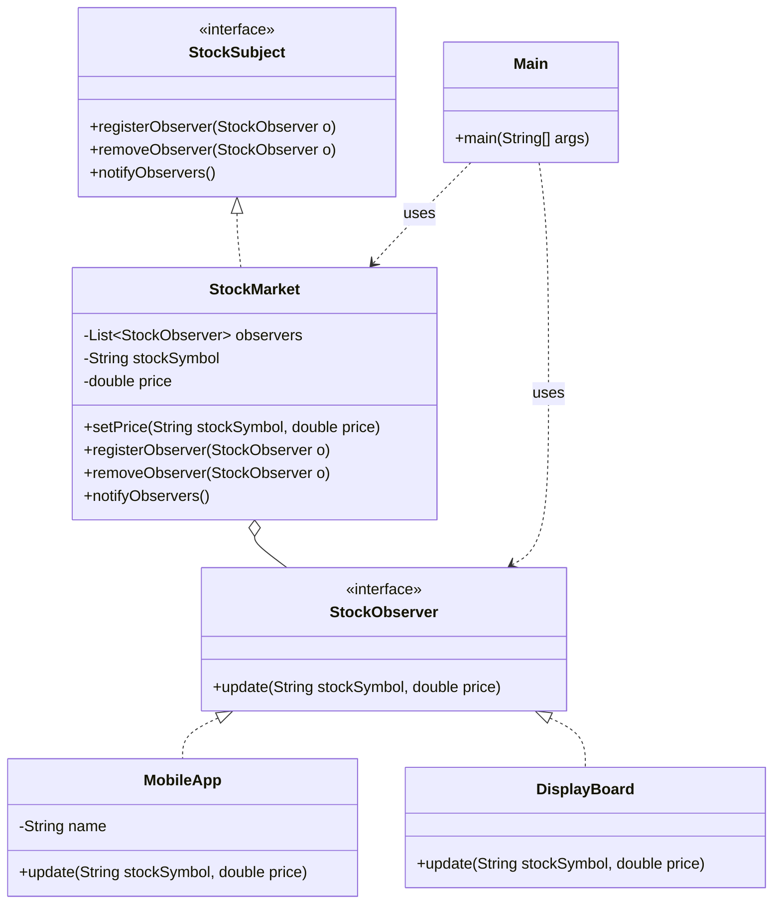

> [!NOTE]
> **📋 5-Minute Summary**
>
> **What this covers:** The Observer Pattern — defines a subscription mechanism to notify multiple objects about any events that happen to the object they're observing.
>
> **Key concepts:**
> - The problem: tightly coupling a state-holding object (Subject) to the objects that need to know about its changes (Observers). Hardcoding `chart.update()` inside `StockMarket`.
> - The fix: the Subject maintains a list of Observers (which implement an `Observer` interface).
> - Publish/Subscribe: Observers call `subject.subscribe(this)`. When the Subject changes, it loops through the list and calls `observer.update()` on all of them.
> - Push vs Pull: The Subject can "push" the new data in the `update(data)` method, or it can just notify `update()`, and the Observer "pulls" the data via `subject.getState()`.
> - Use cases: Model-View-Controller (MVC) where Views observe the Model; event handling systems (button clicks); real-time feeds.
>
> **Key takeaway:** Observer is extremely common in LLD (e.g., "Design a Notification System" or "Design a Live Cricket Scoreboard"). It's the OOP foundation of event-driven architectures.

---
module: 06-lld
topic: Design Patterns
subtopic: Behavioral
status: unread
tags: [06-lld, system-design, design-patterns]
---
# Observer Pattern

> 🔵 **Java idiom:** A `Subject` maintains `List<Observer>` and calls `update()` on each; observers register/deregister. **Note the legacy `java.util.Observer`/`Observable` are deprecated since Java 9** (don't cite them) — the modern JDK equivalents are `PropertyChangeListener`, `java.util.concurrent.Flow` (reactive streams / back-pressure), and framework events (Spring `@EventListener`, Swing/AWT listeners). **Interview gotcha:** call out the failure modes — memory leaks if observers never deregister (use weak references or explicit removal), the risk of notification during iteration (copy the list or use `CopyOnWriteArrayList`), and *push vs pull* (send the changed data in `update()` vs let observers query the subject back). This is the backbone of event-driven and MVC architectures.

## Question

A `StockMarket` class holds the current price of a stock. A `PriceAlert`, a `Chart`, and a `NewsFeed` all need to update when the stock price changes. Write the code inside `StockMarket.setPrice()` that tells all three components about the change.

Try it before reading on.

---

## Pattern Mindmap

```
[Observer Pattern]
├── Problem It Solves
│   ├── StockMarket.setPrice() hardcoded to call PriceAlert, Chart, NewsFeed
│   ├── Adding/removing a listener requires modifying StockMarket
│   └── StockMarket should not know about its observers
├── Core Structure
│   ├── Subject (Observable): StockMarket maintains List<Observer>
│   │   ├── subscribe(Observer o), unsubscribe(Observer o)
│   │   └── notifyObservers() iterates and calls each o.update()
│   ├── Observer interface: update(price) or update(Event)
│   └── Concrete observers: PriceAlert, Chart, NewsFeed implement Observer
├── Push vs Pull Model
│   ├── Push: subject sends data in update(price) — observer gets what subject decides
│   ├── Pull: update() passes subject reference; observer calls subject.getPrice()
│   └── Pull: observer gets exactly what it needs; push: simpler but may send excess data
├── Analogy
│   ├── YouTube subscription: channel (subject) notifies subscribers (observers) on upload
│   └── Subscriber list is dynamic — subscribe/unsubscribe any time
├── Lapsed Listener (Memory Leak)
│   ├── Observer registered but never unsubscribed when widget is destroyed
│   ├── Subject holds strong reference → observer cannot be GC'd
│   └── Fix: unsubscribe in onDestroy/close; use WeakReference for listeners
├── When to Use
│   ├── One-to-many dependency: one state change, many components must react
│   ├── Decoupled event system (UI events, stock tickers, messaging)
│   └── Publisher/subscriber systems (event bus, message queue)
├── Java Built-ins
│   ├── java.util.Observable (deprecated in Java 9)
│   ├── PropertyChangeListener/PropertyChangeSupport
│   └── Reactor/RxJava: reactive streams build on Observer
├── Trade-offs
│   ├── Unexpected cascading updates: one change → chain of reactions
│   ├── Delivery order is undefined (iterate order = registration order)
│   └── Memory leaks if unsubscribe is forgotten
└── Interview Angles
    ├── Push vs pull — what are the trade-offs?
    ├── How do you prevent the lapsed listener memory leak?
    └── How does Observer relate to event-driven architecture at scale?
```

## Problem Without the Pattern

The direct approach — `StockMarket` calls each component explicitly:

```java
class StockMarket {
    private double price;
    private final PriceAlert alert;
    private final Chart chart;
    private final NewsFeed feed;

    StockMarket(PriceAlert alert, Chart chart, NewsFeed feed) {
        this.alert = alert;
        this.chart = chart;
        this.feed = feed;
    }

    void setPrice(double price) {
        this.price = price;
        alert.onPriceChanged(price);  // hardcoded dependency
        chart.onPriceChanged(price);  // hardcoded dependency
        feed.onPriceChanged(price);   // hardcoded dependency
    }
}
```

**What breaks**:
1. **Tight coupling**: `StockMarket` must know about `PriceAlert`, `Chart`, and `NewsFeed`. It can't function without them.
2. **OCP violation**: Adding a 4th subscriber (e.g., `MobileNotification`) means editing `StockMarket.set_price()`.
3. **SRP violation**: `StockMarket` manages stock prices AND knows the notification routing table.
4. **Untestable**: You cannot test price changes without constructing all three dependent objects.

---

## Derive the Minimal Fix

The constraint: **`StockMarket` must not know who is listening**.

Step 1 — extract a common interface all subscribers implement:
```java
interface Observer {
    void onPriceChanged(double price);
}
```

Step 2 — `StockMarket` holds a list of `Observer`, never concrete types:
```java
class StockMarket {
    private final List<Observer> observers = new ArrayList<>();
    private double price;

    void addObserver(Observer o) {
        observers.add(o);
    }

    void removeObserver(Observer o) {
        observers.remove(o);
    }
}
```

Step 3 — on state change, iterate the list:
```java
    void setPrice(double price) {
        this.price = price;
        for (Observer o : observers) {
            o.onPriceChanged(price);
        }
    }
```

Adding `MobileNotification` is now: implement `Observer`, call `market.add_observer(MobileNotification())`. Zero edits to `StockMarket`. That is the pattern.

---

> **Category**: Behavioral Pattern
> **Purpose**: Define a one-to-many dependency so that when one object changes state, all its dependents are notified and updated automatically.

## Real-Life Analogy

**YouTube subscriptions.**

When a channel (Subject) uploads a new video, every subscriber (Observer) gets a notification automatically. The channel does not know who exactly is subscribed — it just fires the event. Subscribers can subscribe or unsubscribe at any time. The channel doesn't care.

- The **channel** is the Subject: it maintains a list of subscribers and calls `notify()` when new content is uploaded.
- The **subscriber** is the Observer: it implements `update()` which defines what happens when a notification arrives (show a bell icon, send an email, play a sound).

The channel and subscribers are **loosely coupled**: the channel only knows subscribers implement some notification interface. It has no idea whether they're a mobile app, a desktop app, or an email digest service.

---

## When to Use

- Event handling systems (UI listeners, webhook handlers).
- Pub-Sub scenarios (stock market, news feeds, IoT sensor updates).
- Keeping UI in sync with data models (MVC: Model changes → View updates).
- Any time one change in one object should trigger updates in many objects, without hardcoding those relationships.

---

## Implementation

### Example: Stock Market Ticker

```java
// 1. Subject (Observable)
interface StockSubject {
    void registerObserver(StockObserver o);
    void removeObserver(StockObserver o);
    void notifyObservers();
}


class StockMarket implements StockSubject {
    private final List<StockObserver> observers = new ArrayList<>();
    private String stockSymbol;
    private double price;

    void setPrice(String stockSymbol, double price) {
        this.stockSymbol = stockSymbol;
        this.price = price;
        notifyObservers();  // State changed — notify ALL subscribers automatically
    }

    public void registerObserver(StockObserver o) {
        observers.add(o);
    }

    public void removeObserver(StockObserver o) {
        observers.remove(o);
    }

    public void notifyObservers() {
        for (StockObserver observer : observers) {
            observer.update(stockSymbol, price);
        }
    }
}


// 2. Observer Interface
interface StockObserver {
    void update(String stockSymbol, double price);
}


// 3. Concrete Observers — each decides what to do with the notification
class MobileApp implements StockObserver {
    private final String name;

    MobileApp(String name) {
        this.name = name;
    }

    public void update(String stockSymbol, double price) {
        System.out.println("Mobile App (" + name + "): " + stockSymbol + " is now $" + price);
    }
}


class DisplayBoard implements StockObserver {
    public void update(String stockSymbol, double price) {
        System.out.println("Wall Display: " + stockSymbol + " -> " + price);
    }
}


// Usage
public class Main {
    public static void main(String[] args) {
        StockMarket nasdaq = new StockMarket();

        MobileApp app1 = new MobileApp("User A");
        MobileApp app2 = new MobileApp("User B");
        DisplayBoard board = new DisplayBoard();

        // Subscribe
        nasdaq.registerObserver(app1);
        nasdaq.registerObserver(app2);
        nasdaq.registerObserver(board);

        // State change — all three notified
        System.out.println("--- Market Open ---");
        nasdaq.setPrice("AAPL", 150.00);

        // User B unsubscribes — only app1 and board notified from now on
        System.out.println("--- Market Update ---");
        nasdaq.removeObserver(app2);
        nasdaq.setPrice("AAPL", 155.00);
    }
}
```

### Class Diagram



---

## Output

```
--- Market Open ---
Mobile App (User A): AAPL is now $150.0
Mobile App (User B): AAPL is now $150.0
Wall Display: AAPL -> 150.0
--- Market Update ---
Mobile App (User A): AAPL is now $155.0
Wall Display: AAPL -> 155.0
```

---

## Push vs Pull Model

### Push Model (Used above)
Subject sends data directly to observer: `observer.update(data)`
- **Pros**: Observer gets the relevant data immediately. No extra call needed.
- **Cons**: Subject must know what data the observer needs. Creates coupling if different observers need different subsets of data.

### Pull Model
Subject notifies that *something changed*, observer pulls the data it needs: `observer.update()` → `subject.get_data()`
- **Pros**: Flexible — each observer fetches only the fields it cares about.
- **Cons**: Two round trips (notify + get). Observer needs a reference to the subject.

---

## Real-World Examples

1. **Swing/AWT listeners**: `button.addActionListener(...)` callbacks.
2. **React/Redux**: Store updates → connected components re-render.
3. **Kafka/RabbitMQ**: Producers publish events; consumers subscribe. Distributed Observer.
4. **YouTube**: Channel uploads → all subscribers notified.
5. **Git Hooks**: `post-commit` hook fires after every commit, notifying registered scripts.

---

## Java Built-in Support

Java's event-driven approach often uses functional listener lists or `PropertyChangeSupport`:

```java
import java.util.function.BiConsumer;

// Simple observable mixin using a list of listener callbacks
class Observable {
    private final List<BiConsumer<Object, Object>> listeners = new ArrayList<>();

    void addListener(BiConsumer<Object, Object> fn) {
        listeners.add(fn);
    }

    void removeListener(BiConsumer<Object, Object> fn) {
        listeners.remove(fn);
    }

    protected void notifyListeners(Object oldValue, Object newValue) {
        for (BiConsumer<Object, Object> fn : listeners) {
            fn.accept(oldValue, newValue);
        }
    }
}


class NewsAgency extends Observable {
    private String news;

    void setNews(String value) {
        String old = this.news;
        this.news = value;
        notifyListeners(old, value);
    }
}
```

---

## Pros & Cons

**Pros:**
- **Loose Coupling**: Subject only knows observers implement the observer interface — not their concrete types.
- **Dynamic Relationships**: Subscribe/unsubscribe at runtime. The channel list is mutable.
- **Open/Closed**: Add new observer types without touching the Subject at all.

**Cons:**
- **Memory Leaks**: "Lapsed Listener Problem" — if you register but never deregister, observers are never garbage collected. Common in GUI frameworks.
- **Ordering**: Notification order among observers is typically undefined.
- **Cascade effects**: One notification can trigger updates that trigger more notifications. Hard to trace in complex systems.

---

## Applied In

This concept is used by **12 problems** in this repo — a representative selection:

**Low-Level Design**

- [Design a Nested Comment System](../../05-problems/02-frequent-problems/10-design-comment-system.md)
- [Design a Food Delivery System](../../05-problems/02-frequent-problems/14-design-food-delivery.md)
- [Design Locker Service](../../05-problems/02-frequent-problems/15-design-locker-service.md)
- [Design Notification System](../../05-problems/02-frequent-problems/16-design-notification-system.md)
- [Design Mentorship Platform](../../05-problems/03-domain-specific/18-design-mentorship-platform.md)
- [Design a Library Management System](../../05-problems/03-domain-specific/20-design-library-management.md)
- [Design an Order Management System](../../05-problems/03-domain-specific/21-design-order-management.md)
- [Design a Ride Sharing System](../../05-problems/03-domain-specific/22-design-ride-sharing.md)
- …and 4 more

