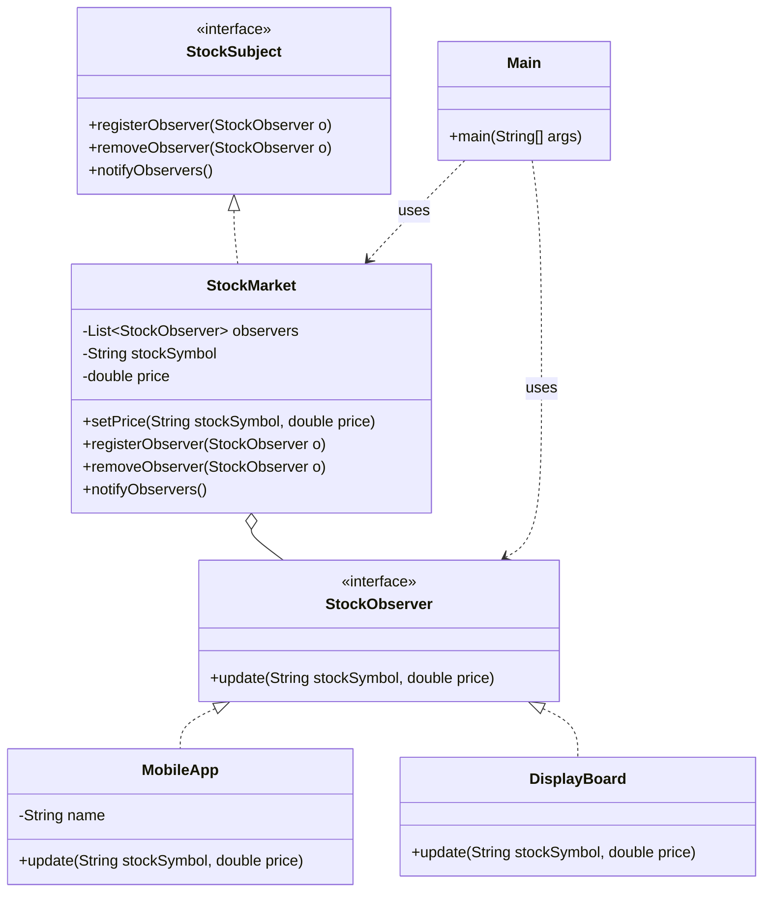

# Observer Pattern

> **Category**: Behavioral Pattern
> **Purpose**: Define a one-to-many dependency so that when one object changes state, all its dependents are notified and updated automatically.

## Real-Life Analogy

**YouTube subscriptions.**

When a channel (Subject) uploads a new video, every subscriber (Observer) gets a notification automatically. The channel does not know who exactly is subscribed — it just fires the event. Subscribers can subscribe or unsubscribe at any time. The channel doesn't care.

- The **channel** is the Subject: it maintains a list of subscribers and calls `notify()` when new content is uploaded.
- The **subscriber** is the Observer: it implements `update()` which defines what happens when a notification arrives (show a bell icon, send an email, play a sound).

The channel and subscribers are **loosely coupled**: the channel only knows subscribers implement some notification interface. It has no idea whether they're a mobile app, a desktop app, or an email digest service.

---

## When to Use

- Event handling systems (UI listeners, webhook handlers).
- Pub-Sub scenarios (stock market, news feeds, IoT sensor updates).
- Keeping UI in sync with data models (MVC: Model changes → View updates).
- Any time one change in one object should trigger updates in many objects, without hardcoding those relationships.

---

## Implementation

### Example: Stock Market Ticker

```java
import java.util.ArrayList;
import java.util.List;

// 1. Subject (Observable)
interface StockSubject {
    void registerObserver(StockObserver o);
    void removeObserver(StockObserver o);
    void notifyObservers();
}

class StockMarket implements StockSubject {
    private List<StockObserver> observers;
    private String stockSymbol;
    private double price;
    
    public StockMarket() {
        observers = new ArrayList<>();
    }
    
    public void setPrice(String stockSymbol, double price) {
        this.stockSymbol = stockSymbol;
        this.price = price;
        notifyObservers(); // State changed — notify ALL subscribers automatically
    }
    
    @Override
    public void registerObserver(StockObserver o) {
        observers.add(o);
    }
    
    @Override
    public void removeObserver(StockObserver o) {
        observers.remove(o);
    }
    
    @Override
    public void notifyObservers() {
        for (StockObserver observer : observers) {
            observer.update(stockSymbol, price);
        }
    }
}

// 2. Observer Interface
interface StockObserver {
    void update(String stockSymbol, double price);
}

// 3. Concrete Observers — each decides what to do with the notification
class MobileApp implements StockObserver {
    private String name;
    
    public MobileApp(String name) { this.name = name; }
    
    @Override
    public void update(String stockSymbol, double price) {
        System.out.println("Mobile App (" + name + "): " + stockSymbol + " is now $" + price);
    }
}

class DisplayBoard implements StockObserver {
    @Override
    public void update(String stockSymbol, double price) {
        System.out.println("Wall Display: " + stockSymbol + " -> " + price);
    }
}

// Usage
public class Main {
    public static void main(String[] args) {
        StockMarket nasdaq = new StockMarket();
        
        StockObserver app1 = new MobileApp("User A");
        StockObserver app2 = new MobileApp("User B");
        StockObserver board = new DisplayBoard();
        
        // Subscribe
        nasdaq.registerObserver(app1);
        nasdaq.registerObserver(app2);
        nasdaq.registerObserver(board);
        
        // State change — all three notified
        System.out.println("--- Market Open ---");
        nasdaq.setPrice("AAPL", 150.00);
        
        // User B unsubscribes — only app1 and board notified from now on
        System.out.println("--- Market Update ---");
        nasdaq.removeObserver(app2);
        nasdaq.setPrice("AAPL", 155.00);
    }
}
```

### Class Diagram



---

## Output

```
--- Market Open ---
Mobile App (User A): AAPL is now $150.0
Mobile App (User B): AAPL is now $150.0
Wall Display: AAPL -> 150.0
--- Market Update ---
Mobile App (User A): AAPL is now $155.0
Wall Display: AAPL -> 155.0
```

---

## Push vs Pull Model

### Push Model (Used above)
Subject sends data directly to observer: `observer.update(data)`
- **Pros**: Observer gets the relevant data immediately. No extra call needed.
- **Cons**: Subject must know what data the observer needs. Creates coupling if different observers need different subsets of data.

### Pull Model
Subject notifies that *something changed*, observer pulls the data it needs: `observer.update()` → `subject.getData()`
- **Pros**: Flexible — each observer fetches only the fields it cares about.
- **Cons**: Two round trips (notify + get). Observer needs a reference to the subject.

---

## Real-World Examples

1. **Java Swing**: `addActionListener()` — button clicks notify registered listeners.
2. **React/Redux**: Store updates → connected components re-render.
3. **Kafka/RabbitMQ**: Producers publish events; consumers subscribe. Distributed Observer.
4. **YouTube**: Channel uploads → all subscribers notified.
5. **Git Hooks**: `post-commit` hook fires after every commit, notifying registered scripts.

---

## Java Built-in Support

Java had `java.util.Observable` (now deprecated). Use `PropertyChangeListener` instead:

```java
import java.beans.PropertyChangeListener;
import java.beans.PropertyChangeSupport;

class NewsAgency {
    private String news;
    private PropertyChangeSupport support;

    public NewsAgency() {
        support = new PropertyChangeSupport(this);
    }

    public void addPropertyChangeListener(PropertyChangeListener pcl) {
        support.addPropertyChangeListener(pcl);
    }

    public void setNews(String value) {
        support.firePropertyChange("news", this.news, value);
        this.news = value;
    }
}
```

---

## Pros & Cons

**Pros:**
- **Loose Coupling**: Subject only knows observers implement the observer interface — not their concrete types.
- **Dynamic Relationships**: Subscribe/unsubscribe at runtime. The channel list is mutable.
- **Open/Closed**: Add new observer types without touching the Subject at all.

**Cons:**
- **Memory Leaks**: "Lapsed Listener Problem" — if you register but never deregister, observers are never garbage collected. Common in Android and Swing.
- **Ordering**: Notification order among observers is typically undefined.
- **Cascade effects**: One notification can trigger updates that trigger more notifications. Hard to trace in complex systems.
