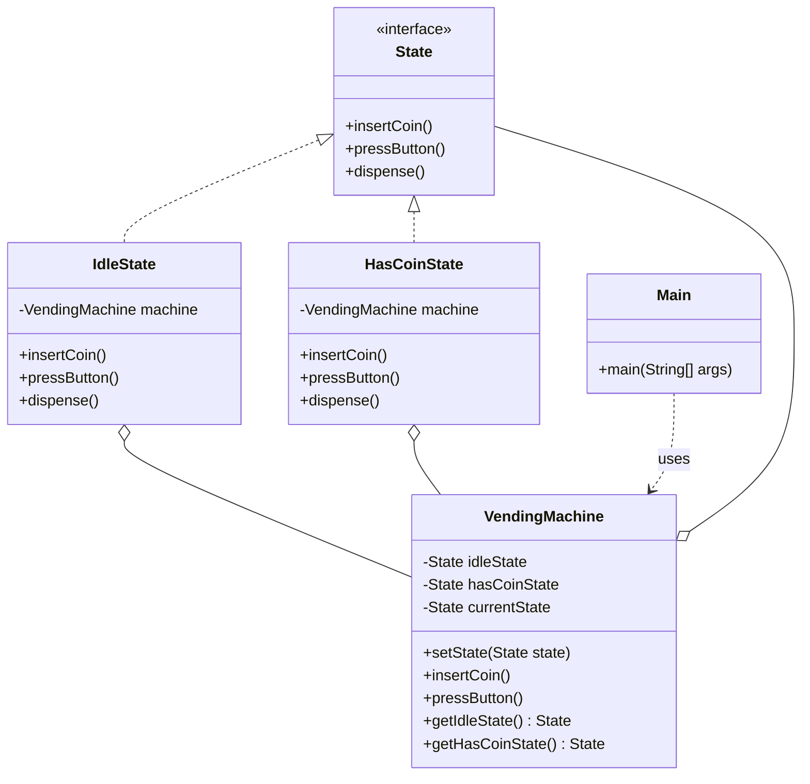

> [!NOTE]
> **📋 5-Minute Summary**
>
> **What this covers:** The State Pattern — lets an object alter its behavior when its internal state changes. It appears as if the object changed its class.
>
> **Key concepts:**
> - The problem: massive `switch(currentState)` statements inside every method of a class (e.g., `insertCoin()` behaves differently if state is `IDLE` vs `SOLD_OUT`).
> - The fix: extract the state-specific behaviors into separate classes.
> - Interface: create a `State` interface with methods for all possible actions (`insertCoin`, `dispense`).
> - Concrete States: `IdleState`, `HasCoinState`. Each implements the actions valid for that state (and throws exceptions for invalid ones).
> - Context: the main object (`VendingMachine`) holds a reference to the current `State` object and delegates all actions to it. The state objects themselves usually trigger the transition to the next state.
>
> **Key takeaway:** State is the only acceptable answer for "Design a Vending Machine" or "Design an Elevator". It transforms a spaghetti mess of `if/else` state checks into clean, polymorphic classes.

---
module: 06-lld
topic: Design Patterns
subtopic: Behavioral
status: unread
tags: [06-lld, system-design, design-patterns]
---
# State Pattern

## Question

You are designing a `VendingMachine`. It has four states: `IDLE`, `HAS_COIN`, `DISPENSING`, `OUT_OF_STOCK`. Write `insertCoin()`, `selectProduct()`, and `dispense()` methods for the machine.

Try it before reading on.

---

## Pattern Mindmap

```
[State Pattern]
├── Problem It Solves
│   ├── VendingMachine: 4 states × 3 actions = 12 if/else branches
│   ├── Add new state: must touch every method to add new branch
│   └── Complexity grows as O(S × A) — unmanageable
├── Core Structure
│   ├── State interface: insertCoin(), selectProduct(), dispense()
│   ├── Concrete states: IdleState, HasCoinState, DispensingState, OutOfStockState
│   ├── Context: VendingMachine holds current State reference
│   ├── Context delegates: insertCoin() calls currentState.insertCoin()
│   └── States transition context: state.insertCoin() calls context.setState(new HasCoinState())
├── Transition Ownership
│   ├── State objects own their own transitions
│   ├── IdleState.insertCoin() → context.setState(new HasCoinState())
│   ├── HasCoinState.dispense() → context.setState(new IdleState())
│   └── Each state only handles its own valid transitions — invalid actions throw
├── Analogy
│   ├── Traffic light: each color knows when to transition to the next color
│   └── The light (context) delegates behavior to the current signal (state)
├── When to Use
│   ├── Object behavior depends heavily on its current state
│   ├── Large switch/if-else in methods based on state field
│   └── State transitions are complex or need to be self-contained
├── State vs Strategy
│   ├── Strategy: algorithms are interchangeable; client chooses
│   ├── State: transitions are internal — state decides next state
│   └── State pattern: context changes state itself; Strategy: client swaps strategy
├── Trade-offs
│   ├── More classes (one per state), but each is small and focused
│   ├── Adding a new state: one new class + update transitions in neighboring states
│   └── State explosion if states are too fine-grained
└── Interview Angles
    ├── How is State different from Strategy?
    ├── Who owns the transition logic — context or state?
    └── How do you model hierarchical states (nested states)?
```

## Problem Without the Pattern

```python
class VendingMachine:
    def __init__(self):
        self._state = "IDLE"

    def insert_coin(self):
        if self._state == "IDLE":
            self._state = "HAS_COIN"
            print("Coin accepted")
        elif self._state == "HAS_COIN":
            print("Coin already inserted")
        elif self._state == "DISPENSING":
            print("Please wait, dispensing")
        elif self._state == "OUT_OF_STOCK":
            print("Machine out of stock")

    def select_product(self):
        if self._state == "IDLE":
            print("Please insert coin first")
        elif self._state == "HAS_COIN":
            self._state = "DISPENSING"
        # ... more branches

    # dispense() — another full set of branches
```

**What breaks**:
1. **O(S × A) branching**: S states × A actions = branches that grow quadratically. 4 states × 4 actions = 16 blocks, all in one class.
2. **OCP violation**: Adding a new state (e.g., `MAINTENANCE`) requires editing every method.
3. **Logic scatter**: The behavior for a given state is split across all methods, not grouped in one place.
4. **Invalid transitions compile silently**: Nothing in the type system prevents calling `dispense()` in `IDLE` — only a runtime string check catches it.

---

## Derive the Minimal Fix

The constraint: **each state should own its own behavior, and the machine delegates to the current state**.

Step 1 — extract a `State` interface where each action is a method:
```python
from abc import ABC, abstractmethod

class State(ABC):
    @abstractmethod
    def insert_coin(self):
        pass

    @abstractmethod
    def select_product(self):
        pass

    @abstractmethod
    def dispense(self):
        pass
```

Step 2 — each state is its own class that owns the logic for that state:
```python
class IdleState(State):
    def __init__(self, machine):
        self._machine = machine

    def insert_coin(self):
        self._machine.set_state(self._machine.get_has_coin_state())

    def select_product(self):
        print("Insert coin first")

    def dispense(self):
        print("Insert coin first")


class HasCoinState(State):
    def __init__(self, machine):
        self._machine = machine

    def insert_coin(self):
        print("Coin already inserted")

    def select_product(self):
        self._machine.set_state(self._machine.get_dispensing_state())

    def dispense(self):
        print("Select product first")
```

Step 3 — the machine holds a reference to the current state and delegates:
```python
class VendingMachine:
    def __init__(self):
        self._current_state = None

    def insert_coin(self):
        self._current_state.insert_coin()

    def select_product(self):
        self._current_state.select_product()

    def dispense(self):
        self._current_state.dispense()

    def set_state(self, s):
        self._current_state = s
```

Adding `MAINTENANCE` is now one new `MaintenanceState` class. The existing states are untouched.

---

> **Category**: Behavioral Pattern
> **Purpose**: Allows an object to alter its behavior when its internal state changes. The object will appear to change its class.

## Real-Life Analogy

**A traffic light.**

A traffic light has three states: Green, Yellow, Red. Each behaves completely differently:
- **Green**: Cars go. If you "request next state", it transitions to Yellow.
- **Yellow**: Slow down. If you "request next state", it transitions to Red.
- **Red**: Stop. If you "request next state", it transitions to Green.

The traffic light object is the same object throughout. But its behavior changes entirely based on its current state. The transition rules are built into each state — Green knows it should go to Yellow, not Red. You don't need a massive `if state == GREEN ... else if state == YELLOW ...` block.

**The key insight**: The object *delegates* its behavior to the current state object. Swapping the state object changes how the object behaves — no `if-else`, no giant switch.

---

## When to Use

- An object's behavior depends on its **internal state** and must change at runtime.
- You have **large conditional blocks** (`if/switch`) based on state that affect multiple methods.
- **State transitions** have rules that should be encoded in the states themselves, not the context class.
- Adding a new state should require only a new class, not changes to every method in the context.

---

## Understanding the Problem

Bad code — state as a string, logic spread everywhere:

```python
def insert_coin(self):
    if self._state == "Idle":
        self.accept()
    elif self._state == "HasCoin":
        self.reject()
    elif self._state == "OutOfStock":
        self.reject()

def press_button(self):
    if self._state == "Idle":
        print("Insert coin first")
    elif self._state == "HasCoin":
        self.dispense()  # + transition to Idle
    elif self._state == "OutOfStock":
        print("Out of stock")
```

**Problems**: Adding a new state (`Dispensing`, `Refunding`) requires modifying every method. The state transition logic is spread across all methods. Violates OCP.

---

## Solution: State Pattern

```python
from abc import ABC, abstractmethod


# 1. State Interface
class State(ABC):
    @abstractmethod
    def insert_coin(self):
        pass

    @abstractmethod
    def press_button(self):
        pass

    @abstractmethod
    def dispense(self):
        pass


# 2. Context (The Machine)
class VendingMachine:
    def __init__(self):
        self._idle_state = IdleState(self)
        self._has_coin_state = HasCoinState(self)
        self._current_state = self._idle_state

    def set_state(self, state):
        self._current_state = state

    def insert_coin(self):
        self._current_state.insert_coin()

    def press_button(self):
        self._current_state.press_button()

    def get_idle_state(self):
        return self._idle_state

    def get_has_coin_state(self):
        return self._has_coin_state


# 3. Concrete States — each state knows its own rules and transitions
class IdleState(State):
    def __init__(self, machine):
        self._machine = machine

    def insert_coin(self):
        print("Coin inserted")
        self._machine.set_state(self._machine.get_has_coin_state())  # Transition built into the state

    def press_button(self):
        print("Insert coin first")

    def dispense(self):
        print("Insert coin first")


class HasCoinState(State):
    def __init__(self, machine):
        self._machine = machine

    def insert_coin(self):
        print("Coin already inserted")

    def press_button(self):
        print("Button pressed — dispensing...")
        self._machine.set_state(self._machine.get_idle_state())  # Transition back to Idle

    def dispense(self):
        print("Dispensing...")


# Client
if __name__ == "__main__":
    vm = VendingMachine()
    vm.insert_coin()   # State changes to HasCoin
    vm.press_button()  # Action allowed, state reverts to Idle
    vm.press_button()  # "Insert coin first" — correct behavior for Idle state
```

### Class Diagram



---

## How State Pattern Resolves the Issues

| Issue | Solution |
|---|---|
| **Giant if-else across every method** | Each state class contains only its own behavior. No conditionals anywhere. |
| **Adding a new state modifies all methods** | Add a new state class. Context methods (`insert_coin`, `press_button`) never change. |
| **Transition logic scattered** | Each state decides its own transitions: `IdleState.insert_coin()` transitions to `HasCoinState`. The context just delegates. |
| **Violates OCP** | New state = new class. Zero changes to existing code. |

---

## State vs. Strategy

| Aspect | State | Strategy |
|---|---|---|
| **Who switches?** | The object switches its own state internally as side effect of actions. | The client typically chooses and injects the strategy. |
| **Do states know each other?** | Yes — `IdleState` knows to transition to `HasCoinState`. | No — strategies are independent algorithms. |
| **Purpose** | Model state machines with transition rules. | Swap interchangeable algorithms. |

---

## When NOT to Use

- If the object has only 2 states and the transitions are trivial, a simple boolean flag is clearer.
- If states don't have distinct behavior — state pattern adds classes without simplifying logic.

---

## Pros & Cons

**Pros**
- Eliminates large conditional chains based on state.
- Each state class is small and focused (Single Responsibility).
- Adding new states doesn't break existing ones (Open/Closed Principle).
- Transition logic is localized to each state — easy to audit.

**Cons**
- Increases class count — one class per state.
- States are coupled to the context class (need a reference to transition back).
- Can be overkill for objects with only 2-3 trivial states.
