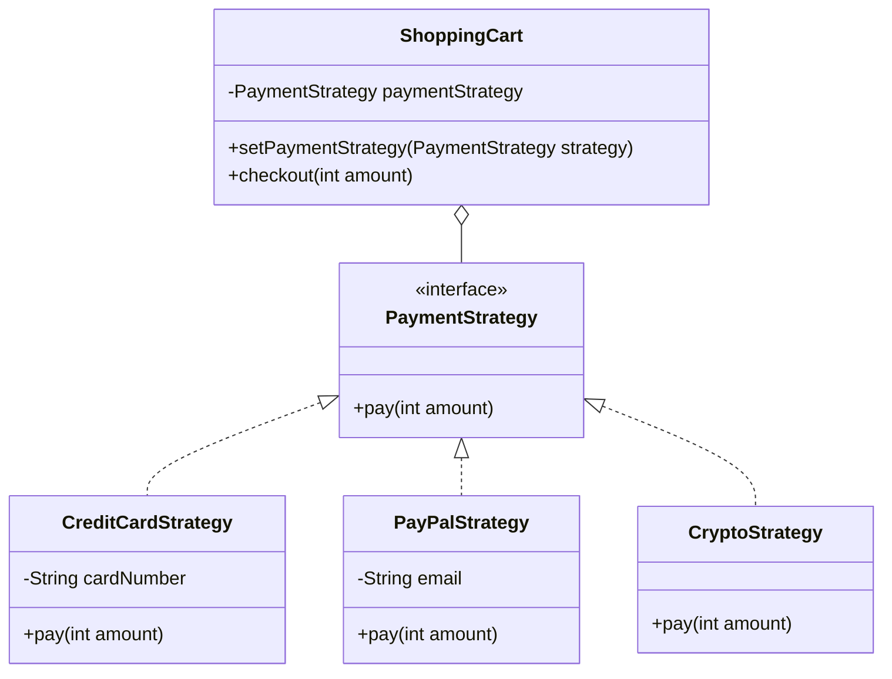

# Strategy Pattern

## Question

You have a `PaymentProcessor` class. It currently handles Stripe payments. Now you need to add PayPal. Then crypto. Then bank transfer. Where do you put the fourth payment method?

Write the `PaymentProcessor.pay(amount)` method for all four types before reading on.

---

## Pattern Mindmap

```
[Strategy Pattern]
├── Problem It Solves
│   ├── PaymentProcessor if/else per payment type — add method = modify class (OCP violation)
│   ├── Algorithms (payment methods, sort algorithms, routing) need to vary independently
│   └── Client should not know which algorithm is used — only that it works
├── Core Structure
│   ├── Strategy interface: PaymentStrategy with pay(amount)
│   ├── Concrete strategies: CreditCardStrategy, PayPalStrategy, CryptoStrategy
│   ├── Context: PaymentProcessor holds PaymentStrategy reference
│   ├── Context.pay() delegates to strategy.pay() — no branching
│   └── Strategy injected via constructor or setter (swappable at runtime)
├── Runtime Swap
│   ├── processor.setStrategy(new CryptoStrategy())
│   ├── Same context, different behavior — no code change
│   └── New payment method: one new class, no modification to context
├── Analogy
│   ├── GPS navigation: same trip, choose fastest/shortest/scenic route
│   └── Route is the strategy — swapped without changing the destination
├── When to Use
│   ├── Multiple algorithms for the same task (sorting, payment, compression)
│   ├── Algorithm must be selectable at runtime
│   └── Eliminating large if/else or switch based on type
├── Strategy vs State vs Template Method
│   ├── Strategy: swaps interchangeable algorithms; context delegates entirely
│   ├── State: object changes behavior as its internal state changes
│   └── Template Method: skeleton fixed; subclass fills specific steps
├── Strategy vs Policy
│   ├── Strategy encapsulates a full algorithm
│   └── Policy is a simpler predicate — but same structural pattern
├── Trade-offs
│   ├── Clients must know which strategies exist to choose one
│   ├── If strategies need context data, must pass it or expose via interface
│   └── Overkill for 2 variants — just use if/else; apply at 3+ variants
└── Interview Angles
    ├── How is Strategy different from using a simple if/else?
    ├── Can a Strategy have state? Is it still a strategy?
    └── Strategy vs Template Method — which do you choose when?
```

## Problem Without the Pattern

```python
class PaymentProcessor:
    def pay(self, type_: str, amount: float) -> None:
        if type_ == "STRIPE":
            # 20 lines of Stripe SDK setup and API calls
            pass
        elif type_ == "PAYPAL":
            # 20 lines of PayPal OAuth and API calls
            pass
        elif type_ == "CRYPTO":
            # 20 lines of wallet address resolution and broadcast
            pass
        # 4th type: edit this method
```

**What breaks**:
1. **OCP violation**: Every new payment type requires editing `PaymentProcessor`. It is never closed for modification.
2. **SRP violation**: `PaymentProcessor` contains the implementation details of every payment system it knows about.
3. **Untestable in isolation**: You cannot test Stripe logic without the file containing PayPal and Crypto logic being compiled in.
4. **Shared risk**: A bug introduced while adding PayPal can break the already-working Stripe path.

---

## Derive the Minimal Fix

The constraint: **the algorithm (how to pay) must be swappable without changing the class that uses it**.

Step 1 — extract the varying part (the payment algorithm) behind an ABC:
```python
from abc import ABC, abstractmethod

class PaymentStrategy(ABC):
    @abstractmethod
    def pay(self, amount: float) -> None: ...
```

Step 2 — each algorithm is its own class:
```python
class StripeStrategy(PaymentStrategy):
    def pay(self, amount: float) -> None: ...  # Stripe logic

class PayPalStrategy(PaymentStrategy):
    def pay(self, amount: float) -> None: ...  # PayPal logic
```

Step 3 — the context holds a reference to the ABC, not a concrete class:
```python
class PaymentProcessor:
    def __init__(self, strategy: PaymentStrategy):
        self._strategy = strategy

    def pay(self, amount: float) -> None:
        self._strategy.pay(amount)  # delegates — no branching
```

Adding the 4th payment type is now one new class, zero edits to `PaymentProcessor`. That is the pattern.

---

> **Category**: Behavioral Pattern
> **Purpose**: Define a family of algorithms, encapsulate each one, and make them interchangeable. Strategy lets the algorithm vary independently from the clients that use it.

## Real-Life Analogy

**A GPS with multiple route options.**

When you enter a destination in Google Maps, it shows you three buttons: **Fastest**, **Shortest**, **Avoid Tolls**. Each button is a different routing *strategy*. You pick one at runtime. The GPS (context) doesn't care which one you pick — it just calls `getRoute()` and the selected strategy figures out the path.

If Google needed to add "Avoid Highways" in the future, they'd add a new strategy class, not rewrite the GPS. The GPS code doesn't change.

**Without Strategy**: One massive `getRoute()` method with `if type=="fastest"`, `else if type=="shortest"`, `else if type=="avoid_tolls"` — a new option means modifying this method every time.

**With Strategy**: Each routing algorithm is its own class. Adding a new option = adding a new class, no existing code touched.

---

## When to Use

- You have **multiple ways to accomplish a task** and want to swap them at runtime.
- You want to eliminate large `if-else` or `switch` statements based on algorithm type.
- Algorithms should be swappable without touching the context class.
- You want to follow the Open/Closed Principle: open for extension, closed for modification.

---

## Understanding the Problem

Without Strategy, adding payment methods requires modifying the core class:

```python
# Bad! Every new payment method requires modifying this class
class PaymentProcessor:
    def pay(self, type_: str, amount: int) -> None:
        if type_ == "credit_card":
            pass  # validate card, call bank API...
        elif type_ == "paypal":
            pass  # login to PayPal, charge...
        elif type_ == "crypto":
            pass  # validate wallet, broadcast transaction...
        # Adding "UPI" means editing this method — violates OCP
```

---

## Solution: Strategy Pattern

```python
from abc import ABC, abstractmethod

# 1. Strategy ABC — the contract all algorithms must fulfill
class PaymentStrategy(ABC):
    @abstractmethod
    def pay(self, amount: int) -> None: ...

# 2. Concrete Strategies — each algorithm is its own class
class CreditCardStrategy(PaymentStrategy):
    def __init__(self, card_number: str):
        self._card_number = card_number

    def pay(self, amount: int) -> None:
        print(f"Paid {amount} using Credit Card {self._card_number}")

class PayPalStrategy(PaymentStrategy):
    def __init__(self, email: str):
        self._email = email

    def pay(self, amount: int) -> None:
        print(f"Paid {amount} using PayPal {self._email}")

class CryptoStrategy(PaymentStrategy):
    def pay(self, amount: int) -> None:
        print(f"Paid {amount} using Bitcoin")

# 3. Context — holds a reference to the current strategy, delegates to it
class ShoppingCart:
    def __init__(self):
        self._strategy: PaymentStrategy | None = None

    def set_payment_strategy(self, strategy: PaymentStrategy) -> None:
        self._strategy = strategy

    def checkout(self, amount: int) -> None:
        self._strategy.pay(amount)  # delegate — doesn't know or care which strategy

# Usage
cart = ShoppingCart()

# Use Credit Card
cart.set_payment_strategy(CreditCardStrategy("1234-5678"))
cart.checkout(100)

# Switch to PayPal at runtime — same cart, different algorithm
cart.set_payment_strategy(PayPalStrategy("user@example.com"))
cart.checkout(200)

# Adding UPI later requires zero changes to ShoppingCart
```

### Class Diagram



---

## Real-World Examples

### 1. Sorting (Python `key` / `sorted`)
```python
names = ["John", "Alice", "Bob"]

# Strategy 1: Natural order
sorted_names = sorted(names)

# Strategy 2: Reverse order (strategy passed as callable)
sorted_names = sorted(names, key=lambda s: s, reverse=True)

# Strategy 3: Sort by length
sorted_names = sorted(names, key=len)
```
The `key` callable is the Strategy in Python's sort API.

### 2. Navigation Apps (Route Planning)
- `FastestRouteStrategy`: Optimize for shortest time.
- `ShortestRouteStrategy`: Optimize for lowest distance.
- `AvoidTollsStrategy`: Minimize toll costs.
- `WalkingStrategy`: Pedestrian-optimized path.

Each strategy implements the same `getRoute(origin, destination)` interface.

### 3. Compression
- `ZipCompressionStrategy`
- `RarCompressionStrategy`
- `GzipCompressionStrategy`

File manager picks the strategy based on format selected. Core compression logic untouched.

---

## Pros & Cons

**Pros:**
- **Open/Closed Principle**: Add new strategies without changing the Context.
- **Runtime Switching**: Change behavior dynamically based on user input, config, or load.
- **Eliminates Conditionals**: Replaces `if-else` chains with clean polymorphism.
- **Testability**: Each strategy can be tested in isolation.

**Cons:**
- **More Classes**: Every algorithm becomes its own class, even if it's one line.
- **Client Must Know Strategies**: The caller decides which strategy to use. Occasionally, the context should decide internally — see State pattern.

---

## Interview Tips

**Q: Difference between Strategy and State pattern?**
- **Strategy**: Algorithms are interchangeable and the **client** typically chooses which one (external control). The context doesn't usually switch strategies on its own.
- **State**: The **object itself** changes behavior as its internal state transitions (internal control). States often know about each other and trigger transitions.

**Q: Difference between Strategy and Template Method?**
- **Strategy**: Uses composition. Algorithms are separate classes implementing an interface. Swappable at runtime.
- **Template Method**: Uses inheritance. The skeleton is fixed in a base class; subclasses fill in specific steps. Not swappable at runtime.

**Q: How does dependency injection relate to Strategy?**
- DI is often the mechanism used to inject a specific Strategy implementation into the Context. In Spring: `@Autowired PaymentStrategy strategy` where the bean is configured externally.
