> [!NOTE]
> **📋 5-Minute Summary**
>
> **What this covers:** The Strategy Pattern — defines a family of algorithms, encapsulates each one, and makes them interchangeable at runtime.
>
> **Key concepts:**
> - The problem: a class does something specific in lots of different ways (e.g., calculating pricing for normal, premium, and VIP users), leading to massive `if-else` blocks that violate OCP.
> - The fix: extract the algorithms into separate classes that all implement a common interface.
> - Interface: `PricingStrategy` with `calculatePrice(cart)`.
> - Concrete Strategies: `NormalPricing`, `VipPricing`.
> - Context: the `Checkout` class holds a `PricingStrategy` reference. It calls `strategy.calculatePrice(cart)`. You can swap the strategy at runtime.
> - Difference from State: State transitions are usually automatic and internal; Strategies are usually injected by the client and stay the same for the duration of the task.
>
> **Key takeaway:** This is arguably the most important pattern in LLD. Any time an interview problem has "multiple ways to do X" (payment methods, sorting algorithms, pricing rules, rate-limiting algorithms), use Strategy.

---
module: 06-lld
topic: Design Patterns
subtopic: Behavioral
status: unread
tags: [06-lld, system-design, design-patterns]
---
# Strategy Pattern

> 🔵 **Java idiom:** A `Strategy` interface injected into the context (constructor or setter). Since Java 8, most strategies are **lambdas / method references** against a functional interface — `Comparator` passed to `Collections.sort(list, comparator)` is the textbook JDK example, as are `Runnable`, `Predicate`, `Function`. **Interview gotcha:** this is the single most reusable LLD pattern — reach for it whenever a problem says "multiple ways to do X" (payment methods, pricing tiers, sort orders, rate-limiting algorithms). Prefer injecting the strategy (DI/Spring) over a `switch`. Distinguish from State (Strategy is client-chosen and stable for the task; State self-transitions internally) and Command (Command bundles a receiver + a deferred request; Strategy is a pure algorithm).

## Question

You have a `PaymentProcessor` class. It currently handles Stripe payments. Now you need to add PayPal. Then crypto. Then bank transfer. Where do you put the fourth payment method?

Write the `PaymentProcessor.pay(amount)` method for all four types before reading on.

---

## Pattern Mindmap

```
[Strategy Pattern]
├── Problem It Solves
│   ├── PaymentProcessor if/else per payment type — add method = modify class (OCP violation)
│   ├── Algorithms (payment methods, sort algorithms, routing) need to vary independently
│   └── Client should not know which algorithm is used — only that it works
├── Core Structure
│   ├── Strategy interface: PaymentStrategy with pay(amount)
│   ├── Concrete strategies: CreditCardStrategy, PayPalStrategy, CryptoStrategy
│   ├── Context: PaymentProcessor holds PaymentStrategy reference
│   ├── Context.pay() delegates to strategy.pay() — no branching
│   └── Strategy injected via constructor or setter (swappable at runtime)
├── Runtime Swap
│   ├── processor.setStrategy(new CryptoStrategy())
│   ├── Same context, different behavior — no code change
│   └── New payment method: one new class, no modification to context
├── Analogy
│   ├── GPS navigation: same trip, choose fastest/shortest/scenic route
│   └── Route is the strategy — swapped without changing the destination
├── When to Use
│   ├── Multiple algorithms for the same task (sorting, payment, compression)
│   ├── Algorithm must be selectable at runtime
│   └── Eliminating large if/else or switch based on type
├── Strategy vs State vs Template Method
│   ├── Strategy: swaps interchangeable algorithms; context delegates entirely
│   ├── State: object changes behavior as its internal state changes
│   └── Template Method: skeleton fixed; subclass fills specific steps
├── Strategy vs Policy
│   ├── Strategy encapsulates a full algorithm
│   └── Policy is a simpler predicate — but same structural pattern
├── Trade-offs
│   ├── Clients must know which strategies exist to choose one
│   ├── If strategies need context data, must pass it or expose via interface
│   └── Overkill for 2 variants — just use if/else; apply at 3+ variants
└── Interview Angles
    ├── How is Strategy different from using a simple if/else?
    ├── Can a Strategy have state? Is it still a strategy?
    └── Strategy vs Template Method — which do you choose when?
```

## Problem Without the Pattern

```python
class PaymentProcessor:
    def pay(self, payment_type, amount):
        if payment_type == "STRIPE":
            pass  # 20 lines of Stripe SDK setup and API calls
        elif payment_type == "PAYPAL":
            pass  # 20 lines of PayPal OAuth and API calls
        elif payment_type == "CRYPTO":
            pass  # 20 lines of wallet address resolution and broadcast
        # 4th type: edit this method
```

**What breaks**:
1. **OCP violation**: Every new payment type requires editing `PaymentProcessor`. It is never closed for modification.
2. **SRP violation**: `PaymentProcessor` contains the implementation details of every payment system it knows about.
3. **Untestable in isolation**: You cannot test Stripe logic without the file containing PayPal and Crypto logic being compiled in.
4. **Shared risk**: A bug introduced while adding PayPal can break the already-working Stripe path.

---

## Derive the Minimal Fix

The constraint: **the algorithm (how to pay) must be swappable without changing the class that uses it**.

Step 1 — extract the varying part (the payment algorithm) behind an interface:
```python
from abc import ABC, abstractmethod

class PaymentStrategy(ABC):
    @abstractmethod
    def pay(self, amount):
        pass
```

Step 2 — each algorithm is its own class:
```python
class StripeStrategy(PaymentStrategy):
    def pay(self, amount):
        pass  # Stripe logic

class PayPalStrategy(PaymentStrategy):
    def pay(self, amount):
        pass  # PayPal logic
```

Step 3 — the context holds a reference to the interface, not a concrete class:
```python
class PaymentProcessor:
    def __init__(self, strategy):
        self._strategy = strategy

    def pay(self, amount):
        self._strategy.pay(amount)  # delegates — no branching
```

Adding the 4th payment type is now one new class, zero edits to `PaymentProcessor`. That is the pattern.

---

> **Category**: Behavioral Pattern
> **Purpose**: Define a family of algorithms, encapsulate each one, and make them interchangeable. Strategy lets the algorithm vary independently from the clients that use it.

## Real-Life Analogy

**A GPS with multiple route options.**

When you enter a destination in Google Maps, it shows you three buttons: **Fastest**, **Shortest**, **Avoid Tolls**. Each button is a different routing *strategy*. You pick one at runtime. The GPS (context) doesn't care which one you pick — it just calls `get_route()` and the selected strategy figures out the path.

If Google needed to add "Avoid Highways" in the future, they'd add a new strategy class, not rewrite the GPS. The GPS code doesn't change.

**Without Strategy**: One massive `get_route()` method with `if type=="fastest"`, `else if type=="shortest"`, `else if type=="avoid_tolls"` — a new option means modifying this method every time.

**With Strategy**: Each routing algorithm is its own class. Adding a new option = adding a new class, no existing code touched.

---

## When to Use

- You have **multiple ways to accomplish a task** and want to swap them at runtime.
- You want to eliminate large `if-else` or `switch` statements based on algorithm type.
- Algorithms should be swappable without touching the context class.
- You want to follow the Open/Closed Principle: open for extension, closed for modification.

---

## Understanding the Problem

Without Strategy, adding payment methods requires modifying the core class:

```python
# Bad! Every new payment method requires modifying this class
class PaymentProcessor:
    def pay(self, payment_type, amount):
        if payment_type == "credit_card":
            pass  # Validate card, call bank API...
        elif payment_type == "paypal":
            pass  # Login to PayPal, charge...
        elif payment_type == "crypto":
            pass  # Validate wallet, broadcast transaction...
        # Adding "UPI" means editing this method — violates OCP
```

---

## Solution: Strategy Pattern

```python
from abc import ABC, abstractmethod


# 1. Strategy Interface — the contract all algorithms must fulfill
class PaymentStrategy(ABC):
    @abstractmethod
    def pay(self, amount):
        pass


# 2. Concrete Strategies — each algorithm is its own class
class CreditCardStrategy(PaymentStrategy):
    def __init__(self, card_number):
        self._card_number = card_number

    def pay(self, amount):
        print(f"Paid {amount} using Credit Card {self._card_number}")


class PayPalStrategy(PaymentStrategy):
    def __init__(self, email):
        self._email = email

    def pay(self, amount):
        print(f"Paid {amount} using PayPal {self._email}")


class CryptoStrategy(PaymentStrategy):
    def pay(self, amount):
        print(f"Paid {amount} using Bitcoin")


# 3. Context — holds a reference to the current strategy, delegates to it
class ShoppingCart:
    def __init__(self):
        self._payment_strategy = None

    def set_payment_strategy(self, strategy):
        self._payment_strategy = strategy

    def checkout(self, amount):
        self._payment_strategy.pay(amount)  # Delegate — doesn't know or care which strategy


# Usage
if __name__ == "__main__":
    cart = ShoppingCart()

    # Use Credit Card
    cart.set_payment_strategy(CreditCardStrategy("1234-5678"))
    cart.checkout(100)

    # Switch to PayPal at runtime — same cart, different algorithm
    cart.set_payment_strategy(PayPalStrategy("user@example.com"))
    cart.checkout(200)

    # Adding UPI later requires zero changes to ShoppingCart
```

### Class Diagram

```mermaid
classDiagram
    class PaymentStrategy {
        <<interface>>
        +pay(int amount)
    }

    class ShoppingCart {
        -PaymentStrategy paymentStrategy
        +setPaymentStrategy(PaymentStrategy strategy)
        +checkout(int amount)
    }

    class CreditCardStrategy {
        -String cardNumber
        +pay(int amount)
    }

    class PayPalStrategy {
        -String email
        +pay(int amount)
    }

    class CryptoStrategy {
        +pay(int amount)
    }

    PaymentStrategy <|.. CreditCardStrategy
    PaymentStrategy <|.. PayPalStrategy
    PaymentStrategy <|.. CryptoStrategy
    ShoppingCart o-- PaymentStrategy
```



---

## Real-World Examples

### 1. Sorting (Python)
```python
names = ["John", "Alice", "Bob"]

# Strategy 1: Natural Order
names.sort()

# Strategy 2: Custom key (Strategy injected via lambda)
names.sort(key=lambda x: x[-1])  # Sort by last character

# Strategy 3: Using functools.cmp_to_key for full comparator
from functools import cmp_to_key
names.sort(key=cmp_to_key(lambda a, b: -1 if a > b else 1))  # Reverse order
```
The `key` parameter is the Strategy interface in Python sorting.

### 2. Navigation Apps (Route Planning)
- `FastestRouteStrategy`: Optimize for shortest time.
- `ShortestRouteStrategy`: Optimize for lowest distance.
- `AvoidTollsStrategy`: Minimize toll costs.
- `WalkingStrategy`: Pedestrian-optimized path.

Each strategy implements the same `get_route(origin, destination)` interface.

### 3. Compression
- `ZipCompressionStrategy`
- `RarCompressionStrategy`
- `GzipCompressionStrategy`

File manager picks the strategy based on format selected. Core compression logic untouched.

---

## Pros & Cons

**Pros:**
- **Open/Closed Principle**: Add new strategies without changing the Context.
- **Runtime Switching**: Change behavior dynamically based on user input, config, or load.
- **Eliminates Conditionals**: Replaces `if-else` chains with clean polymorphism.
- **Testability**: Each strategy can be tested in isolation.

**Cons:**
- **More Classes**: Every algorithm becomes its own class, even if it's one line.
- **Client Must Know Strategies**: The caller decides which strategy to use. Occasionally, the context should decide internally — see State pattern.

---

## Interview Tips

**Q: Difference between Strategy and State pattern?**
- **Strategy**: Algorithms are interchangeable and the **client** typically chooses which one (external control). The context doesn't usually switch strategies on its own.
- **State**: The **object itself** changes behavior as its internal state transitions (internal control). States often know about each other and trigger transitions.

**Q: Difference between Strategy and Template Method?**
- **Strategy**: Uses composition. Algorithms are separate classes implementing an interface. Swappable at runtime.
- **Template Method**: Uses inheritance. The skeleton is fixed in a base class; subclasses fill in specific steps. Not swappable at runtime.

**Q: How does dependency injection relate to Strategy?**
- DI is often the mechanism used to inject a specific Strategy implementation into the Context. The concrete strategy is configured externally and injected at construction time.

---

## Applied In

This concept is used by **27 problems** in this repo — a representative selection:

**Low-Level Design**

- [Design a Parking Lot](../../05-problems/01-core-problems/01-design-parking-lot.md)
- [Design a Rate Limiter](../../05-problems/01-core-problems/02-design-rate-limiter.md)
- [Design Splitwise](../../05-problems/01-core-problems/05-design-splitwise.md)
- [Design BookMyShow](../../05-problems/02-frequent-problems/06-design-bookmyshow.md)
- [Design Chess](../../05-problems/02-frequent-problems/07-design-chess.md)
- [Design Snake and Ladder](../../05-problems/02-frequent-problems/08-design-snake-and-ladder.md)
- [Design Elevator System](../../05-problems/02-frequent-problems/09-design-elevator-system.md)
- [Design a Nested Comment System](../../05-problems/02-frequent-problems/10-design-comment-system.md)
- …and 19 more

