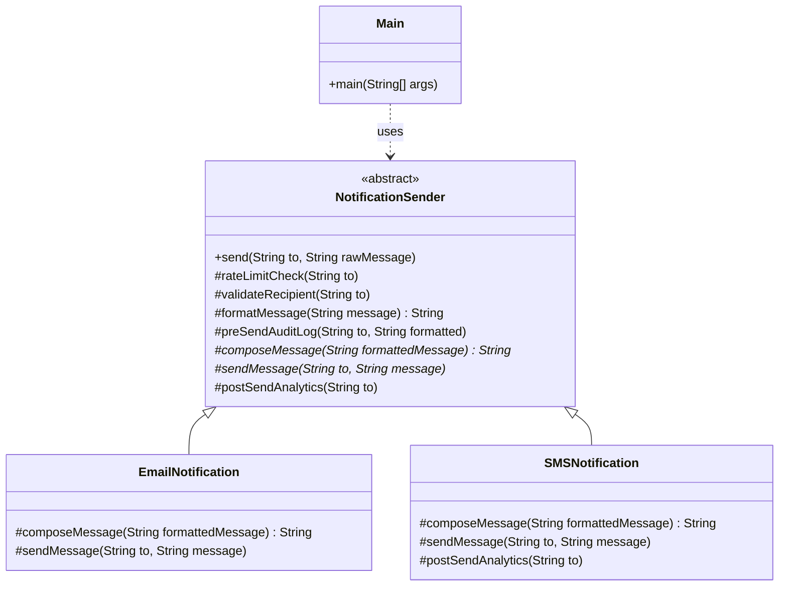

# Template Method Pattern

## Question

You are building an order processing system. Every order goes through: validate → calculate price → notify customer. Email orders validate differently from SMS orders. The notification medium differs too. But the sequence never changes. Write `processOrder()` for both `EmailOrder` and `SMSOrder`.

Try it before reading on.

---

## Pattern Mindmap

```
[Template Method Pattern]
├── Core Concept
│   ├── What → Define the skeleton of an algorithm in a base class; subclasses fill in steps
│   └── Why → Enforces a fixed sequence while allowing step-level variation without code duplication
├── Key Components
│   ├── Abstract base class → processOrder() calls validate(), calculatePrice(), notify() in order
│   ├── Template method → final; cannot be overridden — sequence is locked
│   ├── Abstract steps → validate(), notify() — must be overridden by subclass
│   └── Hook methods → optional; base class provides default, subclass may override
├── When to Use
│   ├── ✓ Multiple classes share the same algorithm sequence but differ in steps
│   ├── ✓ Prevent subclasses from changing the overall flow (mark template method final)
│   └── ✓ Frameworks/libraries where callers extend and fill in hooks
├── When NOT to Use
│   ├── ✗ Steps vary so much that the shared skeleton is meaningless — use Strategy
│   └── ✗ Composition preferred over inheritance — Strategy + delegation is more flexible
├── Trade-offs
│   ├── Pro: Eliminates duplication of algorithm skeleton; sequence enforced centrally
│   └── Con: Inheritance coupling — subclass tied to base class; hard to change template later
├── Real-World Examples
│   ├── Java Collections.sort() → algorithm fixed; compareTo() is the customizable step
│   └── Spring AbstractController → handleRequest() is the template; handleRequestInternal() is the hook
└── Interview Angles
    ├── vs Strategy → Strategy changes the whole algorithm at runtime; Template fixes sequence, varies steps
    ├── Hollywood Principle → "Don't call us, we'll call you" — base class calls subclass methods
    └── Code challenge: implement data parser with fixed parse() → open → extract → close steps
```

---

## Problem Without the Pattern

```python
class EmailOrderProcessor:
    def process_order(self, o: Order) -> None:
        # Step 1: validate
        if o.email is None:
            raise ValueError("No email")
        # Step 2: calculate
        price = o.base_price * 1.1  # email surcharge
        # Step 3: notify
        email_service.send(o.email, f"Your order: ${price}")


class SMSOrderProcessor:
    def process_order(self, o: Order) -> None:
        # Step 1: validate
        if o.phone is None:
            raise ValueError("No phone")
        # Step 2: calculate
        price = o.base_price  # no surcharge
        # Step 3: notify
        sms_service.send(o.phone, f"Order: ${price}")
```

**What breaks**:
1. **Duplicated structure**: Both classes have an identical three-step sequence — validate → calculate → notify. The order is repeated, not shared.
2. **SRP violation**: If the sequence gains a 4th step (e.g., log audit trail), it must be added to every processor class.
3. **Risk of divergence**: A developer adds "log audit" to `EmailOrderProcessor` but forgets `SMSOrderProcessor`. Silent inconsistency.

---

## Derive the Minimal Fix

The constraint: **the algorithm's sequence lives in one place; only the varying steps are overridable**.

Step 1 — move the sequence into a base class as a method the subclass must not override (the "template"):
```python
from abc import ABC, abstractmethod

class OrderProcessor(ABC):
    # Template method — sequence is fixed
    def process_order(self, o: Order) -> None:
        self.validate(o)
        price = self.calculate_price(o)
        self.notify(o, price)

    @abstractmethod
    def validate(self, o: Order) -> None: ...

    @abstractmethod
    def calculate_price(self, o: Order) -> float: ...

    @abstractmethod
    def notify(self, o: Order, price: float) -> None: ...
```

Step 2 — subclasses only provide the varying steps:
```python
class EmailOrderProcessor(OrderProcessor):
    def validate(self, o: Order) -> None:
        if o.email is None:
            raise ValueError("No email")

    def calculate_price(self, o: Order) -> float:
        return o.base_price * 1.1

    def notify(self, o: Order, price: float) -> None:
        email_service.send(o.email, f"Your order: ${price}")
```

Adding a new channel (`PushNotification`) is one new subclass — the sequence in `processOrder()` is untouched.

---

> **Category**: Behavioral Pattern
> **Purpose**: Define the skeleton of an algorithm in the base class, deferring some steps to subclasses. Subclasses can override specific steps without changing the algorithm's structure.

## Real-Life Analogy

**A recipe.**

When you bake a cake, the overall process is fixed:
1. Preheat oven
2. Mix ingredients
3. Bake
4. Cool and plate

These steps always happen in this order — that's the **template**. But the *details* vary:
- Chocolate cake: mix cocoa powder and dark sugar.
- Vanilla cake: mix vanilla extract and white sugar.
- Red velvet: mix red dye, cocoa, and buttermilk.

The recipe (base class) owns the sequence. The specific ingredient choices (abstract methods) are filled in by each cake type (subclass). You can't reorder the steps — you can't plate before baking — but you can customize what happens *within* each step.

**Without Template Method**: `ChocolateCake` and `VanillaCake` each repeat the full baking flow (preheat, mix, bake, cool) with tiny differences — massive code duplication. Any change to the common logic (e.g., change oven temperature) requires modifying every class.

---

## Formal Definition

The Template Method Pattern provides a blueprint for executing an algorithm. It allows subclasses to override specific steps of the algorithm, but the overall structure remains the same. The invariant parts are never changed; only the variant parts are customizable.

**Four Key Steps**:

| Step | Type | Description |
|---|---|---|
| **Template Method** | `final` in base class | Defines the skeleton. Calls other steps in order. Cannot be overridden. |
| **Primitive Operations** | `abstract` methods | Variable steps that subclasses MUST implement. |
| **Concrete Operations** | Regular methods in base class | Shared behavior. Subclasses inherit unchanged. |
| **Hooks** | Optional methods with default behavior | Subclasses CAN override, but don't have to. |

---

## Understanding the Problem

Without Template Method, common logic is duplicated across classes:

```python
# EmailNotification handles sending emails
class EmailNotification:
    def send(self, to: str, message: str) -> None:
        print(f"Checking rate limits for: {to}")
        print(f"Validating email recipient: {to}")
        formatted = message.strip()
        print(f"Logging before send: {formatted} to {to}")

        # Compose Email
        composed = f"<html><body><p>{formatted}</p></body></html>"

        # Send Email
        print(f"Sending EMAIL to {to} with content:\n{composed}")

        # Analytics
        print(f"Analytics updated for: {to}")


# SMSNotification handles sending SMS messages
class SMSNotification:
    def send(self, to: str, message: str) -> None:
        print(f"Checking rate limits for: {to}")
        print(f"Validating phone number: {to}")
        formatted = message.strip()
        print(f"Logging before send: {formatted} to {to}")

        # Compose SMS
        composed = f"[SMS] {formatted}"

        # Send SMS
        print(f"Sending SMS to {to} with message: {composed}")

        # Analytics (custom)
        print(f"Custom SMS analytics for: {to}")


# Usage
email_notification = EmailNotification()
email_notification.send("example@example.com", "Your order has been placed!")

sms_notification = SMSNotification()
sms_notification.send("1234567890", "Your OTP is 1234.")
```

**Issues**:
- **Code Duplication**: Rate limit check, formatting, logging, and analytics are copied verbatim across both classes. Violates DRY.
- **Hardcoded Behavior**: Adding a PushNotification requires duplicating the entire `send()` skeleton again.
- **Maintenance Overhead**: Changing the rate limit logic requires updating every notification class.
- **Lack of Extensibility**: New notification types are expensive to add and risky to maintain.

---

## Solution: Template Method Pattern

```python
from abc import ABC, abstractmethod

# Abstract base class defining the template method and common steps
class NotificationSender(ABC):
    # Template method — sequence is fixed; subclasses must not override this
    def send(self, to: str, raw_message: str) -> None:
        # Common logic
        self._rate_limit_check(to)
        self._validate_recipient(to)
        formatted = self._format_message(raw_message)
        self._pre_send_audit_log(to, formatted)

        # Specific logic: defined by subclasses
        composed = self._compose_message(formatted)
        self._send_message(to, composed)

        # Optional hook
        self._post_send_analytics(to)

    # Common step 1: check rate limits
    def _rate_limit_check(self, to: str) -> None:
        print(f"Checking rate limits for: {to}")

    # Common step 2: validate recipient
    def _validate_recipient(self, to: str) -> None:
        print(f"Validating recipient: {to}")

    # Common step 3: format the message (can be customized)
    def _format_message(self, message: str) -> str:
        return message.strip()

    # Common step 4: pre-send audit log
    def _pre_send_audit_log(self, to: str, formatted: str) -> None:
        print(f"Logging before send: {formatted} to {to}")

    # Abstract: subclasses must implement custom message composition
    @abstractmethod
    def _compose_message(self, formatted_message: str) -> str: ...

    # Abstract: subclasses must implement custom message sending
    @abstractmethod
    def _send_message(self, to: str, message: str) -> None: ...

    # Optional hook for analytics (can be overridden)
    def _post_send_analytics(self, to: str) -> None:
        print(f"Analytics updated for: {to}")


# Concrete class for email notifications
class EmailNotification(NotificationSender):
    def _compose_message(self, formatted_message: str) -> str:
        return f"<html><body><p>{formatted_message}</p></body></html>"

    def _send_message(self, to: str, message: str) -> None:
        print(f"Sending EMAIL to {to} with content:\n{message}")


# Concrete class for SMS notifications
class SMSNotification(NotificationSender):
    def _compose_message(self, formatted_message: str) -> str:
        return f"[SMS] {formatted_message}"

    def _send_message(self, to: str, message: str) -> None:
        print(f"Sending SMS to {to} with message: {message}")

    # Override optional hook for custom SMS analytics
    def _post_send_analytics(self, to: str) -> None:
        print(f"Custom SMS analytics for: {to}")


# Client code
email_sender = EmailNotification()
email_sender.send("john@example.com", "Welcome!")

sms_sender = SMSNotification()
sms_sender.send("9876543210", "Your OTP is 4567.")
```

### Class Diagram



---

## How Template Method Resolves the Issues

| Issue | Solution |
|---|---|
| **Code Duplication** | Rate limit check, validation, logging, and analytics are centralized in the base class. Written once, inherited by all. |
| **Hardcoded Behavior** | Email vs. SMS specifics handled by subclasses implementing `composeMessage()` and `sendMessage()`. |
| **Lack of Extensibility** | Add `PushNotification` by extending `NotificationSender` and implementing the two abstract methods. Zero changes to existing classes. |
| **Maintenance Overhead** | Update rate limit logic in one place (`NotificationSender`). All subclasses inherit the fix automatically. |

---

## Template Method vs. Strategy

| Aspect | Template Method | Strategy |
|---|---|---|
| **Mechanism** | Inheritance. Subclasses fill in abstract steps. | Composition. Context delegates to an injected strategy object. |
| **Runtime swap?** | No — algorithm is fixed at compile time via class hierarchy. | Yes — strategy can be swapped at runtime. |
| **Use when** | The overall skeleton is fixed; only specific steps vary. | The entire algorithm varies and needs to be swappable. |

---

## When to Use

- Multiple classes follow the **same algorithm structure** but differ in specific steps.
- You want to **avoid code duplication** of common steps across similar classes.
- You need to **enforce a fixed order of steps** — subclasses should not reorder the algorithm.
- You want to provide **optional hooks** — override to customize, skip to get default behavior.

---

## Pros & Cons

**Pros**
- Promotes code reusability — shared steps written once in base class.
- Supports OCP — new behaviors added by subclassing, not modifying.
- Enforces consistent flow — the algorithm sequence is guaranteed by `final` template method.
- Hooks allow optional customization without forcing implementation.

**Cons**
- Inheritance-based — reduces flexibility; behavior is tightly coupled to base class.
- Changes in base class affect all subclasses — be careful with inheritance hierarchies.
- Can lead to too many subclasses if many step combinations are needed (consider Strategy instead).
- Not ideal if the algorithm varies significantly between implementations — use Strategy in that case.
