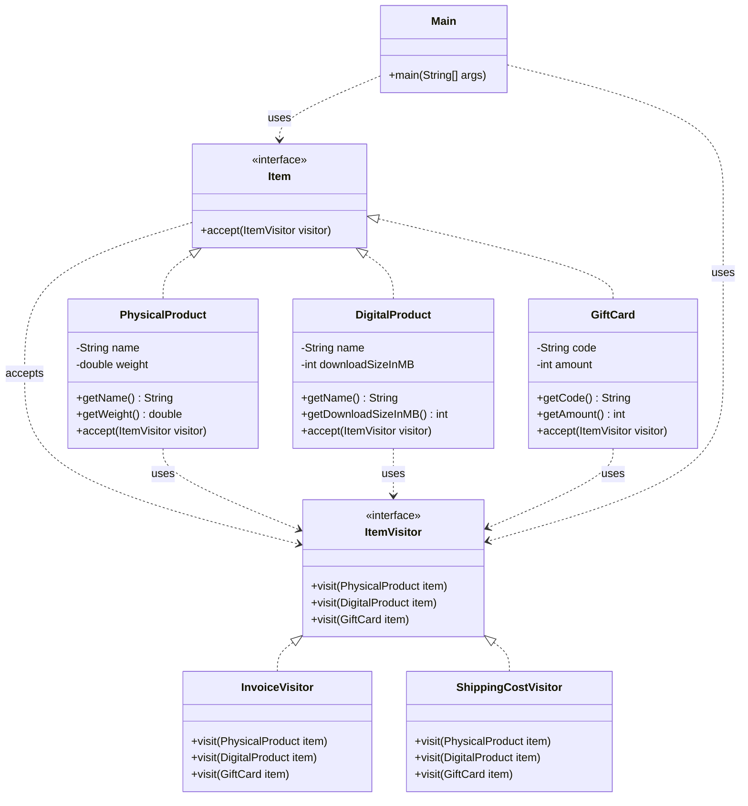

> [!NOTE]
> **📋 5-Minute Summary**
>
> **What this covers:** The Visitor Pattern — lets you separate algorithms from the objects on which they operate.
>
> **Key concepts:**
> - The problem: you have a complex tree/structure of different objects (e.g., AST nodes, or Document elements). You need to add a new operation (e.g., "Export to XML") that behaves differently for each node type. Modifying every node class violates OCP and pollutes the domain models.
> - The fix: move the operation logic into a separate `Visitor` class.
> - Double Dispatch: the core mechanism. The element calls `visitor.visit(this)`. The visitor executes the logic specific to that element type.
> - Structure: `Element` interface has `accept(Visitor)`. `Visitor` interface has `visit(TypeA)`, `visit(TypeB)`.
> - Pros: adding a new operation (e.g., "Export to JSON") just means creating a new `JsonVisitor` class. Zero changes to the element classes.
> - Cons: adding a new *element type* requires updating every single Visitor interface and implementation.
>
> **Key takeaway:** Visitor is the most complex pattern. Only use it when your object structure (the types of nodes) is very stable, but you frequently need to add new operations across that structure.

---
module: 06-lld
topic: Design Patterns
subtopic: Behavioral
status: unread
tags: [06-lld, system-design, design-patterns]
---
# Visitor Pattern

> 🔵 **Java idiom:** Elements expose `accept(Visitor v)` which calls back `v.visit(this)` — **double dispatch**, Java's workaround for lacking multiple dispatch (the concrete `visit` overload is chosen by the element's runtime type via the callback). **JDK equivalent:** `java.nio.file.FileVisitor` (`Files.walkFileTree`), the annotation-processing `ElementVisitor`. **Interview gotcha:** know the tradeoff sharply — Visitor makes **adding operations easy** (write one new visitor) but **adding element types hard** (must edit every visitor). So use it when the element hierarchy is *stable* but operations churn (AST traversals, tax/report/export over a fixed object model); avoid it when new element types appear often. This is the classic "expression problem" answer.

## Question

You have a hierarchy: `Item` (interface), `Food`, `Electronics`, `Clothing`. You need to: (1) calculate tax for each type (different rates), (2) calculate shipping cost for each type (different logic). Where do you put these two operations?

Try it before reading on.

---

## Pattern Mindmap

```
[Visitor Pattern]
├── Core Concept
│   ├── What → Add new operations to a class hierarchy without modifying the classes
│   └── Why → Open/Closed for operations — new operation = new Visitor, not new class method
├── Key Components
│   ├── Visitor interface → visitFood(Food f); visitElectronics(Electronics e); visitClothing(Clothing c)
│   ├── Concrete Visitors → TaxVisitor, ShippingVisitor — each implements all visit() methods
│   ├── Element interface → accept(Visitor v) — implemented by Food, Electronics, Clothing
│   ├── Concrete Elements → each calls v.visitFood(this) — double dispatch
│   └── Double dispatch → runtime type of element selects the right visit() overload
├── When to Use
│   ├── ✓ Stable class hierarchy + frequently adding new operations
│   ├── ✓ Operations across a heterogeneous object structure (AST traversal, document export)
│   └── ✓ Avoid polluting element classes with unrelated logic (tax, shipping, rendering)
├── When NOT to Use
│   ├── ✗ Class hierarchy changes often — every new class requires updating all Visitors
│   └── ✗ Elements are homogeneous — simpler iterator + method call is enough
├── Trade-offs
│   ├── Pro: Group related operations in one Visitor; element classes stay clean
│   └── Con: Breaks encapsulation — Visitor must access element internals; adding element = update all visitors
├── Real-World Examples
│   ├── Compiler AST → TypeCheckVisitor, CodeGenVisitor walk the same syntax tree
│   └── Tax calculation → TaxVisitor computes different rates for Food, Electronics, Clothing
└── Interview Angles
    ├── Double dispatch → accept(v) routes to v.visitFood(this); static dispatch alone can't do this
    ├── vs Strategy → Strategy replaces one algorithm; Visitor operates across a whole hierarchy
    └── Code challenge: implement an AST with NumberNode, AddNode, MulNode + EvalVisitor + PrintVisitor
```

---

## Problem Without the Pattern

Option A — add methods to each class:
```java
abstract class Item {
    abstract double calculateTax();
    abstract double calculateShipping();
}

class Food extends Item {
    private double price, weight;

    double calculateTax() {
        return price * 0.05;
    }

    double calculateShipping() {
        return weight * 0.5;
    }
}

// ... same for Electronics, Clothing
```

Adding a 3rd operation (e.g., `calculateInsurance()`) means editing `Item`, `Food`, `Electronics`, `Clothing` — all four files.

Option B — centralise with `instanceof`:
```java
class TaxCalculator {
    double calculate(Item item) {
        if (item instanceof Food) {
            return ((Food) item).getPrice() * 0.05;
        } else if (item instanceof Electronics) {
            return ((Electronics) item).getPrice() * 0.18;
        } else if (item instanceof Clothing) {
            return ((Clothing) item).getPrice() * 0.12;
        }
        throw new IllegalArgumentException("Unknown item type");
    }
}
```

**What breaks**:
1. **OCP violation (Option A)**: New operations require editing every class in the hierarchy.
2. **Fragile casting (Option B)**: `instanceof` chains break at runtime when a new `Item` subtype is added without updating the calculator.
3. **Operations are scattered (Option A)** or **type knowledge leaks into the operation (Option B)**.

---

## Derive the Minimal Fix

The constraint: **add new operations without touching the item hierarchy; let the type dispatch happen via polymorphism, not runtime type checks**.

Step 1 — define a `Visitor` interface with one method per concrete type:
```java
interface ItemVisitor {
    double visitFood(Food food);
    double visitElectronics(Electronics electronics);
    double visitClothing(Clothing clothing);
}
```

Step 2 — each `Item` accepts a visitor, calling the correct method (this is **double dispatch** — type resolved via polymorphism):
```java
interface Item {
    double accept(ItemVisitor visitor);
}

class Food implements Item {
    public double accept(ItemVisitor v) {
        return v.visitFood(this);  // calls visitFood
    }
}

class Electronics implements Item {
    public double accept(ItemVisitor v) {
        return v.visitElectronics(this);  // calls visitElectronics
    }
}
```

Step 3 — each operation is a separate `Visitor` class:
```java
class TaxVisitor implements ItemVisitor {
    public double visitFood(Food f) {
        return f.getPrice() * 0.05;
    }

    public double visitElectronics(Electronics e) {
        return e.getPrice() * 0.18;
    }

    public double visitClothing(Clothing c) {
        return c.getPrice() * 0.12;
    }
}


class ShippingVisitor implements ItemVisitor {
    public double visitFood(Food f) {
        return f.getWeight() * 0.5;
    }

    public double visitElectronics(Electronics e) {
        return 15.0;  // flat rate
    }

    public double visitClothing(Clothing c) {
        return c.getWeight() * 0.3;
    }
}
```

Adding `InsuranceVisitor` is one new class. Adding `Jewelry` to the hierarchy requires updating every `Visitor` — that is an explicit trade-off: operations are easy to add, types are harder to add.

---

> **Category**: Behavioral Pattern
> **Purpose**: Add new operations to existing class hierarchies without modifying the classes themselves. Move the operation logic into a separate "visitor" class.

## Real-Life Analogy

**A tax inspector visiting different businesses.**

A tax inspector visits a restaurant, a retail store, and a tech startup. Each type of business has a different tax structure:
- Restaurant: GST on food + service charge calculation.
- Retail Store: Import duty + sales tax.
- Tech Startup: Software service tax + R&D exemptions.

The inspector (Visitor) knows how to calculate taxes for each type of business. The businesses (Elements) don't calculate their own taxes — they just `accept(inspector)` and the inspector applies the right logic for that business type.

**Key insight**: If you want to add a new operation (say, audit compliance checks), you create a new inspector class (`ComplianceAuditorVisitor`) with `visitRestaurant()`, `visitRetailStore()`, `visitTechStartup()` methods. The business classes themselves never change. The inspector knows the rules; the business just opens its doors.

This is **double dispatch**: the business (`accept(visitor)`) dispatches to the visitor, and the visitor (`visit(this)`) dispatches to the correct `visit*()` method based on the element's type.

---

## Formal Definition

The Visitor Pattern lets you add new operations to existing class hierarchies without modifying the classes themselves. The main advantage: it decouples operations from the objects they operate on, enabling new functionality via new visitor classes without altering the element classes. This promotes the Open/Closed Principle.

**Key Components**:

| Component | Role | Example |
|---|---|---|
| **Element Interface** | Defines `accept(visitor)` method. | `Item` |
| **Concrete Element** | Implements `accept()`, calls `visitor.visit*(this)`. | `PhysicalProduct`, `DigitalProduct`, `GiftCard` |
| **Visitor Interface** | Defines `visit*()` methods for each element type. | `ItemVisitor` |
| **Concrete Visitor** | Implements the actual operation for each element type. | `InvoiceVisitor`, `ShippingCostVisitor` |

---

## Understanding the Problem

Without Visitor, operations are scattered into element classes or require `isinstance` checks:

```java
import java.util.*;

// Class representing a Physical Product
class PhysicalProduct {
    // Method to print invoice for physical product
    void printInvoice() {
        System.out.println("Printing invoice for Physical Product...");
    }

    // Method to calculate shipping cost for physical product
    double calculateShippingCost() {
        System.out.println("Calculating shipping cost for Physical Product...");
        return 10.0;  // Example shipping cost
    }
}


// Class representing a Digital Product
class DigitalProduct {
    // Method to print invoice for digital product
    void printInvoice() {
        System.out.println("Printing invoice for Digital Product...");
    }

    // No shipping cost for digital product
}


// Class representing a Gift Card Product
class GiftCard {
    // Method to print invoice for gift card
    void printInvoice() {
        System.out.println("Printing invoice for Gift Card...");
    }

    // Method to calculate discount for gift card
    double calculateDiscount() {
        System.out.println("Calculating discount for Gift Card...");
        return 5.0;  // Example discount
    }
}


public class Main {
    public static void main(String[] args) {
        List<Object> cart = List.of(new PhysicalProduct(), new DigitalProduct(), new GiftCard());

        // Loop through cart and perform actions based on product type
        for (Object item : cart) {
            if (item instanceof PhysicalProduct p) {
                p.printInvoice();
                double shippingCost = p.calculateShippingCost();
                System.out.println("Shipping cost: " + shippingCost + "\n");
            } else if (item instanceof DigitalProduct d) {
                d.printInvoice();
                System.out.println("No shipping cost for Digital Product.\n");
            } else if (item instanceof GiftCard g) {
                g.printInvoice();
                double discount = g.calculateDiscount();
                System.out.println("Discount applied: " + discount + "\n");
            }
        }
    }
}
```

**Issues**:

| Issue | Description |
|---|---|
| **Violates SRP** | Product classes handle both data representation AND operation logic (invoice, shipping). Two responsibilities in one class. |
| **`isinstance` in client code** | Adding a new product type (`SubscriptionProduct`) requires modifying every if-else chain in the client. Violates OCP. |
| **Lack of flexibility** | Adding a new operation (tax calculation, discount) means modifying every product class. |
| **Tight coupling** | Operations are tightly coupled to product classes — impossible to add operations without changing elements. |

---

## Solution: Visitor Pattern

```java
import java.util.*;

// ======= Element Interface ==========
interface Item {
    void accept(ItemVisitor visitor);
}


// ======= Concrete elements ===========
class PhysicalProduct implements Item {
    private final String name;
    private final double weight;

    PhysicalProduct(String name, double weight) {
        this.name = name;
        this.weight = weight;
    }

    String getName() {
        return name;
    }

    double getWeight() {
        return weight;
    }

    public void accept(ItemVisitor visitor) {
        visitor.visitPhysicalProduct(this);  // First dispatch: calls visitor's method for PhysicalProduct
    }
}


class DigitalProduct implements Item {
    private final String name;
    private final int downloadSizeInMB;

    DigitalProduct(String name, int downloadSizeInMB) {
        this.name = name;
        this.downloadSizeInMB = downloadSizeInMB;
    }

    String getName() {
        return name;
    }

    int getDownloadSizeInMB() {
        return downloadSizeInMB;
    }

    public void accept(ItemVisitor visitor) {
        visitor.visitDigitalProduct(this);  // First dispatch: calls visitor's method for DigitalProduct
    }
}


class GiftCard implements Item {
    private final String code;
    private final int amount;

    GiftCard(String code, int amount) {
        this.code = code;
        this.amount = amount;
    }

    String getCode() {
        return code;
    }

    int getAmount() {
        return amount;
    }

    public void accept(ItemVisitor visitor) {
        visitor.visitGiftCard(this);  // First dispatch: calls visitor's method for GiftCard
    }
}


// ======== Visitor Interface ============
interface ItemVisitor {
    void visitPhysicalProduct(PhysicalProduct item);
    void visitDigitalProduct(DigitalProduct item);
    void visitGiftCard(GiftCard item);
}


// ============ Concrete Visitors ==============
class InvoiceVisitor implements ItemVisitor {
    public void visitPhysicalProduct(PhysicalProduct item) {
        System.out.println("Invoice: " + item.getName() + " - Shipping to customer");
    }

    public void visitDigitalProduct(DigitalProduct item) {
        System.out.println("Invoice: " + item.getName() + " - Email with download link");
    }

    public void visitGiftCard(GiftCard item) {
        System.out.println("Invoice: Gift Card - Code: " + item.getCode());
    }
}


class ShippingCostVisitor implements ItemVisitor {
    public void visitPhysicalProduct(PhysicalProduct item) {
        System.out.println("Shipping cost for " + item.getName() + ": Rs. " + (item.getWeight() * 10));
    }

    public void visitDigitalProduct(DigitalProduct item) {
        System.out.println(item.getName() + " is digital -- No shipping cost.");
    }

    public void visitGiftCard(GiftCard item) {
        System.out.println("GiftCard delivery via email -- No shipping cost.");
    }
}


// Client Code
public class Main {
    public static void main(String[] args) {
        List<Item> items = List.of(
                new PhysicalProduct("Shoes", 1.2),
                new DigitalProduct("Ebook", 100),
                new GiftCard("TUF500", 500));

        ItemVisitor invoiceGenerator = new InvoiceVisitor();
        ItemVisitor shippingCalculator = new ShippingCostVisitor();

        for (Item item : items) {
            item.accept(invoiceGenerator);
            item.accept(shippingCalculator);
            System.out.println();
        }
    }
}
```

### Class Diagram



---

## How Visitor Resolves the Issues

| Issue | Solution |
|---|---|
| **Violates SRP** | Element classes only handle data representation. All operation logic lives in visitor classes. |
| **`isinstance` in client code** | Client calls `item.accept(visitor)`. No type checking. Polymorphism handles dispatching. |
| **Lack of flexibility** | Add a new operation (e.g., `TaxCalculatorVisitor`) by creating one new visitor class. Zero changes to product classes. |
| **Tight coupling** | Operations are isolated in visitor classes. Product classes are untouched when operations change. |

---

## Double Dispatch Explained

Normal method calls use **single dispatch** — the method called depends on the type of one object (the receiver).

Visitor uses **double dispatch** — the method called depends on the types of TWO objects:

1. **First dispatch**: `item.accept(visitor)` — dispatches based on the concrete type of `item` (e.g., `PhysicalProduct.accept()`).
2. **Second dispatch**: Inside `accept()`, `visitor.visitPhysicalProduct(this)` — dispatches based on the concrete type of `visitor` (e.g., `InvoiceVisitor.visitPhysicalProduct()`).

Result: The correct `visit*()` method is called based on both the element type AND the visitor type. No `instanceof`, no casting.

Note: this example uses distinct method names per element type (`visitPhysicalProduct`, `visitDigitalProduct`, ...). Java *does* support overloading, so you could instead declare a single overloaded `visit(PhysicalProduct)`, `visit(DigitalProduct)`, `visit(GiftCard)` set — the JDK's own `FileVisitor` and `ElementVisitor` favor distinct names for clarity, which is why this example keeps them distinct too.

---

## When to Use

- You have a **stable element hierarchy** (types rarely change) but need to add **many new operations** frequently.
- You want to **add operations without modifying element classes**.
- You need **distinct logic per element type** — the visitor naturally handles this via separate `visit_*()` methods.
- Avoid if the **element types change frequently** — every new element type requires updating every visitor.

---

## Pros & Cons

**Pros**
- Follows OCP — add new operations without changing element classes.
- Clean separation of logic — element classes stay lean; operation logic lives in visitor classes.
- Easy to add new operations — just create a new visitor class.
- Centralizes related operations — `InvoiceVisitor` has all invoice logic in one place.

**Cons**
- Adding a new element type requires modifying all existing visitor interfaces and implementations.
- Can be overkill for simple object structures.
- Double dispatch is unintuitive for developers unfamiliar with the pattern.
- Elements and visitors are still coupled — the visitor interface lists all element types explicitly.
