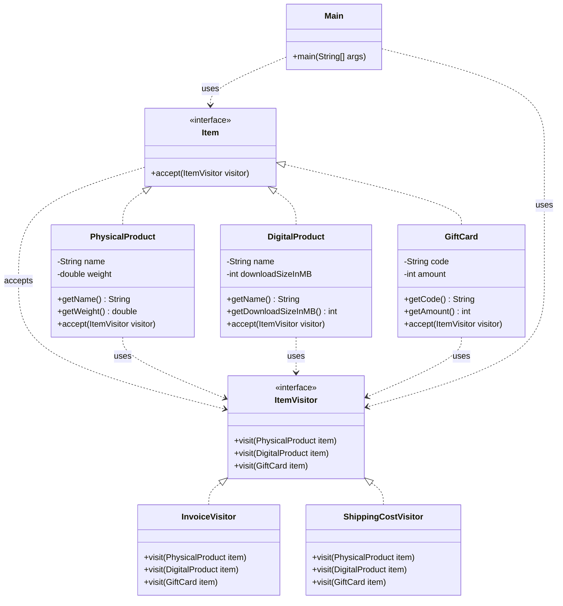

# Visitor Pattern

## Question

You have a hierarchy: `Item` (interface), `Food`, `Electronics`, `Clothing`. You need to: (1) calculate tax for each type (different rates), (2) calculate shipping cost for each type (different logic). Where do you put these two operations?

Try it before reading on.

---

## Pattern Mindmap

```
[Visitor Pattern]
├── Core Concept
│   ├── What → Add new operations to a class hierarchy without modifying the classes
│   └── Why → Open/Closed for operations — new operation = new Visitor, not new class method
├── Key Components
│   ├── Visitor interface → visitFood(Food f); visitElectronics(Electronics e); visitClothing(Clothing c)
│   ├── Concrete Visitors → TaxVisitor, ShippingVisitor — each implements all visit() methods
│   ├── Element interface → accept(Visitor v) — implemented by Food, Electronics, Clothing
│   ├── Concrete Elements → each calls v.visitFood(this) — double dispatch
│   └── Double dispatch → runtime type of element selects the right visit() overload
├── When to Use
│   ├── ✓ Stable class hierarchy + frequently adding new operations
│   ├── ✓ Operations across a heterogeneous object structure (AST traversal, document export)
│   └── ✓ Avoid polluting element classes with unrelated logic (tax, shipping, rendering)
├── When NOT to Use
│   ├── ✗ Class hierarchy changes often — every new class requires updating all Visitors
│   └── ✗ Elements are homogeneous — simpler iterator + method call is enough
├── Trade-offs
│   ├── Pro: Group related operations in one Visitor; element classes stay clean
│   └── Con: Breaks encapsulation — Visitor must access element internals; adding element = update all visitors
├── Real-World Examples
│   ├── Compiler AST → TypeCheckVisitor, CodeGenVisitor walk the same syntax tree
│   └── Tax calculation → TaxVisitor computes different rates for Food, Electronics, Clothing
└── Interview Angles
    ├── Double dispatch → accept(v) routes to v.visitFood(this); static dispatch alone can't do this
    ├── vs Strategy → Strategy replaces one algorithm; Visitor operates across a whole hierarchy
    └── Code challenge: implement an AST with NumberNode, AddNode, MulNode + EvalVisitor + PrintVisitor
```

---

## Problem Without the Pattern

Option A — add methods to each class:
```python
class Item:
    def calculate_tax(self):
        pass

    def calculate_shipping(self):
        pass

class Food(Item):
    def calculate_tax(self):
        return self._price * 0.05

    def calculate_shipping(self):
        return self._weight * 0.5

# ... same for Electronics, Clothing
```

Adding a 3rd operation (e.g., `calculate_insurance()`) means editing `Item`, `Food`, `Electronics`, `Clothing` — all four files.

Option B — centralise with `isinstance`:
```python
class TaxCalculator:
    def calculate(self, item):
        if isinstance(item, Food):
            return item.get_price() * 0.05
        elif isinstance(item, Electronics):
            return item.get_price() * 0.18
        elif isinstance(item, Clothing):
            return item.get_price() * 0.12
        raise ValueError("Unknown item type")
```

**What breaks**:
1. **OCP violation (Option A)**: New operations require editing every class in the hierarchy.
2. **Fragile casting (Option B)**: `isinstance` chains break at runtime when a new `Item` subtype is added without updating the calculator.
3. **Operations are scattered (Option A)** or **type knowledge leaks into the operation (Option B)**.

---

## Derive the Minimal Fix

The constraint: **add new operations without touching the item hierarchy; let the type dispatch happen via polymorphism, not runtime type checks**.

Step 1 — define a `Visitor` interface with one method per concrete type:
```python
from abc import ABC, abstractmethod

class ItemVisitor(ABC):
    @abstractmethod
    def visit_food(self, food):
        pass

    @abstractmethod
    def visit_electronics(self, electronics):
        pass

    @abstractmethod
    def visit_clothing(self, clothing):
        pass
```

Step 2 — each `Item` accepts a visitor, calling the correct method (this is **double dispatch** — type resolved via polymorphism):
```python
class Item(ABC):
    @abstractmethod
    def accept(self, visitor):
        pass

class Food(Item):
    def accept(self, v):
        return v.visit_food(self)  # calls visit_food

class Electronics(Item):
    def accept(self, v):
        return v.visit_electronics(self)  # calls visit_electronics
```

Step 3 — each operation is a separate `Visitor` class:
```python
class TaxVisitor(ItemVisitor):
    def visit_food(self, f):
        return f.get_price() * 0.05

    def visit_electronics(self, e):
        return e.get_price() * 0.18

    def visit_clothing(self, c):
        return c.get_price() * 0.12


class ShippingVisitor(ItemVisitor):
    def visit_food(self, f):
        return f.get_weight() * 0.5

    def visit_electronics(self, e):
        return 15.0  # flat rate

    def visit_clothing(self, c):
        return c.get_weight() * 0.3
```

Adding `InsuranceVisitor` is one new class. Adding `Jewelry` to the hierarchy requires updating every `Visitor` — that is an explicit trade-off: operations are easy to add, types are harder to add.

---

> **Category**: Behavioral Pattern
> **Purpose**: Add new operations to existing class hierarchies without modifying the classes themselves. Move the operation logic into a separate "visitor" class.

## Real-Life Analogy

**A tax inspector visiting different businesses.**

A tax inspector visits a restaurant, a retail store, and a tech startup. Each type of business has a different tax structure:
- Restaurant: GST on food + service charge calculation.
- Retail Store: Import duty + sales tax.
- Tech Startup: Software service tax + R&D exemptions.

The inspector (Visitor) knows how to calculate taxes for each type of business. The businesses (Elements) don't calculate their own taxes — they just `accept(inspector)` and the inspector applies the right logic for that business type.

**Key insight**: If you want to add a new operation (say, audit compliance checks), you create a new inspector class (`ComplianceAuditorVisitor`) with `visit_restaurant()`, `visit_retail_store()`, `visit_tech_startup()` methods. The business classes themselves never change. The inspector knows the rules; the business just opens its doors.

This is **double dispatch**: the business (`accept(visitor)`) dispatches to the visitor, and the visitor (`visit(self)`) dispatches to the correct `visit_*()` method based on the element's type.

---

## Formal Definition

The Visitor Pattern lets you add new operations to existing class hierarchies without modifying the classes themselves. The main advantage: it decouples operations from the objects they operate on, enabling new functionality via new visitor classes without altering the element classes. This promotes the Open/Closed Principle.

**Key Components**:

| Component | Role | Example |
|---|---|---|
| **Element Interface** | Defines `accept(visitor)` method. | `Item` |
| **Concrete Element** | Implements `accept()`, calls `visitor.visit_*(this)`. | `PhysicalProduct`, `DigitalProduct`, `GiftCard` |
| **Visitor Interface** | Defines `visit_*()` methods for each element type. | `ItemVisitor` |
| **Concrete Visitor** | Implements the actual operation for each element type. | `InvoiceVisitor`, `ShippingCostVisitor` |

---

## Understanding the Problem

Without Visitor, operations are scattered into element classes or require `isinstance` checks:

```python
# Class representing a Physical Product
class PhysicalProduct:
    # Method to print invoice for physical product
    def print_invoice(self):
        print("Printing invoice for Physical Product...")

    # Method to calculate shipping cost for physical product
    def calculate_shipping_cost(self):
        print("Calculating shipping cost for Physical Product...")
        return 10.0  # Example shipping cost


# Class representing a Digital Product
class DigitalProduct:
    # Method to print invoice for digital product
    def print_invoice(self):
        print("Printing invoice for Digital Product...")

    # No shipping cost for digital product


# Class representing a Gift Card Product
class GiftCard:
    # Method to print invoice for gift card
    def print_invoice(self):
        print("Printing invoice for Gift Card...")

    # Method to calculate discount for gift card
    def calculate_discount(self):
        print("Calculating discount for Gift Card...")
        return 5.0  # Example discount


if __name__ == "__main__":
    cart = [PhysicalProduct(), DigitalProduct(), GiftCard()]

    # Loop through cart and perform actions based on product type
    for item in cart:
        if isinstance(item, PhysicalProduct):
            item.print_invoice()
            shipping_cost = item.calculate_shipping_cost()
            print(f"Shipping cost: {shipping_cost}\n")
        elif isinstance(item, DigitalProduct):
            item.print_invoice()
            print("No shipping cost for Digital Product.\n")
        elif isinstance(item, GiftCard):
            item.print_invoice()
            discount = item.calculate_discount()
            print(f"Discount applied: {discount}\n")
```

**Issues**:

| Issue | Description |
|---|---|
| **Violates SRP** | Product classes handle both data representation AND operation logic (invoice, shipping). Two responsibilities in one class. |
| **`isinstance` in client code** | Adding a new product type (`SubscriptionProduct`) requires modifying every if-else chain in the client. Violates OCP. |
| **Lack of flexibility** | Adding a new operation (tax calculation, discount) means modifying every product class. |
| **Tight coupling** | Operations are tightly coupled to product classes — impossible to add operations without changing elements. |

---

## Solution: Visitor Pattern

```python
from abc import ABC, abstractmethod


# ======= Element Interface ==========
class Item(ABC):
    @abstractmethod
    def accept(self, visitor):
        pass


# ======= Concrete elements ===========
class PhysicalProduct(Item):
    def __init__(self, name, weight):
        self._name = name
        self._weight = weight

    def get_name(self):
        return self._name

    def get_weight(self):
        return self._weight

    def accept(self, visitor):
        visitor.visit_physical_product(self)  # First dispatch: calls visitor's method for PhysicalProduct


class DigitalProduct(Item):
    def __init__(self, name, download_size_in_mb):
        self._name = name
        self._download_size_in_mb = download_size_in_mb

    def get_name(self):
        return self._name

    def get_download_size_in_mb(self):
        return self._download_size_in_mb

    def accept(self, visitor):
        visitor.visit_digital_product(self)  # First dispatch: calls visitor's method for DigitalProduct


class GiftCard(Item):
    def __init__(self, code, amount):
        self._code = code
        self._amount = amount

    def get_code(self):
        return self._code

    def get_amount(self):
        return self._amount

    def accept(self, visitor):
        visitor.visit_gift_card(self)  # First dispatch: calls visitor's method for GiftCard


# ======== Visitor Interface ============
class ItemVisitor(ABC):
    @abstractmethod
    def visit_physical_product(self, item):
        pass

    @abstractmethod
    def visit_digital_product(self, item):
        pass

    @abstractmethod
    def visit_gift_card(self, item):
        pass


# ============ Concrete Visitors ==============
class InvoiceVisitor(ItemVisitor):
    def visit_physical_product(self, item):
        print(f"Invoice: {item.get_name()} - Shipping to customer")

    def visit_digital_product(self, item):
        print(f"Invoice: {item.get_name()} - Email with download link")

    def visit_gift_card(self, item):
        print(f"Invoice: Gift Card - Code: {item.get_code()}")


class ShippingCostVisitor(ItemVisitor):
    def visit_physical_product(self, item):
        print(f"Shipping cost for {item.get_name()}: Rs. {item.get_weight() * 10}")

    def visit_digital_product(self, item):
        print(f"{item.get_name()} is digital -- No shipping cost.")

    def visit_gift_card(self, item):
        print("GiftCard delivery via email -- No shipping cost.")


# Client Code
if __name__ == "__main__":
    items = [
        PhysicalProduct("Shoes", 1.2),
        DigitalProduct("Ebook", 100),
        GiftCard("TUF500", 500),
    ]

    invoice_generator = InvoiceVisitor()
    shipping_calculator = ShippingCostVisitor()

    for item in items:
        item.accept(invoice_generator)
        item.accept(shipping_calculator)
        print()
```

### Class Diagram



---

## How Visitor Resolves the Issues

| Issue | Solution |
|---|---|
| **Violates SRP** | Element classes only handle data representation. All operation logic lives in visitor classes. |
| **`isinstance` in client code** | Client calls `item.accept(visitor)`. No type checking. Polymorphism handles dispatching. |
| **Lack of flexibility** | Add a new operation (e.g., `TaxCalculatorVisitor`) by creating one new visitor class. Zero changes to product classes. |
| **Tight coupling** | Operations are isolated in visitor classes. Product classes are untouched when operations change. |

---

## Double Dispatch Explained

Normal method calls use **single dispatch** — the method called depends on the type of one object (the receiver).

Visitor uses **double dispatch** — the method called depends on the types of TWO objects:

1. **First dispatch**: `item.accept(visitor)` — dispatches based on the concrete type of `item` (e.g., `PhysicalProduct.accept()`).
2. **Second dispatch**: Inside `accept()`, `visitor.visit_physical_product(self)` — dispatches based on the concrete type of `visitor` (e.g., `InvoiceVisitor.visit_physical_product()`).

Result: The correct `visit_*()` method is called based on both the element type AND the visitor type. No `isinstance`, no casting.

Note: Python does not have method overloading, so the Visitor pattern uses distinct method names per element type (e.g., `visit_physical_product`, `visit_digital_product`) rather than overloaded `visit()` methods as in Java.

---

## When to Use

- You have a **stable element hierarchy** (types rarely change) but need to add **many new operations** frequently.
- You want to **add operations without modifying element classes**.
- You need **distinct logic per element type** — the visitor naturally handles this via separate `visit_*()` methods.
- Avoid if the **element types change frequently** — every new element type requires updating every visitor.

---

## Pros & Cons

**Pros**
- Follows OCP — add new operations without changing element classes.
- Clean separation of logic — element classes stay lean; operation logic lives in visitor classes.
- Easy to add new operations — just create a new visitor class.
- Centralizes related operations — `InvoiceVisitor` has all invoice logic in one place.

**Cons**
- Adding a new element type requires modifying all existing visitor interfaces and implementations.
- Can be overkill for simple object structures.
- Double dispatch is unintuitive for developers unfamiliar with the pattern.
- Elements and visitors are still coupled — the visitor interface lists all element types explicitly.
