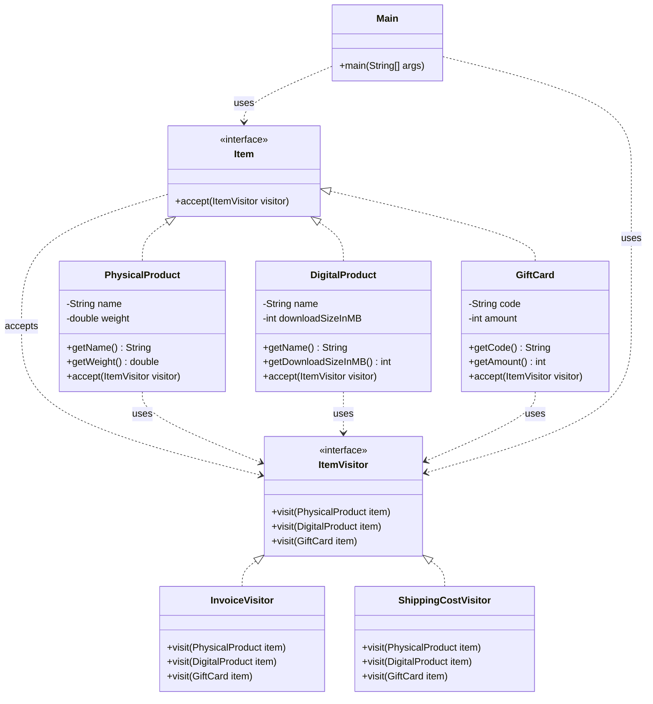

# Visitor Pattern

> **Category**: Behavioral Pattern
> **Purpose**: Add new operations to existing class hierarchies without modifying the classes themselves. Move the operation logic into a separate "visitor" class.

## Real-Life Analogy

**A tax inspector visiting different businesses.**

A tax inspector visits a restaurant, a retail store, and a tech startup. Each type of business has a different tax structure:
- Restaurant: GST on food + service charge calculation.
- Retail Store: Import duty + sales tax.
- Tech Startup: Software service tax + R&D exemptions.

The inspector (Visitor) knows how to calculate taxes for each type of business. The businesses (Elements) don't calculate their own taxes — they just `accept(inspector)` and the inspector applies the right logic for that business type.

**Key insight**: If you want to add a new operation (say, audit compliance checks), you create a new inspector class (`ComplianceAuditorVisitor`) with `visit(Restaurant)`, `visit(RetailStore)`, `visit(TechStartup)` methods. The business classes themselves never change. The inspector knows the rules; the business just opens its doors.

This is **double dispatch**: the business (`accept(visitor)`) dispatches to the visitor, and the visitor (`visit(this)`) dispatches to the correct `visit()` overload based on the element's type.

---

## Formal Definition

The Visitor Pattern lets you add new operations to existing class hierarchies without modifying the classes themselves. The main advantage: it decouples operations from the objects they operate on, enabling new functionality via new visitor classes without altering the element classes. This promotes the Open/Closed Principle.

**Key Components**:

| Component | Role | Example |
|---|---|---|
| **Element Interface** | Defines `accept(visitor)` method. | `Item` |
| **Concrete Element** | Implements `accept()`, calls `visitor.visit(this)`. | `PhysicalProduct`, `DigitalProduct`, `GiftCard` |
| **Visitor Interface** | Defines `visit()` overloads for each element type. | `ItemVisitor` |
| **Concrete Visitor** | Implements the actual operation for each element type. | `InvoiceVisitor`, `ShippingCostVisitor` |

---

## Understanding the Problem

Without Visitor, operations are scattered into element classes or require `instanceof` checks:

```java
// Class representing a Physical Product
class PhysicalProduct {
    // Method to print invoice for physical product
    public void printInvoice() {
        System.out.println("Printing invoice for Physical Product...");
    }
    
    // Method to calculate shipping cost for physical product
    public double calculateShippingCost() {
        System.out.println("Calculating shipping cost for Physical Product...");
        return 10.0;  // Example shipping cost
    }
}

// Class representing a Digital Product
class DigitalProduct {
    // Method to print invoice for digital product
    public void printInvoice() {
        System.out.println("Printing invoice for Digital Product...");
    }
    
    // No shipping cost for digital product
}

// Class representing a Gift Card Product
class GiftCard {
    // Method to print invoice for gift card
    public void printInvoice() {
        System.out.println("Printing invoice for Gift Card...");
    }
    
    // Method to calculate discount for gift card
    public double calculateDiscount() {
        System.out.println("Calculating discount for Gift Card...");
        return 5.0;  // Example discount
    }
}

public class Main {
    public static void main(String[] args) {
        // Create instances of different products
        Object[] cart = {new PhysicalProduct(), new DigitalProduct(), new GiftCard()};
        
        // Loop through cart and perform actions based on product type
        for (Object item : cart) {
            if (item instanceof PhysicalProduct) {
                PhysicalProduct product = (PhysicalProduct) item;
                product.printInvoice();
                double shippingCost = product.calculateShippingCost();
                System.out.println("Shipping cost: " + shippingCost + "\n");
            } else if (item instanceof DigitalProduct) {
                DigitalProduct product = (DigitalProduct) item;
                product.printInvoice();
                System.out.println("No shipping cost for Digital Product.\n");
            } else if (item instanceof GiftCard) {
                GiftCard product = (GiftCard) item;
                product.printInvoice();
                double discount = product.calculateDiscount();
                System.out.println("Discount applied: " + discount + "\n");
            }
        }
    }
}
```

**Issues**:

| Issue | Description |
|---|---|
| **Violates SRP** | Product classes handle both data representation AND operation logic (invoice, shipping). Two responsibilities in one class. |
| **`instanceof` in client code** | Adding a new product type (`SubscriptionProduct`) requires modifying every if-else chain in the client. Violates OCP. |
| **Lack of flexibility** | Adding a new operation (tax calculation, discount) means modifying every product class. |
| **Tight coupling** | Operations are tightly coupled to product classes — impossible to add operations without changing elements. |

---

## Solution: Visitor Pattern

```java
// ======= Element Interface ==========
interface Item {
    void accept(ItemVisitor visitor);
}

// ======= Concrete elements ===========
class PhysicalProduct implements Item {
    private String name;
    private double weight;
    
    public PhysicalProduct(String name, double weight) {
        this.name = name;
        this.weight = weight;
    }
    
    public String getName() { return this.name; }
    public double getWeight() { return this.weight; }
    
    @Override
    public void accept(ItemVisitor visitor) {
        visitor.visit(this);  // First dispatch: calls visitor's visit for PhysicalProduct
    }
}

class DigitalProduct implements Item {
    private String name;
    private int downloadSizeInMB;
    
    public DigitalProduct(String name, int downloadSizeInMB) {
        this.name = name;
        this.downloadSizeInMB = downloadSizeInMB;
    }
    
    public String getName() { return this.name; }
    public int getDownloadSizeInMB() { return this.downloadSizeInMB; }
    
    @Override
    public void accept(ItemVisitor visitor) {
        visitor.visit(this);  // First dispatch: calls visitor's visit for DigitalProduct
    }
}

class GiftCard implements Item {
    private String code;
    private int amount;
    
    public GiftCard(String code, int amount) {
        this.code = code;
        this.amount = amount;
    }
    
    public String getCode() { return this.code; }
    public int getAmount() { return this.amount; }
    
    @Override
    public void accept(ItemVisitor visitor) {
        visitor.visit(this);  // First dispatch: calls visitor's visit for GiftCard
    }
}

// ======== Visitor Interface ============
interface ItemVisitor {
    void visit(PhysicalProduct item);
    void visit(DigitalProduct item);
    void visit(GiftCard item);
}

// ============ Concrete Visitors ==============
class InvoiceVisitor implements ItemVisitor {
    @Override
    public void visit(PhysicalProduct item) {
        System.out.println("Invoice: " + item.getName() + " - Shipping to customer");
    }
    
    @Override
    public void visit(DigitalProduct item) {
        System.out.println("Invoice: " + item.getName() + " - Email with download link");
    }
    
    @Override
    public void visit(GiftCard item) {
        System.out.println("Invoice: Gift Card - Code: " + item.getCode());
    }
}

class ShippingCostVisitor implements ItemVisitor {
    @Override
    public void visit(PhysicalProduct item) {
        System.out.println("Shipping cost for " + item.getName() + ": Rs. " + (item.getWeight() * 10));
    }
    
    @Override
    public void visit(DigitalProduct item) {
        System.out.println(item.getName() + " is digital -- No shipping cost.");
    }
    
    @Override
    public void visit(GiftCard item) {
        System.out.println("GiftCard delivery via email -- No shipping cost.");
    }
}

// Client Code
public class Main {
    public static void main(String[] args) {
        Item[] items = {
            new PhysicalProduct("Shoes", 1.2),
            new DigitalProduct("Ebook", 100),
            new GiftCard("TUF500", 500)
        };
        
        ItemVisitor invoiceGenerator = new InvoiceVisitor();
        ItemVisitor shippingCalculator = new ShippingCostVisitor();
        
        for (Item item : items) {
            item.accept(invoiceGenerator);
            item.accept(shippingCalculator);
            System.out.println();
        }
    }
}
```

### Class Diagram



---

## How Visitor Resolves the Issues

| Issue | Solution |
|---|---|
| **Violates SRP** | Element classes only handle data representation. All operation logic lives in visitor classes. |
| **`instanceof` in client code** | Client calls `item.accept(visitor)`. No type checking. Polymorphism handles dispatching. |
| **Lack of flexibility** | Add a new operation (e.g., `TaxCalculatorVisitor`) by creating one new visitor class. Zero changes to product classes. |
| **Tight coupling** | Operations are isolated in visitor classes. Product classes are untouched when operations change. |

---

## Double Dispatch Explained

Normal method calls in Java use **single dispatch** — the method called depends on the type of one object (the receiver).

Visitor uses **double dispatch** — the method called depends on the types of TWO objects:

1. **First dispatch**: `item.accept(visitor)` — dispatches based on the concrete type of `item` (e.g., `PhysicalProduct.accept()`).
2. **Second dispatch**: Inside `accept()`, `visitor.visit(this)` — dispatches based on the concrete type of `visitor` (e.g., `InvoiceVisitor.visit(PhysicalProduct)`).

Result: The correct `visit()` overload is called based on both the element type AND the visitor type. No `instanceof`, no casting.

---

## When to Use

- You have a **stable element hierarchy** (types rarely change) but need to add **many new operations** frequently.
- You want to **add operations without modifying element classes**.
- You need **distinct logic per element type** — the visitor naturally handles this via overloaded `visit()` methods.
- Avoid if the **element types change frequently** — every new element type requires updating every visitor.

---

## Pros & Cons

**Pros**
- Follows OCP — add new operations without changing element classes.
- Clean separation of logic — element classes stay lean; operation logic lives in visitor classes.
- Easy to add new operations — just create a new visitor class.
- Centralizes related operations — `InvoiceVisitor` has all invoice logic in one place.

**Cons**
- Adding a new element type requires modifying all existing visitor interfaces and implementations.
- Can be overkill for simple object structures.
- Double dispatch is unintuitive for developers unfamiliar with the pattern.
- Elements and visitors are still coupled — the visitor interface lists all element types explicitly.
