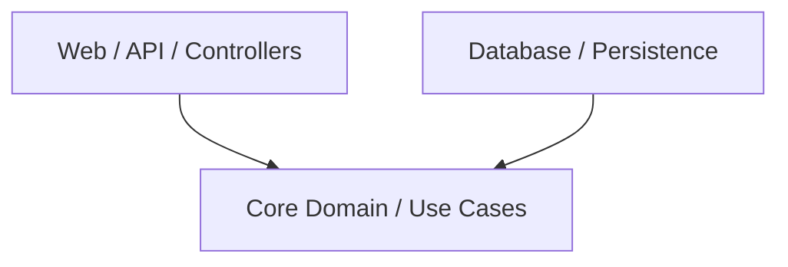

# Clean Architecture in LLD

> **Difficulty**: Hard  
> **Key Concepts**: Hexagonal Architecture, Ports and Adapters, Domain-Driven Design (DDD)

As an SDE-3, you are expected to design systems that are decoupled. If you design a "BookMyShow" system, the core ticket-booking logic should not have `import java.sql.*` sprinkled throughout it.

## The Core Principle: Dependency Inversion

In traditional layered architecture, the Web Layer depends on the Domain Layer, which depends on the Database Layer. 
**Problem:** The Domain Layer (your core business logic) is coupled to the Database Layer. If you switch from MySQL to MongoDB, your domain breaks.

**Clean Architecture** flips this dependency using the **Dependency Inversion Principle (DIP)**.



Notice that *everything* depends inward on the Core. The Core depends on *nothing*.

## Hexagonal Architecture (Ports and Adapters)

To make the Core depend on nothing, we use **Ports and Adapters**.

1. **Core Domain (Entities)**: Your pure LLD classes (`Movie`, `Show`, `Ticket`). No frameworks, no DB annotations.
2. **Ports (Interfaces)**: The boundaries of your Core. 
   - *Inbound Port*: Interfaces the UI calls to interact with the core (e.g., `BookingUseCase`).
   - *Outbound Port*: Interfaces the Core calls to interact with the outside world (e.g., `TicketRepository`).
3. **Adapters (Implementations)**:
   - *Inbound Adapter*: The REST Controller that implements the web logic and calls the Inbound Port.
   - *Outbound Adapter*: The `SqlTicketRepository` that implements `TicketRepository` and talks to MySQL.

### Code Example: Without Clean Architecture (Junior/Mid)

```java
// Tightly coupled to the database framework
public class BookingService {
    private final JdbcTemplate jdbcTemplate; // Framework leakage

    public Ticket book(String userId, String showId) {
        // Business logic mixed with SQL
        String sql = "SELECT * FROM shows WHERE id = ?";
        Show show = jdbcTemplate.queryForObject(sql, ...);
        // ...
    }
}
```

### Code Example: With Clean Architecture (Senior)

```java
// 1. The Outbound Port (Interface living inside the Core)
public interface ShowRepository {
    Show findById(String showId);
    void save(Show show);
}

// 2. The Core Service (Depends ONLY on the Port)
public class BookingService {
    private final ShowRepository showRepository; // Pure interface

    public BookingService(ShowRepository showRepository) {
        this.showRepository = showRepository;
    }

    public Ticket book(String userId, String showId) {
        Show show = showRepository.findById(showId);
        // Pure business logic here
        return new Ticket(userId, show);
    }
}

// 3. The Outbound Adapter (Lives outside the Core, depends on the Port)
public class PostgresShowRepository implements ShowRepository {
    private final JdbcTemplate jdbcTemplate;

    @Override
    public Show findById(String showId) {
        // SQL lives here, safely hidden from the Core
    }
}
```

## Why Interviewers Look For This

When an interviewer says, "Okay, how do you save this to the database?", a junior candidate will add a `.saveToDb()` method on their `User` class. 

An SDE-3 candidate will define a `UserRepository` interface and say: *"The core domain defines this port. An infrastructure adapter will implement it using Spring Data or Hibernate. This allows us to unit test the core business logic completely independently of the database."*
