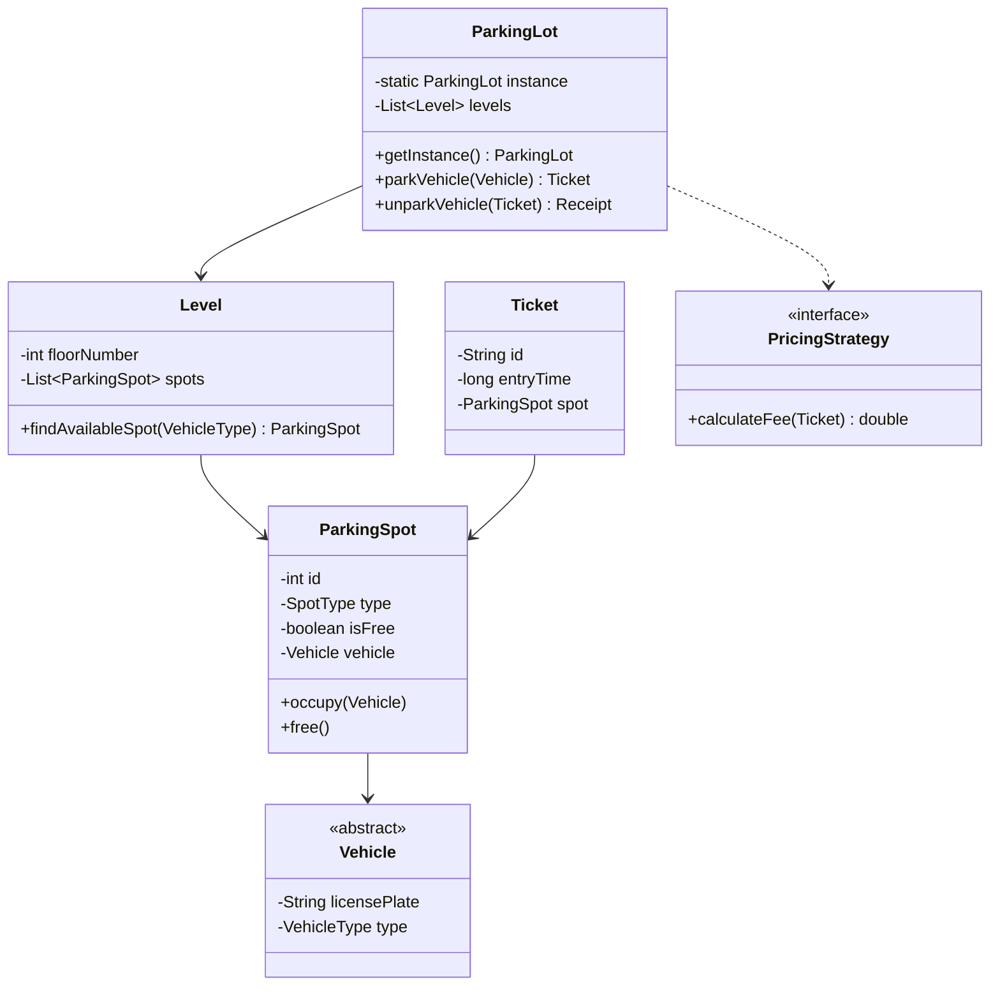

# Design Parking Lot

> **Difficulty**: Medium
> **Topics**: Object-Oriented Design, Singleton, Factory Pattern, Strategy Pattern
> **Key Concepts**: Managing shared resources, pricing logic, concurrency.

---

## What Breaks Without This Design?

Imagine a single `ParkingSystem` God class:

```java
class ParkingSystem {
    private int[][] spots; // [floor][spotIndex], 0=free 1=occupied
    private Map<String, int[]> tickets; // ticketId → [floor, spot]
    private String pricingType = "HOURLY";

    public String parkCar(String licensePlate, String vehicleType) {
        // scan every floor and every spot to find a free one
        for (int f = 0; f < spots.length; f++) {
            for (int s = 0; s < spots[f].length; s++) {
                if (spots[f][s] == 0) {
                    spots[f][s] = 1;
                    String ticketId = UUID.randomUUID().toString();
                    tickets.put(ticketId, new int[]{f, s});
                    return ticketId;
                }
            }
        }
        return null;
    }

    public double exitCar(String ticketId) {
        int[] location = tickets.remove(ticketId);
        spots[location[0]][location[1]] = 0;
        if (pricingType.equals("HOURLY")) { /* ... */ }
        else if (pricingType.equals("FLAT")) { /* ... */ }
        return 0;
    }
}
```

**Concrete failures**:
1. **No vehicle type awareness**: `spots` is a flat 2D int array — it cannot distinguish motorcycle spots from car bays. A truck would be assigned a motorcycle slot.
2. **Race condition on `spots[f][s]`**: Two threads call `parkCar` simultaneously. Both read `spots[1][3] == 0`, both write `spots[1][3] = 1`, both generate different tickets for the same physical spot — double booking.
3. **Pricing change requires code edit**: Switching from hourly to weekend flat rate means editing `exitCar()`. Adding a third pricing model adds another `else if`.
4. **Multiple instances of `ParkingSystem` compile silently**: Two service instances run with separate `spots` arrays. Spot assignments conflict.
5. **Untestable spot assignment**: You cannot test the "nearest spot" algorithm without constructing the entire `spots` array and all pricing logic in the same object.

---

## Derive the Class Structure

Start from the God class and apply one forcing function at a time:

**Force 1 — Vehicle types need different spots**: A `Car` cannot fit in a motorcycle slot. The integer `0/1` in the array cannot encode type. Extract `ParkingSpot` with a `SpotType` field. Now each spot knows what it can hold.

**Force 2 — Nearest spot requires iteration over a floor's spots in order**: Iterating `spots[floor][0..n]` is now a method on the floor, not on the system. Extract `Level` that owns `List<ParkingSpot>` and exposes `findAvailableSpot(VehicleType)`.

**Force 3 — Concurrent double-booking**: Two threads can both pass the `isFree()` check before either marks the spot occupied. Move the lock to `ParkingSpot` itself — `occupy()` holds a write lock and checks `!isFree` atomically.

**Force 4 — Pricing must be swappable**: Adding a new pricing model requires editing `exitCar()`. Extract `PricingStrategy` interface. `ParkingLot` holds a reference to it and delegates. Swapping strategy means one constructor call, not one `else if`.

**Force 5 — Only one lot may exist**: Multiple instantiation corrupts spot tracking. Make `ParkingLot` a Singleton.

**Result** — the class split that these forces produce:
```
God class → ParkingLot (Singleton, orchestration only)
          → Level (floor-level spot management)
          → ParkingSpot (atomic occupy/free + type matching)
          → Vehicle hierarchy (type encoding)
          → Ticket (session: spot reference + entry time)
          → PricingStrategy (fee algorithm, swappable)
```

Each class now has one reason to change. The rest of the phases below document the canonical form.

---

## Real-Life Analogy

**A multi-storey parking garage at a shopping mall.**

You drive in, take a ticket from the machine at the entrance, park on one of the floors, and when you're done you go to the payment booth, pay based on how long you stayed, and the barrier lifts.

Key observations:
- There is ONE system managing the entire garage (Singleton). Two machines cannot give the same ticket to two cars.
- The garage has multiple floors (Levels), each with many spots (ParkingSpots).
- Different vehicles need different spots — a motorcycle doesn't need a full car bay; a truck needs a larger bay.
- The system must always assign the **nearest available spot** (lowest floor, then lowest spot ID) to minimize how far the driver walks.
- Pricing rules can change (flat rate on weekends, hourly on weekdays) — the system does not hardcode them (Strategy Pattern).

---

## Phase 1: Requirements Gathering

### Goals
- Understand the scope: A multi-level parking lot for different vehicle types.
- Identify users: Customers, Parking Attendant/System, Admin.
- Define core features (Must-have vs Should-have).

### 1. Who are the actors?
- **Customer**: Arrives with a vehicle, parks, and pays the fee.
- **System/Attendant**: Issues tickets, assigns spots, calculates fees.
- **Admin**: Manages parking lot capacity, rates, and maintenance (optional).

### 2. What are the must-have features? (Core)
- **Multi-Level Parking**: Support multiple floors.
- **Spot Assignment**: Find the nearest available spot for a specific vehicle type.
- **Ticket Generation**: Issue a ticket with entry time upon arrival.
- **Fee Calculation**: Calculate parking fee upon exit based on duration.
- **Payment**: Process payment and release the spot.

### 3. What are the constraints?
- **Concurrency**: Multiple vehicles arriving/exiting simultaneously.
- **Capacity**: Limited spots per floor and type (Compact, Large, Motorcycle).
- **Scalability**: Extensible for new vehicle types or pricing strategies.

---

## Phase 2: Use Cases

### UC1: Park Vehicle
**Actor**: Customer / System
**Flow**:
1. Vehicle arrives at the entry gate.
2. System identifies vehicle type (Car, Truck, Motorcycle).
3. System checks for the nearest available spot of that type.
4. If full, display "Full".
5. If available, system occupies the spot and generates a `Ticket` with `ticketId` and `entryTime`.
6. Gate opens.

### UC2: Exit & Pay
**Actor**: Customer / System
**Flow**:
1. Customer arrives at the exit gate with `Ticket`.
2. System reads the ticket and calculates duration (Current Time - Entry Time).
3. System calculates fee using the current `PricingStrategy`.
4. Customer pays the amount.
5. System releases the spot (marks it free).
6. Gate opens.

---

## Phase 3: Class Diagram

### Step 1: Core Entities
- **ParkingLot**: Singleton manager.
- **Level**: Represents a floor.
- **ParkingSpot**: An individual slot.
- **Vehicle**: Abstract base class (Car, Truck, Motorcycle).
- **Ticket**: Proof of entry.
- **PricingStrategy**: Logic for fee calculation.

### Step 2: Relationships
- `ParkingLot` **has-many** `Level` (Composition).
- `Level` **has-many** `ParkingSpot` (Composition).
- `ParkingSpot` **has-a** `Vehicle` (Association/Aggregation).
- `Ticket` **references** `ParkingSpot` and `Vehicle`.
- `Vehicle` is a **base class** for `Car`, `Truck`, `Motorcycle` (Inheritance).

### UML Diagram



---

## Phase 4: Design Patterns

### 1. Singleton Pattern
- **Description**: Ensures a class has only one instance and provides a global point of access to it.
- **Why used**: The `ParkingLot` system needs a central point of control for managing shared resources (spots, levels) to prevent conflicting assignments and ensure consistent state across the system.

### 2. Factory Pattern
- **Description**: A creational pattern that provides an interface for creating objects in a superclass, but allows subclasses to alter the type of objects that will be created.
- **Why used**: Encapsulates the logic of creating different `Vehicle` types (`Car`, `Truck`, `Motorcycle`). Allows adding new vehicle types without modifying client code.

### 3. Strategy Pattern
- **Description**: Defines a family of algorithms, encapsulates each one, and makes them interchangeable. Strategy lets the algorithm vary independently from clients that use it.
- **Why used**: Pricing logic matches this perfectly (`HourlyStrategy`, `FlatRateStrategy`). We can swap pricing models dynamically (e.g., weekend rates) without changing the `ParkingLot` class.

---

## Phase 5: Code Key Methods

### Nearest Available Spot Algorithm

The goal is to assign the **nearest** spot to minimize walking distance. "Nearest" means: lowest floor first, then lowest spot ID on that floor.

**Algorithm**:
1. Iterate levels in order (Level 0 = ground floor first).
2. On each level, iterate spots by ascending `id` (spots are stored in insertion order by ID).
3. Return the first `ParkingSpot` that is both `free` and matches the required `SpotType`.
4. If a level has no spot, move to the next level.
5. If no level has a spot, the lot is full.

This guarantees floor-priority-first, then spot-ID-order within a floor — which corresponds to the physically nearest spot to the entrance.

```
findNearestSpot(vehicleType):
    neededSpotType = mapVehicleTypeToSpotType(vehicleType)
    for each level in levels (in floor order):
        for each spot in level.spots (in id order):
            if spot.isFree() AND spot.type == neededSpotType:
                return spot  // nearest match found
    return null  // lot full for this vehicle type
```

The `Level` constructor adds spots in ascending `id` order (0, 1, 2, ...) so a linear scan automatically returns the smallest ID first.

### Java Implementation

```java
import java.util.*;
import java.util.concurrent.*;
import java.time.Instant;

// 1. Enums
enum VehicleType { MOTORCYCLE, CAR, TRUCK }
enum SpotType { MOTORCYCLE, COMPACT, LARGE }

// 2. Vehicle Hierarchy
abstract class Vehicle {
    private String licensePlate;
    private VehicleType type;

    public Vehicle(String licensePlate, VehicleType type) {
        this.licensePlate = licensePlate;
        this.type = type;
    }

    public VehicleType getType() { return type; }
}

class Car extends Vehicle {
    public Car(String licensePlate) { super(licensePlate, VehicleType.CAR); }
}

class Motorcycle extends Vehicle {
    public Motorcycle(String licensePlate) { super(licensePlate, VehicleType.MOTORCYCLE); }
}

class Truck extends Vehicle {
    public Truck(String licensePlate) { super(licensePlate, VehicleType.TRUCK); }
}

// 3. Parking Spot
class ParkingSpot {
    private int id;
    private SpotType type;
    private boolean isFree;
    private Vehicle vehicle;
    private final ReadWriteLock lock = new ReentrantReadWriteLock();

    public ParkingSpot(int id, SpotType type) {
        this.id = id;
        this.type = type;
        this.isFree = true;
    }

    public boolean isFree() { 
        lock.readLock().lock();
        try {
            return isFree; 
        } finally {
            lock.readLock().unlock();
        }
    }
    
    public int getId() { return id; }
    public SpotType getType() { return type; }

    public void occupy(Vehicle v) {
        lock.writeLock().lock();
        try {
            if (!this.isFree) throw new IllegalStateException("Spot already occupied");
            this.vehicle = v;
            this.isFree = false;
        } finally {
            lock.writeLock().unlock();
        }
    }

    public void free() {
        lock.writeLock().lock();
        try {
            this.vehicle = null;
            this.isFree = true;
        } finally {
            lock.writeLock().unlock();
        }
    }
}

// 4. Ticket
class Ticket {
    String id;
    long entryTime;
    ParkingSpot spot;

    public Ticket(ParkingSpot spot) {
        this.id = UUID.randomUUID().toString();
        this.entryTime = System.currentTimeMillis();
        this.spot = spot;
    }
}

// 5. Level
class Level {
    private int floor;
    private List<ParkingSpot> spots;

    public Level(int floor, int numSpots) {
        this.floor = floor;
        this.spots = new ArrayList<>(numSpots);
        // Spots added in ascending ID order: 0..numSpots-1
        // This ensures linear scan returns lowest ID first (nearest to entrance)
        for (int i = 0; i < numSpots; i++) {
            SpotType type = (i < numSpots/3) ? SpotType.MOTORCYCLE : 
                            (i < 2*numSpots/3) ? SpotType.COMPACT : SpotType.LARGE;
            spots.add(new ParkingSpot(i, type));
        }
    }

    /**
     * Finds the nearest available spot for a given vehicle type.
     * Iterates spots in ascending ID order — lowest ID = nearest to entrance.
     * Returns first free spot of the required type.
     */
    public ParkingSpot findAvailableSpot(VehicleType vType) {
        SpotType needed = getSpotTypeForVehicle(vType);
        for (ParkingSpot s : spots) {
            if (s.isFree() && s.getType() == needed) {
                return s;  // First match = nearest spot on this floor
            }
        }
        return null;
    }

    private SpotType getSpotTypeForVehicle(VehicleType vType) {
        switch (vType) {
            case MOTORCYCLE: return SpotType.MOTORCYCLE;
            case CAR: return SpotType.COMPACT;
            default: return SpotType.LARGE;
        }
    }
}

// 6. ParkingLot (Singleton)
class ParkingLot {
    private static ParkingLot instance;
    private List<Level> levels;
    
    private ParkingLot() {
        levels = new ArrayList<>();
    }

    public static synchronized ParkingLot getInstance() {
        if (instance == null) instance = new ParkingLot();
        return instance;
    }

    public void addLevel(Level level) {
        levels.add(level);
    }

    /**
     * Parks a vehicle using the nearest-available-spot algorithm:
     * Iterates levels in order (ground floor first).
     * On each level, findAvailableSpot() iterates spots by ascending ID.
     * The first match across all levels is the nearest overall spot.
     */
    public Ticket parkVehicle(Vehicle v) {
        for (Level l : levels) {
            ParkingSpot spot = l.findAvailableSpot(v.getType());
            if (spot != null) {
                spot.occupy(v);
                System.out.println("Assigned spot ID " + spot.getId() + " to vehicle");
                return new Ticket(spot);
            }
        }
        throw new RuntimeException("Gridlock! No spot available.");
    }

    public double unparkVehicle(Ticket ticket) {
        ticket.spot.free();
        long duration = System.currentTimeMillis() - ticket.entryTime;
        // Simple pricing: $1 per second (for demo speed)
        return (duration / 1000.0) * 1.0;
    }
}

// 7. Client Code
public class ParkingSystem {
    public static void main(String[] args) throws InterruptedException {
        ParkingLot lot = ParkingLot.getInstance();
        lot.addLevel(new Level(1, 10)); // 10 spots

        Vehicle car = new Car("ABC-123");
        System.out.println("Parking car...");
        Ticket ticket = lot.parkVehicle(car);
        System.out.println("Ticket issued: " + ticket.id);

        Thread.sleep(2000); // Wait 2 sec

        double fee = lot.unparkVehicle(ticket);
        System.out.println("Unparked. Fee: $" + fee);
    }
}
```

---

## Phase 6: Discussion

### Concurrency
**Q: How do we handle multiple entrances simultaneously (SDE-3 Concept)?**
- **Single Node**: Instead of using global `synchronized` blocks which create a bottleneck, use **`ReentrantReadWriteLock`**. Finding an available spot involves many READ operations, while actually parking involves a single WRITE operation. ReadWrite locks allow multiple concurrent readers but exclusive writers. For even higher throughput, use `ConcurrentHashMap` to track `freeSpots` per `SpotType`.
- **Distributed System**: If the parking lot spans multiple nodes (e.g., massive airport parking managed by microservices), use **Distributed Locking** (e.g., Redis Redlock or ZooKeeper) on a specific spot before occupying it to prevent double-booking across servers.

### Nearest Spot — Edge Cases
**Q: What if two threads find the same spot simultaneously?**
- A: `ParkingSpot.occupy()` holds a write lock and checks `!isFree` before occupying. If two threads call `findAvailableSpot()` concurrently and both see the same spot as free, only the first one to acquire the write lock will succeed. The second thread will get an `IllegalStateException` and must retry (`parkVehicle` should retry or move to the next spot). For higher throughput, use a `ConcurrentLinkedQueue` of free spots per type — `poll()` is atomic, avoiding the TOCTOU race entirely.

### Extensibility
**Q: How to add electric vehicle charging?**
- Create a `ElectricSpot` extending `ParkingSpot`.
- Add `Chargeable` interface to `ElectricCar`.

### Pricing Flexibility
**Q: How to implement dynamic pricing?**
- Use the **Strategy Pattern**. Pass a `PricingStrategy` (e.g., `WeekendStrategy`, `HourlyStrategy`) to the calculator method.

---

## SOLID Principles Checklist

- **S (Single Responsibility)**: `ParkingSpot` manages state, `Ticket` manages session, `Level` finds spots. Separation is clear.
- **O (Open/Closed)**: New `Vehicle` types can be added by extending `Vehicle` class without modifying existing logic significantly.
- **L (Liskov Substitution)**: `Car`, `Truck` can be substituted for `Vehicle`.
- **I (Interface Segregation)**: Interfaces (like `PricingStrategy` if implemented) should be focused.
- **D (Dependency Inversion)**: High-level modules should depend on abstractions (e.g., `Vehicle`) rather than concrete classes.

---

## Interview Questions Asked

### Google / Amazon / Microsoft
1. **"How would you handle two cars arriving at the same spot simultaneously?"** → Probe: race condition awareness, concurrency primitives. Hint: `ConcurrentLinkedQueue<ParkingSpot>` per type — `poll()` is atomic; or ReadWriteLock with check-then-act inside write lock; avoid synchronized on `ParkingLot` (global bottleneck).
2. **"How do you design for EV charging spots with different pricing?"** → Probe: extensibility without modifying existing classes. Hint: `ElectricSpot extends ParkingSpot` adds `chargingRate`; `EVPricingStrategy implements PricingStrategy` computes fee = hours × rate + kWh × chargeRate; Strategy Pattern keeps fee calculation pluggable.
3. **"Walk me through your class hierarchy"** → Probe: OOP design clarity, SRP. Hint: `Vehicle` (abstract) → `Car`, `Truck`, `Motorcycle`; `ParkingSpot` (abstract, has `SpotType`, `isFree`) → `CompactSpot`, `LargeSpot`; `Ticket` ties vehicle to spot + timestamp; `Level` manages spots; `ParkingLot` orchestrates levels.
4. **"How does your design change for an airport vs a mall?"** → Probe: requirements adaptability. Hint: airport needs long-term pricing tiers (hourly vs daily vs weekly), terminal zoning, and license plate lookup (no physical ticket); mall needs validation (merchant stamps), time-limited free period, and higher throughput at peak; both are config/strategy changes, not structural rewrites.
5. **"How would you add a reservation system?"** → Probe: state management, new entity introduction. Hint: add `Reservation` entity (user, spot, startTime, endTime); reserved spots held in a separate `reservedSpots` map; on arrival, match by license plate or reservation code; background job releases expired unclaimed reservations; use optimistic locking on reservation to prevent double-booking.

### Common Follow-ups
1. **"How would you scale this to a distributed multi-location parking network?"** → Shard by location_id; use Redis for real-time availability counts (fast reads); central DB for reservations; each location's availability is independent, so cross-location joins are rare.
