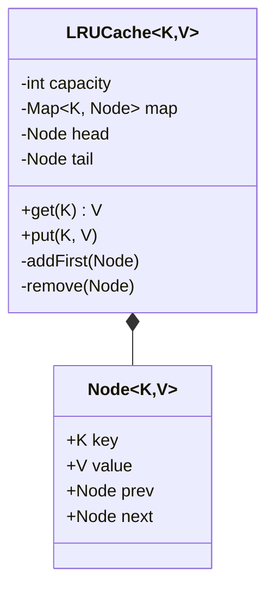

# Design LRU Cache

> **Difficulty**: Medium
> **Topics**: Data Structures, Doubly Linked List, HashMap
> **Key Concepts**: O(1) Get/Put, Eviction Policy, Generics.

---

## What Breaks Without This Design?

**Option A — Use only a `HashMap`**:

```java
class LRUCache {
    private final int capacity;
    private final Map<Integer, Integer> map = new HashMap<>();

    public int get(int key) {
        return map.getOrDefault(key, -1);
    }

    public void put(int key, int value) {
        if (map.size() >= capacity && !map.containsKey(key)) {
            // Which key do we evict? HashMap has no order — we cannot know
            // which key was used least recently. We'd have to scan all keys.
            Integer lruKey = ???; // O(N) scan — and even then, no usage order is tracked
            map.remove(lruKey);
        }
        map.put(key, value);
    }
}
```

**Failure**: `HashMap` has no insertion or access order. You cannot identify the least recently used key without an external data structure. Any attempt to evict requires O(N) scanning the entire map.

**Option B — Use only a `LinkedList` (ordered by recency)**:

```java
class LRUCache {
    private final LinkedList<int[]> list = new LinkedList<>(); // [key, value] pairs in LRU order

    public int get(int key) {
        for (int[] entry : list) {        // O(N) scan to find key
            if (entry[0] == key) {
                list.remove(entry);        // O(N) removal
                list.addFirst(entry);      // move to front
                return entry[1];
            }
        }
        return -1;
    }
}
```

**Failure**: Finding a key requires O(N) linear scan. The cache is O(N) per operation — useless at scale.

**Root cause**: No single data structure provides both O(1) lookup by key AND O(1) ordering updates.

---

## Derive the Class Structure

Start from the requirements and apply one forcing function at a time:

**Force 1 — O(1) lookup by key**: Must find an entry instantly given a key. Only a hash-based structure provides this. Introduce a `HashMap<K, Node>`.

**Force 2 — O(1) move-to-front on access**: When any key is accessed, it becomes MRU. We need to remove a node from its current position and insert it at the head — both in O(1). A singly linked list needs O(N) to find the predecessor for removal. A doubly linked list stores both `prev` and `next`, making arbitrary removal O(1). Introduce `Node<K,V>` with `prev` and `next`.

**Force 3 — O(1) eviction of LRU**: The least recently used node is always the tail. With a doubly linked list, `tail.prev` gives the LRU node directly. `remove(tail.prev)` is O(1). But to remove it from the `HashMap` too, we need its key — so `Node` must store `key` (not just `value`).

**Force 4 — Eliminate null checks on head/tail operations**: Inserting after head and removing the node before tail both require checking for null when the list is empty or has one element. Introduce dummy sentinel nodes (`head`, `tail`): real nodes always live between them. Now `head.next` is always MRU and `tail.prev` is always LRU, even with 0 or 1 real nodes.

**Result** — the class split these forces produce:
```
No abstraction needed → LRUCache (single class)
                      → Node (stores key + value + prev + next)
                      → HashMap<K, Node> (O(1) key lookup, embedded in LRUCache)
                      → DLL with dummy head/tail (O(1) ordering, embedded in LRUCache)
```

The `Node` storing `key` is the non-obvious design decision: it exists solely so eviction (`map.remove(lruKey)`) can happen in O(1) without any reverse lookup.

---

## Real-Life Analogy

**A surgeon's instrument tray.**

A surgeon keeps their most recently used instruments on the tray in front of them. The tray has limited space — only 10 instruments fit. When a new instrument is needed and the tray is full, the least recently used one (the one at the back, untouched the longest) is put away to make room.

Key observations:
- "Most recently used" = closest to the front of the tray (Head of the list).
- "Least recently used" = furthest from the front (Tail of the list).
- When an existing instrument is used again, it is physically moved to the front — it's now the most recently used.
- When looking for a specific instrument by name (key), you don't scan the tray left to right — you have a lookup board (HashMap) that tells you exactly where each instrument is. O(1) lookup.
- The combination of the **lookup board (HashMap)** and the **ordered tray (Doubly Linked List)** gives O(1) for every operation.

---

## Phase 1: Requirements Gathering

### Goals
- Design a data structure that follows Least Recently Used (LRU) eviction policy.
- Support `Get` and `Put` operations in **O(1)** time complexity.

### 1. Who are the actors?
- **Client**: Application or System accessing the cache.
- **Cache**: Stores key-value pairs and manages eviction.

### 2. What are the must-have features? (Core)
- **Capacity**: Fixed size limit.
- **Get(key)**: Return value if exists (and update usage history), else -1 (or null).
- **Put(key, value)**: Insert or Update value. If full, remove the least recently used item.

### 3. What are the constraints?
- **Performance**: All operations must be O(1) on average.
- **Thread Safety**: Optional, but good to discuss (Synchronized vs Concurrent).

---

## Phase 2: Use Cases

### UC1: Get Key
**Actor**: Client
**Flow**:
1. Client requests `Get(Key)`.
2. Cache checks HashMap.
3. **If Hit**:
    - Move corresponding Node to Head (Generic "Recently Used" position).
    - Return Value.
4. **If Miss**:
    - Return -1/Null.

### UC2: Put Key-Value
**Actor**: Client
**Flow**:
1. Client requests `Put(Key, Value)`.
2. Cache checks HashMap.
3. **If Exists**:
    - Update Node value.
    - Move Node to Head.
4. **If New**:
    - If Capacity is full:
        - Remove Tail (Least Recently Used).
        - Remove from HashMap.
    - Create New Node.
    - Add to Head.
    - Add to HashMap.

---

## Phase 3: Class Diagram and Data Structure Design

### Why HashMap + Doubly Linked List?

We need two things simultaneously:
1. **O(1) lookup by key** — to find any cached item instantly.
2. **O(1) ordering updates** — to move any item to "most recently used" without shifting other items.

No single data structure achieves both. The combination does:

| Operation | Data Structure | Why |
|---|---|---|
| Find a node by key | **HashMap** | Direct key → node pointer lookup in O(1) |
| Move a node to front | **Doubly Linked List** | Pointer reassignment in O(1) — no shifting |
| Remove least recently used | **Doubly Linked List tail** | `tail.prev` is always the LRU node; remove in O(1) |
| Insert at front | **Doubly Linked List head** | Add after dummy head in O(1) |

**Why Doubly Linked (not Singly Linked)?**: To remove a node from the middle of the list in O(1), you need to update its predecessor's `next` pointer AND its successor's `prev` pointer. With only `next` pointers (singly linked), finding the predecessor requires O(n) traversal from the head. Doubly linked nodes hold both `prev` and `next`, making any removal O(1).

**Dummy Head and Tail Nodes**: Real nodes are inserted between two permanent sentinel nodes:
```
[dummy head] <-> [MRU node] <-> ... <-> [LRU node] <-> [dummy tail]
```
This eliminates null checks on every insert/remove — `head.next` is always the MRU, `tail.prev` is always the LRU, even when the cache has 0 or 1 elements.

**Visual after operations**:
```
put(1, A): head <-> [1:A] <-> tail
put(2, B): head <-> [2:B] <-> [1:A] <-> tail   (2 is MRU)
get(1):    head <-> [1:A] <-> [2:B] <-> tail   (1 moved to front, now MRU)
put(3, C): head <-> [3:C] <-> [1:A] <-> [2:B] <-> tail   (cap=2 → evict 2:B)
           → actual result: head <-> [3:C] <-> [1:A] <-> tail   (2 evicted)
```

### Step 1: Core Entities
- **LRUCache**: Main container.
- **Node**: Doubly Linked List node (stores Key, Value, Prev, Next).
- **HashMap**: Maps Key -> Node for O(1) access.

### UML Diagram



---

## Phase 4: Design Patterns

### 1. Composition
- **Description**: A design principle where a class is composed of one or more objects of other classes, rather than inheriting from them.
- **Why used**: The `LRUCache` combines a `HashMap` (for O(1) lookup) and a `DoublyLinkedList` (for O(1) updates to ordering). By composing these two structures, we get the benefits of both to satisfy the LRU constraints.

### 2. Decorator Pattern
- **Description**: Attaches additional responsibilities to an object dynamically.
- **Why used**: (Optional) One could decorate a standard `Map` interface to add eviction policies (LRU, LFU) transparently, allowing the client to use it just like a regular Map.

---

## Phase 5: Code Key Methods

### Java Implementation

```java
import java.util.*;

// 1. Double Linked List Node
class Node<K, V> {
    K key;
    V value;
    Node<K, V> prev;
    Node<K, V> next;

    public Node(K key, V value) {
        this.key = key;
        this.value = value;
    }
}

// 2. LRU Cache
public class LRUCache<K, V> {
    private final int capacity;
    private final Map<K, Node<K, V>> map;
    private final Node<K, V> head;  // Dummy head — MRU side
    private final Node<K, V> tail;  // Dummy tail — LRU side

    public LRUCache(int capacity) {
        this.capacity = capacity;
        this.map = new HashMap<>();
        
        // Dummy head/tail to avoid null checks on every add/remove
        // Real nodes always live between head and tail
        this.head = new Node<>(null, null);
        this.tail = new Node<>(null, null);
        head.next = tail;
        tail.prev = head;
    }

    // O(1): HashMap lookup + DLL move to front
    public synchronized V get(K key) {
        if (!map.containsKey(key)) return null;

        Node<K, V> node = map.get(key);
        // Move to head = mark as most recently used
        remove(node);
        addFirst(node);
        return node.value;
    }

    // O(1): HashMap insert/update + DLL insert at front + optional tail eviction
    public synchronized void put(K key, V value) {
        if (map.containsKey(key)) {
            // Update existing — move to front
            Node<K, V> node = map.get(key);
            node.value = value;
            remove(node);
            addFirst(node);
        } else {
            if (map.size() >= capacity) {
                // Evict LRU: the node just before the dummy tail
                Node<K, V> lru = tail.prev;
                remove(lru);
                map.remove(lru.key);  // Key stored in node is used here — why Node stores key
            }
            Node<K, V> newNode = new Node<>(key, value);
            addFirst(newNode);
            map.put(key, newNode);
        }
    }

    // Helper: Insert node immediately after dummy head (MRU position)
    // Before: head <-> oldFirst
    // After:  head <-> node <-> oldFirst
    private void addFirst(Node<K, V> node) {
        node.prev = head;
        node.next = head.next;
        head.next.prev = node;  // oldFirst.prev = node
        head.next = node;       // head.next = node
    }

    // Helper: Remove node from wherever it is in the list (O(1) due to doubly linked)
    // Before: prev <-> node <-> next
    // After:  prev <-> next
    private void remove(Node<K, V> node) {
        node.prev.next = node.next;
        node.next.prev = node.prev;
    }

    // Demo
    public static void main(String[] args) {
        LRUCache<Integer, String> cache = new LRUCache<>(2);
        
        cache.put(1, "Data1");
        cache.put(2, "Data2");
        // List: head <-> [2:Data2] <-> [1:Data1] <-> tail
        
        System.out.println("Get 1: " + cache.get(1)); // "Data1", 1 is now MRU
        // List: head <-> [1:Data1] <-> [2:Data2] <-> tail
        
        cache.put(3, "Data3"); // Capacity full: evict LRU = 2 (tail.prev)
        // List: head <-> [3:Data3] <-> [1:Data1] <-> tail
        
        System.out.println("Get 2: " + cache.get(2)); // null — evicted
        System.out.println("Get 3: " + cache.get(3)); // "Data3"
    }
}
```

**Why does `Node` store the key?**: When evicting the LRU node (`tail.prev`), we need to remove its entry from the HashMap. We only have the node reference at this point — not the key. By storing `key` in the `Node`, we can call `map.remove(lru.key)` in O(1) without any reverse lookup.

---

## Phase 6: Discussion

### Concurrency (SDE-3 Concept)
**Q: How to make this highly concurrent without a massive bottleneck?**
- A: "The simple approach uses a global `synchronized` lock, which serializes all cache access. For high concurrency:
  1. **Lock Striping (like `ConcurrentHashMap`)**: Create an array of `N` segment locks (e.g., 16). Hash the key to determine which segment it belongs to and only lock that segment. Each segment maintains its own independent `DoublyLinkedList` and LRU capacity ($Total Capacity / N$).
  2. **Non-Blocking Algorithms**: Use atomic references and `compareAndSet`, though maintaining a strict LRU order becomes extremely complex without locking."

### Built-in Alternatives
**Q: Does Java have this?**
- A: "Yes, `LinkedHashMap` with `accessOrder = true`. You can override `removeEldestEntry` to enforce capacity."

### Expiration
**Q: How to add Time-To-Live (TTL)?**
- A: "Add a `timestamp` field to `Node`. On `get(K)`, check `if (now - node.time > TTL)`. If expired, remove node and return null. Also need a background cleaner thread for passive expiration."

---

## SOLID Principles Checklist

- **S (Single Responsibility)**: `LRUCache` manages mapping and eviction.
- **O (Open/Closed)**: Hard to extend eviction policy with this specific implementation (it's tightly coupled to LRU logic). Strategy pattern could allow swapping policies (LFU, FIFO).
- **L (Liskov Substitution)**: Generic K, V allows substitution of types.
- **I (Interface Segregation)**: `Cache` interface could expose `get/put`.
- **D (Dependency Inversion)**: Not heavily used, but could depend on `Map` interface.

---

## Interview Questions Asked

### Amazon
1. **"Implement an LRU cache with O(1) get and put"** → Probe: data structure choice, O(1) constraint. Hint: HashMap for O(1) key lookup + doubly linked list for O(1) move-to-front and evict-from-tail; node stores key (needed to remove from map on eviction) and value.

### Google
1. **"How do you make an LRU cache thread-safe without a single global lock?"** → Probe: concurrency, scalability under high read/write load. Hint: lock striping — partition cache into N segments (e.g., 16), each with its own lock and independent LRU list; `segment = hash(key) % N`; contention reduced by 16×; similar to `ConcurrentHashMap` internals.

### Common Follow-ups
1. **"How would you implement LFU (least frequently used) instead?"** → Hint: maintain a `freqMap<freq, LinkedHashSet<key>>` and `keyFreqMap<key, freq>`; on access, move key from `freqMap[f]` to `freqMap[f+1]`; evict from `freqMap[minFreq]`; all operations O(1).
2. **"What if multiple keys reach the same minimum frequency — which do you evict?"** → Hint: `LinkedHashSet` preserves insertion order within each frequency bucket; evict the oldest-inserted key at `minFreq` — effectively LFU with LRU tiebreaking; no additional data structure needed.
3. **"How does Java's LinkedHashMap implement access-ordered eviction?"** → Hint: `new LinkedHashMap<>(capacity, 0.75f, true)` with `accessOrder=true`; on `get()`, internally moves accessed entry to tail of doubly linked list; override `removeEldestEntry()` to return `true` when `size() > capacity` — head entry (LRU) is auto-removed.
4. **"Design a distributed LRU cache"** → Hint: consistent hashing assigns each key to a cache node; local LRU per node; on node failure, consistent hashing minimizes remapping; use replication factor 2 for fault tolerance; Redis with maxmemory-policy=allkeys-lru is a production implementation of exactly this.
