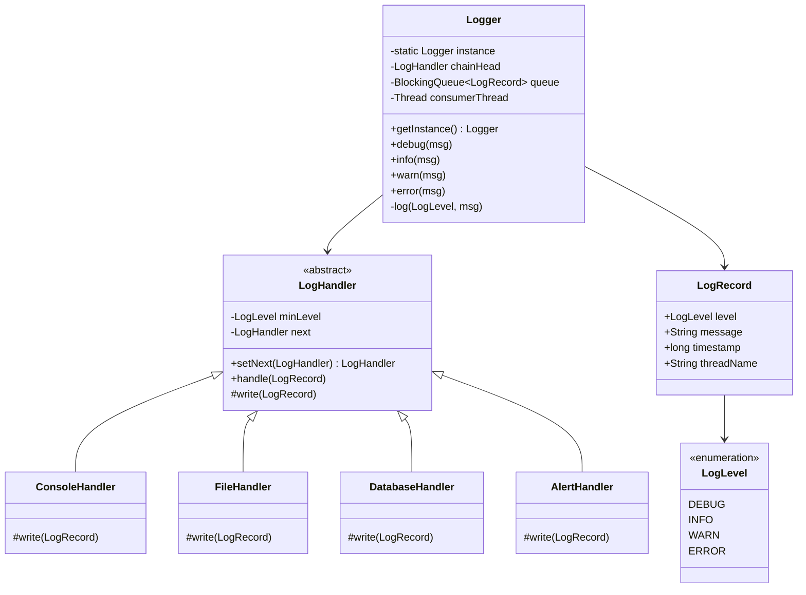

# Design Logger Library

> **Difficulty**: Easy/Medium
> **Topics**: Chain of Responsibility, Singleton, Observer
> **Key Concepts**: Log levels, multiple sinks, async decoupling via BlockingQueue.

---

## What Breaks Without This Design?

```python
class Logger:
    @staticmethod
    def log(level, message):
        if level in ("DEBUG", "INFO", "WARN", "ERROR"):
            # write to console
            print(f"[{level}] {message}")
        if level in ("WARN", "ERROR"):
            # write to file
            with open("app.log", "a") as f:
                f.write(f"[{level}] {message}\n")
        if level == "ERROR":
            # write to DB
            db.execute(f"INSERT INTO logs VALUES ('{level}', '{message}')")
```

**Concrete failures**:
1. **`log()` blocks the calling thread on I/O**: The DB write is synchronous. In a high-throughput service, every `logger.error()` call holds the caller's thread for the duration of a DB round-trip (~5ms). At 10,000 req/sec, this is 50 seconds of wasted thread-time per second.
2. **OCP violation**: Adding a new sink (Splunk, Datadog) requires editing `log()`. The routing table (`ERROR` → file + DB) is hardcoded.
3. **SRP violation**: `Logger.log()` knows the routing rules AND the write implementation for every sink.
4. **Multiple `Logger` instances compile silently**: Two components instantiate `Logger` and log to different file handles. File output is interleaved or duplicated.
5. **Level filtering is centralized and rigid**: All `INFO` logs always go to console. Making `INFO` go to file in production requires editing the method.

---

## Derive the Class Structure

**Force 1 — Logging must not block the caller**: I/O (file, DB, network) is slow. The caller should never wait for a write. Decouple: the `log()` method enqueues to a `BlockingQueue<LogRecord>`; a single background thread drains the queue and dispatches to sinks. The caller's thread returns immediately after the enqueue.

**Force 2 — Sinks and their level thresholds vary independently**: `ConsoleHandler` handles `INFO+`, `FileHandler` handles `WARN+`, `DBHandler` handles `ERROR` only. Each handler is a link in a chain — it checks its minimum level, handles if eligible, and passes down. Extract `LogHandler` abstract class with `setNext()` and `handle(LogRecord)`. Each sink is a subclass.

**Force 3 — `LogRecord` must carry context**: The raw string is insufficient — you need level, timestamp, thread name, and message for structured logging. Extract `LogRecord` (immutable value object).

**Force 4 — One global logger instance**: Multiple instances would produce duplicate log entries and split the `BlockingQueue`. Make `Logger` a Singleton.

**Force 5 — Adding a new sink must not touch existing code**: A new `SplunkHandler` implementing `LogHandler` plugs into the chain without editing `Logger` or existing handlers.

**Result** — the class split these forces produce:
```
God class → Logger (Singleton, BlockingQueue, background dispatcher thread)
          → LogRecord (level, message, timestamp, thread — immutable)
          → LogLevel (enum: DEBUG < INFO < WARN < ERROR, with compareTo)
          → LogHandler (abstract: minLevel, next, handle(LogRecord))
             → ConsoleHandler, FileHandler, DatabaseHandler, RemoteHandler
```

---

## Real-Life Analogy

Think of the **black box flight recorder** on an airplane. It captures everything: routine sensor data, pilot communications, warnings, and critical failures. It writes to multiple destinations: the cockpit display (console), the flight data recorder (file), and sometimes a live telemetry stream to ground control (remote sink). Critically, it operates **asynchronously** — the logging system never pauses the plane's flight computer waiting for a write to finish.

The severity levels mirror aviation: `DEBUG` is routine telemetry, `INFO` is normal flight events, `WARN` is turbulence warnings, `ERROR` is engine anomalies that need immediate attention. A log message flows through a **chain of handlers**, each deciding whether to process it based on its configured minimum severity.

---

## Phase 1: Requirements

### Functional Requirements
- Log messages at multiple severity levels: `DEBUG < INFO < WARN < ERROR`.
- Route messages to multiple destinations: Console, File, Database, Remote API.
- Configure which levels go to which destination (e.g., `ERROR` → File + DB, `INFO` → Console only).
- Single global access point: `Logger.getInstance()`.

### Non-Functional Requirements
- **Performance**: Logging must not block the calling thread on I/O. Critical for high-throughput services.
- **Reliability**: `ERROR`-level logs must not be lost even under load.
- **Extensibility**: Adding a new sink (e.g., Splunk, Datadog) requires zero changes to existing handlers.

### Concurrency Constraints
- Multiple threads call `logger.log()` concurrently.
- Solution: the `log()` method enqueues to a `BlockingQueue`; a single background thread drains the queue and writes to sinks, eliminating lock contention on I/O.

---

## Phase 2: Use Cases

### Actors
- **Client Application**: The code calling `logger.info(...)`, `logger.error(...)`.
- **Logger System**: Receives calls, enqueues messages, dispatches to the handler chain.
- **Log Sinks**: Physical destinations — stdout, `error.log`, database table, Splunk HTTP endpoint.

### UC1: Log a Routine Event
**Actor**: Client Application
**Flow**:
1. Client calls `logger.info("User login: user_id=42")`.
2. Logger wraps message in a `LogRecord` (level, timestamp, thread name, message).
3. Record is placed on the `BlockingQueue`.
4. Background consumer thread picks it up.
5. `ConsoleHandler` (min level `INFO`) accepts and writes it.
6. `FileHandler` (min level `WARN`) rejects it — level too low.

### UC2: Log a Critical Error
**Actor**: Client Application
**Flow**:
1. Client calls `logger.error("DB connection pool exhausted")`.
2. `LogRecord` enters queue.
3. Consumer dispatches through chain: `ConsoleHandler` writes → `FileHandler` writes → `DatabaseHandler` inserts row → `AlertHandler` sends PagerDuty alert.
4. All handlers process `ERROR`-level messages.

---

## Phase 3: Class Diagram

### Core Entities
- **Logger**: Singleton facade. Exposes `info()`, `warn()`, `error()`. Owns the queue and background thread.
- **LogHandler (abstract)**: The chain node. Holds `minLevel` and reference to `nextHandler`. Implements the "should I handle this?" decision.
- **Concrete Handlers**: `ConsoleHandler`, `FileHandler`, `DatabaseHandler` — each overrides `write()`.
- **LogRecord**: Immutable value object carrying level, timestamp, thread, message.

### Key Design Decisions
- The chain is built **once** at startup; handlers form a linked list.
- Each handler calls `write()` if `message.level >= this.minLevel`, then **always forwards** to next — a single message can be processed by multiple handlers.
- The `BlockingQueue` is the boundary between caller threads and I/O threads.



---

## Phase 4: Design Patterns Applied

### 1. Chain of Responsibility
**What**: A log record is passed along a linked list of handlers. Each handler independently decides to process it based on its `minLevel` threshold.
**Why**: Routing rules are complex and change over time. The chain lets you configure "WARN+ goes to File, ERROR+ goes to DB and Alert" without a monolithic `if/else` tree. Adding a new handler means appending it to the chain — no existing code changes.

### 2. Singleton Pattern
**What**: `Logger.getInstance()` returns the single, globally shared logger.
**Why**: A logger needs to be accessible from every class without being passed as a dependency. It also owns shared state (the queue, the background thread) that must exist exactly once.

### 3. Producer-Consumer (Async decoupling)
**What**: `log()` puts a `LogRecord` onto a `BlockingQueue`. A dedicated background thread drains the queue and dispatches to the chain.
**Why**: File and database writes are slow (milliseconds). On a high-throughput path (e.g., logging every HTTP request), synchronous writes would cripple throughput. The queue decouples the caller from I/O latency. The calling thread pays only the cost of `queue.offer()` (~nanoseconds).

---

## Phase 5: Key Implementation

The interesting parts are (a) the `handle()` method that passes the record down the chain regardless of whether this handler processed it, and (b) the async queue that decouples callers from I/O.

```python
import threading
import queue
import datetime
from abc import ABC, abstractmethod
from enum import IntEnum

# --- Log Level ---
class LogLevel(IntEnum):
    DEBUG = 0
    INFO  = 1
    WARN  = 2
    ERROR = 3

# --- Log Record ---
class LogRecord:
    def __init__(self, level, message, timestamp, thread_name):
        self.level       = level
        self.message     = message
        self.timestamp   = timestamp
        self.thread_name = thread_name

    @staticmethod
    def of(level, message):
        return LogRecord(
            level=level,
            message=message,
            timestamp=datetime.datetime.now().timestamp(),
            thread_name=threading.current_thread().name,
        )

# --- Abstract Handler (Chain of Responsibility node) ---
class LogHandler(ABC):
    def __init__(self, min_level):
        self._min_level = min_level
        self._next = None  # LogHandler | None

    # Fluent builder: console.then_(file_handler).then_(alert_handler)
    def then_(self, next_handler):
        self._next = next_handler
        return next_handler

    def handle(self, record):
        if record.level >= self._min_level:
            self._write(record)
        # Always forward — one message can be processed by multiple handlers
        if self._next is not None:
            self._next.handle(record)

    @abstractmethod
    def _write(self, record): ...

# --- Concrete Handlers ---
class ConsoleHandler(LogHandler):
    def __init__(self):
        super().__init__(LogLevel.DEBUG)

    def _write(self, r):
        ts = datetime.datetime.fromtimestamp(r.timestamp)
        print(f"[{r.level.name}][{r.thread_name}][{ts}] {r.message}")

class FileHandler(LogHandler):
    def __init__(self):
        super().__init__(LogLevel.WARN)

    def _write(self, r):
        # In production: rotating file writer
        print(f"[FILE] {r.level.name}: {r.message}")

class AlertHandler(LogHandler):
    def __init__(self):
        super().__init__(LogLevel.ERROR)

    def _write(self, r):
        # In production: POST to PagerDuty / Slack webhook
        print(f"[ALERT] Firing on-call page: {r.message}")

# --- Logger: Singleton + Async Queue ---
class Logger:
    _instance = None  # Logger | None

    def __new__(cls):
        raise RuntimeError("Use Logger.get_instance()")

    @classmethod
    def get_instance(cls):
        if cls._instance is None:
            obj = object.__new__(cls)
            obj._init()
            cls._instance = obj
        return cls._instance

    def _init(self):
        # Build chain: Console (all) → File (WARN+) → Alert (ERROR+)
        console = ConsoleHandler()
        console.then_(FileHandler()).then_(AlertHandler())
        self._chain = console
        # Bounded queue: non-blocking enqueue; drops if full
        self._queue = queue.Queue(maxsize=10_000)  # Queue[LogRecord]
        consumer = threading.Thread(target=self._drain, name="logger-consumer", daemon=True)
        consumer.start()

    def _log(self, level, message):
        try:
            self._queue.put_nowait(LogRecord.of(level, message))
        except queue.Full:
            pass  # drop rather than block caller

    def debug(self, msg): self._log(LogLevel.DEBUG, msg)
    def info(self,  msg): self._log(LogLevel.INFO,  msg)
    def warn(self,  msg): self._log(LogLevel.WARN,  msg)
    def error(self, msg): self._log(LogLevel.ERROR, msg)

    def _drain(self):
        while True:
            record = self._queue.get()  # blocks when queue is empty
            self._chain.handle(record)

# Demo
if __name__ == "__main__":
    import time
    logger = Logger.get_instance()

    logger.debug("Connection pool initialized (8 connections)")
    logger.info("User 42 logged in")
    logger.warn("Response time 450ms exceeds 400ms SLA")
    logger.error("DB write failed: connection refused")

    time.sleep(0.2)  # let async consumer flush
    # Expected:
    # Console: all 4 messages
    # File:    WARN + ERROR
    # Alert:   ERROR only
```

---

## Phase 6: Trade-offs and Extensions

### Trade-off: Synchronous vs. Asynchronous logging
| Mode | Latency Impact | Risk |
|---|---|---|
| Synchronous | Every log call pays I/O cost | Predictable, no message loss |
| Async (BlockingQueue) | ~nanoseconds per call | Messages in queue can be lost on crash |
| Async + persistence | ~nanoseconds, durable | Higher complexity (WAL / journal) |

For `ERROR`-level logs that must not be lost: flush the queue synchronously before process exit, or use a persistent queue (e.g., Kafka).

### Extension: Adding Splunk
Create `SplunkHandler extends LogHandler`, post to Splunk HEC endpoint in `write()`. Append to the chain: `alertHandler.then(new SplunkHandler())`. Zero existing code changes — this is the Open/Closed Principle in action.

### Extension: Named Loggers (like SLF4J)
`LoggerFactory.getLogger(MyService.class)` returns a logger whose records include the class name as context. The factory returns the same singleton but wraps it in a `NamedLogger` that prefixes messages automatically.

### Extension: Structured Logging (JSON)
Instead of free-text messages, log `Map<String, Object>` payloads. Handlers serialize to JSON. This makes logs machine-parseable by tools like Elasticsearch, Splunk, or BigQuery without regex parsing.

---

## Concurrency Depth

### Why BlockingQueue Beats synchronized on Sinks

The current design: `log()` enqueues to `LinkedBlockingQueue`; a single consumer thread drains to handlers. This is correct and the canonical pattern. Here's why alternatives fail:

```python
# WRONG: lock on each write
class Logger:
    def log(self, level, msg):
        with self._lock:  # I/O inside lock!
            for h in self._handlers:
                h.handle(LogRecord.of(level, msg))
# Problem: all caller threads block each other waiting for I/O (file write, network).
# With 100 concurrent callers and FileHandler taking 1ms, throughput = 1000 logs/sec.
# With Queue + single consumer: log() = queue.put_nowait (~10ns); throughput = 100M/sec.
```

**Key insight:** move I/O entirely off the critical path. `log()` never does I/O — it only touches the queue.

### Semaphore for Bounded Queue Backpressure

`LinkedBlockingQueue` defaults to `Integer.MAX_VALUE` capacity — memory grows unboundedly under log bursts. Use a bounded queue with explicit Semaphore for caller backpressure:

```python
import threading
import queue

class Logger:
    CAPACITY = 10_000

    def _init(self):
        # Fair semaphore: under backpressure, callers wait in FIFO order (prevents starvation)
        self._queue_permits = threading.Semaphore(self.CAPACITY)
        self._queue = queue.Queue(maxsize=self.CAPACITY)  # Queue[LogRecord]

    def log(self, level, msg):
        self._queue_permits.acquire()  # blocks caller if queue is full (backpressure)
        self._queue.put_nowait(LogRecord.of(level, msg))

    def _drain(self):
        while True:
            record = self._queue.get()
            self._queue_permits.release()  # unblock a waiting caller
            self._chain.handle(record)
```

**Alternative (non-blocking):** if queue is full, drop the record or sample (1-in-N). Use this for high-throughput metrics logging where losing 0.01% of logs is acceptable. Use the Semaphore approach for audit logs where no record can be dropped.

### Thread-Pool Sizing for Async Sink Dispatch

If each handler writes to a different destination and you want parallel sink dispatch (instead of chained):

```python
import os
from concurrent.futures import ThreadPoolExecutor

# I/O-bound sinks: DB write ~50ms, file write ~1ms, network ~100ms
# On 4-CPU machine, for DB handler: 4 × (1 + 50ms/1ms) = 4 × 51 = 204 threads
# Cap at 50 — more threads doesn't help if DB connection pool is 50
cpu_count = os.cpu_count() or 1
db_handler_threads = min(cpu_count * (1 + 50), db_connection_pool_size)
db_sink_executor = ThreadPoolExecutor(max_workers=db_handler_threads)
```

---

## SOLID Principles
- **S**: `LogHandler` handles routing/filtering; concrete classes handle the actual write destination.
- **O**: New sinks extend `LogHandler` — no existing code modified.
- **L**: All handlers are interchangeable in the chain — substituting `FileHandler` with `S3Handler` works transparently.
- **D**: `Logger` depends on the `LogHandler` abstraction, not any concrete sink.

---

## Interview Questions Asked

### Google
1. **"Design a logging library like log4j from scratch"** → Probe: log levels, handler chain, formatter, configurability. Hint: `Logger` → `LogRecord(level, message, timestamp, context)` → Chain of Responsibility through `LogHandler` list; each handler checks level threshold, formats, and writes to its sink (console, file, remote); handlers are composable and independently configurable.

### Amazon
1. **"How do you implement async logging so it doesn't block the application?"** → Probe: async appender design, queue backpressure, crash safety. Hint: `BlockingQueue<LogRecord>` (bounded, e.g., 100K capacity); application thread enqueues in O(1) nanoseconds; dedicated background thread dequeues and writes to sink; on queue full: drop (lossy) or block (backpressure) depending on log level — always block for ERROR.

### Common Follow-ups
1. **"How do you prevent logging from becoming a throughput bottleneck?"** → Async appender with `ArrayBlockingQueue`; batch writes (flush every 100ms or 1000 records, whichever first); memory-mapped files for file appender; avoid synchronization on critical path — use lock-free queue (`ConcurrentLinkedQueue`) for non-blocking producers.
2. **"Log level filtering: compile-time vs runtime — trade-offs?"** → Runtime filtering (standard): check `if (level >= threshold)` before formatting; format string still evaluated unless guarded with `if (logger.isDebugEnabled())`; compile-time (via annotation processors or constants): DEBUG calls compiled out entirely in production builds — zero overhead but requires recompile to change; runtime is far more flexible for ops.
3. **"Structured logging (JSON) vs plain text — when does it matter?"** → Plain text: human-readable, easy to grep; JSON: machine-parseable, enables log aggregation tools (Elasticsearch, Splunk, BigQuery) to query by field without regex; at scale (10K+ services), structured logging is essential — field-based queries like `level=ERROR AND service=payment-api` are trivial with JSON, painful with text.
4. **"How do you implement a circular buffer for in-memory log buffering?"** → Fixed-size `byte[]` or `LogRecord[]` array with read and write pointers; write pointer advances on new record, wraps around on overflow overwriting oldest; read pointer trails write pointer; lock-free with `AtomicInteger` pointers for single-producer single-consumer; useful for crash diagnostics — dump last N records on exception.

---

## Interviewer Follow-Up Questions

- "What design patterns are natural fits for a logger?" → (1) Singleton: one logger instance per application — but injectable for testability. (2) Chain of Responsibility: log message passes through handlers (console handler, file handler, remote handler) that each decide whether to process it. (3) Strategy: formatting strategy (`JSONFormatter`, `TextFormatter`). (4) Observer: appenders/handlers as observers on the logger. Real libraries (Python `logging`, Java `log4j`) use CoR (handlers) + Strategy (formatters) combined.
- "How do you implement log levels (DEBUG, INFO, WARNING, ERROR, CRITICAL)?" → Each level is an integer or enum with a numerical value. Logger has a `minimum_level` setting. On `logger.debug(msg)`: if `DEBUG_LEVEL < minimum_level` → skip entirely (no handler is called). This short-circuits expensive operations like string formatting and I/O. The ordering matters: `DEBUG(10) < INFO(20) < WARNING(30) < ERROR(40) < CRITICAL(50)`. Filtering at the logger level is more efficient than filtering at each handler.
- "How do you make the logger thread-safe without making it a bottleneck?" → Each thread writes to a local buffer or queue. A dedicated logging thread reads from the queue and writes to the actual output (file, network). This is the async logging pattern: threads never block on I/O — they just enqueue a message (O(1), fast). The logging thread serializes all I/O. Trade-off: on crash, buffered messages may be lost. For crash-safe logging: use synchronous mode (blocking I/O in caller thread). Offer both modes.
- "Your logger writes to a file. How do you handle log rotation?" → `RotatingFileHandler`: on each write, check if the file size exceeds a limit (e.g., 10 MB). If yes: close the current file, rename to `app.log.1`, open a new `app.log`. Maintain N backup files. `TimedRotatingFileHandler`: rotate daily at midnight regardless of file size. The handler encapsulates this logic — the logger doesn't know or care about rotation. This is again SRP: the logger logs; the handler manages the file lifecycle.
- "How do you add structured logging (JSON) without changing all existing log call sites?" → Formatter strategy: `logger.info("user logged in", user_id=123, session=abc)` — the logger accepts kwargs as structured context. The `JSONFormatter` formats these as `{"level": "INFO", "message": "user logged in", "user_id": 123, "session": "abc", "timestamp": "..."}`. The `TextFormatter` ignores the kwargs and logs the plain message. Call sites don't change — only the formatter changes. Context is additive: callers provide context; the formatter decides how to render it.
